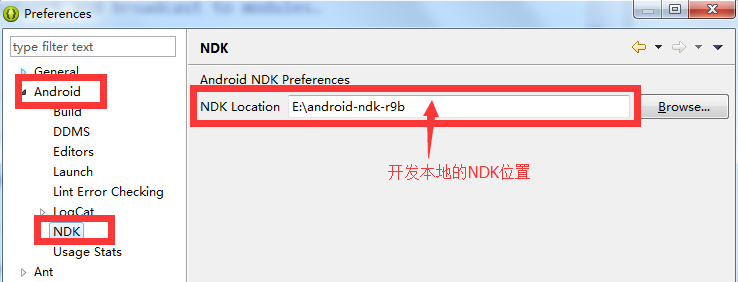
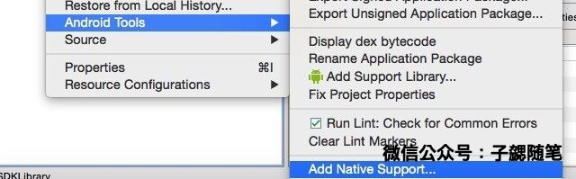
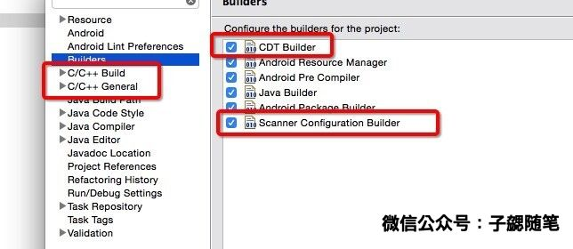

做SDK也有一段时间了，SDK底层是用java写的，早期也只提供java层的接口。后来游戏接入越来越多，而且大多数游戏使用C++或者各种游戏殷勤，为了降低游戏接入的成本，同时也尽可能减少SDK开发的成本，SDK为游戏提供了native的方法。

SDK的C++接口由JNI实现，使用SDK的C++接口的游戏在集成时，SDK直接向游戏游戏提供源码编译，因此需要使用NDK完成编译。在编译和环境配置过程中经常会遇到一些问题，在此总结一下。

##NDK 环境配置：

选择 **window -> preferences -> Android -> NDK**,按照下图配置

**备注：在最新的adt版本（adt-bundle-windows-x86-20140702）中没有集成ndk，游戏在Android选项中可能无法看到上述配置。解决方法如下：**

1. 下载eclipse关于ndk的插件[com.android.ide.eclipse.ndk_23.0.2.1259578.jar](https://github.com/bihe0832/Settings-Tools/tree/master/adt/plugins)
2. 将下载好的`com.android.ide.eclipse.ndk_23.0.2.1259578.jar` 放入adt目录下的 `\eclipse\plugins`中，重启eclipse。

## ADT 配置（支持native编译）

#### 使用ADT自带的Android Tools 完成配置（推荐）：

ADT中已经整合了关于CDT编译的相关内容。当需要工程支持native编译的时候，只需要**选择工程->右键->properties->Android Tools -> Add Native Support**（如下图）即可。：

这时**选择工程->右键->properties->**可以看到已经在配置中多了C++相关的配置，同时工程的builder里面也增加了native编译相关的配置。如下图：

#### 在Builder中手动增加native的支持

对于不是使用ADT的环境，或者其他原因无法使用上面的方法配置的。也可以直接手动去配置natave的编译。具体方法可以参照下面的博客：

[http://blog.csdn.net/yanzi1225627/article/details/16897877](http://blog.csdn.net/yanzi1225627/article/details/16897877)

个人亲测可用，配置以后同样可以支持native的编译，只是配置过程会相对繁琐。

## 解决ADT在native编译报错“Unresolved inclusion jni.h”

开发过程中有时候会遇到其无法处理inclusion导致symbol显示错误，出现类似“Unresolved inclusion jni.h”的错误。最好的解决办法就是初始化ADT对该project的native support:

1. 在ADT中关闭或者删除指定Project
2. 用其他编辑工具打开该project的.project文件，删除以下内容：
	......
	<buildCommand>
	<name>org.eclipse.cdt.managedbuilder.core.genmakebuilder</name>
	<triggers>clean,full,incremental,</triggers>
	<arguments>
	</arguments>
	</buildCommand>
	......
	<buildCommand>
	<name>org.eclipse.cdt.managedbuilder.core.ScannerConfigBuilder</name>
	<triggers>full,incremental,</triggers>
	<arguments>
	</arguments>
	</buildCommand>
	......
	<nature>org.eclipse.cdt.core.cnature</nature>
	<nature>org.eclipse.cdt.core.ccnature</nature>
	<nature>org.eclipse.cdt.managedbuilder.core.managedBuildNature</nature>
	<nature>org.eclipse.cdt.managedbuilder.core.ScannerConfigNature</nature>

3. 删除项目根目录下的.cproject文件
4. 在ADT里打开或者导入原来的project， refresh，然后按照上文** CDT 配置（支持native编译）**中提到的方法重新设置工程支持native编译即可。