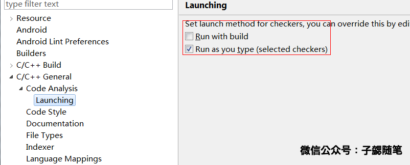
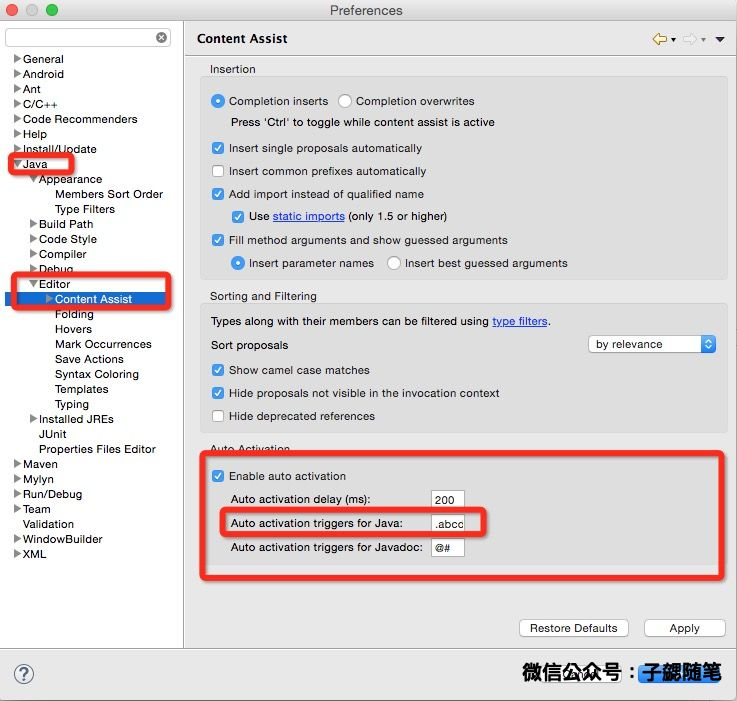

## Eclipse的switch workspace删除多余workspace

1. 删除workspace文件夹：找到workspace所在的目录、删除对应的workspace。

- 修改org.eclipse.ui.ide.prefs 文件

	打开Eclipse目录的\configuration\.settings目录，找到org.eclipse.ui.ide.prefs 文件，将删除workspace的路径删除。
- 重启Eclipse，再点击swith workspace就不会看到已经被删除的workspace

## 防止Android log太多，太多有用信息被刷掉

1. 修改logcat的日志buff大小即可，如下图：

## JNI配置不在编写代码时候做语法检查

1. Eclipse的语法检查有时候会误判部分JNI语法，导致代码报错，无法运行。可以按照下图配置：

## 代码自动补全

### 每次输入自动提示

1. 在Eclipse中选择，preferences->Java->Editor->Content Assist
2. 在右下角Auto activation triggers for Java里面改为

		.abcdefghijklmnopqrstuvwxyzABCDEFGHIJKLMNOPQRSTUVWXYZ0123456789

这样每次输入上面字母都会自动提示了。

### alt+/手动控制自动提示

1. 在Eclipse中选择，preferences->General->Keys找到Content Assist
2. 点击Remove Binding(移除绑定)
3. 然后再Binding（按下Alt+/）
4. When中选Editing Text就可以

### 编写XML文件时联想

1. 在Eclipse中选择，preferences->XML->XML Files -> Editor ->Content Assist
2. 修改方法与每次输入自动提示一致，不再赘述

## 一些常见问题总结

### 1. Mac Eclipse 出现Android sdk content loader 0%的无法完成初始化：

处理方法：

关闭Eclipse，删掉WorkSpace下.metadata下.plugins下org.eclipse.core.resources.projects文件夹下的所有内容，再重启Eclipse。

### 2. ADT生成apk时，编译不报错，运行APK时crash。提示 java.lang.NoClassDefFoundError

- 问题特征：

	- 编译时OK，不会报错，打包时会报错，一般为java.lang.NoClassDefFoundError
	- 反编译代码发现对应的类确实缺失
	- 大多出现在引用第三方jar，然后第三方jar中部分代码丢失
	- 目前遇到的使用的ADT的版本都是 v22.2.1.v201309180102-833290 

- 问题日志：

	

	
- 解决方法：

	更新ADT吧，别用这个版本的ADT了，升级ADT的版本就OK了~
	