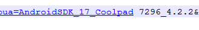

##坑0：build.prop文件被修改，导致部分机型获取到机型中间包含空格

- **问题：**在调用别的平台时，平台希望可以提供一些机型等数据用作参考，因此在网络请求的get参数中利用机型构造了一个简单的参数。取了系统的版本、机型等几个简单的参数。默认这几个参数都是完整的字符串，因此没有对参数做urlencode。然后噩梦开始了……
- **问题现象**：版本发出以后，发现有机型的所有HTTP请求都失败。提示：

		IllegalArgumentException, msg: Illegal character in query at

- **具体代码出问题的位置**：

- **问题原因：找了台相同型号的机器，但是发现获取的ro.product.device中间木有空格。初步怀疑有可能是玩家root以后或者刷了第三方rom以后修改了build.prop对应的值导致。**
- **解决办法**：将所有的get请求的参数都urlencode 一遍
- **问题总结**：其实这个问题不能赖给玩家或者第三方rom。确实**所有的get请求都应该urlencode**，这是基本常识，有时候却忘了，导致一场本来可以避免的问题发生了。