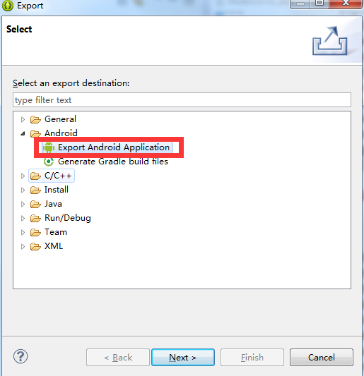

之前有多个游戏遇到关于签名错误的问题，加上有些游戏开发不熟悉Android签名校验的机制以及打包的方法，就专门总结了一下，现在整理一下。
首先放上官方文档链接:[http://developer.android.com/tools/publishing/app-signing.html](http://developer.android.com/tools/publishing/app-signing.html)

## 什么是签名

就是只有信息的发送者才能产生的别人无法伪造的一段数字串，这段数字串同时也是对信息的发送者发送信息真实性的一个有效证明。数字签名是个加密的过程，数字签名验证是个解密的过程。

## 为什么有签名

- 最简单直接的回答： 系统要求的。

- 通俗的解答：

	Android系统要求每一个Android应用程序必须要经过数字签名才能够安装到系统中，也就是说如果一个Android应用程序没有经过数字签名，是没有办法安装到系统中的！

- 装逼的解答：  
   
	在Android 系统中，所有安装到系统的应用程序都必有一个数字证书，此数字证书用于标识应用程序的作者和在应用程序之间建立信任关系,如果一个permission的protectionLevel为signature，那么就只有那些跟该permission所在的程序拥有同一个数字证书的应用程序才能取得该权限。

## 签名怎么来

数字证书的私钥保存在程序开发者的手中。Android将数字证书用来在应用程序的作者和应用程序之间建立信任关系，不是用来决定最终用户可以安装哪些应用程序。这个数字证书并不需要权威的数字证书签名机构认证，它只是用来让应用程序包自我认证的。

## 签名的两种模式

### 调试模式(debug mode)

在调试模式下，ADT会自动的使用debug密钥为应用程序签名，因此我们可以直接运行程序。

- debug密钥：一个名为debug.keystore的文件，android默认的debug.keystore的信息如下：

		Keystore name: “debug.keystore”
		Keystore password: “android”
		Key alias: “androiddebugkey”
		Key password: “android”
		CN: “CN=Android Debug,O=Android,C=US”

- 存放位置：C:\Users\用户名\.android\debug.keystore

debug签名的两个风险：

1. debug签名的应用程序不能在Android Market上架销售，它会强制你使用自己的签名；

- debug.keystore在不同的机器上所生成的可能都不一样，就意味着如果你换了机器进行apk版本升级，那么将会出现程序不能覆盖安装的问题。

### 发布模式(release mode)

发布程序时，开发者需要使用自己的数字证书给apk包签名。使用自己的数字证书给APK签名有两种方法。将在下文描述。

## 私钥生成

私钥目前主要是通过 keytool 生成，事例如下：

- 生成命令：

		keytool -genkey -keystore bihe0832.keystore -alias bihe0832 -keypass android -keyalg RSA -validity 40000
	
- **常用参数含义：**

	- genkey 在用户主目录中创建一个默认文件”.keystore”
	- alias 产生别名 每个keystore都关联这一个独一无二的alias，这个alias通常不区分大小写
	- keystore 指定密钥库的名称(产生的各类信息将不在.keystore文件中)
	- keyalg 指定密钥的算法 (如 RSA DSA，默认值为：DSA)
	- list 显示密钥库中的证书信息 keytool -list -v -keystore 指定keystore -storepass 密码
	- v 显示密钥库中的证书详细信息
	
- **非常用参数含义：**

	- validity 指定创建的证书有效期多少天(默认 90)
	- keysize 指定密钥长度 （默认 1024）
	- storepass 指定密钥库的密码(获取keystore信息所需的密码)
	- keypass 指定别名条目的密码(私钥的密码)
	- dname 指定证书发行者信息 其中： “CN=名字与姓氏,OU=组织单位名称,O=组织名称,L=城市或区域名 称,ST=州或省份名称,C=单位的两字母国家代码”
	- export 将别名指定的证书导出到文件 keytool -export -alias 需要导出的别名 -keystore 指定keystore -file 指定导出的证书位置及证书名称 -storepass 密码
	- file 参数指定导出到文件的文件名
	- delete 删除密钥库中某条目 keytool -delete -alias 指定需删除的别 -keystore 指定keystore – storepass 密码
	- printcert 查看导出的证书信息 keytool -printcert -file g:\sso\michael.crt
	- keypasswd 修改密钥库中指定条目口令 keytool -keypasswd -alias 需修改的别名 -keypass 旧密码 -new 新密码 -storepass keystore密码 -keystore sage
	- storepasswd 修改keystore口令 keytool -storepasswd -keystore g:\sso\michael.keystore(需修改口令的keystore) -storepass pwdold(原始密码) -new pwdnew(新密码)
	- import 将已签名数字证书导入密钥库 keytool -import -alias 指定导入条目的别名 -keystore 指定keystore -file 需导入的证书

## 签名方法

### 使用keytool签名

目前使用keytool签名有两种方式，一种是java提供的jarsigner，另一种是安卓官方提供的apksigner，这里分别介绍一下。**不过需要注意的是目前Android已经在逐渐淘汰基于 jarsigner 的 Android V1 签名模式，因此如非必需，建议使用基于 apksigner的 Android V2 签名方式签名apk。**关于 Android V2 签名的更多文章，请参考个人的另一篇文章：[关于Android的APK Signature Scheme v2签名相关的资料汇总](http://blog.bihe0832.com/android-v2.html) 

#### 使用jarsigner 签名
 
 - 签名命令：
		
		jarsigner -verbose -keystore bihe0832.keystore -signedjar agsdkdemo_signed.apk  agsdkdemo.apk bihe0832
    
- **参数含义：**    
	
	- verbose 输出签名的详细信息
	- keystore  bihe0832.keystore 密钥库位置
	- agsdkdemo_signed.apk :名后产生的文件demo_signed
	- agsdkdemo.apk :要签名的文件demo.apk
	- bihe0832:私钥的alias
			
- **注意事项：**android工程的bin目录下的demo.apk默认是已经使用debug用户签名的，所以不能使用上述步骤对此文件再次签名。正确步骤应该是:在工程点击右键->Anroid Tools-Export Unsigned Application Package导出的apk采用上述步骤签名。
		
####  使用apksigner 签名

 - 签名命令：
 
		$ANDROID_HOME/build-tools/25.0.1/apksigner sign --ks ~/lib/bihe0832.keystore ./debug-ysdk.apk
				
		$ANDROID_HOME/build-tools/25.0.1/apksigner sign --ks ~/lib/bihe0832.keystore --out ./debug-ysdk-singned.apk --ks-pass pass:mypassword ./debug-ysdk.apk
 
- **参数含义：**   
	 
	- sign 给应用签名
	- --ks ~/lib/bihe0832.keystore 密钥库位置
	- --out ./debug-ysdk-singned.apk 签名后应用
	- --ks-pass pass:mypassword 文字格式的签名密码，其中mypassword即为密码
	- ./debug-ysdk.apk 要签名的应用
	
- **注意事项：** apksigner是Android官方提供的签名及校验工具，从Android SDK Build Tools的24.0.3版本开始支持，具体路径在SDK目录的build-tools目录下。
		
		
### 使用Eclipse直接导出带签名的APK

Eclipse直接能导出带签名的最终apk，非常方便，推荐使用，步骤如下：

1. 导出

	

- 选择工程：选择你要导出apk的工程

- 创建密钥库keystore,输入密钥库导出位置和密码，要记住密码

	

- 填写密钥库信息，填写一些apk文件的密码，使用期限和组织单位的信息

- 输入生成带签名的apk文件的位置。

## 常见问题

1. jarsigner: 找不到XXXX的证书链。XXXX必须引用包含私有密钥和相应的公共密钥证书链的有效密钥库密钥条目。

	出现该错误是因为在命令输入的最后一个参数填写的是签名私钥的alias，而不是私钥的文件名称
		
2. jarsigner: 无法对 jar 进行签名: java.util.zip.ZipException: invalid entry compressed size (expected 19384 but got 19942 bytes)

	出现该错误的原因是因为对一个已经使用DEBUG权限的数字签名的包，使用jarsigner再次签名导致的，建议用V2重新签名或者导出一个未签名的apk重新签名即可，**如果一定要对当前包重新签名，可以选择将文件修改为.zip后缀，然后解压缩，删除`META-INF`目录，然后再次压缩为.zip并修改扩展名为.apk后再次签名**
		
3. jarsigner 错误: java.security.NoSuchAlgorithmException: unrecognized algorithm name: RSAwithDSA

	出现该错误的原因是私钥算法与签名算法（命令中的-sigalg 参数的值）不兼容，直接使用keytool去查看私钥使用的算法修改即可，命令示例如下：
	
		➜  readhub git:(master) keytool -list -v -keystore bihe0832.keystore
		输入密钥库口令:
		……
		
		证书指纹:
			……
			 签名算法名称: SHA1withDSA
		……

4. jarsigner: 无法对 jar 进行签名: 无法对jar进行签名：java.util.zip.ZipException: invalid entry compressed size (expected xxx but got xxx bytes)

	出现该错误的原因是由于资源文件造成的，对于android开发来说应该检查res文件夹中的文件，逐个排查。当然也可以可以通过升级系统的JDK和JRE版本来解决。

5. 安装apk过程中出现：adb: failed to install 2.apk: Failure [INSTALL_PARSE_FAILED_NO_CERTIFICATES: Failed to collect certificates from XXX.apk: Attempt to get length of null array]

	使用adb安装时出现该错误是因为应用没有签名，需要先对apk签名之后再尝试安装
		
6. 安装apk过程中出现：adb: failed to install test.apk: Failure [INSTALL_PARSE_FAILED_NO_CERTIFICATES: Failed to collect certificates from XXX.apk: META-INF/CERT.SF has invalid digest for XXX.xml in XXX.apk]
	
	出现该的原因是由于使用jarsigner 方式签名时JDK的版本问题造成的，可以通过升级系统的JDK和JRE版本来解决。

7. 安装apk过程中出现：adb: failed to install test-singend.apk: Failure [INSTALL_FAILED_UPDATE_INCOMPATIBLE: Package com.bihe0832.getsignature signatures do not match the previously installed version; ignoring!] 
	
	出现该错误的原因是因为设备上已经安装了一个同包名但是签名并不一致的apk，需要卸载原有apk重新安装新签名的apk。

8. 安装apk过程中出现：adb: failed to install test-singend.apk: Failure [INSTALL_PARSE_FAILED_INCONSISTENT_CERTIFICATES]

	出现该错误的原因是因为设备上已经安装了一个同包名但是签名并不一致的apk，并且已经安装的应用使用Android的debug签名文件来签名，即将安装的应用使用自定义签名文件签名，需要卸载原有apk重新安装新签名的apk。

## 参考文章：

1. [http://www.cnblogs.com/wanqieddy/p/3556060.html](http://www.cnblogs.com/wanqieddy/p/3556060.html)
2. [http://www.tttabc.com/android/keytool-keystore-jarsigner-apk.htm](http://www.tttabc.com/android/keytool-keystore-jarsigner-apk.htm)
3. [http://yangguangfu.iteye.com/blog/723182](http://yangguangfu.iteye.com/blog/723182)
4. [关于Android的APK Signature Scheme v2签名相关的资料汇总](http://blog.bihe0832.com/android-v2.html)

