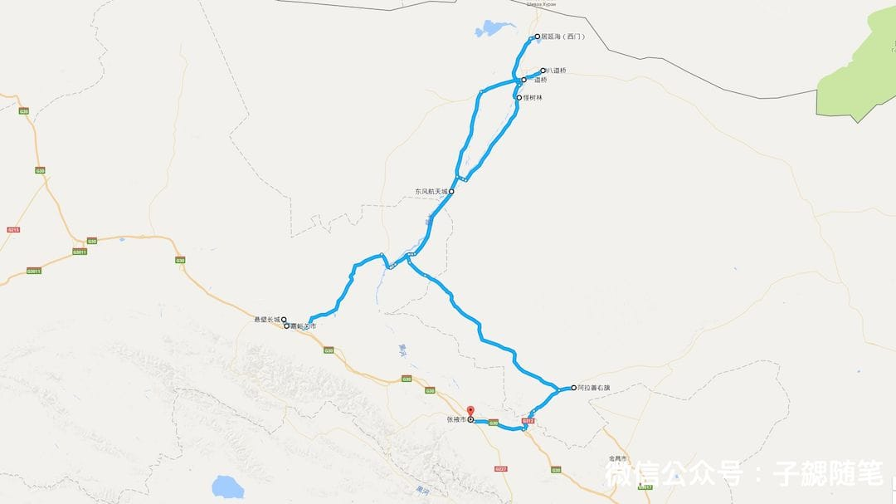

十一与妹子一起去额济纳看胡杨，顺便回家；回来以后很多人问攻略，就把自己的攻略、景区信息、一些旅行照片分享给大家，所有照片为手机拍摄（iPhone 6），没有调色、滤镜等任何处理，为了方便大家浏览，对图片进行了比较大程度的有损压缩，单片原图2M一下，目前提供的均为40K左右图片。

### 用时：9天

### 主题：感侠客仗剑天涯、赏大漠长河落日、睹胡杨千年不倒、归故里优哉游哉

### 主要看点： 嘉峪关日落、金塔胡杨林、东风航天城、居延海日出、黑水城遗址、怪树林风景、二道桥日落、八道桥日出、胡杨林风景、边境口岸风情

### 主要路线：深圳 - 广州 — 嘉峪关 - 酒泉 - 额济纳 - 张掖 - 兰州 - 深圳

### 具体行程：

#### 第一天（2016-10-01）：

- 地点：深圳、广州
- 路线：深圳 - 广州
- 住宿：
    - 广州 尚品假日酒店（广州机场二店）白云区矮岗村陇西庄13号 ，近凤岗路
- 交通：
    - 福田 - 广州南 ：G6520 次福田 站（12:33 开）—广州南 站（13:20 到）
    - 广州南 - 酒店 ：地铁2号线 → 地铁3号线北延段
- 规划：
    - 上午11点：出发前往福田，然后地铁11号线到福田，高铁到广州南
    - 下午3点半：到达广州南，地铁先回酒店，安顿好，休息一下
    - 下午6点半：出来晚茶，逛街，早点回去休息
- 备注：
	1. 节假日的广州地铁人非常多，建议直接买张羊城通
	2. 晚茶选择的点都德（[点击跳转大众点评](http://www.dianping.com/shop/21007651)）还不错，比较正宗

- 费用：
	- 小计：
		1. 住宿：尚品假日酒店 239
		2. 高铁：82 * 2 = 164
		3. 羊城通两张：50 * 2 = 100
		4. 晚茶：240
	- 共计：239 + 164 + 100 + 240 = 743

#### 第二天（2016-10-02）：

- 地点：广州、嘉峪关
- 路线：广州 - 嘉峪关
- 住宿：
    - 嘉峪关 锦江之星（嘉峪关兰新路店）嘉峪关 兰新东路638号 ，与五一中路交汇处
- 交通：
     - 东方航空 MU2324 06:40 — 12:20
- 要点：
   - 关城日落
- 规划：
    - 早上5点：起床，前往白云机场，搭飞机到嘉峪关
    - 下午1点：到达嘉峪关，机场包车接机前往市区午饭，入住酒店
    - 下午2点半：前往嘉峪关关城参观游玩，先去第一墩，然后悬臂长城，最后关城
    - 下午7点半：游玩结束，美食休息
- 备注：
	1. 节假日期间关城附近可能会比较堵车
	2. 只有关城的售票窗口卖第一墩、悬臂和关城的联票、如果是包车可以让师傅提前帮忙买好联票
	3. 如果一个下午去三个地方建议提前计算好前往关城的时间，一定不要错过关城日落，我们因为吃饭和接机遇到问题，实际上四点才开始游玩，推荐5点半就到达关城
	4. 午饭选择了清真伊阁园手抓羊肉餐厅([点击查看](http://www.dianping.com/shop/56845318))，总体还不错，不过人多的时候等候时间会比较久

- 费用：
	- 小计：
		1. 住宿：锦江之星 375
		2. 飞机：1450 * 2 = 2900
		3. 午餐：239 / 6 * 2 = 80
		4. 门票：120 * 2 = 240 
	- 共计：375 + 2900 + 80 = 3355

- 景色：
	- 嘉峪关：
	
		
	
		

#### 第三天（2016-10-03）：

- 地点：嘉峪关、额济纳
- 路线：嘉峪关 - 金塔 - 东风航天城 - 额济纳
- 住宿：露营八道桥（约150）
- 交通：包车
- 要点：
    - 金塔胡杨林
    - 东风航天城
    - 八道桥日落
- 规划：
    - 早上7点半 从嘉峪关出发
    - 早上10点多到达金塔，游玩金塔胡杨
    - 下午1点左右到达东风航天城，参观一个小时、吃饭
    - 下午大约4点到达额济纳，吃饭、休息
- 备注：

	1. 金塔胡杨林值得一去、一定要买观光车票
	2. 东风航天城因为当天天气不好，我们要尽快赶去额济纳没有去
	3. 如果要中间吃饭就在到达航天城小镇吃饭，过了以后就只能到额济纳~
	4. 原计划在八道桥露营因为天气恶劣取消了

- 费用：
	- 小计：
		1. 金塔胡杨林 68 * 2 = 136
		2. 住宿（民宿） 200
		3. 晚饭 22 * 2 = 44
	- 共计：136 + 200 + 44 = 380
		
- 景色：
	
	- 金塔胡杨林
				
		
	
		
		
		
 
#### 第四天（2016-10-04）：

- 地点：额济纳
- 路线：居延海 - 神树 - 策克口岸 - 神树 - 黑水城 - 怪树林
- 住宿：额济纳
- 交通：包车
- 要点：
    - 居延海日出
    - 策克口岸
    - 黑水城旧址
    - 怪树林日落
- 规划：
    - 5：30出发，车程1小时后到达居延海景区，欣赏海上日出
    - 8：30前往策克口岸参观，游览时间1小时
    - 中午12点左右回来以后吃饭
    - 下午3:30到黑城及怪树林景区游玩，拍完怪树林日落，回来早点休息，宿额济纳

- 备注：
	1. 怪树林推荐路线：景区大门（景交车）- 黑城（游玩1.5小时）（景交车）- 怪树林停车点（边走边玩）直到日落离开景区。
	2. 晚饭在老成都小老板排骨店（[点击查看](http://www.dianping.com/shop/32339186)），味道比较赞，第二天的晚饭我们也还是这里吃。排骨好评。

- 费用：
	- 小计：
		1. 居延海门票：80 * 2 = 160
		2. 策克口岸门票：30 * 2 = 60
		3. 怪树林 + 黑城门票：150 * 2 = 300
		4. 晚饭 340 / 6 * 2 = 114
		5. 住宿 250 * 2 = 500
	- 共计：160 + 60 + 300 + 114 + 500 = 1134

- 景色：
	
	- 居延海：
	
		
	
		
	
		
		
	- 策克口岸
	
		
	
	- 怪树林
	
		
			 
		
	
		
	
		
	
		
	
		
	
		
	
			

#### 第五天（2016-10-05）：

- 地点：额济纳
- 路线：八道桥 - 四道桥 - 二道桥 - 一道桥
- 住宿：额济纳
- 交通：包车
- 要点：
    - 八道桥日出
    - 二道桥日落
- 规划：
    - 早上7起床出发，之后从一道桥往八道桥依次游玩，全天在一到八道桥
    - 晚上7点左右回来，吃饭休息
- 备注：
	1. 推荐游玩线路一（深度体验版）：一道桥（边走边玩）二道桥（边走边玩）三道桥（边走边玩）四道桥（吃午饭+景交车）七道桥（景交车）八道桥（看日落+景交车）一道桥；
   2. 推荐游玩线路二（摄影版）：一道桥（景交车）八道桥（拍驼影+景交车）四道桥（胡杨人像，边走边玩）三道桥（边走边玩）二道桥（边走边玩）一道桥（胡杨日落）。
- 备注
    - 胡杨节期间最早的景交车是5点30，一道桥边走边拍到四道桥大致需要3.5-4小时
    - 如果觉得胡杨林一天不够的玩家或者专业摄影用户可选择胡杨林景区的三日票

- 费用：
	- 小计：
		1. 胡杨林门票：220 * 2 = 440
		- 晚饭 310 / 6 * 2 = 102
		- 住宿 250 * 2 = 500
	- 共计：440 + 102 + 500  = 1042

- 景色：
	
	- 一道桥：
	
		
		
		
	
	- 二道桥：
	
		
	
		
	
		
	
		
	
		
	
		
	
		
	
		
	
		

	
	- 四道桥：
	
		
	
		
	
		
		
	- 七道桥：
	
		
	
		
	
		

		
	
	- 八道桥：
	
		
		
		
			
#### 第六天（2016-10-06）：

- 地点：额济纳、张掖
- 路线：额济纳 - 张掖
- 住宿：民乐
- 交通：大巴
- 规划：
    - 早上8点坐大巴出发从额济纳往张掖
    - 下午4点到达张掖

- 备注

	1. 我们是坐大巴前往张掖，建议如果不是包车的话，大巴做到酒泉或者额济纳动车前往张掖

- 费用：
	- 小计：
		1. 大巴车票 138 * 2 = 276
	- 共计：276

#### 第七天（2016-10-07）：

- 地点：张掖
- 路线：张掖
- 住宿：张掖
- 交通：无
- 规划：在家休息

#### 第八天（2016-10-08）：

- 地点：张掖
- 路线：张掖
- 住宿：张掖
- 交通：无
- 规划：在家休息

#### 第九天（2016-10-09）：

- 地点：张掖、兰州、深圳
- 路线：张掖 - 兰州 - 深圳
- 住宿：兰州
- 交通：
    - D2742 张掖 —— 兰州西 08:57 —— 11:35
    - C8513 兰州西 —— 中川机场 12:04 —— 12:46
    - C8605 兰州西 —— 中川机场 12:35 —— 13:10
    - ZH9978 深圳航空 14:45 —— 19:25

- 规划：
    - 早点七点半起床
    - 早上八点出门前往火车站

- 费用：
	- 小计：
		1. 机票：2716
		2. 动车：160 *2 = 320
	- 共计：2716 + 320 = 3016

### 其他

#### 特别说明：

1. 从嘉峪关到额济纳期间，我们六个人全程包车，费用3200，人均：533 
2. 额济纳期间住宿均为民宿，环境相对还可以，负责住宿的曾姐人很好，点赞，如果有兴趣可以加微信联系：z13804732582

#### 费用总计（2人）：

743 + 3355 + 380 + 1134 + 1042 + 276 + 533 * 2 + 3016 + 300（零食、其他）= 11312

- 备注：
	1. 上述费用不包含一些零碎的开销，只是最后汇总为300
	2. 由于有两天住在家里，因此没有任何开销
	3. 由于非全程包车，因此包车价格相对较低

### 景点介绍

#### 长城第一墩

长城第一墩是古长城的起点，其实就是一个烽火台，如今只剩下一个土墩。景区还包括讨赖河滑索、天险吊桥、“醉卧沙场”雕塑群等内容。最值得看的还是第一墩身后嘉峪关的母亲河—讨赖河，由祁连山上的冰川融雪形成并流向嘉峪关，有一座吊桥悬于讨赖河上，险峻壮观。景区观光车有两个下车点，一是西入口的博物馆，在博物馆内有一个玻璃观景台，可以透过玻璃看脚下的河川，还有吊索，让你在空中穿越讨赖河；第二个点在兵营，可以走过铁索桥横渡讨赖河到达另一侧，再往上爬上山坡，可以更近距离地接触讨赖河。

#### 悬臂长城

悬壁长城在黑山峡谷的北面，为南北走向，城墙陡峭直长，气势雄伟，垂若悬臂，有“西部八达岭”之称。与位于黑山峡谷之南的断壁长城形成拱卫之势，共同扼守黑山峡口。 悬壁长城位于嘉峪关市西北14公里处，距嘉峪关关城8.4公里。为了便于游人攀登，1987年重修时还在首墩和山脊城墙上修筑了台阶式漫道。沿漫道而上，虽只有四百多级台阶，但也足以使人心生踟蹰，然而只要登上山顶，放眼望去，关外大漠的荒凉尽收眼底，仅有极少的片片绿洲点缀其中，显示出这里还有生命在与恶劣的自然环境进行顽强的抗争

#### 嘉峪关关城

嘉峪关关城是明长城西端的第一重关，也是古代“丝绸之路”的交通要塞。关城始建于明朝，是万里长城沿线最为壮观的关城。这里并不仅是单独的关隘，分为内城、外城和城壕。外城的雄关水寨可以远摄关城外景，进入内城登上城楼，祁连山麓在远方连绵。

关城入口处有一个“黑山石雕群”的小公园，岩画内容展示了嘉峪关悠久的历史和文化。在夏季旺季时，城楼内的演武场会有杂技表演；古城内还可以看到皮影的身影，皮影以陕西甘肃两地最为著名，陕西重表演，而甘肃更重皮影的工艺精致，选用驴皮精雕，再细细上色。景区内有射箭、10元/人；关城外还有骑骆驼和滑翔机体验（200元/圈）；

日落时分的嘉峪关关城是最美的，不可错过。走出关城，可以看到茫茫的戈壁滩，远处是连绵的黑山和祁连山。

#### 东风航天城

酒泉卫星发射基地据酒泉市约200km，距离阿拉善盟约500km（直线距离）。所以最接近的地级城市是酒泉市，酒泉发射中心于1958年开始建设。上世纪80年代中期，发射中心开始开放，需要取一个对外的正式名称，这个名字得体现发射中心大概的地理位置，又得是在国际上也有一定知名度的地方，而离发射中心最近的符合这些条件的城市无疑就是酒泉了，因此就取名为酒泉卫星发射中心。取名酒泉发射中心还有物资供应的现实考虑，基地长期以来的物资供应大多是由酒泉承担的，同时酒泉负责了基地生活区、专用铁路和高速公路的建立。基地的教育，医疗，公安均为酒泉市管辖。由于有5%的子基地分布于阿拉善盟的额济纳旗，为了补偿阿拉善盟，所以将税收交给阿拉善盟负责，此外一切事务均为酒泉负责。

酒泉卫星发射中心是中国建设最早，规模最大的卫星发射中心，也是各种型号运载火箭和探空气象火箭的综合发射场，拥有完整、可靠的发射设施，能发射较大倾角的中、低轨道卫星。中心自1958年创建以来，曾为中国航天事业的发展创造过骄人的十个第一：1970年4月24日，中国的第一颗人造地球卫星在这里升起；1975年11月26日，第一颗返回式人造地球卫星在这里升空；1980年5月18日，第一枚远程弹道导弹在这里飞向太平洋预定领空；1981年9月20日，第一次用一枚火箭将三颗卫星送上太空；随后还有第一次为国外卫星提供发射搭载服务、第一艘载人飞船，都从这里顺利升空……

这里，成功发射了81颗卫星、10艘神舟飞船﹑1艘天宫空间实验室，相继将10位航天员安全顺利送往太空；这里，奇迹般走出了34位将军；这里，是世界三大航天发射场之一。

东风航天城的开放时间9:00-17:00，可以在门口买票（150元/人，学生半价）办理通行手续，自驾车辆可以开进去，一定记得带好身份证和车辆行驶证。航天城目前开放三个地方：问天阁、历史陈列馆、载人发射场。参观时间至少得花费2小时。

#### 胡杨

目前国内主要有四大胡杨林观赏区，分别是：

- 新疆木垒胡杨林——历史最悠久，是世界上最古老的胡杨林，距今已6500万年；
- 新疆塔里木轮台胡杨林——最小清新的胡杨林，有17公里观景小火车，特别文艺；
- 格青海格尔木胡杨林——世界上海拔最高的胡杨林，海拔2770米，有机会看到雪山下的胡杨；
- 内蒙古额济纳旗胡杨林——最为美丽壮观，知名度最高，究其原因有以下四点：

    1. 面积大、覆盖率高。38万亩的保护区里分布着大面积的胡杨树
    - 密度大。一道桥至八道桥之间集中分布着大面积的胡杨林，对视觉有着极大的冲击
    - 树龄长，树形漂亮。目前网上胡杨林的照片多以额济纳的为主
    - 景观丰富，多样性强。光一道桥至八道桥，就包含着倒影林（胡杨与水）、红柳海、英雄林（树形最好看）、梦境林（树龄小，黄的早）、沙海王国（巴丹吉林沙漠边缘，早晨可拍沙漠驼影）等各具特色的景区

    它经过春风的滋润、夏雨的洗礼，当大漠旷野吹过一丝清凉的秋风时，胡杨林便在不知不觉中，由浓绿变为浅黄，继而变成杏黄了。登高远眺，金秋的海洋，令人心旷神怡。落日苍茫，晚霞一抹，胡杨由金黄色变成金红，最后化为一片褐红，渐渐地融入朦胧的夜色之中。一夜霜降，胡杨林如香山枫叶一样火红，像在熊熊燃烧。而每一棵高大的胡杨树冠枝头，间或又有浅绿、淡黄的叶片在闪现，错落有致，色彩缤纷。秋风乍起，胡杨金黄的叶片，飘飘洒洒“哗哗”地落到地面，大地铺上了金色的地毯，辉煌而凝重。 漫步在胡杨林中，就仿佛进入神话中的仙境。茂密的胡杨千奇百怪，神态万般。粗壮的胡杨几个人难以合抱，挺拔的有七八丈之高，怪异的似苍龙腾越、虬蟠狂舞，令人叹为观止。密密匝匝的树叶，也是风采独具。幼小的胡杨，叶片狭长而细小，宛如少女的柳叶眉，人们常常把它误认为柳树；壮龄的胡杨，叶片又变成卵形或三角形，犹如兴安岭的白桦；进入老年期的胡杨，叶片才定型为椭圆形，更有甚者，在同一棵胡杨树冠的上、下层次，还生长生长着几种不同形状的叶片，可谓奇妙绝伦。 阳光下，蓝得有些让人难以置信的湖面映着一片金黄，高高低低的胡杨成为画面中的主角。

#### 金塔胡林场

金塔胡杨林位于甘肃省金塔县城以西的潮湖林场，为三北防护林体系的一部分，胡杨林周边分布着大面积的沙枣树、白杨树和红柳等西北特色树种，总面积达8万亩。该胡杨林分布密集，长势良好，规模居全省之冠，极具旅游开发价值。金塔胡杨林是额济纳旗原始胡扬林的一个林系。

#### 一到八道桥

- 一道桥：景区售票处-大门
    - 5:30开门

- 二道桥：
    - 倒影林
    - 二道桥有大的水流经过，所以特别适合拍日落倒影

- 三道桥：红柳海

- 四道桥：英雄林
    - 四道桥树形最为婀娜壮观，胡杨比较高大，也是电影《英雄》的拍摄所在，特别是四道桥路北1公里处的胡杨人家院内的胡杨

- 五道桥：土尔扈特民族风情园

- 七道桥：梦境林
    - 七道桥黄得最早，也有倒影，但以小树为主

- 八道桥：沙海王国
    - 沙漠沙漠日出（7：15）
    - 八道桥是巴丹吉林沙漠，有较多沙漠体验项目，也是摄影团队拍摄日出的地方

#### 居延海

居延海位于内蒙古自治区阿拉善盟额济纳旗北部，形状狭长弯曲，有如新月，额济纳河汇入湖中，是居延海最主要的补给水源。居延是匈奴语，《水经注》中将其译为弱水流沙，在汉代时曾称其为居延泽，魏晋时称之为西海，唐代起称之为居延海，现称天鹅湖。 居延海历史上面积很大，是我国西北最大的湖泊之一，由现在的东居延海（也称苏泊淖尔）和西居延海（也称嘎顺淖尔）以及其他湖泊组成，如今游客前往的居延海，指的是东居延海（苏泊淖尔），其他的湖泊已经干枯（西居延海近年通过不断的补水，已经开始恢复水面）。

历史上有过多位名人来到这里，如汉代的霍去病、张骞，唐朝大诗人王维等，都在这里留下了足迹。

#### 策克口岸

中国策克口岸位于内蒙古额济纳旗境内，距额济纳旗府达来呼布镇77公里，东距巴盟甘其毛道口岸800km，西距新疆老爷庙口岸1200km，与蒙古国南戈壁省西伯库伦口岸对应。对外辐射蒙古国南戈壁、巴音洪格尔、戈壁阿尔泰、前杭盖、后杭盖五个畜产品、矿产品资源较为富集的省区。是阿拉善盟对外开放的唯一国际通道，是内蒙古、陕、甘、宁、青五省区所共有的陆路口岸，同时也是内蒙古第三大口岸。

#### 黑城

“丝绸之路”上现存最完整、规模最宏大的古城遗址——西夏黑城（黑水城），位于纳林河东岸荒漠中，是现今已知唯一一座用党项人语言命名的城市。

黑城又称黑水城，是西夏王朝设在北部边境的一座重要军事城堡和戍防要塞。这里也是元代河西走廊通往岭北行省的驿道要站，黑城周边曾经有一片大面积绿洲，14世纪中期后水源开始枯竭，如今你看的是沙海中的孤城残址。当年的黑城城垣每边长约两百多米，东西两面各有一门，如今遗留有南墙及南门遗址。古城城内的西南方，能够看到一座外形保存较完整的古教堂，其中礼拜堂的顶、壁样式与伊斯兰教礼拜堂相同。虽然很多地方被流沙掩埋，但你在城内还能清晰的辨认出街道和建筑的墙壁。西北角城墙上有一座覆钵式塔，远在10公里以外的荒漠上就可看到。城外临近大土塔不远的地方还有两组土塔群，但仅残留塔基，整座遗址给人无限苍凉、悲壮的感觉。

进入景区大门后，沿游览道路深入，依次是：怪树林、红城、大同城、黑城等景点。在国庆节期间，景区提供内部观光车来往于各景点之间（，观光车班次较多，但此时客流量非常大，特别是从黑城返回大门时，会发生挤不上车的情况。从景区大门到黑城，约十几公里，耗时约半小时。

#### 怪树林

胡杨是树木中起源最早的类群，是植物的“活化石”，一棵胡杨的主根，可以穿越地层一百多米。“生而不死一千年，死而不倒一千年，倒而不朽一千年”，这就是胡杨林的一生写照。

百年前这是一片原始森林，由于自然因素，大片枯死的胡杨树东倒西歪，神态各异，其奇异的造型给人死一般的沉默。怪树林的胡杨最荒凉，姿势张扬，是拍摄日落剪影的好地方。
