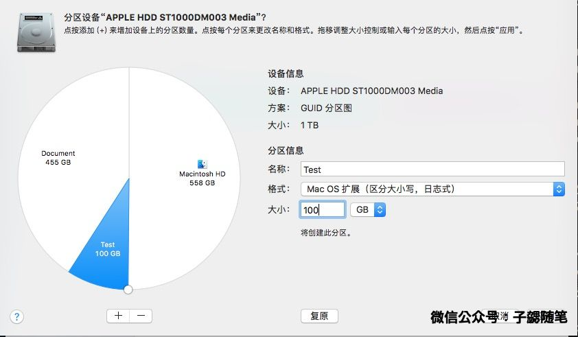

## 背景

对于很多开发者来说，尤其是使用Linux的开发者来说，文件名大小写敏感是一件习以为常的事情。然而当切换到mac以后发现这竟然变成一件很头疼的事情。由于历史原因，目前mac虽然已经支持文件系统大小写敏感，但是默认依然是不敏感。

第一次遇到这种问题的时候是使用git，你会发现你本地大写开头的文件在提交以后，github上的文件名竟然是小写开头，当时懒得折腾，因此选择了所有的命名方式都是用小写开头来规避了这个问题。然而最近要checkout Android的源码，发现这个问题就不得不要解决了。

## 概述

这篇文章简单介绍一下如何使用系统提供的分区工具将mac的磁盘分区，并将文档目录迁移到新的大小写敏感的分区。

## 步骤

### 第一步：备份

虽然自己的几台电脑分区切换过程中都没有出现问题，但是建议还是先备份系统，以免出现问题。

### 第二步：分区

#### 打开分区软件

在launchpad中找到mac系统提供的磁盘工具Disk Utility，如下图：

操作界面如下图：

#### 调整分区

点击左侧边栏中的`Fusion Drive`，然后点击UI上方的分区按钮，就会弹出完整的分区界面。

你可以根据自己的需求来调整分区，例如我将默认分区减小100G，从658减小的558；修改完数字以后点击左侧的扇形，就会发现分区调整以后的预览图。

点击调整出来的部分，修改为你自定义的名称，**`然后在格式中修改文件格式为区分大小写`**，调整空间到整数。如下图

#### 开始分区

当上面的调整都已经OK以后，点击右下角的应用，系统将开始漫长的分区调整的过程。这个过程与你新分区的大小有关。**分区期间电脑会明显变卡，因此最好选择闲时调整~**。当分区完成以后，新的分区将会出现在`/Volumes`目录下。

至此，如果只是为了修改mac的分区，工作已近完成了，但是个人为了工作方便，决定将用户目录下Document中的所有内容也都平移到新建的分区中，因此接下来的内容是关于怎么迁移文件的。

### 迁移文件

迁移的过程其实很简单，就是复制到新分区，然后删除老分区，最后老分区软链接到新分区。

**备注：下面所有的命令都是基于个人电脑的分区设置和文件结构的，仅供参考，由于涉及到rm命令，请谨慎。**

#### 复制到新分区

将`~/Documents`整个文件夹直接复制到新建的分区，例如`/Volumes/Document`下。**除非是新的机器，一般这个目录内容也会很多，因此拷贝的时间也会很久，因此最好选择闲时调整~**

#### 删除旧分区下内容

在确认文件已经全部复制OK以后，为了节省空间，就可以删除旧分区对应的文件了。由于mac系统对于Documents文件夹有保护，因此这步操作只能在终端中完成。打开终端，切换到用户根目录

	cd ~/
	
使用rm命令删除对应目录，由于Documents有权限保护，因此需要使用root权限来删除。输入密码然后继续开始等待。

	sudo rm -fr ~/Documents
	
	
当删除以后，输入ls命令发现已经被删除干净。为了兼容以前的配置，不带来新的问题，我们选择创建一个新分区的软链接到老分区。

	ln -s /Volumes/Document/Documents ~/Documents
	

OK，至此，分区以及内容迁移都已经完成了。
