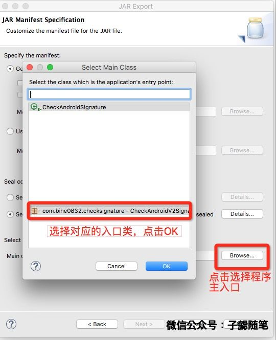

最近因为工作需要提供几个Android 相关的小工具，这几个工具最终都是以可执行的jar的方式提供，开发期间遇到了一些问题，在这里专门总结一下备忘一下。

## 怎么生成可执行java程序

### 相关源码：

- [https://github.com/bihe0832/AndroidGetAPKInfo](https://github.com/bihe0832/AndroidGetAPKInfo)

### 具体案例

可执行Java程序只需要一个入口程序即可，想要把哪个类作为执行入口，只需要在对应类实现static的main函数即可。例如源码中的`CheckAndroidSignature.java`。

在添加了main函数以后，cd到src目录即可编译运行对应的java程序。例如下面就完成了编译了运行：

	➜  src git:(master) javac com/bihe0832/checksignature/CheckAndroidSignature.java
	➜  src git:(master) ✗ java com.bihe0832.checksignature.CheckAndroidSignature --version
	com.tencent.ysdk.CheckAndroidV2Signature version 1.0.1 (CheckAndroidV2Signature - 2)
	homepage : https://github.com/bihe0832/AndroidGetAPKInfo
	blog : http://blog.bihe0832.com
	github : https://github.com/bihe0832
	
## 怎么生成可执行jar

上一步演示了如果生成可以执行的Java程序，但是这并不方便提供给第三者使用，因此我们需要把可执行的java代码进一步封装为一个可执行的jar。接下来会分别介绍包含第三方jar和不包含第三方jar的Java程序怎么生成可执行jar。两种方法都是直接使用Eclipse导出的方法，没有使用maven等其余方法。

### 不包含第三方jar

#### 相关源码：

- [https://github.com/bihe0832/AndroidGetAPKInfo](https://github.com/bihe0832/AndroidGetAPKInfo)

### 具体案例

`CheckAndroidV2Signature`是一个完全自己写的，没有依赖第三方jar的java程序，接下来会step by step来介绍导出过程。

- 1.选择项目工程，然后右击选择导出，如下图：

	

- 2.在弹框（Select）中选择Java分类下面的`Jar File`，之后下一步。
- 3.在新的弹框（JAR File Specification）中，选择你要导出的工程，并选择Jar包含的内容，一般一些IDE的配置文件之类的就不用导出了。然后选择并指定导出文件的路径和地址，之后下一步，如下图：

	

- 4.在新的弹框（JAR Packaging Options）中，保持默认的配置，然后继续下一步。
- 5.在新的弹框（JAR Mainfest Specification）中，在最下方选择应用的主入口（Select the class of the application entry point）如下图：

	

- 6.设置OK以后直接点击Finish，如果不出意外，就会在之前设置的路径生成对应的jar
- 7.执行命令检查效果，已经OK

		➜  src git:(master) ✗ java -jar ./../CheckAndroidV2Signature.jar --version
		com.tencent.ysdk.CheckAndroidV2Signature version 1.0.1 (CheckAndroidV2Signature - 2)
		homepage : https://github.com/bihe0832/AndroidGetAPKInfo
		blog : http://blog.bihe0832.com
		github : https://github.com/bihe0832

### 包含第三方jar

在开发中发现，包含第三方jar和不包含的，处理方法会不太一样，目前还没有仔细研究不一样的原因，只确定用下面的方法可以解决。

#### 相关源码：

- [https://github.com/bihe0832/AndroidGetAPKInfo](https://github.com/bihe0832/AndroidGetAPKInfo)

### 具体案例

`GetApkInfo`是一个使用了AXMLPrinter和jdom写的java程序，运行时依赖两个jar。接下来会step by step来介绍导出过程：

- 1.选择项目工程，然后右击选择导出，如下图：

	

- 2.在弹框（Select）中选择Java分类下面的`Runnable JAR file`，然后下一步。
- 3.在新的弹框（Runnable Jar File Specification）中，选择你程序运行的入口类，指定导出文件的路径和地址，之后点击完成，如下图：

	

- 4.如果不出意外，就会在之前设置的路径生成对应的jar。执行命令检查效果，已经OK

		➜  java -jar getPackageInfo-inner.jar --version
		com.bihe0832.getPackageInfo version 1.0.1 (getPackageInfo - 2)
		homepage : https://github.com/bihe0832/AndroidGetAPKInfo
		blog : http://blog.bihe0832.com
		github : https://github.com/bihe0832
	
## jar 怎么混淆

我们有时候虽然需要提供可执行jar给第三方，但是并不想很简单的让第三方了解我们的实现逻辑，因此最有效的办法就是代码混淆。Android中的代码混淆我们都很熟，对于Jar文件的代码混淆怎么做呢？

#### 混淆工具

Android的sdk工具包里面已经整合了代码混淆相关的工具，放在sdk目录下的$tools/proguard/bin/中。

#### 混淆规则文件

	-injars       getPackageInfo-inner.jar  # 混淆前的文件
	-outjars      getPackageInfo.jar		# 混淆后的文件

	-libraryjars  <java.home>/lib/rt.jar	# Java运行时
	
	#常规的代码混淆规则
	
	-dontwarn org.**
	-keep class org.** { *;}
	
	-keep public class com.bihe0832.packageinfo.Main {
		public static void main(java.lang.String[]);
	}

关于代码混淆文件有几点说明：

1. 混淆前后的文件不要同名
2. Java可执行程序的入口函数不能被混淆

#### 混淆方法

将上面的混淆规则保存为文件，例如`proguard.pro`，把`proguard.pro`和待混淆的文件`getPackageInfo-inner.jar`按照`proguard.pro`中的路径设置，然后运行命令

	➜  $ANDROID_HOME/tools/proguard/bin/proguard.sh @proguard.pro
	
程序执行完成以后就生成了对应的jar，指定命令的时候注意混淆规则文件签名的`@`符号。OK，至此就生成了可以混淆的可执行jar。	

