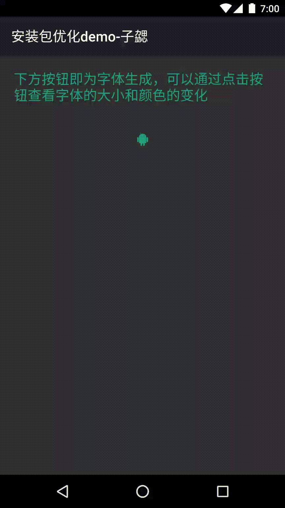
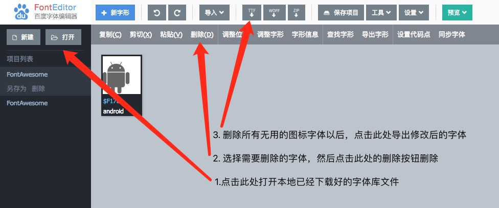

这是个人总结的应用安装精简系列的关于图片精简的第一篇，主要介绍怎么使用图标字体库来代替图标达到精简图片的效果

## 概述

在应用会存在很多简单的按钮，一般这些按钮都会使用png的图片，虽然这部分图片并不会占用太多的资源，但是也是可以优化的内容，就以这部分的优化作为系列的开始。

**`除 .9图、带阴影图外，所有常见的图标都做到字体库里，不使用icon图片。目前比较成熟的图标字体库可以使用font-awsome`**。Font Awesome为您提供可缩放的矢量图标，您可以使用CSS所提供的所有特性对它们进行更改，包括：大小、颜色、阴影或者其它任何支持的效果。

## 相关源码	

- github：Android-APK-Optimize:Resource

	[https://github.com/bihe0832/Android-APK-Optimize/tree/master/Resource](https://github.com/bihe0832/Android-APK-Optimize/tree/master/Resource)
	
## 具体方案

具体方案中包含了，怎么下载、怎么修改、怎么使用。

### 下载字体库

在Font Awesome的官网[http://fontawesome.dashgame.com/](http://fontawesome.dashgame.com/)下载最新的库，解压后在`fonts`目录下找到`fontawesome-webfont.ttf`，然后将字体库拷贝到项目的assets目录

### 使用字体库

 创建字库类
 
	public class FontManager {

	    public static final String FONTAWESOME = "fontawesome-webfont.ttf";
	
	    public static Typeface getTypeface(Context context) {
	        return Typeface.createFromAsset(context.getAssets(), FONTAWESOME);
	    }
	
	}

设置字体
	
	final TextView icon1 = (TextView) findViewById(R.id.icon1);
	icon1.setTypeface(FontManager.getTypeface(this));
		
### 效果展示

## 其他

`fontawesome-webfont.ttf`完整的字体库有160多K，如果项目用到的icon数量极少的时候，貌似切换为字体得不偿失。这里我们可以通过删除字体库里面的无用图标来达到我们的需求，具体方法如下：

- 打开字体编辑工具

	个人是使用一个在线的应该是百度开源的字体编辑工具`fonteditor`[`https://github.com/ecomfe/fonteditor`](https://github.com/ecomfe/fonteditor)，对应官网地址为：[http://fontstore.baidu.com/static/editor/index.html](http://fontstore.baidu.com/static/editor/index.html)
	
- 编辑字体

	打开字体编辑工具以后，按照下图的指引完成字体的修改，修改完成保存以后会发现字体已经大大减少了~

	

## 参考文章

- How to Use FontAwesome in an Android App

	[https://code.tutsplus.com/tutorials/how-to-use-fontawesome-in-an-android-app--cms-24167](https://code.tutsplus.com/tutorials/how-to-use-fontawesome-in-an-android-app--cms-24167)
	
- 如何在 Android 应用中使用 FontAwesome 图标
	
	[http://www.codeceo.com/article/android-app-fontawesome-icon.html](http://www.codeceo.com/article/android-app-fontawesome-icon.html)
