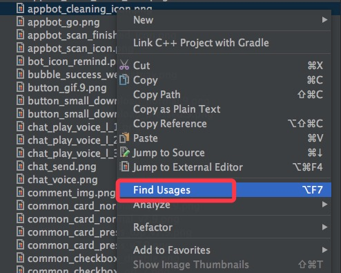

这是个人总结的应用安装精简系列的关于图片精简的第二篇，主要介绍在不降低用户体验的前提下，尽可能的精简图片的相关方案。`优化总体原则就是：在不降低图片效果、保证用户体验的前提下尽最大可能缩小图片文件的大小`。

## 概述

在应用从会存在很多简单的按钮，一般这些按钮都会使用png的图片，虽然这部分图片并不会占用太多的资源，但是也是可以优化的内容，就以这部分的优化作为系列的开始。

**`除 .9图、带阴影图外，所有常见的图标都做到字体库里，不使用icon图片。目前比较成熟的图标字体库可以使用font-awsome`**。Font Awesome为您提供可缩放的矢量图标，您可以使用CSS所提供的所有特性对它们进行更改，包括：大小、颜色、阴影或者其它任何支持的效果。

## png图片处理

由于png图片格式的设计导致png的图片天然很大，因此我们要尽可能少的使用png图片，可行的方法包括：

- `对于无透明或渐变的png图，一律转化为jpg`

	如何判断一张png的图片有没有透明或者渐变的处理，可以参考文章[iMac下制作含透明度图片及判断图片透明度](http://blog.bihe0832.com/png_alpha.html)，或者直接使用文章中提到的工具[https://github.com/bihe0832/getImageInfo](https://github.com/bihe0832/getImageInfo)。该工具基于Java环境，通过命令行处理，可以检测一张图片是否有渐变效果。例如：
	
		➜  getPNGInfo git:(master) java -jar getImgInfo.jar head.png
		{"ret":0,"msg":"图片是否有渐变: true ,图片尺寸为(宽*高): 344 * 344 , 图片大小: 33 KB,图片类型: 6","hasAlpha":true,"type":6,"width":344,"height":344,"size":33}
	
	如果`用工具检查确认图片不含渐变或者透明的效果，必须将png图片转为无alpha通道的jpg，另外对于存在渐变或者透明度的图片，也要判断下是否必须，非必须也要转为jpg`。
- 尽可能使用代码、.9图等代替png

	在开发中对于一些简单图片，我们其实可以通过多种方式来替换，达到精简图片的效果，具体包括：
	
	- `对于纯色的或者渐变的背景图等，我们可以使用drawable结合color来制作，这样不但可以减少图片大小，还可以提升ui渲染的性能`

	- `对于一些简单的，需要适配的图片，例如进度条、按钮等很多场景，可以使用.9.png来代替png`。.9.png图片的制作，Android官方在Android SDK的tools里面已经提供了对应的工具，位于`SDK/tools/draw9patch`，双击即可运行程序开始制作。关于.9.png的制作，后续根据情况写一个文档吧。

	- 还有一些简单的，通过一些几何图形绘出来的图形，我们也可以考虑彻底将图形代码化，通过代码绘制对应的图片，这部分内容网上也已经有很多介绍的开源项目。
	
## 其他图处理

上面关于png的处理方案中除了png转jpg，其余的内容和上一篇的图标转字体一样更多的都是是处理一些小图，这些小图虽然小但是数量很多，因此还是有处理的必要，接下来的内容都是关于在通过上面的方法排除以后，剩余的图片怎么处理的方案，`核心原则就是图片压缩和预加载`。

### 所有图片均需要采用有损压缩算法进一步压缩

按照上面的步骤处理以后，目前剩下的主要就是一些透明的png图片和大量的jpg图。对于这些图片，在不影响用户体验的前提下，我们要尽可能大的进行有损压缩。`对于png的图片，必须使用压缩率更高的图片无损压缩算法ZopFliPng来压缩，对于jpg的话，则使用tinyjpg来进行压缩.`

#### ZopFliPng 使用简介

ZopFli是一个谷歌开源的数据压缩算法，ZopFliPng是基于此开放的图片压缩工具，使用过程中，我们需要将源码clone到本地并编译，之后即可使用命令行进行图片压缩：

- github地址：

	[https://github.com/zixieTools/zopfli](https://github.com/zixieTools/zopfli)

- 下载并编译

		➜  temp ✗ git clone https://github.com/zixieTools/zopfli.git
		Cloning into 'zopfli'...
		remote: Counting objects: 518, done.
		remote: Total 518 (delta 0), reused 0 (delta 0), pack-reused 518
		Receiving objects: 100% (518/518), 429.77 KiB | 280.00 KiB/s, done.
		Resolving deltas: 100% (286/286), done.
		➜  temp ✗ cd zopfli
		➜  zopfli git:(master) make zopflipng
		gcc src/zopfli/blocksplitter.c src/zopfli/cache.c src/zopfli/deflate.c src/zopfli/gzip_container.c src/zopfli/hash.c src/zopfli/katajainen.c src/zopfli/lz77.c src/zopfli/squeeze.c src/zopfli/tree.c src/zopfli/util.c src/zopfli/zlib_container.c src/zopfli/zopfli_lib.c -W -Wall -Wextra -ansi -pedantic -lm -O2 -Wno-unused-function -c
		clang: warning: -lm: 'linker' input unused
		g++ blocksplitter.o cache.o deflate.o gzip_container.o hash.o katajainen.o lz77.o squeeze.o tree.o util.o zlib_container.o zopfli_lib.o src/zopflipng/lodepng/lodepng.cpp src/zopflipng/lodepng/lodepng_util.cpp src/zopflipng/zopflipng_lib.cc src/zopflipng/zopflipng_bin.cc -W -Wall -Wextra -ansi -pedantic -lm -O2 -Wno-unused-function -o zopflipng

- 使用事例

		➜  zopfli git:(master) ✗ ./zopflipng  ~/temp/1/head.png ~/temp/1/head_optimize.png
		Optimizing /Users/zixie/temp/1/head.png
		Input size: 33947 (33K)
		Result size: 20367 (19K). Percentage of original: 59.996%
		Result is smaller

#### tinyjpg 使用简介

tinyjpg 在设计师人群中比较流行，也是一款图片压缩的利器，目前对于jpg图片的有损压缩基本上都是用tinyjpg.

- 官网地址：

	[https://tinyjpg.com/](https://tinyjpg.com/)

- 使用方法

	最简单的方法就是直接在官网压缩，把图片拖动进官网的窗口，然后就会自动执行压缩，压缩完的图片会提供下载链接来下载。为了方便在命令行下使用，我也专门封装了tinyjpg的SDK，提供了java的命令行工具。
	
- github地址：

	[https://github.com/bihe0832/getImageInfo/tree/master/tinyjpg](https://github.com/bihe0832/getImageInfo/tree/master/tinyjpg)

- 使用事例：

		➜  getPNGInfo git:(master) ✗ java -jar ./tinyjpg.jar ~/temp/1/head.jpg
		tinypng_api_key:QVFA4tI-IBD6Ge4gcCqQX44xTdQTay1f
		http_proxy:http://dev-proxy.oa.com:8080
		
		file unoptimized size: 8037
		file optimized: /Users/zixie/temp/1/head_optimized.jpg
		file optimized size: 4895
		file compress percentage: 39.094193%

### 非关键或基础场景，大图云端化

经过上面的流程，目前应该大部分图片都已经被处理过了，简单的通过压缩、优化这些方法已经不能再减少应用安装包中图片的大小了，接下来就是一些非技术的优化手段了。

结合[Android安装包精简系列之为什么要优化精简安装包](http://blog.bihe0832.com/android-optimize-why.html)中提到的观点，我们会有下面的一些策略

- `部分必须要保留在安装包里面的非关键或者基础场景相关的大图通过云端下发的方式来下发。`
- `下发后的图片缓存本地，后续均使用缓存图片，不再从云端拉取`。
- `应用提供几张不同类型的默认图供全局使用，用于解决网络等问题导致的图片首次下发失败的问题`

这里就涉及到两个问题：

#### 怎么找到非关键或基础场景的大图

有些应用有上千张图，因此如果一张一张去判断太过麻烦，因此我们的做法是先用脚本筛选出所有大于5K的图片，然后追踪他们的使用场景。最终确定哪些图片是可以云端下发的。对于如何找到这些大图，可以通过下面的命令：

	➜  res git:(master) find . -size +5k | egrep 'png|jpg' | xargs -I {} du -h  {}
	8.0K	./drawable/dice_1.png
	 12K	./drawable/dice_2.png
	 12K	./drawable/dice_3.png
	 12K	./drawable/dice_4.png
	 12K	./drawable/dice_5.png
	 12K	./drawable/dice_6.png
	268K	./drawable/dice_barrel.png
	8.0K	./drawable/iconfont_blog.png
	8.0K	./drawable/iconfont_game.png
	 24K	./drawable/newer01.png
	 20K	./drawable/shake.png
	 16K	./drawable/shake_gray.png

因为是简单的shell命令，因此不再专门具体介绍，通过命令的组合可以完成很多筛选的条件

#### 怎么找到图片的使用场景

对于找到的每一张图，在Android Studio里面右击图片，然后选择Find Usages(或者直接使用快捷键Alt + F7)，IDE就会帮你找出代码中所有的引用。如下图：

接下来的就是具体的代码分析了。这里要注意`通过反射获取的资源是无法通过这种方式发现的，因此如果项目中有使用比较多的反射，建议通过别的方法处理，这部分内容我会在后面介绍资源精简的时候说明。`

## 关于webp

WebP是一种支持有损压缩和无损压缩的图片文件格式，派生自图像编码格式 VP8。根据 Google 的测试，无损压缩后的 WebP 比 PNG 文件少了 45％ 的文件大小，即使这些 PNG 文件经过其他压缩工具压缩之后，WebP 还是可以减少 28％ 的文件大小。使用webp更大的目的并不是为了降低安装包大小，而是为了降低带宽占用。

虽然webp存在兼容性的问题，但目前github上已经有解决方案。之前简单验证尝试发现引入的so都比较大，单CPU在80K+，但是开源项目是提供了编码、解码等一整套方案的代码。对于客户端来说，我们仅仅关注解码相关的内容，虽然并没有亲自实践，但是`感觉仅用来兼容低版本解码的so经过整合以后应该并不是很大，因此个人对于webp还是是比较积极的看法`。
