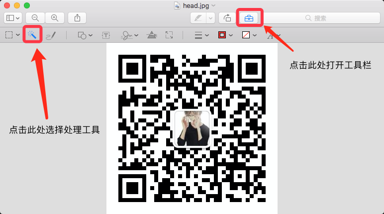
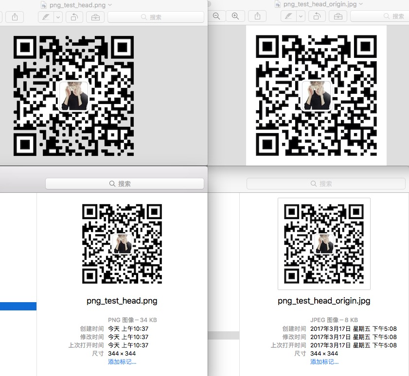

最近在做安装包优化相关的内容，期间遇到了一个问题，怎么检查一张图片是不是有透明度，发现mac下面没有很好的工具，这部分内容难度也很低，所以就自己顺手写了一个简单的工具。

关于为什么要检查一张图片是不是有透明度，我后面会在介绍安装包优化的详细介绍。

### iMac下怎么制作含透明度图片

在macOS中自带的预览十分强大，我们可以通过预览来直接制作一些透明效果的PNG图片。这里要用到的是【预览】中的“即时Alpha”工具。

- 使用预览打开图片，点击上方菜单中的按钮打开工具栏，然后找到 "即时Alpha" 功能对应的魔术笔一样的按钮，点准备开始编辑，如下图：

	

- 选色

	使用选色笔，选择要清楚的颜色部分，然后按住鼠标左键拖动，然后就会发现预览已经自动帮你裁剪选择了要剔除的部分，然后按删除键删除白色部分，这时系统就会提示是否要将文稿转换为png，选择转换，此时图片就已经完成了修改。

- 导出

	选择 “文件”-“导出”，即可导出并保存修改后的图片。
	
- 文件对比

	这里是修改后的两个文件的一个简单的对比效果，可以看到png的大小明显增加：
		
	

### 怎么判断图片是否有渐变或者透明度

- 源码地址：

	[https://github.com/bihe0832/getPNGInfo](https://github.com/bihe0832/getPNGInfo)

	关于工具的详细使用介绍可以参考源码中的README文件。
	
- 使用事例：

		➜  getPNGInfo git:(master) ✗ java -jar ./getPNGInfo.jar ./png_test_head_origin.jpg
		{"ret":0,"msg":"图片是否有渐变: false ,图片尺寸为(宽*高): 344 * 344 , 图片大小: 7 KB,图片类型: 5","hasAlpha":false,"type":5,"width":344,"height":344,"size":7}
		
		➜  getPNGInfo git:(master) ✗ java -jar ./getPNGInfo.jar ./png_test_head.png
		{"ret":0,"msg":"图片是否有渐变: true ,图片尺寸为(宽*高): 344 * 344 , 图片大小: 33 KB,图片类型: 6","hasAlpha":true,"type":6,"width":344,"height":344,"size":33}

### 参考文章

- 使用OS X自带预览功能制作透明背景的PNG图片

	[https://www.macx.cn/thread-2093768-1-1.html](https://www.macx.cn/thread-2093768-1-1.html)