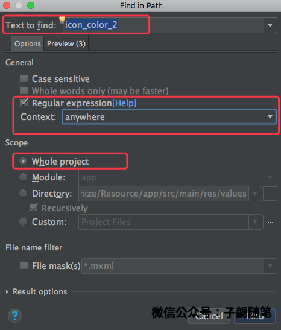

## 概述

最近因为忙于整理工作项目相关的文档，因此更新较慢。但是后面会坚持逐渐更新。

这是个人总结的应用安装精简系列的第三篇，在前面的文章中总结了关于图片优化相关的内容。这篇文章主要介绍整体资源的优化，包括怎么梳理apk里面的未被使用资源并精简优化以及怎么通过资源混淆等达到存量资源的精简。这里提到的`未被使用资源是指存在在代码中，但是并没有被任何代码或者场景使用到的资源。`这部分资源在apk中是无用的。

### 相关源码	

- Android-APK-Optimize:Resource

	[https://github.com/bihe0832/Android-APK-Optimize/tree/master/Resource](https://github.com/bihe0832/Android-APK-Optimize/tree/master/Resource)

## 未被使用资源精简

随着项目的不断推进，**`不断的原型验证、方案调整等导致项目代码中很容易出现大量的未被使用资源或者代码`**。尤其是迭代过快的时候，这种现象更加明显。当项目发展到一定时期以后，这部分内容也会越来越多。找出这部分内容并清除，对于项目资源精简也优化也是很重要的一部分。接下来就介绍一下怎么找到以及找到了怎么处理。

### 怎么找到真正没有被使用的资源

#### 找到未被使用资源

目前都是使用Lint来分析，Lint是Android官方提供的扫描分析工具，它可以发现代码质量、安全性等相关的问题并提供解决方案。lint整个非常强大，这里我们仅介绍怎么使用lint来发现未被使用资源。更多关于Lint的介绍可以查看官方文档：[https://developer.android.google.cn/studio/write/lint.html?hl=zh-cn](https://developer.android.google.cn/studio/write/lint.html?hl=zh-cn)

在Android Studuio的菜单选择 "Analyze" -> "Run Inspection by Name"，如下图：

	
在弹框中输入 "Unused resources"后，点击列表中的 "Unused resources"，然后在弹框中选择 "Whole project" ，然后点击OK，在视图的左侧（红框1的位置）就会列出所有当前项目包含但是并未被使用的资源：

#### 确认未被使用资源确实没用

通过上面的方法演示了怎么通过lint分析出当前应用中所有没有使用到的资源，那这些资源是不是真的就未被使用呢？

以事例工程为例，在上面的扫描中，在res_reflection中，lint扫描出来有一条资源未被使用：

	<color name="icon_color_2">#af17aa</color>

那这条资源是不是真的没有被使用呢？

在MainActivity.java的第38行有如下的代码：
	
	icon1.setTextColor(getResources().getColor(
		Res.color(getResources(),"icon_color_2",getPackageName())));

上面的代码可以看出，`icon_color_2`并不是没有被使用。由于代码中是通过反射的方式动态获取资源，因此就导致资源虽然被使用了，但是在使用lint做静态扫描是并不能发现。因此当`通过lint分析出未被使用的资源后，我们并不能简单粗暴的直接删除所有未被使用的资源，还需要进一步确认`。一般的：

- `如果项目没有使用反射等动态加载资源的方式，开发者可以直接一键删除所有无用资源（怎么操作下文会说明）或者直接自动删除`

- `如果不确定项目木有使用动态加载资源的方式，那就需要逐个资源去确认，如果发现确实没有使用，那就可以手动删除。`确认的方法很简单，全局查找：在Android Studio中选择："Edit" -> "Find" -> "Find in Path" 如下图：

	

	然后在弹框中输入需要查找的资源名称，确认选项如下：

	
	
	之后点击查找，就可以看到查找结果。这是基于文本的全局查找，虽然费事但是全面，在查找出结果后逐个确认是否确与该资源相关，如果全部无关或者查无结果，那就证明该资源确实无用。

### 怎么精简真正没有被使用的资源

当能确定一个资源真正没有被使用以后，精简的工作就非常简单了，下面还是针对上面列出的不同情况总结下不同情况下怎么做最后的精简。需要注意，`尽可能通过分析以后精简资源，不要使用修改构建配置中的shrinkResources来精简`。

#### 自动精简

所有的`自动精简都仅仅适用于确认没有使用动态加载资源方式的应用。其中使用Android Studio可以删除所有无用的文件以及具体资源文件中的无用资源项（如string\color等定义），而通过构建配置仅仅能删除无用的文件，对于具体资源文件中的无用资源项不不能删除。具体在实际开发场景中，推荐使用Android Studio定期优化的方式。`

- 通过Android Studio

	其实就是通过AS结合lint找出所有未使用的资源，然后一键删除。如下图：

	

	点击红框2的区域，Android Studio就会自动删除所有查找出来的无用资源。这里可以清除的资源包括：
	
	- 无用的图片资源
	- values/ 文件夹中定义的资源（例如字符串、尺寸、样式和颜色）等

- 通过资源压缩器

	如果确认自己的应用没有使用动态加载的方式，其实有更简单无用资源精简的方式，那就是直接使用Android官方提供的资源压缩器，在项目的构建脚本添加配置shrinkResources为true即可开启。官方说明可以点击链接 [https://developer.android.com/studio/build/shrink-code.html?hl=zh-cn#shrink-resources](https://developer.android.com/studio/build/shrink-code.html?hl=zh-cn#shrink-resources) 查看。在构建过程中，构建系统会自动删除所有无用的资源。事例如下：
		
		android {
		    ...
		    buildTypes {
		        release {
		            minifyEnabled = true
		            shrinkResources true
		            proguardFiles './../proguard-rules.pro'
		        }
		        debug {
		            minifyEnabled = false
		            shrinkResources false
		        }
		    }
		}
		
	但是这里需要注意通过资源压缩器目前不会移除 values/ 文件夹中定义的资源（例如字符串、尺寸、样式和颜色）等，因此效果会降低很多。
	
#### 手动精简

对于上面提到的`使用了动态加载的方式的应用，或者无法确定一定没有使用动态加载资源的方式的应用，建议都通过手动判断并删除的方式来精简`。如果项目资源很多的时候，手动精简的方法成本还是很高，因此建议`对于使用动态加载或者确认虽然无引用但是要保留的资源使用专门的文件标示来避免每次重复的确认。例如事例中将通过反射使用的资源放在专门的文件中，文件名以reflection结尾。`后续资源精简的时候就可以直接忽略这个文件中的资源。

## 存量资源混淆

通过上面的方法，基本上可以梳理并精简项目相关的所有无用资源。除了无用资源的精简，我们对于存量的有用的资源我们还可以通过资源混淆达到进一步的精简。

关于资源混淆相关的原理可以参考微信团队的这篇文章：[安装包立减1M--微信Android资源混淆打包工具](https://mp.weixin.qq.com/s?__biz=MzAwNDY1ODY2OQ==&mid=208135658&idx=1&sn=ac9bd6b4927e9e82f9fa14e396183a8f#rd)。资源混淆和代码混淆使用一样的原理，目前微信已经将该工具开源。工具对应的开源项目[AndResGuard](https://github.com/zixieTools/AndResGuard)中也有非常详细的使用介绍，因此对于这部分不做详细介绍。下面就以Demo项目为例演示一下如何使用命令行工具来压缩以及压缩效果。

### 准备安装包

在资源压缩Demo项目的根目录运行gradle命令开始构建最新的Demo包

	➜  Demo git:(master) ✗ ./gradlew clean && ./gradlew build

在构建结束以后，将生成的安装包复制到资源压缩的工作目录

	➜  Demo git:(master) ✗ cp -r ./app/build/outputs/apk/app-all-debug.apk ./../Tools/

### 资源压缩

- 准备资源压缩的配置文件

	配置文件主要包括设置混淆相关的白名单，mapping文件等，下面是一个简单的事例，具体规则参考开源项目中的配置文件。

		<?xml version="1.0" encoding="UTF-8"?>
		<resproguard>
		    <issue id="property">
		        <!--是否开启7zip压缩，由于Android的V2签名的关系，建议关闭，不开启-->
		        <seventzip value="false"/>
		        <!-- V1版本的签名信息保存位置，建议不修改-->
		        <metaname value="META-INF"/>
		        <! 是否保留资源文件夹目录名称，如果选false，例如res/drawable 会被压缩为 r/s-->
		        <keeproot value="false"/>
		    </issue>
		
		    <!-- 白名单，所有使用反射获取的资源都不能被混淆-->
		    <issue id="whitelist" isactive="true">
		        <path value="com.bihe0832.android.optimize.R.drawable.ic_launcher"/>
		        <path value="com.bihe0832.android.optimize.R.color.icon_color_2"/>
		    </issue>
		
		    <!-- mapping文件，类似代码混淆的mapping，保证不同版本混淆结果的一致性 -->
		    <issue id="keepmapping" isactive="false">
		        <path value="{your_mapping_path}"/>
		    </issue>
		
		    <!-- 是否开启进一步压缩，建议开启 -->
		    <issue id="compress" isactive="true">
		        <path value="*.png"/>
		        <path value="*.jpg"/>
		        <path value="*.jpeg"/>
		        <path value="*.gif"/>
		        <path value="resources.arsc"/>
		    </issue>

		    <!-- 签名相关的信息，因为涉及到安全，因此建议这部分内容不集成在混淆中，可以在混淆完成以后用命令行重新签名 -->
		    <issue id="sign" isactive="false">
		    </issue>
		
		</resproguard>

- 运行命令开始压缩

	在工具根目录运行命令开始压缩
	
		➜  Tools git:(master) ✗ java -jar AndResGuard-cli-1.2.0.jar app-all-debug.apk -config config.xml -out outapk
		special configFile file path: ~/github/Android-APK-Optimize/Resource/Tools/config.xml
		special output directory path:  ~/github/Android-APK-Optimize/Resource/Tools/outapk
		reading config file,  ~/github/Android-APK-Optimize/Resource/Tools/config.xml
		mKeepRoot false
		[AndResGuard] begin: outapk, app-all-debug.apk
		unziping apk to ~/github/Android-APK-Optimize/Resource/Tools/outapk/temp
		decoding resources.arsc
		parse to get the exist names in the resouces.arsc first
		reading packagename com.bihe0832.android.optimize
		resources mapping file ~/github/Android-APK-Optimize/Resource/Tools/outapk/resource_mapping_app-all-debug.txt done
		writing new resources.arsc
		resources.arsc Character Encoding: utf-8
		general unsigned apk: app-all-debug_unsigned.apk
		DestResDir 4 rawResDir 4
		[AndResGuard] done, total time cost: 0.241000s
		[AndResGuard] done, you can go to file to find the output ~/github/Android-APK-Optimize/Resource/Tools/outapk
		➜  Tools git:(master) ✗ cd outapk
		➜  outapk git:(master) ✗ ls
		app-all-debug_unsigned.apk         resources.arsc
		r                                  temp
		resource_mapping_app-all-debug.txt
	
	混淆过程日志详细列出了混淆过程的相关文件、耗时等信息。查看Tools目录下的outapk目录，可以看到已经生成了混淆后未签名的apk以及混淆过程中的mapping文件。如果要保持不同版本之间的资源混淆结果的一致性，在下次混淆资源时即可使用上面生成的`resource_mapping_app-all-debug.txt`作为项目资源混淆的mapping文件

### 重新签名

	➜  outapk git:(master) ✗ $ANDROID_HOME/build-tools/25.0.1/apksigner sign --ks ~/lib/debug.keystore ./app-all-debug_unsigned.apk
	Keystore password for signer #1:
	➜  outapk git:(master) ✗ java -jar ~/lib/getPackageInfo.jar ./app-all-debug_unsigned.apk
	执行结果: 成功
	应用信息:
	  包名: com.bihe0832.android.optimize
	  版本名: 1.0.0
	  版本号: 1
	  签名文件MD5: 252e3ded833125ed3e3bb010bc24f4dc
	  V1签名验证通过: true
	  使用V2签名: true
	  V2签名验证通过: true
	➜  outapk git:(master) ✗ du -h ./app-all-debug_unsigned.apk
	248K	./app-all-debug_unsigned.apk
	➜  outapk git:(master) ✗ du -h ../app-all-debug.apk
	284K	../app-all-debug.apk
	➜  outapk git:(master) ✗ echo "scale=2;284/248"|bc
	1.14

在使用apksigner完成签名以后，对比查看，混淆前后的安装包，发现已经安装包大小已经减少了14% 。由于我们的demo只是为了测试原理，因此减少的内容比较少。

### 效果确认

通过上面的过程就完成了应用的资源混淆和再次签名，可以发现安装包大小确实已经减少，接下来确认下混淆的效果是不是达到了。首先通过zip命令简单查看安装包的内容，对比发现资源目录确实已经被混淆了

	➜  outapk git:(master) ✗ unzip -t ./../app-all-debug.apk
	Archive:  ./../app-all-debug.apk
	    testing: AndroidManifest.xml      OK
	    testing: META-INF/CERT.RSA        OK
	    testing: META-INF/CERT.SF         OK
	    testing: META-INF/MANIFEST.MF     OK
	    testing: assets/fontawesome-webfont.ttf   OK
	    testing: classes.dex              OK
	    testing: res/drawable-xhdpi-v4/head.jpg   OK
	    testing: res/drawable-xhdpi-v4/head_optimized.jpg   OK
	    testing: res/drawable-xhdpi-v4/ic_launcher.png   OK
	    testing: res/layout/activity_main.xml   OK
	    testing: resources.arsc           OK
	No errors detected in compressed data of ./../app-all-debug.apk.
	➜  outapk git:(master) ✗ unzip -t ./app-all-debug_unsigned.apk
	Archive:  ./app-all-debug_unsigned.apk
	    testing: AndroidManifest.xml      OK
	    testing: assets/fontawesome-webfont.ttf   OK
	    testing: classes.dex              OK
	    testing: r/a/a.jpg                OK
	    testing: r/a/b.jpg                OK
	    testing: r/a/ic_launcher.png      OK
	    testing: r/b/a.xml                OK
	    testing: resources.arsc           OK
	    testing: META-INF/ANDROIDD.SF     OK
	    testing: META-INF/ANDROIDD.RSA    OK
	    testing: META-INF/MANIFEST.MF     OK
	No errors detected in compressed data of ./app-all-debug_unsigned.apk.
	
我们反编译混淆以后的apk以后，进一步查看，发现资源的文件名已经未加入白名单的资源也都已经混淆成功了。因此可以确认资源混淆是有效的。

	➜  outapk git:(master) ✗ java -jar -Duser.language=en -Duser.home=$ANDROID_HOME/build-tools/25.0.2 ~/lib/apktool.jar d -f ./app-all-debug_unsigned.apk
	I: Using Apktool 2.2.2 on app-all-debug_unsigned.apk
	I: Loading resource table...
	I: Decoding AndroidManifest.xml with resources...
	I: Loading resource table from file: /Users/hardyshi/lib/android-sdk/build-tools/25.0.2/Library/apktool/framework/1.apk
	I: Regular manifest package...
	I: Decoding file-resources...
	I: Decoding values */* XMLs...
	I: Baksmaling classes.dex...
	I: Copying assets and libs...
	I: Copying unknown files...
	I: Copying original files...
	➜  outapk git:(master) ✗ cd app-all-debug_unsigned/res
	➜  res git:(master) ✗ tree
	.
	├── drawable-xhdpi-v4
	│   ├── a.jpg
	│   ├── b.jpg
	│   └── ic_launcher.png
	├── layout
	│   └── a.xml
	└── values
	    ├── colors.xml
	    ├── dimens.xml
	    ├── ids.xml
	    ├── public.xml
	    └── strings.xml
	
	3 directories, 9 files
	➜  res git:(master) ✗ head values/colors.xml
	<?xml version="1.0" encoding="utf-8"?>
	<resources>
	    <color name="a">#ffafa71a</color>
	    <color name="icon_color_2">#ffaf17aa</color>
	    <color name="b">#ff1fa67a</color>
	</resources>