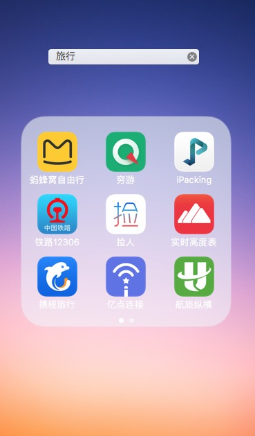
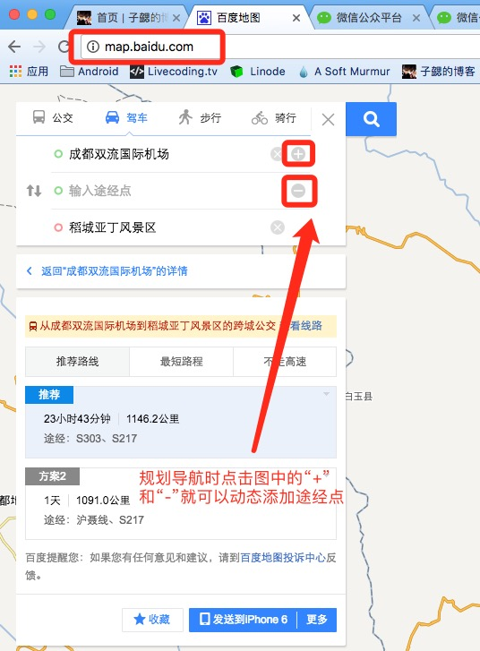
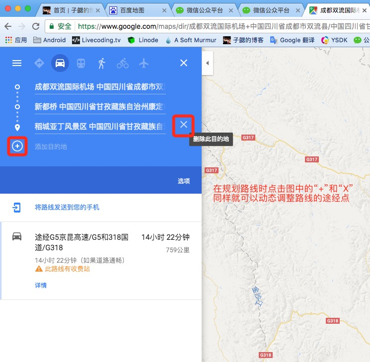
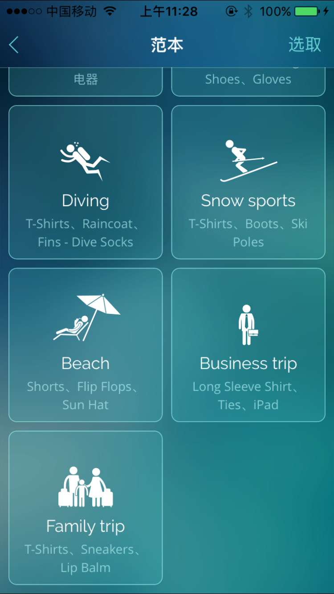
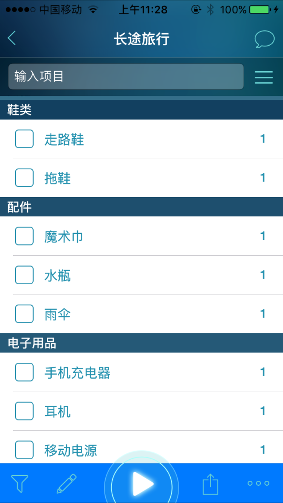
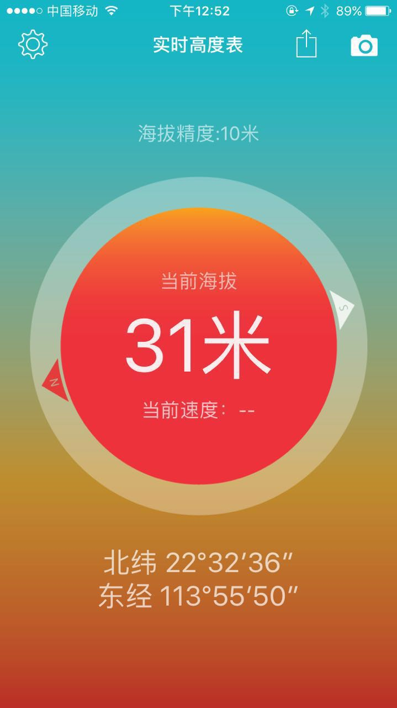
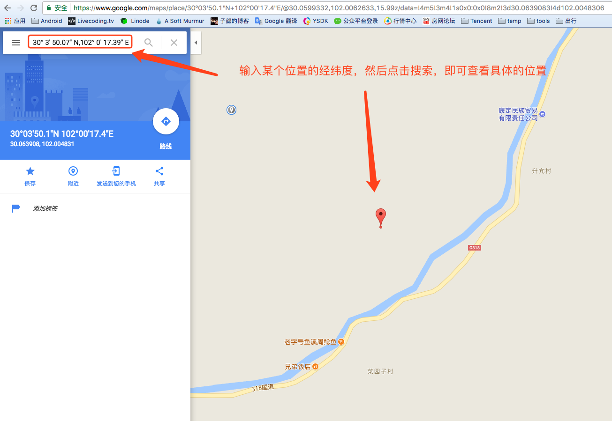

每次出去玩之前都会上网搜很多很多的攻略。但是发现更多的是游记；游记里面的大部分信息是介绍景色、感悟等；其实除了这部分信息，怎么去，有什么注意事项等等更是很多人想要关注的事情。然而要么是因为玩的太久忘记了，要么是没有想到，很多游记对于这部分信息的记录寥寥。其实这部分信息的记录并不复杂，正好有朋友问我，因此就专门写篇文章把自己的一些经验分享一下。

作为一个高逼格的工程师，肯定是要通过各种技术手段来协助自己记录。不然好不容易出去玩，不能尽兴，还要花很多心思来记录各种时间点和经历也太伤神了，同时也失去了旅行的意义。这篇文章就简单介绍一下自己每次出行使用的一些辅助工具。

## 总体介绍

下面是我手机里面出行时使用的应用的汇总，简单截图了下。主要包括攻略查询类、导航类、打车类、订票订酒店类、信息查询类。接下来会按照的旅行的不同阶段详细介绍一下其中的一些。

## 出行准备

### 攻略游记查看

出行前往往都需要花费大量的精力来做准备，尤其是自由行的时候。一方面防止有坑，另一方面好不容易出来一次，就一定要不含遗憾的回去。目前国内出行时规划行程一般用蚂蜂窝比较多，国外的话会同时看蚂蜂窝和穷游。

- 蚂蜂窝自由行：
	- 主要用于规划行程、了解路线和沿途攻略；同时对于旅行的一些细节也可以提问，主要也是当地的一些旅行团或者旅游行业的人士会解答
	- 网址：[http://www.mafengwo.cn/](http://www.mafengwo.cn/)

- 穷游：
	- 主要用于规划行程、了解路线和沿途攻略
	- 网址：[http://www.qyer.com/](http://www.qyer.com/)

- 微博：
	- 主要用于查看历史上相同时间去过的人的照片，了解当时的景色以及了解近期的景色
	- 网址：[http://weibo.com/](http://weibo.com/)

对于出行的路线规划主要是用百度和谷歌，目前百度和谷歌都支持导航设置途径点。不过百度的途经点远少于谷歌的，因此短距离可以用百度规划，长距离用谷歌规划。

- 百度地图：
	
	- 主要用于路线规划、和总体了解
	- 网址：[http://map.baidu.com/](http://map.baidu.com/)
	
		

- 谷歌地图：
	- 主要用于制作路线图
	- [https://www.google.com/maps](https://www.google.com/maps)		
		

下面附上一张自己制作的路线图事例：

	
### 机票酒店

为了防止旅行顺利，我大部分行程都会提前预定好，以防万一。当然如果非高峰期也可以边走边订，会更自由。这部分内容一般是用携程和航旅纵横。

- 携程：
	- 主要用于酒店、机票预订
	- 网址：[http://www.ctrip.com/](http://www.ctrip.com/)
	- 特别说明：
		
		出去玩经常要走完全没有经验的航线，选错航班就特别坑。携程有提供一个航班点评的功能，但是入口非常深，至今没有记住。不过可以用下面的链接直接访问：[https://m.ctrip.com/webapp/you/comment/list/XXX-flight.html](https://m.ctrip.com/webapp/you/comment/list/XXX-flight.html)；将链接中的XXX更换为你打算乘坐的航班号，就可以看到相关航班的点评信息了。

- 航旅纵横：
	- 主要用于查看航班的历史飞行状态，早晚点等信息；曾经根据机场的进出港航班和航空公司的延误情况准确预测到我们延误航班的预计登机时间被妹子表扬，[捂脸]
	- 网址：[http://www.umetrip.com/mskyweb/main/index.html](http://www.umetrip.com/mskyweb/main/index.html)

### 行李整理

除了上面的准备，出发前的行李准备也很重要，尤其是长途旅行，准备的东西更加多，因此更容易漏了东西。而且有时候这次出去发现应该带什么忘了，下次出去的时候还是忘记了。目前我是用iPacking，主要用于出发前物品整理和打包。是一款iPhone应用，AppStore应用名称：iPacking。软件截图如下：

### 路线规划

路线规划以及后面的游记整理我都是用markdown，什么是markdown。markdown的语法以及编辑工具可以参考下面的文章。

- Markdown语法简介：[http://blog.bihe0832.com/markdow_intrduce.html](http://blog.bihe0832.com/markdow_intrduce.html) 

### 旅行约伴

如果自驾出去可能需要找同行的人，一般是使用捡人和微博，个人感觉微博效果更好一点。

## 出行过程

在出行的过程中主要就是衣食住行相关的问题了。导航的话基本主要用百度地图，大部分时候还是比较靠谱可信的。

- 百度地图：
	
	- 主要用于导航、记录足迹点（用于协助后面的游记制作，当然我基本用得少）
	- 网址：[http://map.baidu.com/](http://map.baidu.com/)

如果去一些海拔比较高的地方的话，可以用实时高度表来实时查看当前的海拔高度的行车速度。实时高度表也是一款iPhone应用，AppStore应用名称：实时高度表。软件截图如下：

对于吃的话主要就是用大众点评了，不过很多时候也会怎么方便怎么吃，只有晚上休息的时候会参考比较多。住的话就还是前面提到的主要参考携程，尤其是去一些偏远的地方一般酒店都是可以先看房在预订的，因此相对问题不大。

除了上面的内容以外，**在旅行中最重要的一点就是多拍照片了，每天出发、休息、到标志性的地方都记得要拍照**。因为用脑子记住什么时候到了什么地方这些太难了，而且路上怎么会有心思记这些。因此我们都是想记下来的地方就拍一张照片，后面会用工具读取这张照片的拍摄时间、地点等信息。这样写游记就会方便很多。
	
## 出行回顾

等旅行结束回到家，也就算旅行基本结束了。有人会选择整理一下照片，有人会写个游记；我更多的会以攻略的角度为主来写。写游记既是对旅行的一次回顾，又可以通过文字加图片记录下更多的旅行信息，方便后来人了解。在游记整理中最关键的点就是什么时间到了什么位置做了什么事。做了什么有照片为证，什么时间什么地点怎么解决呢？

每张照片在拍摄的时候一般拍摄设备都会同时记下一些相关信息，这里面的信息很多，但是我们只需要一部分。网上找了很久一直没有找到适合的工具，于是就自动动手写了一个工具PhotoManager，关于PhotoManager的详细说明请参考文档 [基于命令行的照片整理及查看工具](http://blog.bihe0832.com/photomanage.html) 。下面列出查看照片时的某个事例：

	➜  PhotoManager git:(master) ✗ java -jar ./managePhoto.jar --show ~/temp/IMG_3555.jpg
	照片信息如下：
	******************************************************
	照片的当前名称: 2017-05-21_14-56-16.jpg
	照片的当前路径: /Volumes/Document/Document/temp/1/5/2017-05-21_14-56-16.jpg
	照片的空间大小: 2941 KB
	照片的像素大小: 3264 pixels * 2448 pixels
	拍摄时当地时间: 2017:05:21 14:56:16
	拍摄时标准时间: 2017:05:21 06:56:16.00 UTC
	拍摄时地点经纬: 30° 3' 50.07" N,102° 0' 17.39" E
	拍摄时地点海拔: Sea level:2386 metres
	拍摄时使用设备: Apple (iPhone 6)
	******************************************************

可以看到上面的工具在获取位置时只能获取到拍摄照片的位置的经纬度，这个还是不够直观，因此我们需要将经纬度转化为地理位置。由于自己平时电脑用google地图比较多，因此解析照片的时候直接解析为了google地图支持的经纬度。当需要知道具体的位置的时候，在google数据经纬度即可。如下图：

## 汇总信息

- 百度地图：

  - 主要用于导航、记录足迹点、规划路线
  - 网址：[http://map.baidu.com/](http://map.baidu.com/)

- 谷歌地图：
	- 主要用于制作路线图，根据照片经纬度确定对应地理位置来完成游记。
	- [https://www.google.com/maps](https://www.google.com/maps)

- PhotoManager：
	- 整理拍摄照片、读取照片的拍摄时间、拍摄位置经纬度、海拔高度等信息，用于完成游记
	- 网址：[https://github.com/bihe0832/PhotoManager](https://github.com/bihe0832/PhotoManager)

- 实时高度表：
	- 主要用于查看实时的车速和海拔
	- iPhone应用，AppStore应用名称：实时高度表

- iPacking：
	- 主要用于出发前物品整理和打包
	- iPhone应用，AppStore应用名称：iPacking

- 携程：
	- 主要用于酒店、机票预订
	- 网址：[http://www.ctrip.com/](http://www.ctrip.com/)

- 航旅纵横：
	- 主要用于查看航班的历史飞行状态，早晚点等信息
	- 网址：[http://www.umetrip.com/mskyweb/main/index.html](http://www.umetrip.com/mskyweb/main/index.html)
 
- 蚂蜂窝自由行：
	- 主要用于规划行程、了解路线和沿途攻略
	- 网址：[http://www.mafengwo.cn/](http://www.mafengwo.cn/)

- 穷游：
	- 主要用于规划行程、了解路线和沿途攻略
	- 网址：[http://www.qyer.com/](http://www.qyer.com/)

- 微博：
	- 主要用于查看历史上相同时间去过的人的照片，了解当时的景色以及了解近期的景色以及捡人
	- 网址：[http://weibo.com/](http://weibo.com/)
	
- 捡人：
	- 主要用于旅行约伴
	- 网址：[http://www.ijianren.com/](http://www.ijianren.com/)
      

