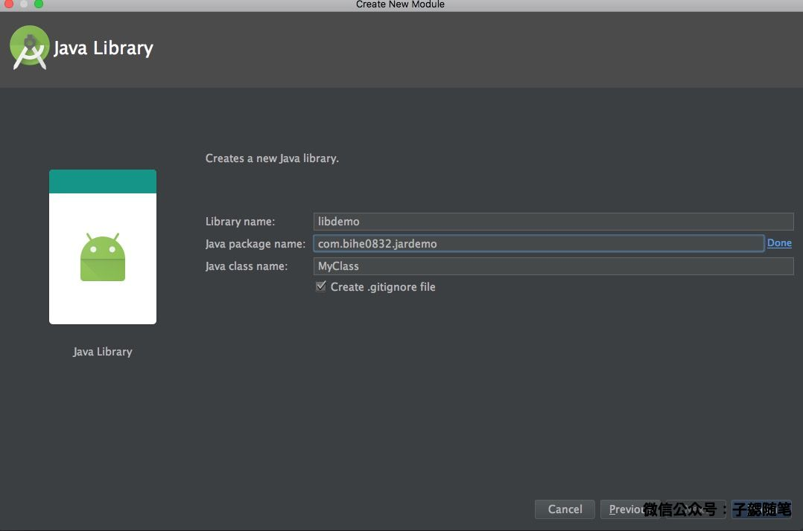
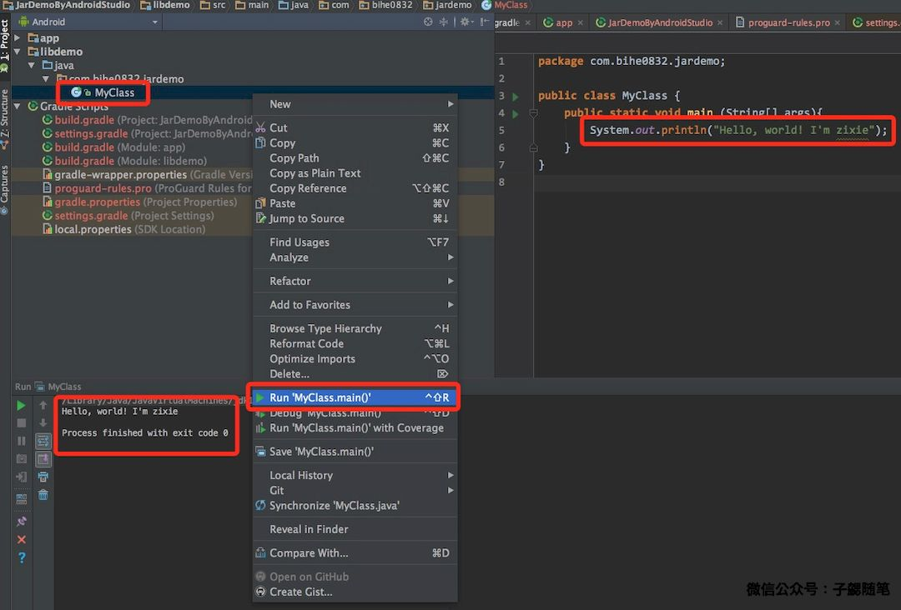

之前开发Java程序一直都是使用Eclipse 开发Jar程序，现在开发基本上都已经弃用Eclipse了，但是有时偶尔开发个小的Jar程序，还要切换回去好麻烦，刚好前几天有人问几个相关的问题，就顺便整理了下Android Stuido开发Jar程序的一个简单流程，方便后续开发需要。

### 创建工程

启动Android Studio，新建一个Android Studio项目，如下图

在弹出的项目配置框中填写项目的名称、包名、代码路径等信息，然后点击下一步，如下图。

选择一个项目类型，最简单的就是手机和平板应用了，然后其余的参数都不用修改，直接下一步，如下图：

选择不含任何Activity的项目，如下图：

因为我们并不是要新建一个Android 应用，只是需要一个壳。之后点击finish，然后就开始项目创建，如果个人的网络环境无法代理到外网，可以点击取消，然后切换为个人本地的开发用gradle常见配置项。配置方法可以参考文档：[终端基于gradle的开源项目运行环境配置指引](http://blog.bihe0832.com/android-as-gradle-config.html)。构建中的一些错误，也可以参考文章[gradle常见错误解决方案](http://blog.bihe0832.com/gradle-issues.html)来解决。

### 创建项目

当创建好工程以后，接下来就是创建Jar程序对应的项目，Android Studio中通过创建不同的Module可以维护不同的Jar.

选择 "File"->"New"->"New Module"，弹出新建module对话框，选择Java Library，如下图：

在弹窗的模块配置框中填写模块响应的信息，然后点击完成，如下图：

至此就已经完成了一个新模块的创建，同时在该模块的java代码目录创建MyClas类，如下图：

### 创建入口类

一个可运行的java程序，都需要一个Java入口类，入口类需要实现Main方法，由于只是写一个demo，因此这里就修改MyClass，在运行时打印一行文本。代码如下：

	package com.bihe0832.jardemo;

	public class MyClass {
	    public static void main (String[] args){
	        System.out.println("Hello, world! I'm zixie");
	    }
	}

然后在项目视图，选择MyClass，右击选择"Run 'MyClass.main()'"，然后就看到在控制台打印出了项目的执行结果。如下图：

至此就可以在Android Studio完成项目的开发了。

### 编译运行

上面只给出了怎么编辑和运行，当项目开发完成以后，怎么生成项目对应的jar呢？在开发过程中，如果仔细观察会发现其实当我们可以运行jar程序的时候，在项目目录的build/libs目录下已经生成了对应的jar包，那这个jar是否可以用呢？

	➜  JarDemoByAndroidStudio git:(master) ✗ cd libdemo/build/libs
	➜  libs git:(master) ✗ ls
	libdemo.jar
	➜  libs git:(master) ✗ java -jar ./libdemo.jar
	./libdemo.jar中没有主清单属性

发现运行报错很熟悉，意思就是找不到整个jar包中的函数入口类，接下来就介绍怎么添加版本号，入口类等配置。

在项目视图中打开libdemo对应的build.gradle，按照如下修改：

	apply plugin: 'java'
	
	jar{
	    //项目名，也是生成的jar的名字
	    baseName = "libdemo"
	    //项目版本号，这部分内容会写进manifest
	    version = "1.0"
	    //项目的manifest定义，其中就包含最关键的入口类定义
	    manifest{
	        attributes 'Main-Class': 'com.bihe0832.jardemo.MyClass'
	    }
	}
	
	dependencies {
	    compile fileTree(dir: 'libs', include: ['*.jar'])
	}

修改以后再运行MyClass，此时再去看build/libs目录，发现内容已经有了变化，而且此时的jar已经可以运行

	➜  JarDemoByAndroidStudio git:(master) ✗ cd libdemo/build/libs
	➜  libs git:(master) ✗ ls
	libdemo-1.0.jar libdemo.jar
	➜  libs git:(master) ✗ java -jar libdemo-1.0.jar
	Hello, world! I'm zixie
	➜  libs git:(master) ✗

至此最基本的需求已经满足了。

### 出包

上面已经可以生成可以运行的jar了，已经可以满足大部分需求。但是实际开发中我们可能还会遇到下面的两个问题：

1. 代码混淆
2. 我们想把jar输出到指定目录

为了解决这两个问题，我们进一步优化下我们的构建脚本，在脚本添加了一个makeJar的task，添加后的构建脚本如下：
	
	apply plugin: 'java'
	
	jar{
	    //项目名，也是生成的jar的名字
	    baseName = "libdemo"
	    //项目版本号，这部分内容会写进manifest
	    version = "1.0"
	    //项目的manifest定义，其中就包含最关键的入口类定义
	    manifest{
	        attributes 'Main-Class': 'com.bihe0832.jardemo.MyClass'
	    }
	}
	
	dependencies {
	    compile fileTree(dir: 'libs', include: ['*.jar'])
	}
	
	task makeJar(type: proguard.gradle.ProGuardTask, dependsOn: "build") {
	    // 未混淆的jar路径
	    injars 'build/libs/'+ jar.baseName +'-'+ jar.version +'.jar'
	    // 混淆后的jar输出路径
	    outjars './../'+ jar.baseName  +'.jar'
	    // 混淆协议
	    configuration './../proguard-rules.pro'
	}

同时在项目的根目录添加了混淆规则proguard-rules.pro

	-libraryjars  <java.home>/lib/rt.jar	# Java运行时

	#常规的代码混淆规则
	
	-dontwarn org.**
	-keep class org.** { *;}
	
	-keep public class com.bihe0832.jardemo.MyClass {
		public static void main(java.lang.String[]);
	}

之后，我们直接在项目根目录运行命令即可直接在项目根目录生成对应的混淆后的可运行jar

	➜  JarDemoByAndroidStudio git:(master) ✗ ./gradlew makejar
	Java HotSpot(TM) 64-Bit Server VM warning: ignoring option MaxPermSize=1g; support was removed in 8.0
	Parallel execution with configuration on demand is an incubating feature.
	Incremental java compilation is an incubating feature.
	:libdemo:compileJava UP-TO-DATE
	:libdemo:processResources UP-TO-DATE
	:libdemo:classes UP-TO-DATE
	:libdemo:jar UP-TO-DATE
	:libdemo:assemble UP-TO-DATE
	:libdemo:compileTestJava UP-TO-DATE
	:libdemo:processTestResources UP-TO-DATE
	:libdemo:testClasses UP-TO-DATE
	:libdemo:test UP-TO-DATE
	:libdemo:check UP-TO-DATE
	:libdemo:build UP-TO-DATE
	:libdemo:makeJar
	
	BUILD SUCCESSFUL
	
	Total time: 1.376 secs
	➜  JarDemoByAndroidStudio git:(master) ✗ java -jar ./libdemo.jar
	Hello, world! I'm zixie

使用JDGui查看，可以看到Jar也确实已经被混淆过了~

至此，我们就完成了所有关于使用Android Studio开发可以独立运行的Jar程序的所有工作。

### 附录

本文中设计到的所有代码都已经放在github上，可以前往查看：

JarDemoByAndroidStudio ：[https://github.com/bihe0832/JarDemoByAndroidStudio
](https://github.com/bihe0832/JarDemoByAndroidStudio
)

