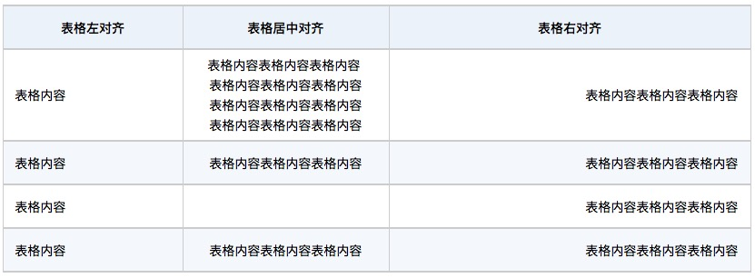

从很早开始就热衷于使用markdown以及推广markdown，效果都还不错。目前个人基本上所有的文档都是使用markdown来书写。用的久了就会遇到一些之前没有遇到的奇奇怪怪的问题，以及一些经验总结，在这里集中记录一下，方便后续查找。

## Markdown处理后HTML使用的css

- 地址：`http://cdn.bihe0832.com/css/markdown.css`
- 说明：目前文档都使用markdown来编写，但是有时候文档使用者木有markdown工具，因此一般会把markdown导出为html。该css主要是用于针对markdown生成的html的排版。
- 常用markdown转html站点：
	- [http://daringfireball.net/projects/markdown/dingus](http://daringfireball.net/projects/markdown/dingus)
	- [http://www.atool.org/html2markdown.php](http://www.atool.org/html2markdown.php)
	- [http://softwaremaniacs.org/playground/showdown-highlight/](http://softwaremaniacs.org/playground/showdown-highlight/)

## 表格

其余通用的一些markdown的用法或者标签就不介绍了，这里重点介绍一下表格相关的内容。当使用markdown制作表格时，经常会遇到下面的问题：

- 表格前期填充内容的同时还需要关注行列内容是否对齐，当空行较多是比较麻烦
- 表格中内容的对齐，各种左中右对齐
- 表格内容较多，尤其是某一列内容过多时，由于宽度自适应导致排版很丑

对于这三个问题，可以分别通过下面的方法来解决

#### 内容填充

Tables Generator 是一个可以在线快速生成 Text、Markdown 格式等多种格式表格的工具，支持在表格中填充数据，保证排版整齐，而且支持将Excel等的表格转化为markdown的格式，生成复制以后即可使用。

- 网址：[https://www.tablesgenerator.com/markdown_tables](https://www.tablesgenerator.com/markdown_tables)

- 使用示例：

	

#### 表格对齐

表格中内容的对齐可以直接依靠markdown提供的标签来设置，通过添加 “`:`”来控制，下面直接上示例（由于博客有css样式，会重置，因此放上截图）：

- 应用效果

	

- 对应源码
	
		| 表格左对齐 | 表格居中对齐 | 表格右对齐 |
		|:--|:--:|--:|
		| 表格内容表格内容表格内容 | 表格内容表格内容表格内容 | 表格内容表格内容表格内容 |

#### 表格格式

相比表格的对齐，表格的格式就相对复杂，由于mardkdown本身并不提供表格格式的设置标签，因此我们只能通过css来设置，同样上示例（由于博客有css样式，会重置，因此放上截图），同时在代码中添加足够多的注释方便更多人使用。

- 应用效果

	

- 对应源码：https://cdn.bihe0832.com/css/markdown-table.css
	
		
	
		| 表格左对齐 | 表格居中对齐 | 表格右对齐 |
		|:--|:--:|--:|
		| 表格内容 | 表格内容表格内容表格内容   表格内容表格内容表格内容 表格内容表格内容表格内容 表格内容表格内容表格内容 | 表格内容表格内容表格内容 |
		| 表格内容 | 表格内容表格内容表格内容 | 表格内容表格内容表格内容 |
		| 表格内容 |  | 表格内容表格内容表格内容 |
		| 表格内容 | 表格内容表格内容表格内容 | 表格内容表格内容表格内容 |

