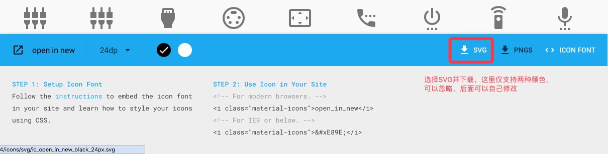
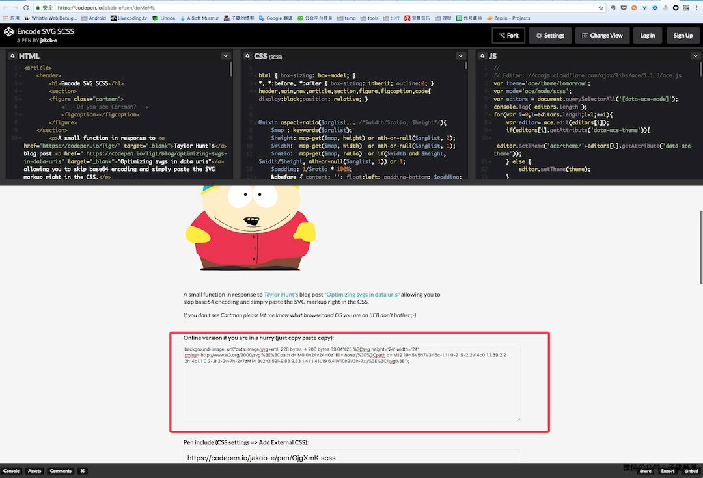
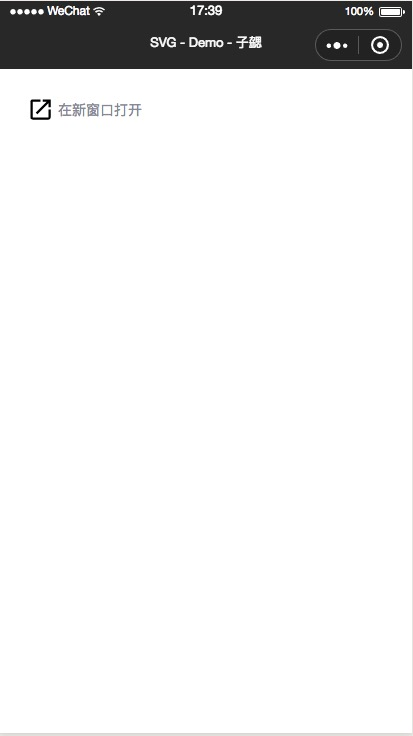

因为工作的原因，最近开始接触并且了解微信小程序。太久没有写或者看过前端相关的代码，加上小程序本身的bug也比较多，中间发现坑还是不少，后面逐渐整理总结一下。这一篇先总结一下svg在小程序中的使用。

## SVG 简介 

#### 什么是SVG

SVG是"Scalable Vector Graphics"的简称。中文可以理解成“可缩放矢量图形”。是一个基于XML的图形描述语言。它是可以用于描述静态图、动画，以及用户界面的一种图形格式。1999年由万维网联盟发布。于2013年成为W3C推荐标准。

#### SVG有哪些优势

与其他图像格式相比，使用SVG的优势在于：

- SVG 可被非常多的工具读取和修改
- SVG 与JPEG和GIF图像比起来，尺寸更小，且可压缩性更强。
- SVG 使用 XML 格式定义图形
- SVG 图像在放大或改变尺寸的情况下其图形质量不会有所损失

## SVG在小程序中的使用

由于前面提到的SVG的特性，因此他被广泛应用于各种开发中，尤其适合各种icon和图标，下面就结合具体的开发记录下小程序中使用SVG的过程。

#### 获取SVG资源

目前常用的设计工具例如sketch等都支持将图形导出为SVG。当然如果没有设计图，如果只是一些常见的图标的话也可以去一些资源站点下载。下面是个人常用的资源站点：

- [https://material.io/icons/](https://material.io/icons/)

material上有大量基于Android的Material Design设计的一些通用图标，而且支持导出为PNG，SVG等，例如文章中的示例icon：

- <svg height="24" width="24" xmlns="http://www.w3.org/2000/svg"><path d="M0 0h24v24H0z" fill="none"/><path d="M19 19H5V5h7V3H5c-1.11 0-2 .9-2 2v14c0 1.1.89 2 2 2h14c1.1 0 2-.9 2-2v-7h-2v7zM14 3v2h3.59l-9.83 9.83 1.41 1.41L19 6.41V10h2V3h-7z"/></svg> 
- [https://material.io/icons/#ic_open_in_new](https://material.io/icons/#ic_open_in_new)

根据下图的提示下载对应的图标的SVG资源

#### 获取对应SVG代码

使用任意文本编辑工具打开资源，可以看到里面的代码如下：

	<svg fill="#000000" height="24" viewBox="0 0 24 24" width="24" xmlns="http://www.w3.org/2000/svg">
	    <path d="M0 0h24v24H0z" fill="none"/>
	    <path d="M19 19H5V5h7V3H5c-1.11 0-2 .9-2 2v14c0 1.1.89 2 2 2h14c1.1 0 2-.9 2-2v-7h-2v7zM14 3v2h3.59l-9.83 9.83 1.41 1.41L19 6.41V10h2V3h-7z"/>
	</svg>
	
其中最外层的`fill="#000000"` 就是SVG的填充色，可以根据需求修改对应的填充颜色（由于示例中的SVG比较简单，因此只有一个填充颜色，并非所有SVG的最外层的fill都是他的填充色）。我们可以直接使用这部分代码，也阔以通过一些SVG优化工具进一步进行优化。目前我一般使用：

- [https://jakearchibald.github.io/svgomg/](https://jakearchibald.github.io/svgomg/)

将SVG图片直接拖入页面右侧的画布，他会根据一些通用优化方式对SVG进行初步优化，点击上方的`MAKEUP`，再看我们SVG的代码已经发生了变化（当然这里由于我们的示例图标比较简单，主要是删除了代码间的无效空白）：

	<svg height="24" width="24" xmlns="http://www.w3.org/2000/svg"><path d="M0 0h24v24H0z" fill="none"/><path d="M19 19H5V5h7V3H5c-1.11 0-2 .9-2 2v14c0 1.1.89 2 2 2h14c1.1 0 2-.9 2-2v-7h-2v7zM14 3v2h3.59l-9.83 9.83 1.41 1.41L19 6.41V10h2V3h-7z"/></svg>

#### 将SVG代码转码为Base64编码格式

由于微信小程序的限制，我们不能像在web中一样直接使用SVG，只能是通过css，设置背景图片的方式来设置。因此我们先要把优化后的SVG转化为Base64格式。我一般用下面的地址：

- [https://codepen.io/jakob-e/pen/doMoML](https://codepen.io/jakob-e/pen/doMoML)

打开网址以后，上推页面到下图位置，然后将之前生成的SVG代码复制到输入框中，发现SVG代码已经转化为Base64编码。

	background-image: url("data:image/svg+xml, 228 bytes → 203 bytes 89.04%25 %3Csvg height='24' width='24' xmlns='http://www.w3.org/2000/svg'%3E%3Cpath d='M0 0h24v24H0z' fill='none'/%3E%3Cpath d='M19 19H5V5h7V3H5c-1.11 0-2 .9-2 2v14c0 1.1.89 2 2 2h14c1.1 0 2-.9 2-2v-7h-2v7zM14 3v2h3.59l-9.83 9.83 1.41 1.41L19 6.41V10h2V3h-7z'/%3E%3C/svg%3E");
	
如果是直接复制了svgomg中的代码，会发现生成的Base64代码中多了一点东西：

	`url("data:image/svg+xml, 228 bytes → 203 bytes 89.04%25 %3Csvg`

代码中的`228 bytes → 203 bytes 89.04%25` 为无效信息，需要手动删除，删除以后的SVG代码变为：

	background-image: url("data:image/svg+xml, %3Csvg height='24' width='24' xmlns='http://www.w3.org/2000/svg'%3E%3Cpath d='M0 0h24v24H0z' fill='none'/%3E%3Cpath d='M19 19H5V5h7V3H5c-1.11 0-2 .9-2 2v14c0 1.1.89 2 2 2h14c1.1 0 2-.9 2-2v-7h-2v7zM14 3v2h3.59l-9.83 9.83 1.41 1.41L19 6.41V10h2V3h-7z'/%3E%3C/svg%3E");
			
#### 在具体代码中引用SVG

至此我们就完成了在小程序中使用SVG的所有准备工作了，接下来在代码中使用就和普通的css中引用SVG没有太大区别。具体代码如下：

- index.wxml：

		<view class="svg-demo-container">
		  <text class="icon-open-new icon"></text>
		  <text class="svg-demo-text">在新窗口打开</text>
		</view>

- index.wxss：

		.svg-demo-container {
		  margin: 50rpx;
		  width: 300rpx;
		  display: flex;
		  align-items: center; 
		}
		
		.svg-demo-text {
		  color: #888896;
		  font-size: 26rpx;
		  margin-left: 9rpx;
		}
		
		.icon-open-new {
		  background-image: url("data:image/svg+xml, %3Csvg height='24' width='24' xmlns='http://www.w3.org/2000/svg'%3E%3Cpath d='M0 0h24v24H0z' fill='none'/%3E%3Cpath d='M19 19H5V5h7V3H5a2 2 0 0 0-2 2v14a2 2 0 0 0 2 2h14c1.1 0 2-.9 2-2v-7h-2v7zM14 3v2h3.59l-9.83 9.83 1.41 1.41L19 6.41V10h2V3h-7z'/%3E%3C/svg%3E");
		  background-size: cover;
		}
		
		.icon {
		  display: inline-block;
		  width: 50rpx;
		  height: 50rpx;
		}

- 展示效果：

	

## 相关资源：

OK，至此我们就实现了在微信小程序中使用SVG资源。文章中涉及到的所有代码已经开源到github，相关链接如下：

- github:
	
	- http: [https://github.com/bihe0832/wx-app/tree/master/svg-demo](https://github.com/bihe0832/wx-app/tree/master/svg-demo)

	- git: `https://github.com/bihe0832/wx-app.git`
	
- 小程序代码片段（可以直接使用小程序开发工具导入）：

	- `wechatide://minicode/Qbo6ewmT69Ym`

