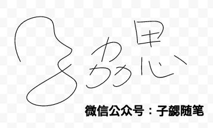

因为工作的原因，最近开始接触并且了解微信小程序。在使用canvas的时候，遇到一些需要画线条的场景。前期都比较简单，主要是简单线条也规则的圆弧或者扇形，相对好画；最近开始出现需要画一些曲线，尤其是比较多需要使用贝塞尔曲线来画。最开始因为精度要求不高还可以接受。当最近的业务场景需要高度还原设计稿的时候，再画下去就很复杂了。后来和同事一起研究发现可以通过下面的路径来大大降低绘图难度，这里总结一下：

- 将设计稿中的线条导出为SVG

- 将SVG代码使用工具转化为Canvas代码

- 基于工具生成的Canvas代码整理为最终的代码

接下来结合示例详细介绍一下具体的步骤

## 拿到图片的SVG

首先我们去google doc自己随便画一个简单的SVG的图片，如下图：

最终我们导出为SVG格式，具体svg的图片资源保存在文章对应开源代码的根目录。

## 使用工具将SVG代码转为Canvas代码

由于SVG的语法的固定，目前已经又专门的工具可以讲SVG的代码转化为Canvas对应的代码了，目前个人使用的是基于 `canvg.js`（[https://github.com/gabelerner/canvg](https://github.com/gabelerner/canvg)）开发的在线工具`svg2canvas`。

- 网址：[http://demo.qunee.com/svg2canvas/](http://demo.qunee.com/svg2canvas/)

- 截图：

	

	页面左边是我们拖入的SVG文件，右侧就是生成的SVG的JS 代码，部分代码如下：
	
		var SVGIcons = {
			"zixie.svg": {
			 draw: function(ctx){
				ctx.save();
				ctx.strokeStyle="rgba(0,0,0,0)";
				ctx.miterLimit=4;
				ctx.font="normal normal 400 normal 15px / 21.4286px ''";
				ctx.font="   15px ";
				
				……
				
				ctx.moveTo(258.2251,83.05221);
				ctx.bezierCurveTo(264.7121605,86.9550802,271.30707,90.96817200000001,276.65378,96.334841);
				ctx.fill("evenodd");
				ctx.stroke();
				ctx.restore();
				ctx.restore();
				ctx.restore();
			}
		}}

可以看到主体代码已经是绘制Canvas的每一步步骤了。但是里面夹杂了很多文字大小、填充颜色等的设置，而且有些函数，例如`save` 和 `restore` 多处都是重复调用，因此我们并不能直接拿来使用，还需要进行进一步的精简和梳理。

## 整理优化Canvas代码

整理优化代码主要分为两个步骤：

- 删除重复和无用代码

- 结合业务场景调整代码

### 删除无用代码

这里主要是删除里面大量的字体、颜色等设置、SVG的边框绘制等代码，修改为小程序中的代码，并且在画图前统一设置画笔颜色，同时将里面部分重复代码删除。整理以后的部分代码如下：

	Page({
	  data: {
	    
	  },
	  onLoad: function () {
	    this.draw()
	  },
	  draw:function(){
	    const ctx = wx.createCanvasContext('myCanvas')
	    ctx.save();
	    ctx.strokeStyle = "blue";  //填充颜色
	    ctx.scale(1,1)  //缩放比例
	    ctx.beginPath();
	    ctx.moveTo(33.609554, 92.2973);
	    ctx.bezierCurveTo(25.849306000000002, 77.841322, 21.627914000000004, 57.562917000000006, 29.579143000000002, 43.211664000000006);
	   
		 ……		
		     
	    ctx.moveTo(258.2251, 83.05221);
	    ctx.bezierCurveTo(264.7121605, 86.9550802, 271.30707, 90.96817200000001, 276.65378, 96.334841);
	    ctx.stroke();
	    ctx.restore();
	    ctx.draw()
	  }
	})
		
		
### 结合业务场景调整代码

这里主要是结合业务场景对SVG的大小、位置、画笔颜色等做调整。由于是事例，因此对于画笔颜色我没有做调整。仅仅调整了整个SVG的位置，让他右移、下移一定范围。

如果使用常规方法我们需要逐个去修改里面的函数参数太过费时，我选择了重新实现他的划线函数，在里面对坐标增加偏移量以后再绘图。示例代码如下：

	Page({
	  data: {
	    indent:50,
	    vIndent:200,
	    canvasContext:null
	  },
	  onLoad: function () {
	    this.draw()
	  },
	  draw:function(){
	    onst ctx = wx.createCanvasContext('myCanvas')
	    this.setData({ canvasContext: ctx})
	    ctx.save();
	    ctx.strokeStyle = "blue";  //填充颜色
	    ctx.scale(1,1)  //缩放比例
	    ctx.setLineWidth(10)
	    ctx.beginPath();
	    this.moveTo(33.609554, 92.2973);
	    
	    ……
	    
	    this.bezierCurveTo(264.7121605, 86.9550802, 271.30707, 90.96817200000001, 276.65378, 96.334841);
	    ctx.stroke();
	    ctx.restore();
	    ctx.draw()
	  },
	  moveTo:function(x,y){
	    this.data.canvasContext.moveTo(x + this.data.indent, y + this.data.vIndent);
	  }, 
	  bezierCurveTo: function (x, y, x1, y1, x2, y2) {
	    this.data.canvasContext.bezierCurveTo(
	      x  + this.data.indent, y  + this.data.vIndent, 
	      x1 + this.data.indent, y1 + this.data.vIndent, 
	      x2 + this.data.indent, y2 + this.data.vIndent);
	  }, 
	})

至此我们就完成了图片到Canvas的转化，最终效果截图如下：

## 相关资源：

OK，至此我们就实现了在微信小程序中使用SVG资源。文章中涉及到的所有代码已经开源到github，相关链接如下：

- github:
	
	- http: [https://github.com/bihe0832/wx-app/tree/master/canvas-demo](https://github.com/bihe0832/wx-app/tree/master/canvas-demo)

	- git: `https://github.com/bihe0832/wx-app.git`
	
- 小程序代码片段（可以直接使用小程序开发工具导入）：

	- `wechatide://minicode/6OzE4Dmw6qYh`

