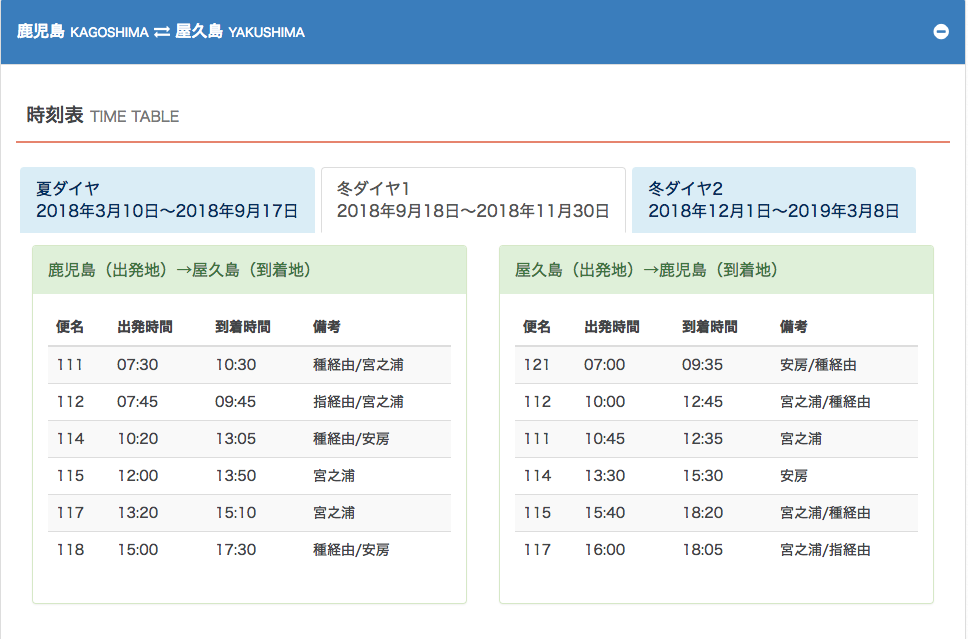

### 写在前面

妹纸一直想去日本，今年国庆终于成行。由于比较喜欢自然景观，加上一直对九州比较有兴趣，因此最后选择了鹿儿岛和屋久岛。在制作攻略的过程中发现确实由于位置相对偏僻，国内去的人相对少，很多内容都不全面，好在台湾同胞去的比较多，加上官方已经提供了非常详细的内容，因此还算不是很麻烦。

这是个人在出行前为了方便制作攻略专门整理的各种资料，后面的同学可能用得到，一并整理出来。主要包括以下几个部分：

- 通用注意事项

  为一些需要注意或者提前准备好的细节。

- 手机软件

	列了一些旅行中可能使用到的应用，方便处理日常。
	
- 九州小火车

  重点整理了JR九州的时刻、路线、预定方法以及特色列车的中英文对照、详细介绍等

- 鹿儿岛：

  整理了鹿儿岛的旅行指南、各种交通、购物相关的信息
  
- 屋久岛

  整理了前往屋久岛的周边交通介绍及预定以及屋久岛内的相关的信息
 
- 参考资料

  个人在做攻略的过程中收藏或者整理的前人总结的相对有效的信息

### 通用注意事项

去之前在做攻略的时候一定要注意的一些细节点，全篇适用，这里优先列举出来。

- 如果使用日本官网预定船票等情况下，需要提供你名字的日文写法，因此需要事先准备好，后面软件部分有推荐一款软件。

- 预定有些东西，例如JR的周游券等会要求填写护照上的英文，注意个人信息不要填错，如果填写错误会很麻烦，已经填错的建议提前退换票，尽量不要抱侥幸心理

- 由于日本的公共交通比较发达（其实主要是出租等太贵），大家的攻略中都会有很多公共交通相关的内容，但是**在日本交通相关的信息（例如车次、时刻表等）变动非常频繁，切记在参考这些信息的时候注意攻略中内容的时效性**。推荐参考的优先级为：交通预定官网 > 在酒店前台等拿到的旅行指南等小册子 > 各种当地政府官网 > 当地旅游相关网站 > 别人游记。尤其游记中的只能供参考了解。

### 手机软件

- 通用软件：

  主要用于旅行整个过程中查看游记、了解路线、路线查看、导航、吃住预订、整理游记等。关于这部分内容个人之前专门写了一篇文章来介绍。请点击 [旅行中不可或缺的软件 | 子勰的博客](http://blog.bihe0832.com/lv_software.html) 查看详细内容。这里在额外补充几个日本相关的。

- Name變換君（[http://namehenkan.com/tw](http://namehenkan.com/tw)）

  一个快速將你的名字翻譯並轉換成日文名字，包括日文漢字、片假名、平假名的软件。
  
- 乗換案内：日本交通网提供的换乘查询工具，仅支持日文

  [https://itunes.apple.com/cn/app/%E4%B9%97%E6%8F%9B%E6%A1%88%E5%86%85/id299490481?mt=8](https://itunes.apple.com/cn/app/%E4%B9%97%E6%8F%9B%E6%A1%88%E5%86%85/id299490481?mt=8)

- 换乘案内 (中文版)，日本交通查询工具：国人利用接口开发的可以使用中文查询的工具，结果还是日文

  [https://itunes.apple.com/cn/app/%E6%8D%A2%E4%B9%98%E6%A1%88%E5%86%85-%E4%B8%AD%E6%96%87%E7%89%88-%E6%97%A5%E6%9C%AC%E4%BA%A4%E9%80%9A%E6%9F%A5%E8%AF%A2%E5%B7%A5%E5%85%B7/id1112129114?mt=8](https://itunes.apple.com/cn/app/%E6%8D%A2%E4%B9%98%E6%A1%88%E5%86%85-%E4%B8%AD%E6%96%87%E7%89%88-%E6%97%A5%E6%9C%AC%E4%BA%A4%E9%80%9A%E6%9F%A5%E8%AF%A2%E5%B7%A5%E5%85%B7/id1112129114?mt=8)
  
- JR九州：JR九州的官方app，也阔以查询路线，预定车票等，但是实际使用体验，感觉使用本文后面列出来的网站更方便，如果已经到日本了就在售票口咨询即可

  [https://itunes.apple.com/cn/app/jr%E4%B9%9D%E5%B7%9E%E3%82%A2%E3%83%97%E3%83%AA/id1081742880?mt=8](https://itunes.apple.com/cn/app/jr%E4%B9%9D%E5%B7%9E%E3%82%A2%E3%83%97%E3%83%AA/id1081742880?mt=8)

### JR九州

#### JR九州官网

- JR九州铁道中文官网：专门为中国游客搭建的官网
  
  - 网址：[http://www.jrkyushu.cn](http://www.jrkyushu.cn/)
 
  - 介绍：专门为中国游客搭建的官网，重点介绍新干线、以及特色小火车，另外有一些九州游推荐线路

- JR九州铁道多语言官网：
  
  - 网址：[http://www.jrkyushu.co.jp](http://www.jrkyushu.co.jp/)
  
  - 介绍：车票预定等官网，里面对于部分内容有中文介绍，包括JR小火车以及九州交通很全面的内容，里面包含了JR所有主要线路的路线、时刻表、车票、购改退票、特色小火车预定、周游券、主要车站、周边机场交通等等信息

#### JR九州列车路线图 时刻表：

- 官方网站：

  [https://www.jrkyushu.co.jp/cn/time_table/time_table.html](https://www.jrkyushu.co.jp/cn/time_table/time_table.html)

- 相关附件：

  - [JR九州列车时刻表.pdf](./../public/resource/kagoshima/d1226ac0.pdf)
  
  - [JR九州列车路线图.pdf](./../public/resource/kagoshima/96510b3b.pdf)
  
  - [JR九州列车路线图_en.pdf](./../public/resource/kagoshima/fc269096.pdf)
  
#### 小火车介绍：

- 九州小火车名称对照表

  |列车名|英文名|日文|
  |:---|:---:|:---:|
  | 特快“由布院之森” | Yufuin no Mori| ゆふいんの森 |
  | 特快“海鸥”885系列 | Kamome | 885系特急 |
  | 特快“音速”883系列 | Sonic | 883系列 |
  | 特快“豪斯登堡” | Huis Ten Bosch |  |
  | 特快“阿苏男孩！” | Aso Boy! | あそぼーい！|
  | 特快“翡翠 山翡翠” | KAWASEMI YAMASEMI |かわせみ やませみ |
  | 特快“坐A列车去吧” | A-TRAIN | A列車で行こう |
  | 特快“SL人吉” | SL Hitoyoshi | SL人吉 |
  | 特快“九州横断特急” | Kyushu Odan Tokkyu | 九州横断特急 |
  | 特快“伊三郎、新平” | Isaburo / Shinpei | いさぶろう・しんぺい |
  | 特快“隼人之风” | Hayato no Kaze | はやとの風 |
  | 特快“指宿玉手箱” | Ibusuki no Tamatebako | 指宿のたまて箱 |
  | 特快“海幸山幸” | Umisachi-Yamasachi | 海幸山幸|

- 小火车列表（主要介绍时刻表、车厢构成、沿途风光等）： 
  
  [http://www.jrkyushu.co.jp/cn/train/train_index.html](http://www.jrkyushu.co.jp/cn/train/train_index.html)

- 小火车介绍视频：

  [http://www.jr-kyushu.jp/touch_train/cm/index.html](http://www.jr-kyushu.jp/touch_train/cm/index.html)

- 小火车中文介绍（更详细的车厢构成、车上服务等）：

  [http://www.jrkyushu.cn/index.php?s=/Home/Train/intro.html](http://www.jrkyushu.cn/index.php?s=/Home/Train/intro.html)

#### JR车票预订：

- 中文版使用帮助下载地址

  [https://www.jrkyushu.co.jp/cn/booking/manual.html](https://www.jrkyushu.co.jp/cn/booking/manual.html)

- JR周游券介绍

  [http://www.jrkyushu.co.jp/cn/railpass/railpass.html](http://www.jrkyushu.co.jp/cn/railpass/railpass.html)

- 特色列车座位预约地址（JR KYUSHU RAIL PASS ONLINE BOOKING）：

	- [https://kyushurailpass.jrkyushu.co.jp/reserve/TopPage](https://kyushurailpass.jrkyushu.co.jp/reserve/TopPage)
	  
	- [旅行社购买九州铁路周游券预约指定席.pdf](./../public/resource/kagoshima/1d40e923.pdf)
	
	- [旅行社购买九州铁路周游券预约指定席兑换材料.pdf](./../public/resource/kagoshima/f9696e10.pdf)
	  
- 特色列车申请表

  [南部九州版铁路周游券指定席申请表.pdf](./../public/resource/kagoshima/4620527c.pdf)

- 网上预订常见问题（JR KYUSHU RAIL PASS Online Booking   Q&A ）：

  [https://www.jrkyushu.co.jp/cn/qa_ob.html](https://www.jrkyushu.co.jp/cn/qa_ob.html)

### 鹿儿岛

####  鹿儿岛旅行指南电子版

  - 指南电子版官网：[http://www.kagoshima-kankou.com/for/brochures.htm](http://www.kagoshima-kankou.com/for/brochures.html)

    - [鹿儿岛市旅行观光指南.pdf](./../public/resource/kagoshima/d488cf86.pdf)

    - [鹿儿岛市旅行指南.pdf](./../public/resource/kagoshima/aacffdef.pdf)

    - [鹿儿岛市CityView路线图.pdf](./../public/resource/kagoshima/43bd47fb.pdf)
  
  - 霧島市観光協会网站
  
    - [http://kirishimakankou.com/charms_ck ](http://kirishimakankou.com/charms_ck)
    
    - [雾岛观光.pdf](./../public/resource/kagoshima/36b3ac55.pdf)
  
#### 鹿儿岛各种交通介绍

- 鹿儿岛市交通局官网
 
    [http://www.kotsu-city-kagoshima.jp/cn-s/](http://www.kotsu-city-kagoshima.jp/cn-s/)

- 鹿儿岛市内公交路線及時刻表查询

  [http://www.kotsu-city-kagoshima.jp/wp/timesearch/search_index.php](http://www.kotsu-city-kagoshima.jp/wp/timesearch/search_index.php)

- 鹿儿岛市机场

  - 官网：包含交通、货币兑换、免税店地址等详细信息，而且有中文版

    [https://www.koj-ab.co.jp/kan/](https://www.koj-ab.co.jp/kan/)
  
  - 鹿儿岛机场巴士

    [http://nangoku-kotsu.com/ashuttle/kagoshima](http://nangoku-kotsu.com/ashuttle/kagoshima/)

    [鹿儿岛机场市内机场巴士时刻.pdf](./../public/resource/kagoshima/93d09481.pdf)
    
    [鹿儿岛机场隼人机场巴士时刻.pdf](./../public/resource/kagoshima/73518a45.pdf)
    
    [鹿儿岛机场雾岛机场巴士时刻.pdf](./../public/resource/kagoshima/399bdade.pdf)
    
    [鹿儿岛机场国分机场巴士时刻.pdf](./../public/resource/kagoshima/dd726b56.pdf)
    
 - 樱岛轮渡 - 时刻表 收费表
 
    [http://www.city.kagoshima.lg.jp/sakurajima-ferry/chinese-s/guides.html](http://www.city.kagoshima.lg.jp/sakurajima-ferry/chinese-s/guides.html)
 
  - 樱岛介绍及观光船
  
    [http://www.city.kagoshima.lg.jp/sakurajima-ferry/chinese-s/guides-02.html#yorimichi](http://www.city.kagoshima.lg.jp/sakurajima-ferry/chinese-s/guides-02.html#yorimichi)

#### 鹿儿岛商场

- 中央站

  中央站本身是一座大型购物广场（有MUJI，优衣库等），左侧是Tokyo hands，右侧是Bic Camera，摩天轮下方则是一个综合百货公司。对面是永旺。
  
- 天文馆地区
  
  天文馆地区主要有两家大型商场，一个是老牌百货公司山形屋，这里销售的品牌偏向成熟，是日本传统大百货公司的模样，想买大品牌的化妆品以及珠宝首饰，这里是鹿儿岛专柜最全的。另一家是Maruya Gardens，相较山形屋，这座商场更加年轻有活力。
  
  天文馆地区的药妆店主要是松本清、sundrug和drugeleven。买前记得先去大众点评领券，

- 药妆店指南
  
  松本清和sundrug是日本全国范围知名的药妆店，连锁众多。drugeleven是日本九州 - 冲绳地区的连锁药妆店品牌。在价格方面，松本清普遍贵于sundrug和drugeleven。sundrug不领优惠券一般遇节假日也有九五折，但少数贵价产品不享受优惠，sundrug的服务在三家中最好。

### 屋久岛

#### 屋久岛介绍
  
- 景点导览

  [http://www.kagoshima-kankou.com/cn/areaguides/yakushima/about.html](http://www.kagoshima-kankou.com/cn/areaguides/yakushima/about.html)

- 屋久岛官光资料（含各种景区介绍、当地各种设施分布、指引、交通路线、食宿等）
  
  [http://yakukan.jp/index.html](http://yakukan.jp/index.html)

- 屋久岛官光资料下载地址（含各种地图、指引、交通路线等）

  [http://yakukan.jp/doc/index.html](http://yakukan.jp/doc/index.html)

- 屋久島登山相关预报： 

  [http://y-rekumori.com/](http://y-rekumori.com/) 

#### 屋久岛周边交通

- 屋久岛船票预定

  高速船トッピー・ロケット(種子島・屋久島に運航・予約)： [https://www.tykousoku.jp](https://www.tykousoku.jp/)

- 屋久岛船票时刻表

  運賃・時刻表 -トッピー&ロケット：[https://www.tykousoku.jp/fare_time/](https://www.tykousoku.jp/fare_time/)
  
  

- 屋久岛船票通航状态

  [https://www.tykousoku.jp/etc/operation.php](https://www.tykousoku.jp/etc/operation.php)

#### 屋久岛岛内交通介绍

- [屋久岛旅行路线.pdf](./../public/resource/kagoshima/86680189.pdf)
- [屋久岛公交站点日文.pdf](./../public/resource/kagoshima/a193c334.pdf)
- [屋久岛公交站点.pdf](./../public/resource/kagoshima/c773e47c.pdf)
- [屋久岛公交主要路线时刻.pdf](./../public/resource/kagoshima/4527c52b.pdf)
- [屋久岛公交详细路线时刻.pdf](./../public/resource/kagoshima/fd7bc103.pdf)
- [屋久岛公交详细路线时刻英文.pdf](./../public/resource/kagoshima/5d391186.pdf)
- [屋久岛白谷云水峡路线.pdf](./../public/resource/kagoshima/00c68205.pdf)
- [屋久岛登山路线用时参考.pdf](./../public/resource/kagoshima/3ec6c207.pdf)

#### 屋久岛部分重要公交站点：

| 序号 | 英文 | 日文 | 备注 |
|---|---|---|---|
| 20  | Miyanoura Port | 宮之浦港 | 宫之浦港口 |
| 25  | Oharamachi | 小原町 | 环岛公交与白谷云水峡巴士共同停靠点，田代别馆门口 |
| 48  | Shionomichi | 塩ノ道 | 屋久岛我们见到最大的超市（唯一有药妆的地方） |
| 49  | Airport | 空港 | 机场 |
| 64  | Anbo Port | 安房港 | 安房港  |
| 66  | Anbo | 安房 | 安房港附近相对繁华的地方  |
| 87  | Tainokawa | 鯛ノ川 | 千寻瀑布观景点  |
| 94  | Onoaida | 尾之間 | 尾之间温泉下车点，同时有一家小超市  |

### 参考资料（按照个人推荐顺序排序）

#### 关于鹿儿岛和屋久岛

- [鹿儿岛游记及实用信息 - 鹿儿岛市旅游攻略 - 日本 - 论坛 - 穷游网](https://bbs.qyer.com/thread-2588617-1.html?gfh=xzh)

  穷游上一篇关于鹿儿岛的攻略，里面详细介绍了鹿儿岛机场、码头、机场大巴、当地公交等的购票方式以及周边樱岛、长崎鼻、指宿等旅行记录；是一篇很有用的攻略。

- [八天悠游鹿儿岛县-鹿儿岛指宿屋久岛，森林火山与大海,鹿儿岛旅游攻略 - 马蜂窝](http://www.mafengwo.cn/i/9468809.html)

  马蜂窝上一篇关于鹿儿岛的攻略加游记，里面详细介绍了鹿儿岛、指宿、屋久岛的巴士、乘船、部分常规景点相关的信息；而且对鹿儿岛的购物也做了介绍，是一篇很有用的攻略。同时里面也列出来了一些实用的网站，也是一篇很有用的攻略。
  
- [少女的日本屋久岛徒步：小精灵的隐世森林（含路线）（更新中） - 屋久岛旅游攻略 - 户外运动   日本   旅行摄影 - 论坛 - 穷游网](https://bbs.qyer.com/thread-2817292-1.html)

  穷游上一篇关于绳文杉和白谷云水峡徒步的攻略，介绍很详细，对于一日穿越非常有参考价值。我们最终因为酒店的原因也选择了一样的路线
  
- [哭着走过暴雨的白谷云水峡的人是会走下去的--记4月九州武雄温泉鹿儿岛由布院亲子十日游,九州自助游攻略 - 马蜂窝](https://www.mafengwo.cn/i/7087160.html)

  马蜂窝一篇九州的游记，里面对JR购票、部分特色小火车、当地巴士、船票、食宿等都有比较简单的介绍；游记的亮点是关于白谷云水峡的部分，在规划行程时有比较大的参考意义，值得推荐。

- [忆幽灵公主之森-鹿儿岛屋久岛行,屋久岛自助游攻略 - 马蜂窝](http://www.mafengwo.cn/i/10309082.html)

  马蜂窝上一篇关于鹿儿岛、部分小火车、屋久岛的简单的游记，里面对于隼人之风和白谷云水峡的介绍值得参考。

- 屋久岛登山推荐

  某个日本旅行社（veltra）推出的各种路线，里面会有一些关键点之间的详细距离和使用时间，可以参考

  - [【屋久岛深度游】绳文杉一日登山＋白谷云水峡半日游（含RAKUSA酒店住宿3天2夜），屋久岛自由行，当地体验以及各种旅游活动。- VELTRA](https://www.veltra.com/cn/asia/japan/yakushima/a/136630)
  - [【屋久島必訪】尋找古老繩文杉・登山健行一日遊（專屬中文導遊+接送服務），屋久島自由行，當地體驗以及各種旅遊活動。- VELTRA](https://www.veltra.com/tw/asia/japan/yakushima/a/133015)
  - [【屋久岛登山推荐】绳文杉＋白谷云水峡・两日充实露营体验（日语服务），屋久岛自由行，当地体验以及各种旅游活动。- VELTRA](https://www.veltra.com/cn/asia/japan/yakushima/a/136573)

- [行走于碧海青山间—屋久岛&鹿儿岛带娃6日游,屋久岛自助游攻略 - 马蜂窝](http://www.mafengwo.cn/i/8709518.html)

  马蜂窝上一篇关于鹿儿岛和屋久岛的慢游路线，适合非常轻松的出行，而且在屋久岛除了绳文杉路线外，算比较深度的介绍
  
- [万字游记之窥视九州（博多 别府 小仓 门司港 下关 武雄 长崎 熊本 人吉 鹿儿岛 指宿）,九州自助游攻略 - 马蜂窝](http://www.mafengwo.cn/i/7813090.html)

  马蜂窝上一篇介绍整个九州的攻略，里面有福冈机场、博多站、以及全九州各种小火车、周边的的简单介绍；如果去北九州或者全九州，阔以参考。尤其里面有比较详细介绍了我比较想去的下关。

- [仙女の探险记（日本鹿儿岛）,鹿儿岛旅游攻略 - 马蜂窝](http://www.mafengwo.cn/i/7401227.html)

  马蜂窝上一篇关于鹿儿岛和屋久岛的游记，主要去了常规的地方，不过介绍都比较简单
  
- 夏季日本鹿儿岛、樱岛、屋久岛、指宿之旅
  
  - [夏季日本鹿儿岛、樱岛、屋久岛、指宿之旅-景点篇,鹿儿岛旅游攻略 - 马蜂窝](http://www.mafengwo.cn/i/9833414.html)
  - [夏季日本鹿儿岛、樱岛、屋久岛、指宿之旅-食宿篇,鹿儿岛自助游攻略 - 马蜂窝](http://www.mafengwo.cn/i/9818145.html)
  - [夏季日本鹿儿岛、樱岛、屋久岛、指宿之旅-购物篇,鹿儿岛自助游攻略 - 马蜂窝](http://www.mafengwo.cn/i/9856862.html)

  马蜂窝上一篇关于鹿儿岛和屋久岛的常规路线，包括仙岩园、樱岛、白谷云水峡徒步、大川之潼瀑布等，另外有一些简单的关于购物食宿的介绍，不过都比较简单
  
#### 关于小火车

- [20170322-27日本南九州火車之旅,九州旅游攻略 - 马蜂窝](http://www.mafengwo.cn/i/7040060.html)

  一位台湾同胞写的关于九州小火车的攻略，里面部分规划和我们比较接近

- [我和我的九州小火车们,九州旅游攻略 - 马蜂窝](http://www.mafengwo.cn/i/6594380.html)

  马蜂窝上关于九州小火车的游记，乘坐了阿苏男孩、由布院之森、伊三郎/新平、隽人之风、指宿玉手箱。里面从人吉到鹿儿岛的路线与我们基本一致。

- [铁道控都知道的九州观光小火车,日本自助游攻略 - 马蜂窝](http://www.mafengwo.cn/i/10196778.html)

  马蜂窝上一篇关于九州小火车的游记，简单介绍海幸山幸、由布院之森、伊三郎/新平。

- [【南九州之行特辑】赞破次元壁的列车可不可以永远别开到终点,九州自助游攻略 - 马蜂窝](http://ww.mafengwo.cn/i/8667862.html)

  马蜂窝上一个关于部分九州小火车的简单游记，简单介绍了指宿玉手箱、隼人之风、伊三郎/新平、翡翠山翡翠，内容相对简单

- [超詳細!!如何預購九州鐵路JR Pass, 特急和特色列車!! – ::Kate's The Little Factor::](https://cozyaumoment.wordpress.com/2016/11/15/%E5%9C%96%E6%96%87%E6%95%99%E5%AD%B8%E8%B6%85%E8%A9%B3%E7%B4%B0%E5%A6%82%E4%BD%95%E9%A0%90%E8%B3%BC%E4%B9%9D%E5%B7%9E%E9%90%B5%E8%B7%AFjr-pass-%E7%89%B9%E6%80%A5%E5%92%8C%E7%89%B9%E8%89%B2/)

  同样还是以为台湾同胞写的，如果不适用三日券的情况下，如何直接在线购票；不过目前官方已经有比较详细的中文版了

- [《 日本九州交通 》新九州JR PASS 購買教學、使用範圍、特色列車劃位(附上申請書及指定席劃位表單下載) 2017/01更新 @ bobowin旅行攝影生活 :: 隨意窩 Xuite日誌](http://blog.xuite.net/bobowin/me/317732652-%E3%80%8A+%E6%97%A5%E6%9C%AC%E4%B9%9D%E5%B7%9E%E4%BA%A4%E9%80%9A+%E3%80%8B%E6%96%B0%E4%B9%9D%E5%B7%9EJR+PASS+%E8%B3%BC%E8%B2%B7%E6%95%99%E5%AD%B8%E3%80%81%E4%BD%BF%E7%94%A8%E7%AF%84%E5%9C%8D%E3%80%81%E7%89%B9%E8%89%B2%E5%88%97%E8%BB%8A%E5%8A%83%E4%BD%8D%28%E9%99%84%E4%B8%8A%E7%94%B3%E8%AB%8B%E6%9B%B8%E5%8F%8A%E6%8C%87%E5%AE%9A%E5%B8%AD%E5%8A%83%E4%BD%8D%E8%A1%A8%E5%96%AE%E4%B8%8B%E8%BC%89%29+2017%2F01%E6%9B%B4%E6%96%B0)

  还是台湾同胞整理的，非常详细的九州小火车使用兑换券现场预定的详细指引，有包括站台地图，各种指引文档的介绍等；不过大部分是北九州相关的，另外文档时效性较低

- [九州交通 - JR九州官網 會員注冊+購票流程@祐YaU (11597) - 旅行酒吧](https://travel98.com/article/11597)

  同样还是以为台湾同胞写的，如果不适用三日券的情况下，如何直接在线购票；时效性估计会比较低，在后期找到官网的详细介绍以后，我就很少参考了
  

