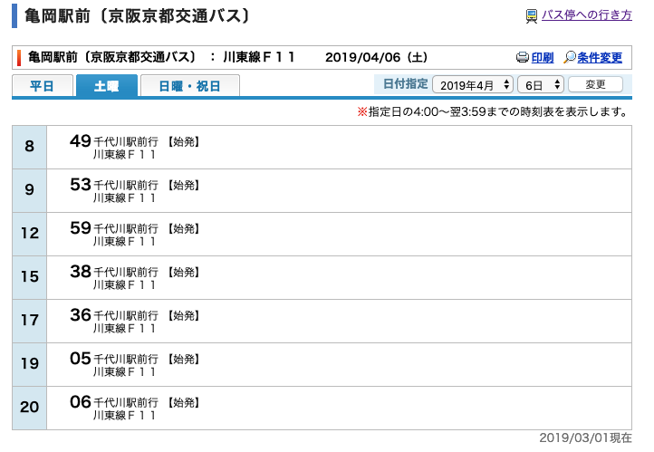
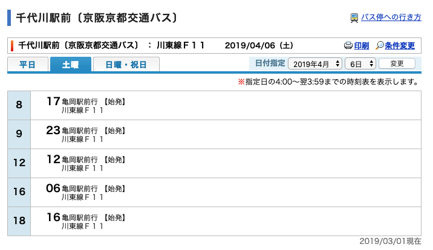
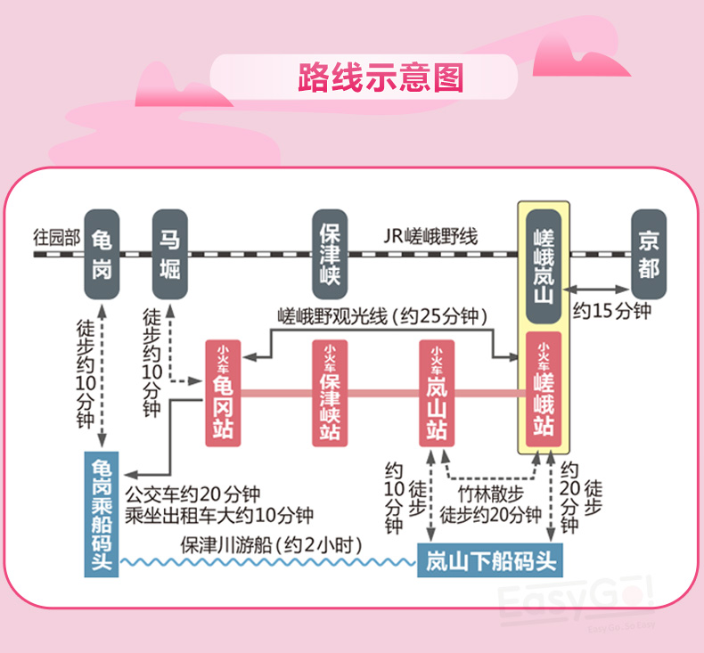
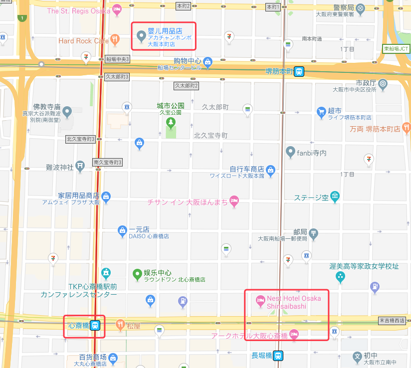
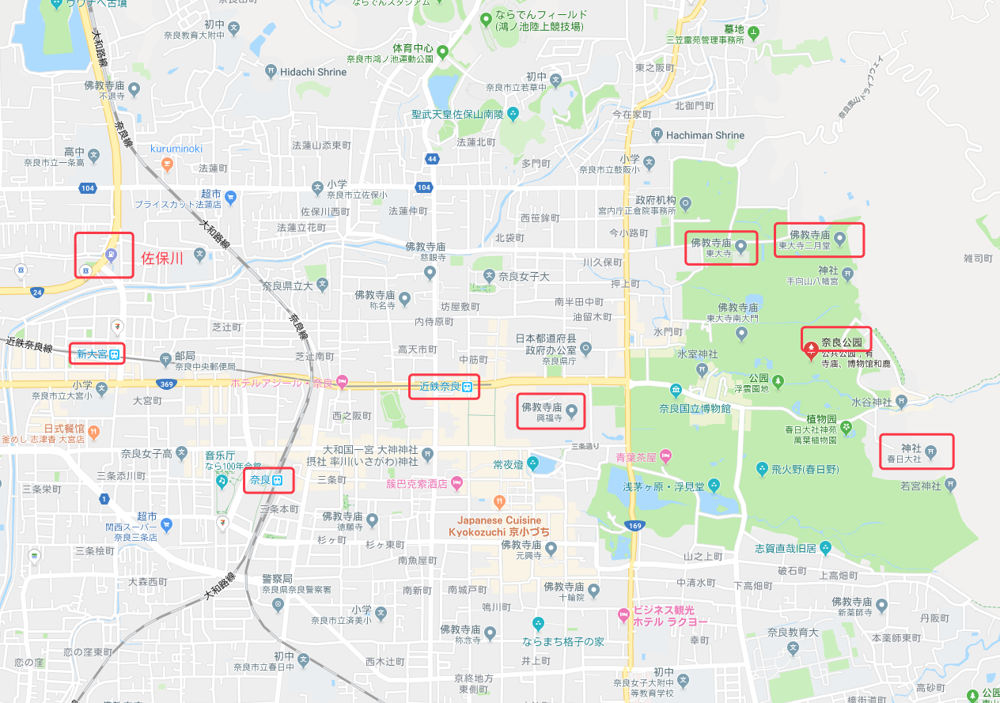

一直想去看樱花，终于成行，这是这次旅行最初的规划路线主要路线就是京都和大阪的热门赏樱路线。

## 概述：

- **用时**：7天（04月05日 - 04月10日）

- **主题**：樱花开 买买买

- **主要途径点**：

  深圳 — 大阪 — 京都 — 奈良 — 大阪 — 深圳

- **路线介绍**：
 
  关西包括大阪、京都、滋贺、三重、奈良、和歌山、兵库2府5县的地区。关西是日本的发源地，是无数日本文化爱好者的推崇之地。无论是“千年古都”京都，还是日本第一个首都奈良，都是你感受日本之魂的古都。历史名胜的密集度堪称全日第一。大阪最有名的就是美食和购物，关西人常用一句“大阪吃倒”的俗话形容其吃文化的繁荣。而对于购物，大阪坐拥着关西最繁华的两大商圈——难波和梅田。在京都，你可以看到有着上千年历史的古建筑，也可以在衹园街头看到盛装打扮的艺伎。今天奈良的活招牌是城市中放养的一群群小鹿，它们聚集在奈良公园和山野之间，与人友好相处，是奈良最为吸引人的地方。

- **主要交通**：

	- 04月05号 深圳宝安T3 - 大阪关西T1：南航 CZ8425（10:00 - 14:30） 
	- 04月10号 大阪关西T1 - 深圳宝安T3：南航 CZ8426（15:30 - 19:05）
 
- **住宿**：
  
	- 京都：
		- 酒店名称：Green Rich酒店-京都站南 (Green Rich Hotel Kyoto Eki Minami)
		- 酒店地址：
		  - 3 Higashikujo Shimotonoda-cho, Minami-ku（601-8047）
		  - 3 Higashikujo Shimotonoda-cho, Minami-ku, 京都, 京都, 日本, 601-8047
  - 大阪：
  		- 酒店名称：大阪心斋桥NEST酒店 (Nest Hotel Osaka Shinsaibashi)
  		- 酒店地址：
  			- 日本大阪2-4-10 Minamisenba Chuoku（邮编542-0081）
  			- 〒542-0081 大阪府大阪市中央区南船場２丁目４−１０
  			- 2 Chome-4-１０ Minamisenba, Chuo Ward, Osaka, 542-0081

## 出行准备

### 资料准备

- 通用事项

  关于签证、软件等相关的一些通用内容。可以点击  [日本行基本资料整理 - 子勰的博客](https://blog.bihe0832.com/lv_Japan.html) 查看详细内容

- 行程相关

	- 关西交通：
		
		- [關西交通攻略 – 小氣少年的部落格](https://nicklee.tw/?page_id=21023)
	
		- [西日本旅客铁道株式会社 - 关西地区铁路周游券 使用指南](http://www.westjr.co.jp/global/sc/ticket/pass/kansai/#routes)

		- [京阪電気鉄道株式会社](http://www.keihan.co.jp/)

	- 赏樱相关：

		- [日本京都、大阪、滋贺 樱花特辑2019 樱花开花状况（查看一览）— 京阪电气铁道株式会社](https://www.okeihan.net/recommend/sakura/migoro/index_cn.php)
		
		- [日本京都、大阪、滋贺 樱花特辑2019 樱花开花状况（查看路线图）— 京阪电气铁道株式会社](https://www.okeihan.net/recommend/sakura/migoro/map_cn.php)
		
		- [樱花 — 京阪电气铁道株式会社](https://www.keihan.co.jp/travel/cn/plan-your-trip/cherry-blossoms)
	
		- [さくら開花予想2019：https://sakura.weathermap.jp/smt/](https://sakura.weathermap.jp/smt/)
		  
		  樱花前线在每年1月就会开始预测各地樱花盛开的时间，当然这个网站随着实际赏樱时间的临近，预测时间也会不断进行修正
	
		- [桜 開花・花見情報2019：https://weathernews.jp/s/sakura/](https://weathernews.jp/s/sakura/)
	
		  可在搜索查看某一具体景点樱花五分开、满开、樱吹雪的时间，仅支持日文。
  
- 软件

  主要用于旅行整个过程中查看游记、了解路线、路线查看、导航、吃住预订、整理游记等。关于这部分内容个人之前专门写了一篇文章来介绍。请点击 [旅行中不可或缺的软件 — 子勰的博客](http://blog.bihe0832.com/lv_software.html) 查看详细内容。
  
  在 [日本行基本资料整理 - 子勰的博客](https://blog.bihe0832.com/lv_Japan.html)里面关于软件的部分，也补充了几个日本自由行可能用得到的软件。

### 注意事项

- 一些需要重点注意或者重点关注的细节。可以点击  [日本行基本资料整理 - 子勰的博客](https://blog.bihe0832.com/lv_Japan.html) 查看详细内容

### 关键信息

- 个人信息

  如果使用日本官网预定船票等情况下，需要提供你名字的日文写法，因此需要事先准备好。[2018年十一国庆九州行相关资料 — 子勰的博客](http://blog.bihe0832.com/lv_kyushu.html) 里面关于软件的部分，有推荐对应的翻译工具。

- 地点信息

    |地名|日文| 公交站·ID |
    |:---|:---|:---|:---|
    | 八条口 | 京都関西空港リムジンバスのりば-H2| | 
    | 鸭川 | 鴨川 | | 
    | 祗园四条 | 祇園四条駅 | KH39 | 
    | 园山公园 | 円山公園 | | 
    | 乌丸 |烏丸 | | 
    | 小火车龟冈 |トロッコ亀岡駅 | |
    | 马倔 | 馬掘駅 | JR-E10 | 
    | 龟冈 | 亀岡  | JR-E11 | 
    | 七谷川 |  七谷川（バス）| | 
    | 伏见稻荷大社 | 伏見稲荷大社 | | 
    | 中书岛 | 中書島駅 | KH28 | 
    | 长堀桥 | 長堀橋駅 | | 
    | 心斋桥 | 心斎橋駅 | | 
    | 御堂筋线 | 御堂筋線 | | | 

## 具体行程

#### 第一天（2018-04-05）：

- **地点**：深圳 - 大阪 - 京都
- **概况**：深圳出发直飞大阪关西机场，然后从机场巴士前往京都，安顿好后熟悉环境，前往清水寺
- **交通**：
	- 深圳宝安T3 - 大阪关西T1：南航 CZ8425（10:00 - 14:30）
	- 大阪 - 京都：
        
        - 机场大巴时刻：[【官方】关西国际机场的机场利木津巴士、时刻表、乘车处、票价、全部线路列表](http://www.kate.co.jp/scn/timetable/detail/KY)
	  
        - 推荐时间：

            | 关西T1 | 高速京田辺 | 京都车站八条口 |
            |:---:|:---:|:---:|
            | 15:00	| 16:08	| 16:28 | 
            | 15:20	| 16:28	| 16:48 |
            | 15:40	| 16:48	| 17:08 |
            | 16:00	| 17:08	| 17:28 |
            | 16:20	| 17:28	| 17:48 |
            | 16:40	| 17:48	| 18:08 |

- **住宿**:

	- 酒店名称：Green Rich酒店-京都站南 (Green Rich Hotel Kyoto Eki Minami)
	- 酒店地址：
		- 3 Higashikujo Shimotonoda-cho, Minami-ku（601-8047）
		- 3 Higashikujo Shimotonoda-cho, Minami-ku, 京都, 京都, 日本, 601-8047

- **路线规划**：
	- 预约早上八点半从家里出发，前往机场，到机场后办理托运，然后过关，搞定以后找地方休息，等待登机
	
	- 下午14:30到达关西机场T1，过关，出到达大厅，右手边8号口买票（单程2550日元）搭巴士到八条口，用时大概一个半小时
	- 到达八条口后下车，按照指引再走10分钟到酒店
	- 安顿行李，休息一下以后，出门楼搭乘岛丸线前往鸭川，经过8站在北大路站下车
	- 下车以后前往鸭川散步、发呆
	- 之后从出町柳乘坐京阪本线前往祗园四条
	- 晚上在祗园附近吃完饭，逛逛祗园白川、然后走一走花见小路前往圆山公园看夜樱，回去休息

- **备注**：

#### 第二天（2018-04-06）：

- **地点**：京都
- **概况**：早起前往岚山坐小火车看樱花，然后逛天龙寺
- **交通**：

  - F11时刻
  
	
   
	

- **住宿**

	- 酒店名称：Green Rich酒店-京都站南 (Green Rich Hotel Kyoto Eki Minami)
	- 酒店地址：
		- 3 Higashikujo Shimotonoda-cho, Minami-ku（601-8047）
		- 3 Higashikujo Shimotonoda-cho, Minami-ku, 京都, 京都, 日本, 601-8047

- **路线规划**：
	
  - 早上8点从酒店出发，从九条搭乘乌丸线前往乌丸，在四条下车，然后前往JR 乌丸站
  
  - 早上8点32分从乌丸站（HK85）乘坐电车阪急京都线到达桂（HK81），然后下车转阪急岚山线3站到达阪急岚山站（HK98）
  
  - 大概8点55分下车，出站以后**右转**100米到达爱游岚山和服店取票
  - 取票以后，前往小火车站点，过渡月桥以后可以根据时间选择直接去嵯峨小火车发车站，还是从岚山公园绕行，直接步行前往车站步行约20min
  - 乘坐小火车参观岚山樱花，参观结束10点半下车，在小火车龟冈附近转转
  - 从小火车步行前往馬掘駅（大概要10分钟），搭乘11：52的山阴本线前往千代川
  - 12点在左右千代川下车，等待12：12的F11前往七谷川看樱花。（如果千代川来不及，就回到龟冈去）
  - 到达七谷川，记录后续的巴士时间，然后去看樱花
  - 看完以后，继续F11回到山阴本线车站，然后直接JR回到京都站开启买买买
  - 买买买结束以后，看时间如果要去清水寺，出门楼下搭207前往清水寺
  - 清水寺游玩结束以后回酒店休息

- **备注**：
  
  - 清水寺行程可能无法安排
  - 岚山主要站点：
  
	

#### 第三天（2018-04-07）：

- **地点**：京都 - 大阪

- **概况**：早起前往伏见荷稻大社，然后前往十石舟，结束以后去大阪，安顿好酒店后去阿卡将

- **交通**：

- **住宿**

	- 酒店名称：大阪心斋桥NEST酒店 (Nest Hotel Osaka Shinsaibashi)
	- 酒店地址：
	
		- 日本大阪2-4-10 Minamisenba Chuoku（邮编542-0081）
		- 〒542-0081 大阪府大阪市中央区南船場２丁目４−１０
		- 2 Chome-4-１０ Minamisenba, Chuo Ward, Osaka, 542-0081日本

- **路线规划**：
	
  - 早上七点起床，然后前往JR京都站，寄存行李后搭乘JR奈良线前往伏见稻荷大社
  
  - 从伏见伏见稻荷大社游完出来，坐京阪本线在中书岛站，前往伏见十石舟，乘船赏樱
  - 赏樱结束以后，打道回府，前往京都站
  - 然后从京都搭乘JR（东海岛、山阳新干线）前往大阪，最后到达长堀桥，如果长崛桥没有合适的，心斋桥也阔以
  - 长堀桥地铁站从2B出口出来后右转，等到红绿灯路口再右转即可到达

	  

  - 入住，安顿行李，然后搭乘地铁御堂筋线前往本町的阿卡將大阪本町店买买买
  - 如果本店人太多，阔以去天满桥店或天王寺店
  - 买完以后吃饭，随便逛逛，然后回酒店休息

- **备注**：
  
	- 心斋桥地图应该搜“道顿崛”“堂吉诃德”的道顿崛店更接近目的地。
  
	- 阿卡將
		- 店铺活动：
			- 各类活动：[マタニティ・ベビーグッズのセール・チラシ｜ベビー・マタニティ用品のアカチャンホンポ](https://www.akachan.jp/sale_chirashi/)
			- 各阶段推荐：[出産育児情報｜ベビー・マタニティ用品のアカチャンホンポ](https://www.akachan.jp/maternity/)
	
		- 四家店铺信息：
				
			-  大阪本店：[大阪本町店｜ベビー・マタニティ用品のアカチャンホンポ](https://www.akachan.jp/store/0070/)
			-  天王寺店：[あべのイトーヨーカドー店｜ベビー・マタニティ用品のアカチャンホンポ](https://www.akachan.jp/store/0071/)
			-  天满桥店：[京阪シティモール店｜ベビー・マタニティ用品のアカチャンホンポ](https://www.akachan.jp/store/0130/)
			- 京都御山店：[イオンタウン久御山店｜ベビー・マタニティ用品のアカチャンホンポ](https://www.akachan.jp/store/0087/)

#### 第四天（2018-04-08）：

- **地点**：大阪 - 奈良 - 大阪
- **概况**：早起前往奈良喂小鹿，参观东大寺；之后回大阪，前往造币局和天守阁
- **交通**：JR
- **住宿**

	- 酒店名称：大阪心斋桥NEST酒店 (Nest Hotel Osaka Shinsaibashi)
	- 酒店地址：
	
		- 日本大阪2-4-10 Minamisenba Chuoku（邮编542-0081）
		- 〒542-0081 大阪府大阪市中央区南船場２丁目４−１０
		- 2 Chome-4-１０ Minamisenba, Chuo Ward, Osaka, 542-0081日本

- **路线规划**：
	
	- 早上起床以后，乘坐地铁堺筋线前往日本桥（大阪），然后转乘JR近铁奈良线前往佐保川
	
	- 到达近鉄新大宫站下车以后步行前往佐保川
	- 佐保川游玩结束以后，根据情况选择步行或者JR前往奈良公园，逗小鹿、游玩东大寺、春日大社等
	- 游玩结束，JR近铁奈良线回城前往大阪，到达大阪上本町
	- 乘坐谷町线至天满桥站下车，步行前往毛马樱之宫公园
	- 结束以后继续步行前往大阪造币局赏樱花
	- 赏完出来以后前往大阪城公园，继续赏樱花（可能大概率夜樱花）
	- 如果时间OK

- **备注**：
  
  - 从新大宫站出来走到佐保川边上，往右转一直走也可以看到铁路及时不时出现列车穿过樱花的画面，但这里的列车速度比岚电列车快很多。
  
  - 奈良地图：
  
	
	 
#### 第五天（2018-04-09）：

- **地点**：大阪 - 吉野山 - 大阪
- **概况**：前往吉野山
- **交通**：市电
- **住宿**

	- 酒店名称：大阪心斋桥NEST酒店 (Nest Hotel Osaka Shinsaibashi)
	- 酒店地址：
	
		- 日本大阪2-4-10 Minamisenba Chuoku（邮编542-0081）
		- 〒542-0081 大阪府大阪市中央区南船場２丁目４−１０
		- 2 Chome-4-１０ Minamisenba, Chuo Ward, Osaka, 542-0081日本

- **路线规划**：
  - 早上起床以后，从心斋桥乘御堂筋线到达天王寺
  
  - 出站后前往大阪阿部野桥转乘近铁特急前往吉野站
  - 從吉野山站搭乘吉野山臨時接駁巴士前往中千本，在吉野山看风景
  - 结束以后原路返回回城，回去如果时间OK就乘坐JR前往梅田（近铁奈良到鹤桥，然后转大阪环状线线到Osaka Station）
  - 逛街买买买，然后前往梅田蓝天大厦看奈良夜景

- **备注**：
	
#### 第六天（2018-04-10）：

- **地点**：大阪 - 深圳
- **概况**：休息，回家
- **交通**：

	- 大阪 - 大阪关西T1：
	  
		- 机场大巴时刻：
	  
			- [近铁上本町/心斋桥 — 时刻表・车费 ](http://www.kate.co.jp/scn/timetable/detail/UH)

		- 推荐时间：

          | 近铁上本町 | 关西T1 |
          |:---:|:---:|
          | 11:10	| 12:01 |
          | 11:40 | 12:31 | 
          | **12:10**	| **13:01** |
          | 12:40	| 13:31 |
          | 13:10 | 14:01 |

	- 大阪关西T1 - 深圳宝安T3：南航 CZ8426（15:30 - 19:05）

- **住宿**

	- 回家
	
- **路线规划**：

	- 早上睡懒觉起床，然后整理东西，之后搭乘堺筋线前往日本桥（大阪），然后转乘JR近铁奈良线前往大阪上本町
    - 达到上本町以后出站，根据指示牌前往机场巴士站搭乘巴士前往大阪关西机场
    - 到达机场，托运、过关、然后去免税店再买一波
    - 等待回家

- **备注**：

## 相关资料

- 攻略：

  - [小众！【京都·赏樱景点】绝景七谷川和らぎの道 (内含攻略)](https://weibo.com/ttarticle/p/show?id=2309404218685052051522#_0)

  - [岚山赏樱枫杏攻略,岚山旅游攻略 - 马蜂窝](http://www.mafengwo.cn/i/11790626.html)

  - [樱花季火热预定 京都岚山嵯峨野小火车单程票 四季美景各异 山水画中游走,马蜂窝自由行 - 马蜂窝自由行](http://www.mafengwo.cn/sales/2080152.html)

  - [专享5号富贵车厢免排队·日本京都岚山嵯峨野小火车票(中文对接轻松取票+岚山行程必选项目+拍照胜地) - 马蜂窝自由行](http://www.mafengwo.cn/sales/2764534.html)

- 游记：

  - [没有樱花的关西，邂逅不一样的你,日本自助游攻略 - 马蜂窝](http://www.mafengwo.cn/i/9102661.html)

  - [关西上（大阪、奈良、京都）8日赏樱攻略，教你1800全日空往返！,日本自助游攻略 - 马蜂窝](http://www.mafengwo.cn/i/8926866.html)

  - [一家三口，四月晚樱，关西五天——如何在绝望中找到晚樱？（含小白/路人摄影攻略）,日本自助游攻略 - 马蜂窝](http://www.mafengwo.cn/i/9820474.html)

  - [到櫻花的原鄉賞櫻(一)：奈良吉野山半日遊行程總覽 — 林氏璧和美狐團三狐的小天地](https://linshibi.com/?p=1431)

  - [【賞櫻】奈良吉野山之1-下千本 – 小氣少年的部落格](https://nicklee.tw/?p=1680)

  - [賞櫻必去吉野山-不管早來晚來都一定看到櫻花 — Tokyo Creative](https://tw.tokyocreative.com/articles/26528-bi-qu-ji-ye-shan-bu-guan-zao-wan-dou-yi-ding-kan-dao-hua)

  - [2018.5大阪-奈良-京都五天暴雨＋艳阳自由行,京都旅游攻略 - 马蜂窝](http://www.mafengwo.cn/i/9390305.html)

