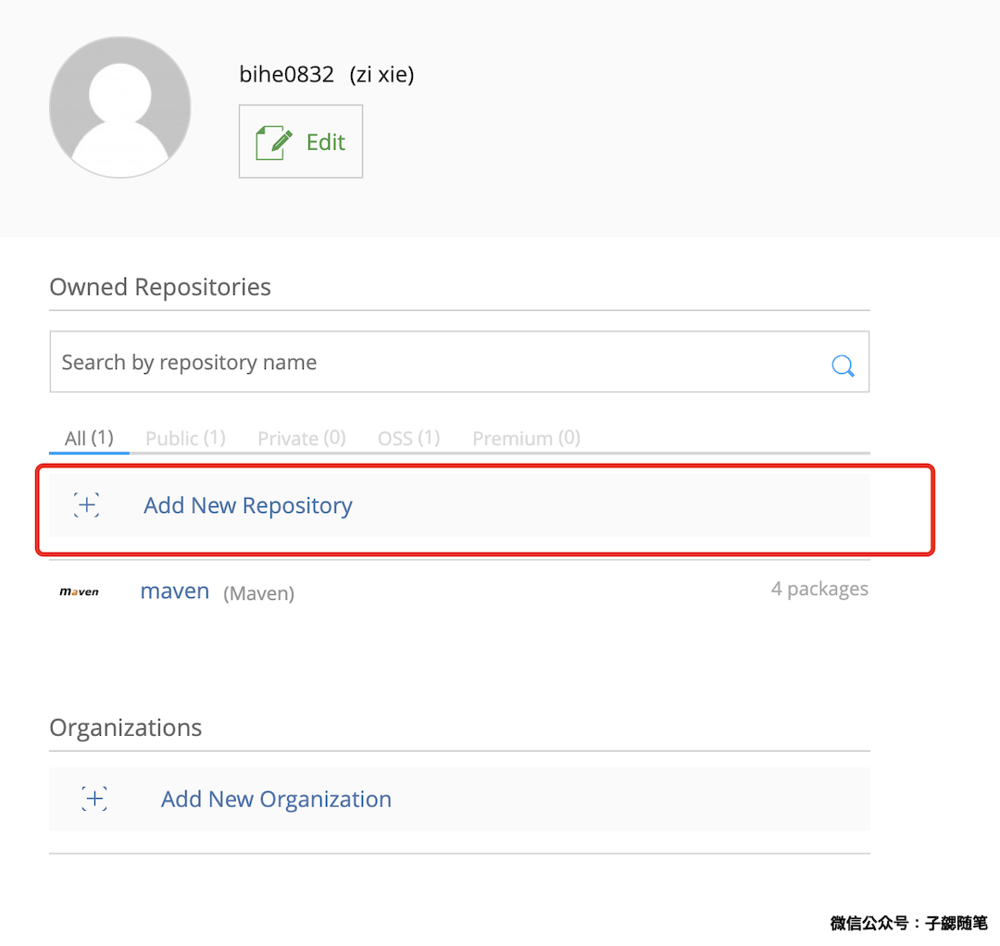
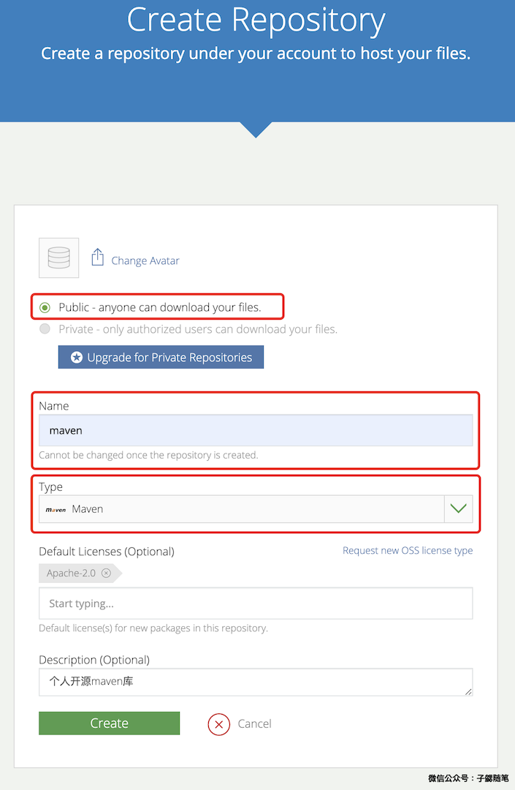
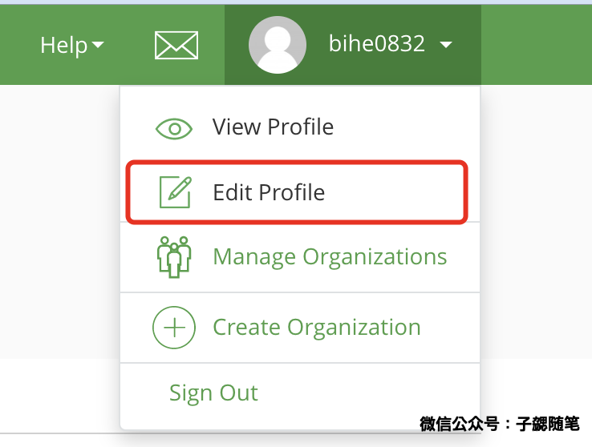

## 活久见，JCenter竟然要跑路了，项目已经迁移到了Maven Central，使用Maven Central 发布可以参考： [替换Jcenter，发布开源代码到 Sonatype Maven Central](https://blog.bihe0832.com/oss-sonatype.html)

## 写在前面

在平时的开发中，经常会写一些通用的代码，为了方便自己后续使用，也为了方便更多的人，大都会选择发布到github或者jcenter等一些开源库。之前一直是使用jcenter，结果活久见，前几天发布的时候登录，竟然看到了这：

### 又红又粗必然是有大事，果然没想到JCenter竟然要跑路了，核心内容就是：

> UPDATE: To better support the community in this migration, JFrog has extended the JCenter new package versions submission deadline through March 31st 2021.

> To clarify, the JCenter repository will keep serving packages for 12 months until February 1st 2022. Only the JCenter REST API and UI will be sunsetted on May 1st 2021.

这篇文章从头开始介绍怎么把开源代码发布到jcenter，并在项目中使用。包括注册账号，发布，发布后使用以及发布中一些常见的问题。

## 代码准备

为了方便介绍，选择通过一款早期开源的项目来介绍。

- 项目地址：

	[https://github.com/bihe0832/Android-HttpURLConnection](https://github.com/bihe0832/Android-HttpURLConnection)
	
- 文件结构
	
		├── README.md
		│
		├── advanced：com.bihe0832:http-advanced 源码
		│
		├── app：Demo 源码
		│
		├── common：com.bihe0832:http-common 源码
		│
		└── utils：com.bihe0832:utils 源码
		
- 补充说明

	接下来我们将会介绍怎么把`utils`、`common`、`advanced`发布到jcenter并在Demo中引用
	
## 注册账号

### 官网地址：

- bintray.com：[https://bintray.com/](https://bintray.com/)

### 注册账号并创建仓库：

- 注册账号

    打开官网首页，点击下图中红框中的[Sign Up Here](https://bintray.com/signup/oss)

	
	
    填写邮箱等信息，创建账号

	
    
    账号创建以后，会自动给使用的邮箱发送一封确认邮件，前往邮箱验证账号。

- 创建仓库

    由于目前我们发布的大部分开源项目都是maven格式的，因此我们先新建一个maven的源码仓库。点击下图中的`Add New Repository`
    
    
    
    如下图填写仓库信息以后，点击create以后，仓库即可创建成功，这里name选择`maven`是因为我们后面发布脚本使用了第三方插件，需要按照他的规范设置。
    
    
    
- 获取API Key

    API Key 主要是在发布代码时使用，因此我们提前获取好，按下图提示点击右上角的用户名，然后点击`Edit Profile`
    
    
    
    进入编辑页以后，按照下图提示，复制API Key到剪贴板
    
    
    
## 发布代码库并使用

### 配置发布插件

- 在根目录添加发布插件的相关依赖

        buildscript {  
            repositories {  
                jcenter()  
            }  
            dependencies {  
                classpath 'com.novoda:bintray-release:0.9.1'  
            }  
        }   

        allprojects {  
            repositories {  
                jcenter()  
            }  
        }

- 在需要发布的module添加开源库相关的配置

        //应用发布使用的插件
        apply plugin: 'com.novoda.bintray-release' 

        //添加发布相关的配置 
        publish {  
          userOrg = 'bihe0832' //用户名  
          repoName = 'maven'	//仓库名，默认为maven
          groupId = 'com.bihe0832.test'//代码库路径  
          artifactId = 'utils-demo'//项目名称  
          publishVersion = '1.0.1'//版本号  
          desc = 'the base utils for zixie'//项目描述
          website = 'https://github.com/bihe0832/Android-HttpURLConnection'//项目对应网站
        }
        
    按照上面的配置发布的插件，在最终被引用时，形式为：`api 'com.bihe0832.test:utils-demo:1.0.0'`
    
### 提交代码

在项目根目录运行下面的命令：

    ./gradlew clean build bintrayUpload -PbintrayUser=USERNAME -PbintrayKey=API_KEY  -PdryRun=false

其中：USERNAME为登录用用户名，API_KEY为上面提到的API Key，具体事例如下：

    ➜  Android-HttpURLConnection git:(master)  ./gradlew clean build bintrayUpload -PbintrayUser=bihe0832 -PbintrayKey=d***d  -PdryRun=false
    Java HotSpot(TM) 64-Bit Server VM warning: ignoring option MaxPermSize=1g; support was removed in 8.0
    Starting a Gradle Daemon (subsequent builds will be faster)

    > Configure project :utils

    > Task :utils:lint
    Ran lint on variant release: 0 issues found
    Ran lint on variant debug: 0 issues found

    ……
    
    > Task :utils:bintrayUpload
    Uploading to https://api.bintray.com/content/bihe0832/maven/utils-sdsd/1.0.0/com/bihe0832/test/utils-demo/1.0.0/utils-demo-1.0.0-sources.jar...
    Uploaded to 'https://api.bintray.com/content/bihe0832/maven/utils-sdsd/1.0.0/com/bihe0832/test/utils-demo/1.0.0/utils-demo-1.0.0-sources.jar'.
    Uploading to https://api.bintray.com/content/bihe0832/maven/utils-sdsd/1.0.0/com/bihe0832/test/utils-demo/1.0.0/utils-demo-1.0.0-javadoc.jar...
    Uploaded to 'https://api.bintray.com/content/bihe0832/maven/utils-sdsd/1.0.0/com/bihe0832/test/utils-demo/1.0.0/utils-demo-1.0.0-javadoc.jar'.
    Uploading to https://api.bintray.com/content/bihe0832/maven/utils-sdsd/1.0.0/com/bihe0832/test/utils-demo/1.0.0/utils-demo-1.0.0.aar...
    Uploaded to 'https://api.bintray.com/content/bihe0832/maven/utils-sdsd/1.0.0/com/bihe0832/test/utils-demo/1.0.0/utils-demo-1.0.0.aar'.
    Uploading to https://api.bintray.com/content/bihe0832/maven/utils-sdsd/1.0.0/com/bihe0832/test/utils-demo/1.0.0/utils-demo-1.0.0.pom...
    Uploaded to 'https://api.bintray.com/content/bihe0832/maven/utils-sdsd/1.0.0/com/bihe0832/test/utils-demo/1.0.0/utils-demo-1.0.0.pom'.

    Deprecated Gradle features were used in this build, making it incompatible with Gradle 5.0.
    Use '--warning-mode all' to show the individual deprecation warnings.
    See https://docs.gradle.org/4.10.1/userguide/command_line_interface.html#sec:command_line_warnings

    BUILD SUCCESSFUL in 22s
    56 actionable tasks: 53 executed, 3 up-to-date
    ➜  Android-HttpURLConnection git:(master) ✗

此时我们的代码就已经成功提交到了`bintray.com`，在maven的页面已经可以查到，此时其实已经可以在代码中使用：

### 引用项目

此时其实我们的项目已经可以在代码中使用

在根目录添加开源库仓库的相关依赖，对应的url在上图的右上角：

    buildscript {  
        repositories {  
            maven { url "https://dl.bintray.com/bihe0832/maven" }
        }  
    }   

    allprojects {  
        repositories {  
            maven { url "https://dl.bintray.com/bihe0832/maven" }
        }  
    }
    
在对应项目添加依赖，具体的依赖方法可以参考上图左下角：

    compile 'com.bihe0832.test:utils-demo:1.0.0'

### 发布到jcenter

可以看到上面虽然我们已经可以使用了，但是其实是发布到一个自己的私有仓库，但是日常开发中我们使用的库都是发布到jcenter，接下来就把我们的仓库同步到jcenter

如下图，进入项目以后，点击右上角的actions，然后选择 Add to Jcenter

在弹框中输入简单的项目介绍即可，接下来就是短暂的等待，一般几个小时内就可以收到jcenter的回复。之后就可以将上面的引用开源库仓库的相关依赖的地址修改为jcenter了，如下：

    buildscript {  
        repositories {  
            jcenter()
        }  
    }   
    
    allprojects {  
        repositories {  
            jcenter()
        }  
    }

## 常见问题：

1. 界面不一致：

    很多人表示看到的教程等等上面的图都是下面的版本，发现和自己登录以后并不一致，这是因为bintray改版了，可以通过点击下面红框中的按钮在新旧两种风格中切换。

    
    
2. 提交代码报错，提示：HTTP/1.1 401 Unauthorized \[message:This resource requires authentication\]

    请检查执行`./gradlew clean build bintrayUpload -PbintrayUser=USERNAME -PbintrayKey=API_KEY -PdryRun=false`时使用的用户名和API Key是否正确，一般是因为这个原因。
    
3. 提交代码报错，提示：HTTP/1.1 409 Conflict \[message:Unable to upload files: An artifact with the path 'com/bihe0832/test/utils-demo/1.0.0/utils-demo-1.0.0-sources.jar' already exists\]

    错误事例：

        * What went wrong:
        Execution failed for task ':utils:bintrayUpload'.
        > Could not upload to 'https://api.bintray.com/content/bihe0832/maven/utils-demo/1.0.0/com/bihe0832/test/utils-demo/1.0.0/utils-demo-1.0.0-sources.jar': HTTP/1.1 409 Conflict [message:Unable to upload files: An artifact with the path 'com/bihe0832/test/utils-demo/1.0.0/utils-demo-1.0.0-sources.jar' already exists]

        * Try:
        Run with --stacktrace option to get the stack trace. Run with --info or --debug option to get more log output. Run with --scan to get full insights.

        * Get more help at https://help.gradle.org

        Deprecated Gradle features were used in this build, making it incompatible with Gradle 5.0.
        Use '--warning-mode all' to show the individual deprecation warnings.
        See https://docs.gradle.org/4.10.1/userguide/command_line_interface.html#sec:command_line_warnings

        BUILD FAILED in 7s
        56 actionable tasks: 53 executed, 3 up-to-date
    
    这种问题很明显，远程已经存在当前版本，升级版本号以后重试即可
 
 		
4. 提交代码报错，提示 HTTP/1.1 400 Bad Request [message:Please enter a valid VCS URL for your package.]

	- 错误事例
		
			FAILURE: Build completed with 2 failures.
			
			1: Task failed with an exception.
			-----------
			* What went wrong:
			Execution failed for task ':LibUtils:bintrayUpload'.
			> Could not create package 'bihe0832/android/lib-utils': HTTP/1.1 400 Bad Request [message:Please enter a valid VCS URL for your package.]
			
			* Try:
			Run with --stacktrace option to get the stack trace. Run with --info or --debug option to get more log output. Run with --scan to get full insights.
			==============================================================================
			
			2: Task failed with an exception.
			-----------
			* What went wrong:
			Execution failed for task ':bintrayPublish'.
			> Could not publish 'bihe0832/android/lib-utils/1.0.0': HTTP/1.1 404 Not Found [message:Package 'lib-utils' was not found]
			
			* Try:
			Run with --stacktrace option to get the stack trace. Run with --info or --debug option to get more log output. Run with --scan to get full insights.
			==============================================================================
			
			* Get more help at https://help.gradle.org
			
			Deprecated Gradle features were used in this build, making it incompatible with Gradle 5.0.
			See https://docs.gradle.org/4.6/userguide/command_line_interface.html#sec:command_line_warnings
	
	- 问题原因
		
		- 检查userOrg、repoName填写是否正确
		
		- **如果没有提前在jcenter创建pkg，确认填写的website已经填写且是一个github的地址**

5. 发布到jcenter失败，提示：The version control XXX returns 404.

    这种问题一般是因为不是自动创建的代码库，而是在提交代码之前已经手动创建了代码库，然后VCS填写错误。修改为项目对应的正确的版本控制地址即可。
    
    
