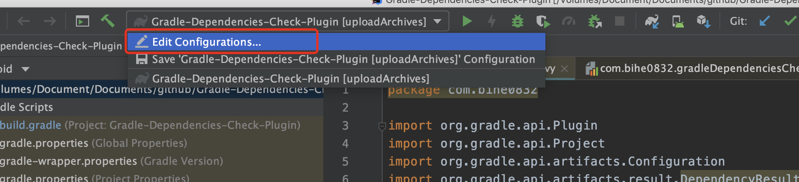
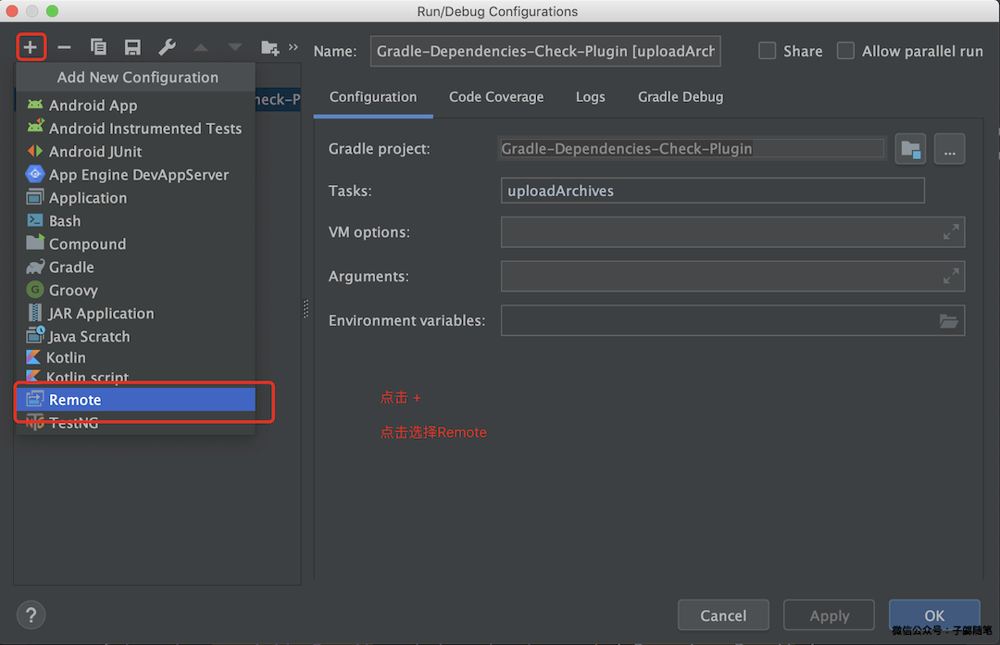
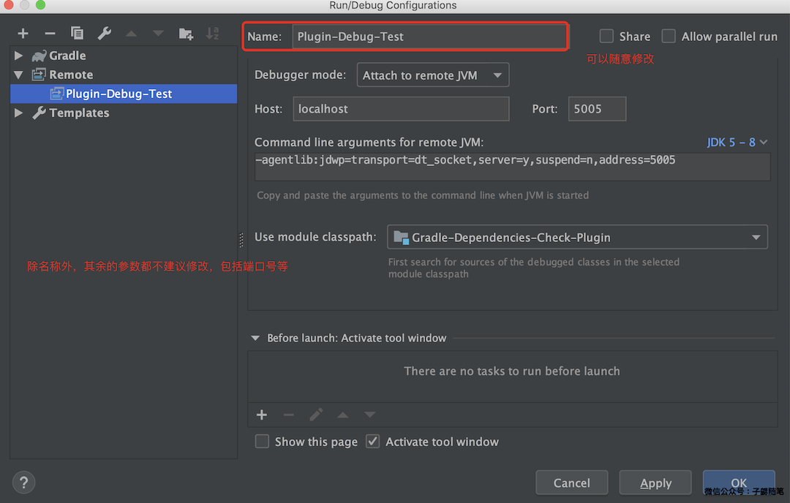
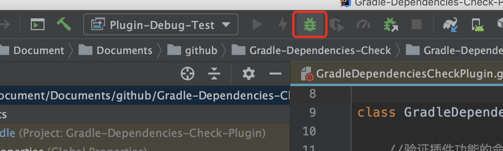
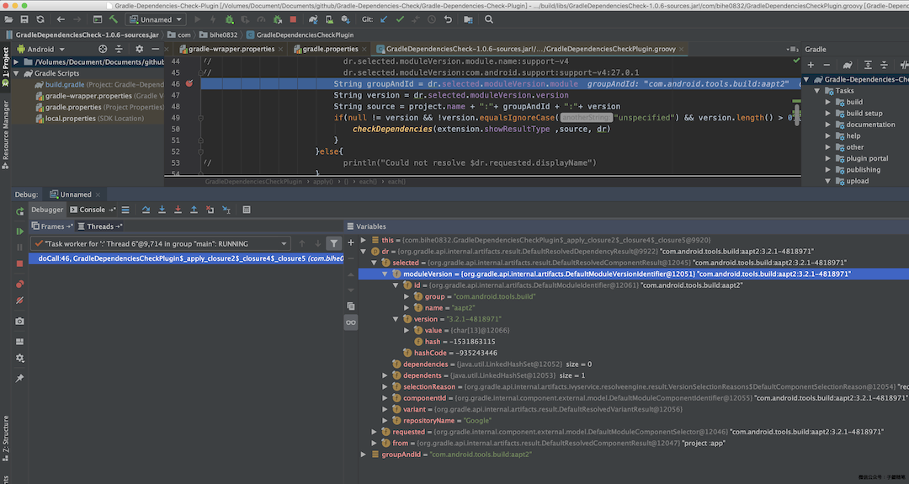
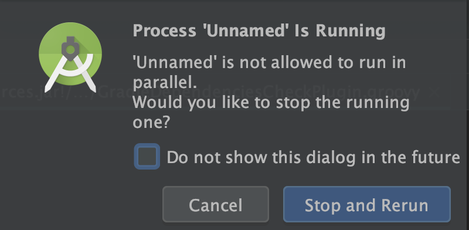

### 背景

这是[Gradle插件开发系列（点击查看）](https://blog.bihe0832.com/gradle_plugin_summary.html)系列的第三篇，整个文档基于开发的插件[一款检查Gradle依赖配置是否冲突的插件](https://blog.bihe0832.com/gradle-dependencies-check.html)完成。相关源码在 [https://github.com/bihe0832/Gradle-Dependencies-Check](https://github.com/bihe0832/Gradle-Dependencies-Check)。

这篇文章主要介绍在插件开发过程中，如何设置断点动态调试插件。首先由于插件项目和实际使用的项目是两个不同的项目，因此只能使用gradle的远程调试功能。下面以上面提到的插件[一款检查Gradle依赖配置是否冲突的插件](https://blog.bihe0832.com/gradle-dependencies-check.html)为例介绍。

### 启动插件和应用项目

#### 代码目录

下面是事例项目的代码目录

	Gradle-Dependencies-Check
		│
		├─── Gradle-Dependencies-Check-Plugin 构建依赖自动检查插件源码
		|
		├─── Sample 构建依赖自动检查插件测试用Demo
		│
		└─── README.md 项目介绍

#### 启动项目
	
使用Android Studio 分别启动插件项目Gradle-Dependencies-Check-Plugin和应用项目Sample

#### 一点说明

为了后面介绍方便，我们会把插件项目Gradle-Dependencies-Check-Plugin简称**插件工程**，把应用项目Sample简称**Demo工程**

### 配置调试信息

#### 创建远程调试任务

首先为**插件工程**添加远程调试任务，点击选择 `Edit Configurations …`

点击添加，在弹出的对话框中选择 Remote。

这时会自动生成一个 Remote debug 的配置，建议所有配置都使用默认值，点击 OK 按钮。

#### 配置调试环境变量

在**Demo工程**根目录输入下面的命令开启gradle的远程调试：

	export GRADLE_OPTS="-Xdebug -Xrunjdwp:transport=dt_socket,server=y,suspend=y,address=5005"
	
例如：

	➜  Gradle-Dependencies-Check git:(master) cd Sample
	➜  Sample git:(master) ✗ export GRADLE_OPTS="-Xdebug -Xrunjdwp:transport=dt_socket,server=y,suspend=y,address=5005"
	➜  Sample git:(master) ✗

### 开始调试

1. 在**插件工程**添加断点

2. 然后在**Demo工程**根目录输入下面命令启动远程调试器：

		./gradlew --no-daemon checkGradleDependencies  -Dorg.gradle.debug=true

	此时，终端会提示`Listening for transport dt_socket at address: 5005`，表示调试环境已经OK，等待 attach 调试器。例如：
	
	例如：

		➜  Sample git:(master) ✗ ./gradlew --no-daemon checkGradleDependencies  -Dorg.gradle.debug=true
		Java HotSpot(TM) 64-Bit Server VM warning: ignoring option MaxPermSize=1g; support was removed in 8.0
		Listening for transport dt_socket at address: 5005
		

3. 在**插件工程**的IDE中点击 Debug 按钮，添加调试器，如下图：

	

	这时在**插件工程**的IDE的调试器终端中会打印：

		Connected to the target VM, address: 'localhost:5005', transport: 'socket'
	
	而在刚才**Demo工程**命令行终端中会打印：

		Starting a Gradle Daemon, 1 incompatible Daemon could not be reused, use --status for details

		> Starting Daemon
		
	接上前面**Demo工程**的日志完整内容例如：
	
		➜  Sample git:(master) ✗ ./gradlew --no-daemon checkGradleDependencies  -Dorg.gradle.debug=true
		Java HotSpot(TM) 64-Bit Server VM warning: ignoring option MaxPermSize=1g; support was removed in 8.0
		Listening for transport dt_socket at address: 5005
		Starting a Gradle Daemon, 1 incompatible Daemon could not be reused, use --status for details
		
		> Starting Daemon
		
	此时调试器已经添加完成
	
4. 在**插件工程**的IDE中再次点击 Debug 按钮，在**Demo工程**命令行查看构建开始执行，当运行到**插件工程**断点时，就会自动暂停。后续调试与正常调试一致。如下图：

	
	
5. 调试结束，命令执行成功，**插件工程**的IDE的调试器终端中会打印另一行日志：

		Disconnected from the target VM, address: 'localhost:5005', transport: 'socket'

6. 一次调试结束以后，如果需要再次调试，只需循坏执行上面的第1 ~ 5步

### 结束调试

彻底调试结束以后，在**Demo工程**根目录输入下面命令关闭gradle远程调试：

	export GRADLE_OPTS=""

### 常见问题

1. attach 调试器以后，再次点击 Debug 按钮，构建开始。但是没有在断点暂停

	问题原因一般有两种，一是断点本来就没有执行到，建议在task入口就添加一个断点。另一个原因是Demo工程开启了gradle的守护进程。这种情况检查启动远程调试器的命令是否加上了 ` --no-daemon` 参数

2. attach 调试器以后，再次点击 Debug 按钮，弹框提示 not allowed to run in parallel：

	之前在调试时遇到过，再次点击 Debug 按钮时，弹出下面的提示框，选择 `Stop and Return` 即可：
	
	
