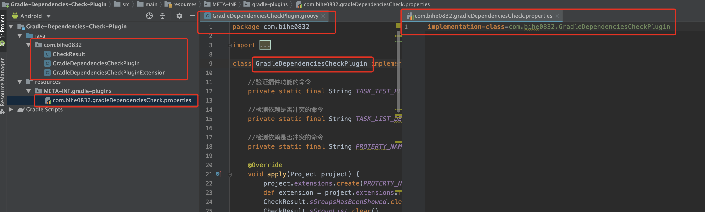

### 背景

这是[Gradle插件开发系列之总纲（点击查看）](https://blog.bihe0832.com/gradle_plugin_summary.html)系列的第二篇，整个文档基于开发的插件[一款检查Gradle依赖配置是否冲突的插件](https://blog.bihe0832.com/gradle-dependencies-check.html)完成。

这篇文章主要介绍如何新建一个插件并可以在本地运行。

### 新建插件工程

####  新建工程

使用Android Studio 新建一个空工程，在选择工程类型的界面，选择第一个"Add No Activity"，然后其余的就和常规项目没有区别。例如我新建一个工程"Gradle-Dependencies-Check-Plugin"

#### 调整代码结构
	
新建完成以后，进入项目根目录，删除根目录下的app目录。同时在根目录按照下面的曾经创建插件目录：
	
	├── build.gradle : 已经存在，项目依赖、构建信息等配置
	├── gradle	 : 已经存在，项目gradle版本、环境变量等配置
	│   └── wrapper
	│       ├── gradle-wrapper.jar
	│       └── gradle-wrapper.properties
	├── gradlew : 已经存在，构建命令
	├── gradlew.bat : 已经存在，构建命令
	└── src	 : 重新创建，插件代码及配置目录，文件夹名称要保持一样，位置在根目录
	    └── main : 重新创建，插件代码及配置目录，文件夹名称要保持一样，位置在src目录
	        ├── groovy	 : 重新创建，插件代码目录，文件夹名称要保持一样，位置在main目录，之后子文件夹可以自定义
	        │   └── com
	        │       └── bihe0832
	        │           ├── CheckResult.groovy
	        │           ├── GradleDependenciesCheckPlugin.groovy
	        │           └── GradleDependenciesCheckPluginExtension.groovy
	        └── resources : 重新创建，插件配置目录，文件夹名称要保持一样，位置在main目录
	            └── META-INF : 重新创建，插件配置目录，文件夹名称要保持一样，位置在resources目录
	                └── gradle-plugins : 重新创建，插件配置目录，文件夹名称要保持一样，位置在META-INF目录
	                    └── com.bihe0832.gradleDependenciesCheck.properties
		                    
####  部分文件命名规则及内容：

- build.gradle 文件内容
		
		apply plugin: 'groovy'
		apply plugin: 'maven'

		dependencies {
		    compile gradleApi()
		    compile localGroovy()
		}
		
		allprojects {
		    repositories {
		        jcenter()
		    }
		}
		
		compileGroovy {
		    sourceCompatibility = JavaVersion.VERSION_1_7
		    targetCompatibility = JavaVersion.VERSION_1_7
		    options.encoding = "UTF-8"
		}
		
		buildscript {
		    repositories {
		        jcenter()
		    }
		}
		
		dependencies {
		    compile gradleApi()
		    compile localGroovy()
		}
		
- gradle-plugins中文件内容
	
		➜  Gradle-Dependencies-Check-Plugin git:(master) ✗ cat src/main/resources/META-INF/gradle-plugins/com.bihe0832.gradleDependenciesCheck.properties
		implementation-class=com.bihe0832.GradleDependenciesCheckPlugin
	
- gradle-plugins目录中的文件夹的名称，以及配置中的implementation-class与代码文件的名称都有对应关系，如下图

	
	
- 插件入口文件名必须为***Plugin，即文件名必须以Plugin结尾
	
- 插件如果在使用的时候有传递参数，则参数的数据结构对应的文件名必须为***PluginExtension，即文件名必须以PluginExtension结尾
	
- gradle-plugins中插件配置中`implementation-class`的值必须与插件入口文件的完整名称一致
	
- 	gradle-plugins中插件配置文件的名称必须与`implementation-class`的值一致，但是又有两个细微区别：**文件名没有了Plugin和插件入口文件的第一个字母大写改为小写**。例如我们的插件入口文件是：

		com.bihe0832.GradleDependenciesCheckPlugin
		
	但是我们的插件属性文件的文件名是：
		
		com.bihe0832.gradleDependenciesCheck.properties
		
#### 注意事项：
	
1. src目录及其子目录，需要严格按照上面的提示创建，这是官方定义的标准，如果木有按照标准，会出现插件可以编译通过但是不生效的问题
2. 如果上面的命名存在问题也会导致插件编译通过但是不生效
3. 上面的配置、入口文件等都是用于开发过程中，在最终使用插件时会与apply有关联，但是与插件的依赖也就是dependencies没有关联，这部分下面插件发布本地会介绍。
	
### 开发插件

#### 编写插件代码

如果插件不需要传递参数，就很简单了，例如下面就是一个不需要传递参数的插件的代码

	class GradleDependenciesCheckPlugin implements Plugin<Project> {
	
	    //验证插件功能的命令
	    private static final String TASK_TEST_PLUGIN = "zixietest"
	
	    @Override
	    void apply(Project project) {
	      
	        project.task(TASK_TEST_PLUGIN) << {
	            println "hello, world! , zixietest is ok !!!"
	        }
	    }
	}

注意插件一定是实现Plugin<Project> ，然后再apply方法中添加新的任务。

如果涉及到外面传入参数，就可以直接参考上面事例中的代码。

#### 添加插件发布配置

当插件开发完成以后，就可以发布到本地项目测试验证了，我们现在根目录的build.gradle中添加如下配置：

	//发布到 本地
	uploadArchives {
	    repositories {
	        mavenDeployer {
        		// 发布到本地maven的对应路径
	            repository(url: 'file:./../Sample/libs/maven_local')
	        }
	    }
	}
	
	//插件版本
	version = "1.0.0"
	//插件所属group
	group "com.bihe0832"
	//插件名称
	archivesBaseName = 'test'
	
下面关于插件的三项相关配置决定了最终第三方使用插件的方式，例如按照上面的配置，第三方的使用方式就为：

添加依赖：

	dependencies {
	  classpath "com.bihe0832:test:1.0.0"
	}

应用插件：
    
    apply plugin: 'com.bihe0832.gradleDependenciesCheck'
    
是的，上面的配置决定了依赖配置时项目库的版本和名称，而前面配置的插件properties文件的名称，决定了最终应用的插件名称    

#### 发布插件

当完成上述配置以后，可以在 Android Studio 右侧的gradle窗口，选择 upload 中的 uploadArchives，如果编辑没有问题，就会发布到上面设置的本地路径。 当然也可以选择直接在命令行执行命令：
	
	➜  Gradle-Dependencies-Check-Plugin git:(master) ✗ ./gradlew uploadArchives
	Java HotSpot(TM) 64-Bit Server VM warning: ignoring option MaxPermSize=1g; support was removed in 8.0
	Starting a Gradle Daemon (subsequent builds will be faster)
	
	BUILD SUCCESSFUL in 4s
	4 actionable tasks: 2 executed, 2 up-to-date
	➜  Gradle-Dependencies-Check-Plugin git:(master) ✗

至此，插件就已经开发完成并在本地发布成功。

### 使用插件

当插件开发完成以后，我们就需要在新的工程中使用插件。打开已有的工程项目(以开源代码中的Sample为例)，修改根目录build.gradle的依赖配置，添加如下依赖:

	buildscript {

	    repositories {
	    		// 本地maven的根目录
	        maven { url './libs/maven_local' }
	    }
	    
	    dependencies {
	        classpath "com.bihe0832:test:1.0.+"
	    }
	}
	
	subprojects {
		apply plugin: 'com.bihe0832.gradleDependenciesCheck'
	}
	
	allprojects {
	    repositories {
	    		// 本地maven的根目录
	        maven { url './libs/maven_local' }
	    }
	}
	
然后更新依赖配置，在 Android Studio 右侧的gradle窗口，选择 others 中的 zixietest，运行后即可看到效果。 当然也可以选择直接在命令行执行命令：

	➜  Sample git:(master) ✗ ./gradlew zixietest
	Java HotSpot(TM) 64-Bit Server VM warning: ignoring option MaxPermSize=1g; support was removed in 8.0
	
	> Configure project :app
	NDK is missing a "platforms" directory.
	If you are using NDK, verify the ndk.dir is set to a valid NDK directory.  It is currently set to /Volumes/Document/Documents/github/Gradle-Dependencies-Check/Sample.
	If you are not using NDK, unset the NDK variable from ANDROID_NDK_HOME or local.properties to remove this warning.
	
	
	> Configure project :sdk
	NDK is missing a "platforms" directory.
	If you are using NDK, verify the ndk.dir is set to a valid NDK directory.  It is currently set to /Volumes/Document/Documents/github/Gradle-Dependencies-Check/Sample.
	If you are not using NDK, unset the NDK variable from ANDROID_NDK_HOME or local.properties to remove this warning.
	
	
	> Task :app:zixietest
	hello, world! , zixietest is ok !!!
	
	> Task :sdk:zixietest
	hello, world! , zixietest is ok !!!
	
	Deprecated Gradle features were used in this build, making it incompatible with Gradle 5.0.
	Use '--warning-mode all' to show the individual deprecation warnings.
	See https://docs.gradle.org/4.10/userguide/command_line_interface.html#sec:command_line_warnings
	
	BUILD SUCCESSFUL in 8s
	2 actionable tasks: 2 executed

至此，我们就完成了新建并开发一个gradle插件，并在本地工程中应用。在接下来的文章会介绍如何debug调试插件。

	

	

	
	
	
	
	
	
