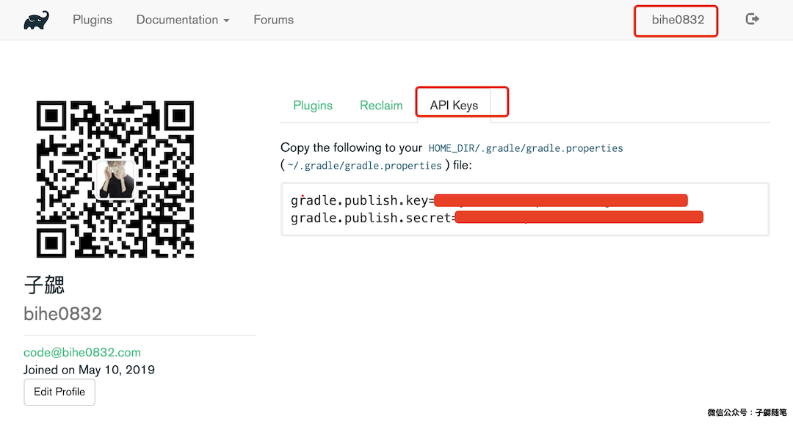

### 背景

这是[Gradle插件开发系列之总纲（点击查看）](https://blog.bihe0832.com/gradle_plugin_summary.html)系列的最后一篇，整个文档基于开发的插件[一款检查Gradle依赖配置是否冲突的插件](https://blog.bihe0832.com/gradle-dependencies-check.html)完成。相关源码在 [https://github.com/bihe0832/Gradle-Dependencies-Check](https://github.com/bihe0832/Gradle-Dependencies-Check)

说最近是近几年最忙的时候之一应该是没有异议的，之前已经累积了很多想总结的文章没总结，所以如果这个系列不趁势写完，估计也是一样的效果。所以就赶时间写一下吧。

这篇文章主要介绍如何把一个gradle插件发布到gradle插件库和jcenter，并使用发布后的插件。

### 发布插件到gradle插件库并使用

这是gradle插件库官方提供的发布插件的指引：[https://plugins.gradle.org/docs/submit](https://plugins.gradle.org/docs/submit)，接下来我们具体介绍

#### 注册账号

打开官网，然后点击右上角登录按钮，然后选择注册，当然也可以直接选择使用github登录，这一步比较简单

- 官网地址：[https://plugins.gradle.org/](https://plugins.gradle.org/)

#### 获取API Key

如下图，点击右上角的个人账号，然后进入个人编辑页，然后切换到API Keys的tab，就可以看到对应的内容

如果没有生成过应该会提示生成。已经生成的按照提示复制内容到用户根目录的` ~/.gradle/gradle.properties ` 文件中，这里是gradle的全局变量的保存位置。关于gradle环境变量的更多内容，可以通过文章[Gradle环境变量那些事](https://blog.bihe0832.com/gradle_properties.html)了解。

#### 添加插件发布配置

在根目录的build.gradle中添加如下配置：
	
	allprojects {
	    repositories {
	        jcenter()
	    }
	}
	
	buildscript {
	    repositories {
	        jcenter()
	    }
	    dependencies {
	        //发布到 https://plugins.gradle.org
	        classpath "com.gradle.publish:plugin-publish-plugin:0.9.10"
	    }
	}
	
	version = "1.0.0"
	group "com.bihe0832"
	archivesBaseName = 'test'
	
	//发布到 https://plugins.gradle.org
	apply plugin: "com.gradle.plugin-publish"
	pluginBundle {
	    website = 'https://github.com/bihe0832/Gradle-Dependencies-Check'
	    vcsUrl = 'https://github.com/bihe0832/Gradle-Dependencies-Check.git'
	    description = 'A plugin to check wherether the configuration of your gradle dependencies have conflicts or not!'
	    tags = ['Android', 'Gradle', 'plugin']
	    plugins {
	        greetingsPlugin {
	            id = 'com.bihe0832.gradleDependenciesCheck' // 就是刚才定义属性文件时使用的ID
	            displayName = archivesBaseName // 添加依赖时使用的名字
	        }
	    }
	}	
	
部分配置在之前的文章 [开发第一个gradle插件](https://blog.bihe0832.com/gradle_plugin_new.html) 中已经介绍了，这里不再说明，其余的配置注释也已经有说明

#### 发布插件

当完成上述配置以后，在命令行执行命令 `./gradlew publishPlugins` 然后等待上传结束就发布成功了
	
	➜  Gradle-Dependencies-Check-Plugin git:(master) ✗ ./gradlew publishPlugins
	Java HotSpot(TM) 64-Bit Server VM warning: ignoring option MaxPermSize=1g; support was removed in 8.0
	
	> Task :groovydoc
	Trying to override old definition of task fileScanner
	
	> Task :publishPlugins
	Publishing plugin com.bihe0832.gradleDependenciesCheck version 1.0.0
	Publishing artifact build/libs/test-1.0.0.jar
	Publishing artifact build/libs/test-1.0.0-sources.jar
	Publishing artifact build/libs/test-1.0.0-javadoc.jar
	Publishing artifact build/libs/test-1.0.0-groovydoc.jar
	Publishing artifact build/publish-generated-resources/pom.xml
	Activating plugin com.bihe0832.gradleDependenciesCheck version 1.0.0
	
	Deprecated Gradle features were used in this build, making it incompatible with Gradle 5.0.
	Use '--warning-mode all' to show the individual deprecation warnings.
	See https://docs.gradle.org/4.10/userguide/command_line_interface.html#sec:command_line_warnings
	
	BUILD SUCCESSFUL in 8s
	8 actionable tasks: 6 executed, 2 up-to-date
	➜  Gradle-Dependencies-Check-Plugin git:(master) ✗
	
一般gradle的插件库的审核周期相对比较长，提交以后审核通过需要一到两周时间。

#### 使用远程插件

当审核通过以后，就可以通过仓库 [https://plugins.gradle.org/m2/](https://plugins.gradle.org/m2/) 使用插件了，使用事例如下：

	buildscript {  
        repositories {  
            maven { url "https://plugins.gradle.org/m2/" }
        }  
    }   
    
    allprojects {  
        repositories {  
            maven { url "https://plugins.gradle.org/m2/" }
        }  
    }
	
	subprojects {
		apply plugin: 'com.bihe0832.gradleDependenciesCheck'
	}

### 发布插件到jcenter

将gradle插件发布到jcenter和发布一般的开源项目到jcenter没有区别，这部分内容可以参照之前的另一篇文章：[发布开源代码到jcenter](https://blog.bihe0832.com/jcenter.html)