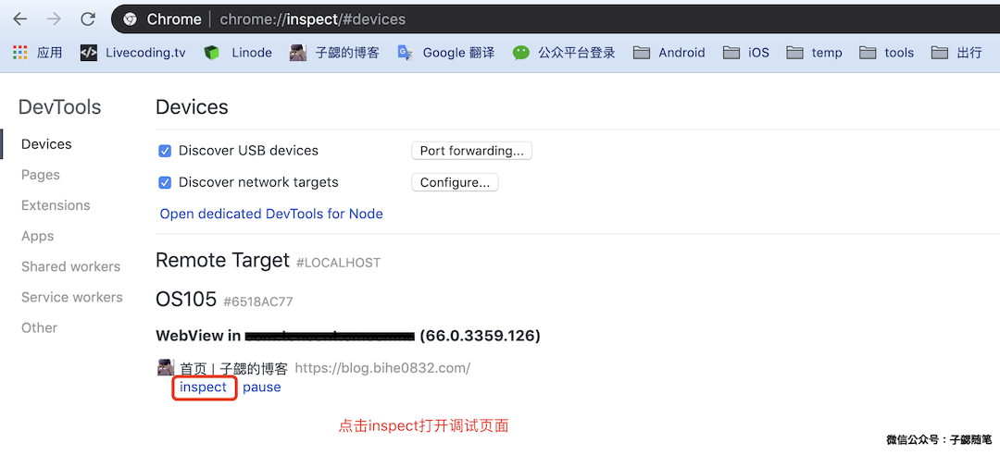

最近有一个产品需求又涉及到了JSBridge，继续一边开发一边简单总结一下。

### 什么是JSBridge

随着HTML5的不断普及及优化，其在移动端开发的应用也越来越多，在开发中我们经常需要web和native进行交互，一般我们都是使用JSBridge来实现。通过JSBridge，native可以调用web的js代码，web也可以调用指定的终端代码。

### JSBridge的实现方式

目前关于JSBridge的终端实现，方法很多。具体实现方法有：

#### ShouldOverrideUrlLoading

页面将伪协议以主资源路径的方式传入（例如新建一个iframe），然后终端通过WebViewClient的ShouldOverrideUrlLoading方法来拦截主资源请求并解析伪协议请求。

#### ShouldInterceptRequest

页面将伪协议以子资源路径的方式传入（例如新建一个script），然后终端通过WebViewClient的ShouldInterceptRequest方法来拦截子资源请求并解析伪协议请求。

#### Prompt 系列

页面通过调用window的prompt、alert、confirm等方法并将伪协议内容传入，然后终端通过WebChromeClient的onJsPrompt、onJsAlert、onJsConfirm方法来处理伪协议请求。

#### Console

页面通过调用console.log方法并将伪协议内容传入，然后终端通过WebChromeClient的onConsoleMessage方法来处理伪协议请求。

#### addjavascriptinterface

直接通过WebView的addjavascriptinterface方法，给webview添加JS的支持，这种方式由于存在致命的远程代码执行漏洞，目前基本被禁用了。

### 我们的JSBridge

我们的JSBridge使用shouldOverrideUrlLoading的方式实现，然后为了降低开发和维护的成本，业务JSBridge来维护各自的业务逻辑。由平台负责维护底层JSBridge在H5和终端之间的交互。

#### JSBridge协议

我们JSBridge的协议为：

	jsb://方法名/系列号/回调方法?key=value&key2=value2……

调用时url参数值记得做url encode，系列号字段为必须，回调方法可以省略，省略时则不回调。具体事例如：

	jsb://toast/4/MyJSBridge.callback?text=%E8%BF%99%E6%98%AF%E4%B8%80%E4%B8%AAToast%E7%9A%84JSBridge%E6%B5%8B%E8%AF%95&duration=2

对于有callback方法的调用，客户端在方法执行完毕后会回调这个callback方法，并将返回结果以json的形式返回回来。
例如调用了这么个方法（获取当前网络信息）：

	jsb://getNetInfo/0/callback

返回的数据可能是下面这样的（注意是json）：
 
	{"data":"{/"isWap/":0,/"apn/":/"WIFI/",/"networkType/":-1,/"networkOperator/":/"/"}","result":0,"seqid":0}
    
#### 如何调试JSBridge接口

这里简单介绍一下自己测试的事例。

1. 使用内置的webview打开网页

2. 初始化Web端的JSBridge的调用

	手机连接电脑，开启调试模式，然后在chrome浏览器里面通过inspect打开webview调试页面，如下图：
	
	

	点击当前打开的webview页面地址下方的inspec超链接，打开详细调试页面
	
3. 初始化web端的JSBridge实例

	在新打卡页面的Console中输入下面的JS代码，初始化web端的JSBridge实例。如果是实际开发，可以在页面中引入js：
	
	https://cdn.bihe0832.com/js/jsbridge.js 
	
	即可直接调用，具体可以参考页面：
	
	https://cdn.bihe0832.com/tools/jsbridge/index.html
	

		//注册全局回调必须
		 window.ZixieJSBridge = window.ZixieJSBridge || {};
			
		 var framesPool = [];
			
		 function createNewFrame() {
		     var frame = document.createElement("iframe");
		     framesPool.push(frame);
		     frame.style.cssText = "position:absolute;left:0;top:0;width:0;height:0;visibility:hidden;";
		     frame.frameBorder = "0";
		     document.body.appendChild(frame);
		     return frame;
		 }
		
		 var _callWithScheme = callWithScheme = function (url) {
		     console.log("JsBridge.callWithScheme: ", url); // @debug
		     var frame;
		     for (var i = 0; frame = framesPool[i]; i++) {
		         if (!frame._busy) {
		             break;
		         }
		     }
		     if (!frame || frame._busy) {
		         frame = createNewFrame();
		     }
		     frame._busy = true;
		     frame.src = url;
		     setTimeout(function () {
		         frame._busy = false;
		     }, 0);
		 };
			
		 var allowBatchCall = true;
			
		 var seq = 1;
		 var map = {};
		 var pool = [];
		 var timer = 0;
			
		 function callSingle(name, args, callback, callbackChain) {
		     var url = ["jsb:/", name, seq, "ZixieJSBridge.callback?"].join("/"), params = [];
		     for (var key in args) {
		         params.push(encodeURIComponent(key) + "=" + encodeURIComponent(args[key] + ""));
		     }
		     url += params.join("&");
		     map[seq++] = {
		         callback: callback,
		         callbackChain: callbackChain
		     };
		     _callWithScheme(url);
		 }
			
		 function callBatch() {
		     timer = 0;
		     if (pool.length == 1) {
		         var one = pool[0];
		         callSingle(one.name, one.args, one.callback, one.callbackChain);
		     } else {
		         var params = [];
		         for (var i = 0, one; one = pool[i]; i++) {
		             if (one.args) {  
		                 for (var p in one.args) {
		                     if(one.args.hasOwnProperty(p)) {
		                         if (one.args[p]) {
		                             one.args[p] = encodeURIComponent(one.args[p]);
		                         }
		                     }
		                 }
		             }
		             params.push({
		                 method: one.name,
		                 seqid: seq,
		                 args: one.args,
		                 callback: "ZixieJSBridge.callback"
		             });
		             map[seq++] = {
		                 callback: one.callback
		             };
		         }
		         var url = ["jsb://callBatch", seq++, "ZixieJSBridge.callback?param="].join("/");
		         url += encodeURIComponent(JSON.stringify(params));
		         _callWithScheme(url);
		     }
		     pool = [];
		 }
			
		 var call = _call = function (name, args, callback) {
		     console.log("JsBridge._call: ", name, args); // @debug
		     args = args || {};
		     var callbackChain = [].slice.call(arguments, 3);
		     if (allowBatchCall) {
		         pool.push({
		             name: name,
		             args: args,
		             callback: callback,
		             callbackChain: callbackChain
		         });
		         !timer && (timer = setTimeout(callBatch, 0));
		     } else {
		         callSingle(name, args, callback, callbackChain);
		     }
		 };
			
		 var callback = function (args) {
		     console.log("ZixieJSBridge.callback: ", args); // @debug
		     var one, res, callbackChain;
		     if (map[args.seqid]) {
		         one = map[args.seqid];
		         callbackChain = one.callbackChain;
		         res = one.callback && one.callback(args);
		         delete map[args.seqid];
		     }
		     if (res && typeof res == "object") {
		         call.apply(null, [res.name, res.args || {}].concat(callbackChain || []));
		     }
		 };
			
		 ZixieJSBridge.callback = callback;
		 
4. 当在页面中完成Web端的JSBridge实例的实例化以后，就可以调用新增的接口，测试效果，例如：

		call('getAppInfo', {packagename:"com.tencent.mm"}, (res) => {
	      console.log(res)
	 	})
		
	详细返回截图如下：
	
	
	
至此就完成了一个终端JSBridge接口的调试。
