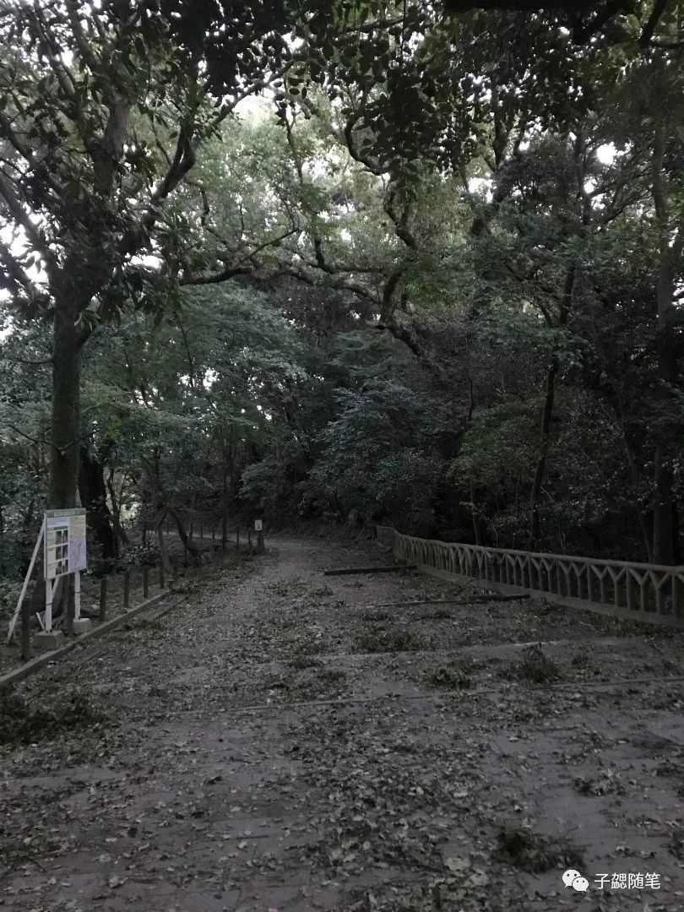
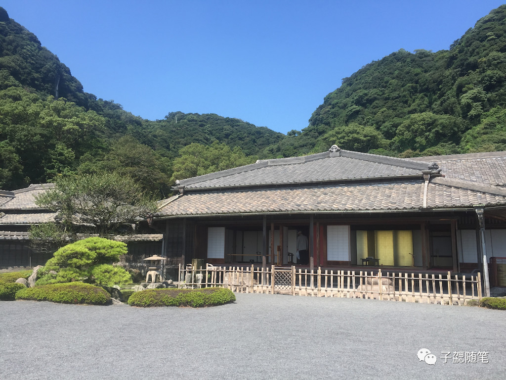
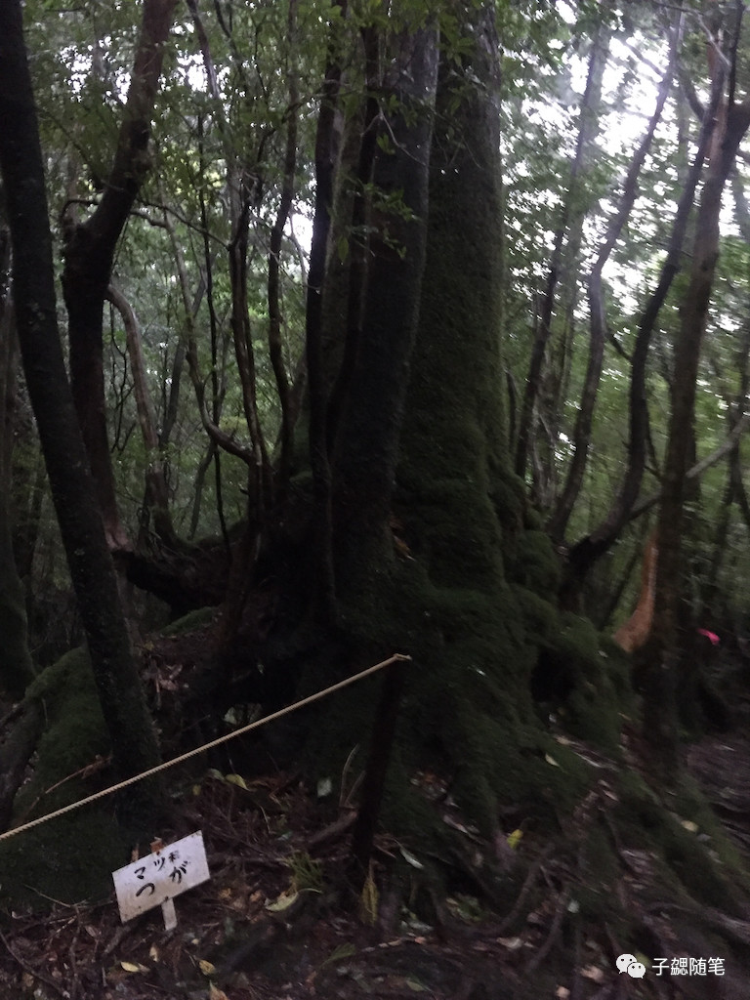
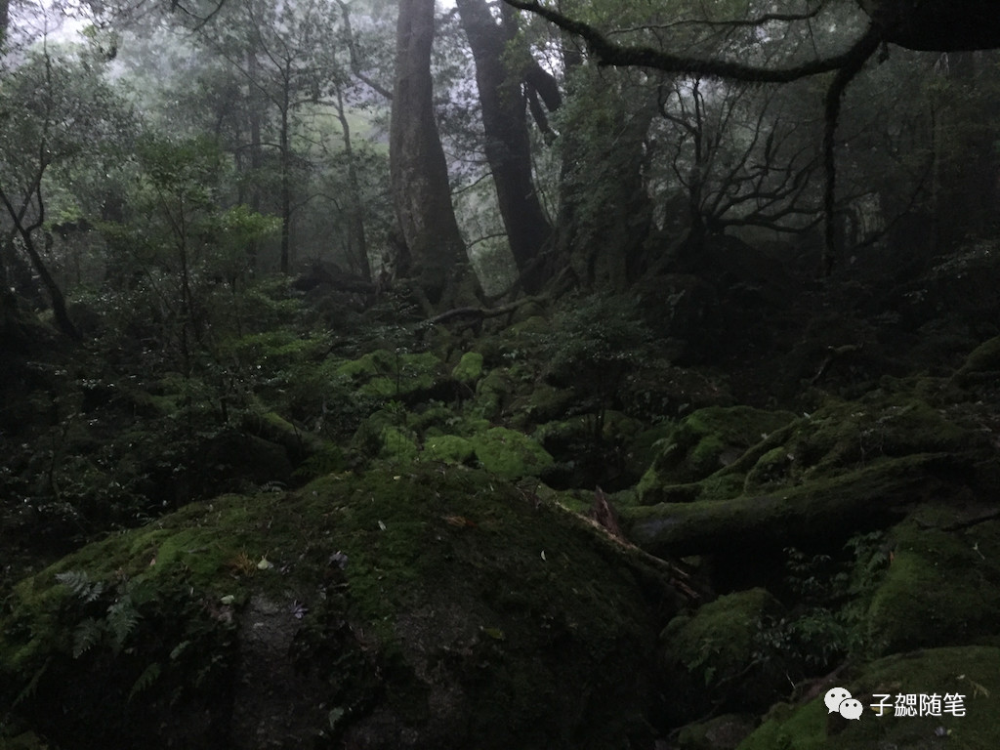
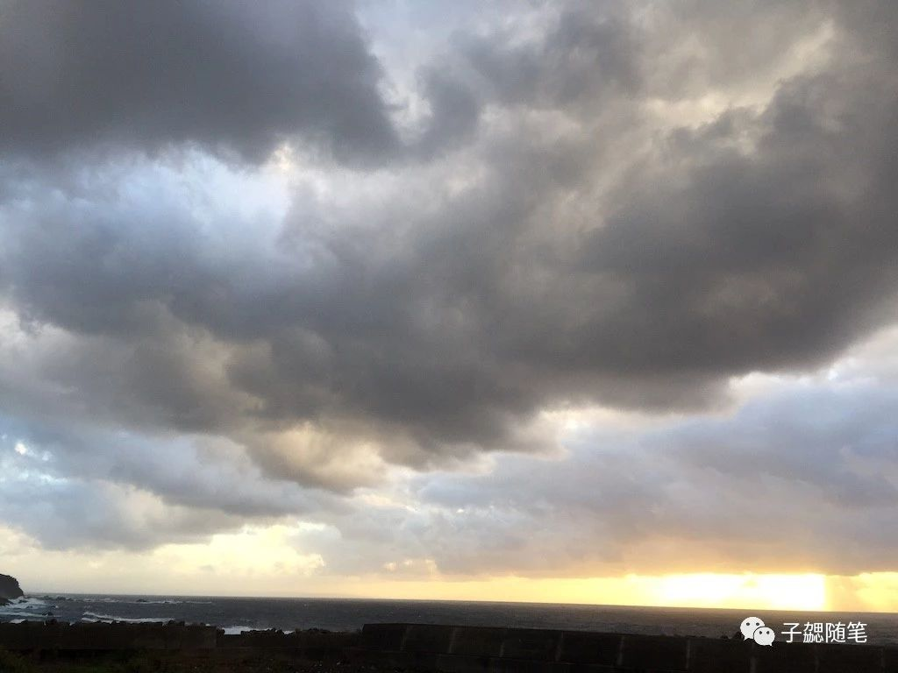
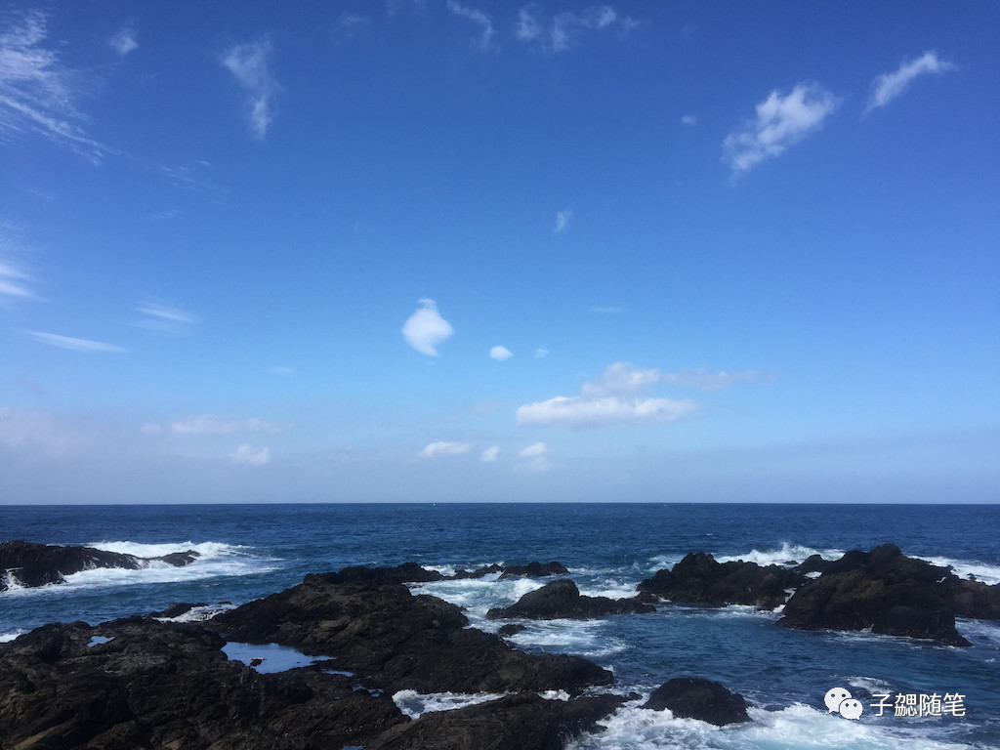

## 写在前面

妹纸一直想去日本乡下一点的地方，再加比较喜欢自然景观，再加一直对九州比较有兴趣（一直想去佐贺、福冈和长崎，想去下关，去佐世保），因此最后国庆选择了鹿儿岛和屋久岛。

## 概述：

- **用时**：7天（10月01日 - 10月07日）

- **主题**：国庆九州行 走进苔之森 火车呜呜开 一路买买买

- **主要途径点**：

  深圳 — 香港 — 鹿儿岛 — 屋久岛 — 鹿儿岛 — 香港 — 深圳

- **路线介绍**：

  九州多山，因此多铁道，各式特色列车也随之诞生，各式各样不同风格的火车串起九州每一处的景致，火车旅行是九州自由行最吸引人的方式之一。
  
  鹿儿岛拥有以世界遗产屋久岛为首的各种特色岛屿，樱岛等火山，茂密的森林，丰富的温泉等，具有多姿多彩的大自然风景和个性力的历史文化等得天独厚的观光资源，是日本为数不多的观光县之一，是日本古代文化发源地之一。
  
  屋久岛是日本最早列入世界遗产的自然景观。整个屋久岛山脉都由丰富的森林植被覆盖，而最主要的树种为柳杉。知名的景点包括有白谷云水峡，千寻瀑布等；白谷云水峡是九州最具代表性的峡谷之一。海拔600～1300米，面积424公顷的广阔的原生苔藓森林。森林被珍贵的凤尾草，藓苔等浓绿的地床植物所覆盖，屋久杉与照叶树的混生，创造了这个神秘并富有魅力的梦幻世界。

- **主要交通**：

    - 10月01号 香港 - 鹿儿岛：香港快运 UO546（07:30 - 11:35） 
    - 10月04号 鹿儿岛 - 屋久岛：快速船（07:45 - 09:45） 
    - 10月06号 屋久岛 - 鹿儿岛：日航快运 JAC3750（17:40 - 18:20） 
    - 10月07号 鹿儿岛 - 香港：香港快运 UO547（12:25 - 14:55） 	 

- **简单说明**

  1. 由于不同的人的生活习惯不同，因此游记中仅列出了我们的旅行时间、路线，没有列出具体的费用清单。如果有同学对这部分很关注，可以邮件私信我了解。
  
  2. 游记内容主要包括以下几个部分：

      - 出行准备：介绍出发前的准备工作，包括签证、行程规划等资料，以及一些关键信息和注意事项等等。
    
      - 实际行程：介绍详细的路线、天气、游玩路线等信息；包括了行程中的所有时间点和具体景区内容，里面都是我们的一路的准确记录，真实可信。关于如何记录这些信息，请点击[ 旅行中不可或缺的软件](https://blog.bihe0832.com/lv_software.html) 了解。由于这次住的都是民宿，因此对住宿信息不做介绍，有兴趣也可以私聊。

## 出行准备

### 资料准备

- **通用事项**

  关于签证、软件等相关的一些通用内容。可以点击  [日本行基本资料整理 - 子勰的博客](https://blog.bihe0832.com/lv_Japan.html) 查看详细内容

- **行程**

   在这次行程的准备过程中发现确实由于位置相对偏僻，国内去的人相对少，很多内容都不全面，好在台湾同胞去的比较多，加上官方已经提供了非常详细的内容，因此还算不是很麻烦。目前个人已经把所有用到的资料都整理汇总了，需要的同学可以参考文章 [2018年十一国庆九州行相关资料 \| 子勰的博客](https://blog.bihe0832.com/lv_kyushu.html)。里面有此次行程相关的：JR九州小火车的介绍、预定、兑换等；鹿儿岛的旅行路线，公共交通等；屋久岛的登山路线，公共交通等。
   
   而对于我们的具体行程规划，可以参考文章[2018年十一国庆九州行行程规划 \| 子勰的博客](https://blog.bihe0832.com/lv_kyushu_plan.html)

- **软件**

  主要用于旅行整个过程中查看游记、了解路线、路线查看、导航、吃住预订、整理游记等。关于这部分内容个人之前专门写了一篇文章来介绍。请点击 [旅行中不可或缺的软件 \| 子勰的博客](https://blog.bihe0832.com/lv_software.html) 查看详细内容。
  
  在 [2018年十一国庆九州行相关资料 \| 子勰的博客](https://blog.bihe0832.com/lv_kyushu.html) 里面关于软件的部分，也补充了几个日本自由行可能用得到的。

### 注意事项

- 一些需要重点注意或者重点关注的细节。可以点击  [日本行基本资料整理 - 子勰的博客](https://blog.bihe0832.com/lv_Japan.html) 查看详细内容

- 我们是十一国庆去的，前后遇到了两个台风（201824潭美(TRAMI) 和 201825康妮(KONG-REY)），而且因为台风确实麻烦了不少，查看了历史记录，十一期间遇到台风的概率相对较高，建议如果国庆去，做好预案，留够足够的buff时间

	

### 其他重要且通用信息

1. **午夜深圳到香港机场**

    如果是第二天很早的飞机飞，可以选择在香港机场过夜，但是个人更推荐晚一点从深圳过去，因为费用相差都不会太多，而且在家待着舒服些。如果自己包车费用比较贵，推荐到口岸搭伙；皇岗口岸24小时通关，关口下车点就有旅行社的售票口，也有不少拉客的；价格应该都是统一的，一般都是人满即走（步行过关，过关后上车）。你也阔以过关以后再找车，尤其节假日人、车都很多，先过关再找效率更高，可以节省一些时间。节假日香港关口如果坐车过关排队会比较久，推荐司机空车过关，车上的人步行过香港关，会快很多。具体详细信息我会在游记中介绍。

2. **节假日香港机场回深圳**
  
    **如果你是长假期间从香港回深圳，尤其是长假的最后一天，建议放弃从机场坐船回蛇口，你会发现这是最糟糕的选择，没有之一；推荐直接入境香港以后从各个陆上关口回深，这也是深刻教训。具体详细信息看我在游记中介绍的我们最后一天的行程即知。**
    
3. 关于民宿

    本次行程，由于妹纸想体验日式民宿，因此我们所有的住宿都是Airbnb上选的民宿。先说妹子的总结：**以后出去玩，如果不是交通方便的城市，除非租车，否则再也不会住民宿。** 这里只列举一下提炼的优缺点，具体信息我会在游记中介绍：
    
    - 由于我们选的民宿都很有特点，因此在价格上和酒店比完全没有优势
    - 酒店一般都会在交通和周边设施比较全的位置，而民宿则不一定，如果去一些偏远的地方，就会比较麻烦
    - 酒店有服务员、而且消息源四通八达，同时可以协助预定很多东西；而民宿则完全取决于房东；如果遇到高冷的房东，再遇到意外情况的时候很麻烦
    - 住民宿如果是大的民宿，还阔以认识一些有趣的人和事，会为旅行增色不少，这是酒店很难有的；但是也有可能遇到作息不一致的可能就会比较吵
    - 民宿一般都接近居住区，因此可以近距离接触到当地的人和生活，这也是酒店不可比拟的
    - 很多民宿确实很有特点，住进去即有家的感觉，又能体会到不一样的体验

## 具体行程

#### 第一天（2018-10-01）：

- **路线**：深圳（2:40）- 皇岗（3:30）- 香港T2（5:48） - 鹿儿岛中央（13:14）
- **天气情况**：多云，总体情况不错
- **交通**：
  
  - 香港 - 鹿儿岛：香港快运 UO546（07:30 - 11:35）
  - 鹿儿岛市内：公交加电车，投币

- **沿途介绍**
    
    原本计划9月30号晚上下班，回家整理好东西，洗个澡就去香港机场，然后再贵宾室过夜。后来觉得睡着还是没家里舒服，就改为先睡一觉再去。考虑到国庆人可能还是比较多，因此预留了一点时间，晚上2:40准备出发。最后在2:54上车，准点在3:30到达了皇岗口岸，口岸的人比想象的要多一点。
    
    下车以后路边就有一个直达香港机场巴士的旅行社售票口，就直接买了两张票，价格已经涨到了（200一个人）。
    
    
 	    
   等到凑齐两车人（等了估计有10多分钟），会有人带下楼过关，由于人比较多，过关用了一点时间，在4:00过关。过关以后会有人等，由于是护照过境，因此要填入境表，等填好表，等车来（等车又有一小段时间，两边也还是有很多拉客的人，因此如果先过关，过关后再上车，应该也是可以，但是不确定两种方式的时间差有多少）。上车走一段，就是香港关，因为排队太长，我们选择了下车步行过关，司机空车过境，这样会节省不少时间。刚去人还很少，等我们快过关的时候人已经越来越多（但总体还是很少的），再次上车已经是4:40了，最终在凌晨5:48到达香港机场T2航站楼。
    
   在航站楼办完托运手续，由于早上7点前T2不能办理出境，因此只能前往T1办理出境手续。所有手续搞定，前往登机口等待，6:11分，刚好到达登机口的时候，天门广场升旗仪式，就顺便远距离实时看了个升旗，之后就是等待了。
    
  

    
   等到7点开始登机，由于当时机票比较便宜，因此专门买了第一排的座位，果然爽的不是一点点。然后发现忘记带笔了，于是在空姐发行程单的是两个人就偷懒了，想着下飞机再填。结果后悔万分。飞机提前十多分钟到达鹿儿岛，然后因为在第一排因此最先下飞机，第一时间来到了国际到达处的入境小厅（嗯，是的小厅，非常小，也非常简单），结果因为没有填好入境单，所以需要找柜台和笔（只有一个柜台，两支笔，一只还是坏的），等我们填完的时候，基本上所有人都来了，我们就这样变成了最后面。因为机场太小了，海关通关只有几个口，所以速度会很慢。
   
   等从海关过来，下楼以后，箱子已经在传送带边静静的等待了。拿上箱子，过边检，然后出国际到达，沿着大楼向左一直走很快就到达国内出发和到达，也阔以看到机场大巴以及自动售票处。买好前往鹿儿岛中央的车票，上车（然后发现都还是同一航班的人，最终大家都还是一起出发了），买票的方式很简单，而且现场也有人帮忙，记录下时间，刚好12:30
   
   下午13:14分，到达鹿儿岛中央，下车后从地下通道穿过，到达鹿儿岛中央站。鹿儿岛中央站是火车站，所以要穿过车站必须上二楼，上了二楼的通道，一边是大大小小的商店以及一大排自动售票机器，另一边就是售票大厅和入口。然后去JR的服务柜台提交兑换券和申请表，拿到各小火车的车票。JR的服务柜台就在进站口旁边，非常好找，办理的速度也很快。
   
   
   
   下午13：57换好小火车的票以后，出来在对面把箱子寄存了（全自助，东西放进去，塞硬币，锁门，拿钥匙）。

   

   然后顺便去买了第三天的巴士一日乘车券（柜台就在寄存箱子的片区旁边），**鹿儿岛提供了两种巴士一日券，一种是市内交通的，一种是包含樱岛的，切记不要买错，两种颜色不一样，下面的就是错的**，别问我为什么这么说，我都知道有两种，然后没说清楚，因为太过自信也没有仔细确认，最后发现还是买错了。
   
   

   之后在鹿儿岛中央吃点午饭，然后就在鹿儿岛中央转转，在商场的五楼有一家精灵宝可梦的主题店，非常值得一逛，里面有很多宝。
    
   
  
   

   
	
   

   
 
   逛完以后，取行李，然后做公交前往民宿安顿行李。因为台风刚走，因此天气很好，而且十一来的另一个好处就是，十一不是日本的节假日，所以当地人正常上班上学。接下来的几天，每天都能见到各种年龄段的学生去上学。很有趣的体验。
   
   

   到民宿，放好行李，稍微休息就再次出发了（17:15）
    
   

 
   因为经常徒步，看到距离城山也不是很远，就和妹子很自信的选了徒步，三条路线区别也不大，看时间还早，就选了一条最远的（图中红线就是实际路线）。
    
   

   走的过程中，发现夕阳不错（17:31），就加快了脚步，想着如果可以看个夕阳也是极好的。然而发现之前规划的时候没有注意到，这条路上城山是要经过很长的一段墓地（对应地图位置：隆盛院跡），旁边是一座寺院（光明禅寺）；我们过去的时候刚好是寺院晚课的时候，我们一边从墓园中间的小路爬山，一边山下的晚课在撞钟，然而从墓园这个角度又是看夕阳最好的方向。还好我们俩对于这些不是很敏感，不然估计整个人都不好了。

   

   估计因为这条路上有墓园，因此走的人非常少，只有一个大叔带着一条小狗和我们错前错后。         
   
   本来以为走到顶可以看到完美的夕阳，谁知道，路上才是最好的，走到头的时候就是树林了，啥都看不到。由于台风才过境，因此路上一片狼藉，在这里大叔也抱着狗狗一起走了。

   
   
   估计大叔对我们的好奇和他对我们的好奇一样，终于主动搭话了，结果语言不通，在简单交流以后，就继续一起向上爬。最终在下午17:49 到达了城山观景台。
   
   

   
        
   由于对夜景的兴趣比较一般，在山顶休息了一下，然后我们就下山了，从近衛の水那条路，一路下来经过美术馆就到了西乡隆盛铜像的位置，本来想好好给妹子讲解一下，但是因为没力气，就没停留，继续前往天文馆通找吃的。结果吃的没找到，先开始了药妆（18:02），买了两拨，吃了点东西以后搭车市电到达鹿儿岛中央，也拍了一张打卡照
   
   

   然后就继续搭车回民宿了，因为一直没有吃晚饭，最后就在楼下的便利店买了泡面、便当和饭团。正在吃饭的时候，隔壁邻居回来了，居然是穿着武士服的帅哥，刚好民宿有地图，而且武士哥哥表示屋久岛很熟，所以就和他交流了一下路线规划，社会现状等等（这原是民宿最大的乐趣吧）。交流结束已经不早了，就赶紧洗洗睡了~
   
#### 第二天（2018-10-02）：

- **路线**：鹿儿岛中央（8:38）- 新八代（9:50）- 人吉（12:09）- 吉松（15:00）- 鹿儿岛（17:00）
- **天气情况**：晴朗
- **交通**： 
  全天JR
- **沿途介绍**

  今天全天的行程就是最受期待之一的小火车之旅了。早上8点10分出门，下楼以后搭乘08:23的公交前往鹿儿岛中央，不到8:40就已经到达，因为按照规划要搭乘9:06的JR出发，因此就在车站吃点零食，顺便候车。

  

  准点上车，然后再9:50到达新八代，由于SL人吉在另一个站台，因此要先出站。下图左边的楼梯就是SL人吉的进站口，而右边就是JR的站厅。
  
  

  由于时间还早，就外面晒晒太阳。天气很好。
  
  
  
  等到10点的时候，就进去候车了，按照站牌指示前往再来线的方向，下楼梯就是站台了。
  
  

  

 
  等到10:25乘坐，小火车准时到达，然后上车从新八代前往人吉，原以为人会很多，结果出乎意料，并没有很多人，有不少空位。一路上风景很好。
  
  
  
  
   
<video  width="600px" controls="controls" src="https://blog.bihe0832.com/public/photo/2018kagoshima/train.mp4" type="video/mp4" ></video>

   
   
   小火车会在中途多个站点停靠，这些站台有些会有人上下，有些就是一些历史老站台，仅供有人参观和盖章。在车上也会贩卖一些零食，乘务员也会帮拍照等等。
   
   

   
   在12:09准时到达人吉，人吉是一个很小的车站，基本上只有特色小火车经过。换车更换站台都是直接从轨道走过去。
   
   

   
   

   
  出站以后因为时间有限，就在站前走了一圈，然后再车站买了鼎鼎大名的栗子饭便当（虽然大家都说不能错过列车上的，但是根据常识和经验判断应该没有区别，事实也证明确实没有），然后边等车，边吃饭。吃完以后就是各种车站摆拍。
  
  

  
  然后等到13:22乘坐伊三郎从人吉出发前往吉松。
  
  

  
  一路上路过一些视角很好的位置，会降低车速或者停下来让游人拍照。
  
  

 
  

  
  

  
  最后这张照片，我也不知道怎么拍出来的。等到后半段的时候，其实两个人都已经有点犯困了，好在时间并不是很久。14:48到达吉松。 一下车就又乘务员在站台一直用日语引导大家出站，因为大部分都是游客，而且估计也和我们一样是继续坐隼人之风的，就都表示很困惑，因为换乘的时间并不宽裕。

  和站务员两个人用蹩脚的英文加上他手上的指引终于大概明白了，因为台风的原因，从吉松前往鹿儿岛中央的一段铁道冲坏了，我们只能改坐大巴回去，出站口已经安排了大巴。
  
  真实晴天霹雳，就这样我们在15:00坐上了列车救济，哈哈哈，还好路上的乡村风景也很好。
  
  

  
  

  上车以后走了一段还是困了，就睡了一会，本来以为直接到鹿儿岛中央，结果在15:35就到了一个JR站，竟然就是之前规划行程时一直很忐忑的JR隼人站（原定计划，最后一天要从雾岛神宫JR到这里，然后在坐机场巴士，但是网上关于这个站的信息很少）。所以下车以后第一时间确认机场大巴的乘车点的具体位置。
  
  问了站边的便利店的老婆婆，结果婆婆不通英语，拿出事先的规划，估计老婆婆也只认识平假和片假，所以没问清楚。由于地图指示就在周边，因此就开始查看周边的公交站点。
  
  

  
  过程中再次恰逢小学生们放学，一群一群的小朋友们简直可爱极了。在找了一圈以后，遇到另一个老婆婆和阿姨，再次咨询，在看了地名以后阿姨表示，知道我要干嘛但是她也不知道公交站在哪，然后让我等着开始打电话，在打了三个电话（应该是不同的人说的不一致）再三确认以后，阿姨也表示就在附近，但是也都是很确定，可能是JR站正对面的那一个。再三感谢以后，走过去，果然是，终于找到了。这时候才发现位置其实很好找，**出JR站，往前一直直行，然后横穿马路，路边的公交牌就是（用时最多两分钟）**，只是之前自己一直以为机场大巴的站牌会和普通的公交站牌有区别所以忽略了他。
    
  搞定了之前一直悬在心上的问题以后，心情大好，从隼人直接做JR前往鹿儿岛中央。这样的风景本来是在隼人之风上看的。
  
  

  
  

  
  快17:00的时候到达鹿儿岛，由于鹿儿岛站距离水族馆更近，而且有巴士前往天文馆，因此我们选择在鹿儿岛站下车，然后搭乘市电前往山形屋买买买。由于目标明确，很快买完，然后继续市电回到鹿儿岛中央，再来一张尚未天黑的打卡照。

 

 
  然后根据大众点评选了一家店吃了烧肉和寿司完晚饭就带着买买买的收获在楼下便利店（21:32）买好第二天的早餐就回去休息了。
  
  

  
#### 第三天（2018-10-03）：

- **路线**：鹿儿岛中央（9:20）- 仙岩园（10:45）- 海豚港（13:15）— 樱岛（15:07）- 鹿儿岛中央（18:33） 
- **天气情况**：晴转多云
- **交通**： 
  - 公交、轮渡
- **沿途介绍**

  今天的规划就是鹿儿岛热门景区一日游。因此也相对轻松，早上起床，然后使用之前买好的一日券搭乘公交前往鹿儿岛中央，之后换乘循环巴士从鹿儿岛中央前往仙岩园。一路上会经过西乡隆盛雕像、城山观景台等很多很有特色或者故事的地点，中间还遇到一个本地的集市，很多人，很多摊位，也很热闹。**因为之前以为环线是往返对开的双循环，所以想着先去仙岩园，有兴趣的回头再来，所以中间都没有下车。结果最后发现是单循环，因此建议如果后续有人对途经点有兴趣，最好下车逛完以后再继续往下走**。
  
  一路都没有下车，在早上10:45左右终于到达了第一个打卡点仙岩园。仙岩园，别名矶庭园是萨摩藩主岛津氏的别邸迹和庭园。
  
  

  
  

  
  

  
  

  
  

  
  

  整个仙岩园参观我们用了一个多小时，庭院中心的正厅进入需要收费，由于兴趣不是很强烈，我们没有进去，就绕着庭院四周转了一圈。里面的设计加上当天的天气让你走在里面非常舒适，而且借景樱岛景色也非常赞，真是会生活。
  
  大该12点班左右参观结束出来，然后等12:49的循环巴士前往水族馆前。在巴士拍到的正在冒烟的樱岛和没有做到的伤心极了的隼人之风。
  
  

  
  

  到达鹿儿岛水族馆前（也就是前往樱岛的栈桥的地方）下车根据大众点评的推荐去吃饭（其实如果是为了休息和吃饭，坐车到海豚港前会更近）。在找了一圈以后终于找到了目的地，有很多人在泡汤和休息。吃完饭休息了一会儿，再次从海豚港附近走过去，去坐船到樱岛，路上可以从桥上看到海豚的表演，但是我们没有停留，还是打算去樱岛了。
  
  由于之前买错票（只买了市区巴士一日通票），考虑到后面还要坐樱岛巴士，因此在码头买了巴士的乘车券，坐船就要付现了，还好也不贵，在之前的[2018年十一国庆九州行行程规划资料整理汇总 \| 子勰的博客](https://blog.bihe0832.com/lv_kyushu.html) 里面的[鹿儿岛市旅行指南.pdf](https://blog.bihe0832.com/public/resource/kagoshima/aacffdef.pdf)中都有详细的介绍。
  
  最终坐上了14:45的樱岛轮渡前往樱岛，轮渡是自由席的，我们最后选择了去船前的甲板吹风。由于距离很近，其实很快就到达了。
  
  

  到达以后，就能看到一个神社的入口，从这个便利店这里过斑马线，然后往自动售货机的方向一直前行，就可以走到樱岛环游巴士的乘车点。
  
  

  
  

  
  然后等到樱岛环游巴士（15:30）出发，开始巡游。一路上会经过很多停靠点，但是一般核心的就是三个展望台。每到达一个展望台，巴士师傅会拿出一个小白板告诉大家发车时间（一般这些位置都是打卡拍照点，所以留的时间基本都足够）
  
  十分钟到达乌岛展望所
  
  

  
  16分钟后到达赤水展望所
  
  

  
  

  
  35分钟后到达汤之平展望所
  
  

  
  之后就一路巴士返回，很多人在达到樱岛码头就直接下车回去市区了，我们选择继续前往锦江湾公园泡足汤，而且观察了方位，虽然之前没有游记提到，但是锦江湾的夕阳应该很好看。不下车，继续乘坐巴士在游客中心下车。参观了一下里面的樱岛火山博物馆，然后就前往锦江湾公园。
  
  

  
  从这里进去不远就又足汤。而且果然没有失望，确实是看夕阳很好的角度和位置。
  
  

  
  恰逢一群当地的高中生应该是秋游吧，在草坪上嬉戏的好不惬意。一边泡足汤、一边聊天，时间匆匆就过去了，很快就夕阳西下了~

   

   
   

   
   

   
   

    
   

   
   

   
   

   
   等夕阳西下以后，我们就开始回程，因为明天就要去屋久岛，所以再继续回去好好大吃一顿，可能明天开始就要与泡面饭团为伍了。下午18：00以后从公园出发，去乘坐轮渡，在回城的轮渡上，捕捉到了锦江湾火烧云下的夜景。
   
   

   
   

   
   

   
   在回首看最后一眼夜幕下的樱岛~
   
   

   
   从樱岛回来以后，出栈桥码头，然后搭乘公交前往鹿儿岛中央，吃饭然后回去收拾东西。然后在民宿遇到了两个刚从屋久岛回来的欧洲帅哥（欧洲小哥为什么那么多人喜欢起名max），再次交流了一下我们的行程，对方表示虽然强度大，但是规划很完美，强烈推荐太古岩一定要争取去，而且看了一些他们的照片。然后顺便用电脑帮他们把相机的照片整理到手机（期间被鄙视，一个做Android开发的人为啥要用苹果电脑和苹果手机）。交流确认以后就早早休息了，明天还要赶路。

#### 第四天（2018-10-04）：

- **路线**：城西公园（7:00）- 鹿児島(南埠頭) （07:17）- 屋久島(宮之浦)（09:45）— 麦生（11:30）- 千寻瀑布（14:31）- 尾之间（15:34）- 麦生（17:18）
- **天气情况**：台风过境后，处于七级风圈，阵雨、短时暴雨
- **交通**： 
    - 鹿儿岛 - 屋久岛：鹿児島(南埠頭) 07:45 ~ 屋久島(宮之浦) 09:45
    - 屋久岛周游：当地公车，详情参考时刻表
- **沿途介绍**

    今天要搭船前往屋久岛，看天气预报新的台风康妮已经形成了，并且鹿儿岛已经收到影响变天了，本来有点纠结和犹豫要不要继续，但是查了下码头正常木有停运，而且康妮路径还在不断调整，于是最后还是决定前往屋久岛，毕竟此行的目的本来就是屋久岛登山。
    
    由于公车到了鹿儿岛中央还要转车，因此我们选择直接打车去码头，从民宿出来以后比预期更快拦到了的士，老师傅带我们走各种小路，不到20分钟就到达了南埠头。利用之前的预订单，换好船票，然后就开始候船。
    
   

   
   等到35准时开始登船，然后准时出发，此时已经变天了，海浪也有点大，再看最后一眼樱岛。
   
   

   等走到航程过半以后，开始飘雨和起风，浪已经越来越大，开始有人不停的上厕所，呕吐，妹子也没能抗住，还好早上吃得少。
   
   最后基本准点到达了屋久岛。此时屋久岛还有太阳，不过风很大，看远处云层也很厚。屋久岛的游客中心很小，因为台风天，大家都在排队买巴士通用乘车券或者改签船票，所以很繁忙，之前规划看起来不太合理。和妹子讨论以后决定买巴士票然后乘坐10:40的巴士前往民宿，先安顿好，然后根据情况就在附近转转，避免在台风天滞留了。
   
   排队买号巴士票，在游客中心门口的巴士站等到前往麦生的巴士。
   
   

   
   **屋久岛三天无限次的巴士票应该是全程最划算的，没有之一，看看上面的票，再看完接下来的行程就会明白他都经历了什么**。大概11点半到达麦生。
   
   

   
   天已经又下起小雨，民宿的房东开车来接，送到位置安顿好就离开了。
   
   

   
   在民宿熟悉了一下，吃了点东西，然后抱着手机电脑开始查台风信息、航班信息、景区开放情况等。看到台风路线又一次偏移面从屋久岛登陆，荒山登山口已经临时关闭，兴致也减了一半。
   
   待了一个半小时，雨小了一点，两个人换好衣服，决定临时调整一下，利用下午去一个千寻瀑布，然后再去尾之间泡个汤，顺便补给一下，不然待着也太亏了。由于距离也不算很远，所以就直接徒步了。基本上13:00左右出门，民宿前的分岔路可以一直走到海边。第一次在台风天跑到海边，果然是风大浪大。

    
  
<video width="600px" controls="controls" src="https://blog.bihe0832.com/public/photo/2018kagoshima/8cac1d39.mp4" type="video/mp4"  ></video>  

  意外之喜是因为下雨，路边有超级多的小螃蟹，你在前面走，他们纷纷从路中间爬往小边的小洞里。

  
<video width="600px" controls="controls" src="https://blog.bihe0832.com/public/photo/2018kagoshima/40fc3c7e.mp4" type="video/mp4" ></video>

  走了一小段路就再次回到了公路上，一直细雨不断，还好准备充分，就当做是为明天提前热身了。
  
  在下午14:31的时候，到达千寻瀑布的观景点，就在86号巴士站附近。在巴士站有指示牌。按照指引即可前往，由于下雨本来就不好走的路更加难走了。
  
  

  

  上面是前往观景点的路线，下面是观景点出看海和看瀑布的景观。
  
  

  
  

  
  从千寻瀑布观景台回来又遇到一波暴雨，只能暂时在休息亭避雨，避雨出来以后原计划搭15:04的巴士前往尾之间。结果从14:50多一直等到15:20还是没有等到车来。
  
  这时有一个老奶奶开车路过，然后停下来，因为语言不通，只能靠比划，老奶奶应该是说上一班已经开走了，下一班还要很远，问我们去那里，想载我们~
  
  我们摆摆手，说谢谢不用了，然后老奶奶开走了~
  
  过了几分钟，老奶奶再次开了回来，又和我们不停比划，这一次我告诉我们要去的位置，由于之前准备的都是日文汉字，估计老奶奶不认识，比划了很久，再次放弃了
  
  我们还在讨论老奶奶去而复来是为什么的时候，老奶奶第三次去而复来。这一次我直接找了尾之间温泉的图片，和对应公交站台的编号，在一番交流以后，老奶奶让我们上了车~
  
  一路上我们语言完全不通，但是老奶奶一直在和我们说话，最终在大概十分钟以后，我们看到了尾之间的路标。
  
  

  很快就到达了尾之间。结果老奶奶不让我们下车，我们以为要钱，拿出来让她自己取要多少，她不停的摇手。然后摇下车窗，叫来了温泉门口的年轻人，然后让我把地址给他，看出来应该是确认是不是我们要找的地方，在确认没有问题以后才让我们下车，然后在我们不停的感谢中告别离开~
  
  

  
  关于泡汤，本地人都是自带全套的洗漱用具（毛巾、洗发水、肥皂等），洗漱、搓澡、泡汤一条龙；浴池只提供泡澡用的盆，由于我们没只带了毛巾等等，因此只能简单泡泡，更主要的是缓解早上坐船的疲劳和雨天的凉意。
  
  

  
  由于装备不够齐全，看了下时间，已经是下午三点半，下一趟比较理想的巴士时间是5点07，因此我和妹子约定泡半个小时就出来。虽然时间不长，但是效果还是很好的，一路走出来，再次雨停了，加上有风，空气还是格外舒适。已经是下午16:17了。
  
  

  来的路上看到很近就有一个超级大的超市，就抓紧时间走去买了当天的晚饭和第二天爬山一整天的补给。超市人挺多的，大部分是来不及的游客，东西相对比较全面。
  
  由于不知道巴士站的位置，快速买完以后（16:46）就出来找站点了位置了，可能是有经验了，最终很快找到了，如果来的时候就坐巴士，估计就没这个困惑了。
  
  

  这是前往永田的巴士站的位置，前方远处红绿灯左转位置就是上面提到的尾之间温泉的路标，右转大下坡，也就是图中加油站后面就是提到的超市。继续前往汤泊温泉或者平内的巴士站就在马路对面。
  
  由于站点找到的比预期要快，因此等的比较久，终于在17:07，巴士没让我们失望，再次出现了。在17:18到达麦生，下起了小雨。还好距离很近，几分钟就回到家了，然后开始边吃饭，边看雨，边查看第二天的交通情况和景区开放信息。
  
  

  
  查询到白谷云水峡正常开放，荒山没有查到。还是决定按照原计划两边穿越。由于天气不好，就多做了一些预案，一个是如果荒山入口上放弃威尔逊树桩，直接从楠川穿过白谷云水峡。一个是如果荒山关闭，直接放弃荒山，白谷云水峡往返。

#### 第五天（2018-10-05）：

- **路线**：麦生（08:40）- 宮之浦（09:30）— 白谷云水峡（10:50）- 太古岩（12:50）- 白谷云水峡（15:45）- 小原町（16:35）- 塩ノ道（17:12）- 麦生（18:30）
- **天气情况**：台风过境后，处于七级风圈，阵雨、多云
- **交通**： 
    - 屋久岛周游：当地公车，详情参考时刻表
- **沿途介绍**

  早上按照之前的规划，四点半就早早起床。收拾好东西，在5:03分到达麦生，等待5:15分巴士前往屋久杉自然館。结果一直等到5:30 都没等到巴士来，想起来前一天晚上岛上的大广播的内容，怀疑这趟巴士可能已经被取消。接下来就是无止无尽的挫败，真正的水逆大戏。
  
  既然公车取消了，就只好回去休息，看时间接近日出，刚好民宿旁边的海边方向也对，那就去看个日出吧。
  
  

  
  由于云层太厚，也看不到非常想象中的日出，就只能回去睡个回笼觉，虽然前一天睡得早，毕竟起得早，还是很困的。回来发现因为心情不好，怎么也睡不着，上网查询，发现荒山登山口因为台风路断了，已经暂停了，白谷云水峡正常开放。交通方面，鹿儿岛屋久岛的所有航船也全部取消了，明天上午的船也全停。临时调整一下规划走常规路线，而且刚好去宫之浦提前改签一下明天的船票，因为台风滞留了太多人，以防改签太晚没票了。
  
  早上8:10 再次出门，此时天已经晴朗了不少，但是风还是很大。
  
  

  
  最终等到8:40的公车，然后大概在9点半到达宫之浦，这一边的风明显更大。咨询了游客中心，今天的船全停，明天上午的全停，下午待定，或许可以开，于是改签到最后一班，此时已经不是关心还能不能玩，能不能回去才是关键，因为我们的机票是后天中午的，而且不能改签和退票。唯一的安慰就是白谷云水峡正常开放，不过由于下雨山洪，可能随时关闭。
  
  出来，在宫之浦边等前往白谷云水峡的巴士，边商量明天行程的应对方案。之前规划行程的时候还和妹子讨论过从宫之浦徒步到白谷云水峡，因为地图距离并不远，事实证明还好没犯傻。虽然巴士只有半个小时，而且距离也并不远，但是实际上大部分是盘山路，如果徒步，还没到白谷云水峡，应该已经耗费大部分体力，而在这样的天气，估计是要废了。
  
  

  
  这就是在巴士上回望远处的宫之浦。公车在10:50准时到达白谷云水峡。
  
  

  
  刚买完票就下起了暴雨，换好雨衣、雨鞋。买票就出发了。买票时售票员已经告知，因为山洪2号线也就是奉行杉路线已经关闭不能通行了，3号线让我们留意下图圈出来的地方，如果水比较深就放弃返回。
  
  

  看了下时间还早,于是决定还是到太古岩，为了给后面保留充裕的时间，没有停留就出发了。沿着台阶和石板路走10分钟。
  
  

  
  就到了很多人照片中的大石头，这是从大石头上面向下看的角度。
  
  

  
  一路上都会有下面的这种粉色的小塑料袋作为路标指路，而且事实证明，从头到尾本来也基本上只有一条路可走。
   
  

  
  过大石头，走过这张很常见的溪流图，再过大概十分钟就到了吊桥。也就是导览图中的3号点。
  
  

  
  由于我们奉行杉路线已经关闭了，因此我们只能过吊桥走简单的太古岩线路。过吊桥刚开始是这样的路，相对好走。
  
   

  
  虽然还没有到苔之森，但是路两边的石头、树干上都有厚厚的青苔。
    
  

  
  在走了半个小时左右以后，路况就基本上都是下面的样子，不过此时总体还是比较好走。
  
  

  
  一路上都会有类似下面的绳子或者粉色的小带子指引，所以基本上不用担心走错路的问题。
  
  

  
  接近一个小时，以后基本上就没有石板路或者平路了，都是下面这种利用石头和树根走出来的小路。
  
  

  
  此时，随处可见下面的大杉树和密林里面幽静和原始的绿色，我们在12点13左右到达苔之森，由于下雨光线不足，但是并不影响带给你神秘和原始的感觉。取出事先准备的皮卡皮卡开始各种拍照。
  
  

  
  

  
  

  
  

  
  

  
  

  
 

  
  在过了苔之森以后，前往太古岩的路况基本上变成了下面的样子，由于一直下雨，所以很多积水。
  
 
  
  我们在下午12点50分到达太古岩。到了太古岩才知道为啥还台风警报，看不到别人照片里的一目千里，只看到强飑线乱飞。由于风大雨急，只让妹子找了个安全的可以站稳的地方拍了小视频就尽快离开了，因此这里就不附上当时的现场了。下面就是继续往回的路了
  

  
  我们在下午一点二十左右的时候再次下到达了辻峠的分叉口。上去的时候赶时间，没有拍照记录路线。我们走了推荐路线，也就是下图从右边上太古岩，然后最后从左边图中有人的这条路下太古岩。
  
  

  
  

  
  由于时间比较充裕，又开始各种拍拍拍和一些关键路线的标记。继续各种杉树、苔藓和小蘑菇。
  
  

  
  

  
  在快下午两点的时候，我们再次回到苔之森
  
  

  

  在两点十三的时候，到达白谷小屋的位置。下图左边就是前往太古岩，右边就是白谷小屋。
  
  

  
  

  
  在14:23到达一开始图中标注的溪水上涨的位置，确实水流已经比上去的时候大了不少，不过还不算危险，反而容易出片。
  
  

  
  

  
  在下午15:14分，我们再次下到休息的大石头，因为时间还早，在这里休息了比较久。
  
  

  最后在15:40到达出口，然后收拾好雨衣、雨鞋等、吃点东西补给，等到16:10分坐车返回。由于宫之浦时间太赶，加上网上看到小原町附近有吃饭的地方可以选，而且到达是16:35，下一班回麦生的巴士是17:40，即使错过了还有18:10的一班，我们有一个多小时吃饭的时间，因此我们选择到小原町下车。
  
  在达到小原町刚下车不久，忽然又开始下雨，而且走了一段发现吃饭的时间可能会很赶，为了以防万一，临时和妹子选择坐车去机场旁边的大超市继续买便当、泡面等比较保险。
  
  最终搭乘16:55的巴士，出发，在17:12到达塩ノ道，下一班是17:57到，除去往返的十多分钟，我们还有20分钟的时间购物。这家超市应该是屋久岛上最大的超市了，甚至还有药妆，之前每次都是坐车路过，这次终于还是来了。
  
  和妹子花了不到20分钟就买好了所有的粮食，就去候车了，车站相对还是有一点距离，这个时候风还是超级大，由于是逆风，走的好吃力，还好时间充裕。巴士没有失望，准时来了，上车回家。终于提着的心可以放下了，能回家的感觉真好，哈哈。
  
  下午18:30到达麦生，然后回家，洗漱，泡面热便当，然后吃饭看雨，听风。又是波折的一天。顺便查询台风、天气、航次情况；台风已经过境，还在七级风圈，第二天船还是上午都停航了，下午待定。讨论觉得最近各种赶就是因为没能第一时间获取信息，反正在哪待着都一样，决定早起，去宫之浦，那里才有机会第一时间获取最新信息。真是风里雨里的折腾，两个人吃饱喝足，就早早休息了，养足精神才能有力气面对各种突发情况。
 
#### 第六天（2018-10-06）：

- **路线**：麦生（08:40）- 宮之浦（09:30）- 空港（14:33）- 鹿儿岛（18:30）
- **天气情况**：台风过境后，处于七级风圈，阵雨、多云
- **交通**： 
    - 屋久岛 - 鹿儿岛：日航快运 JAC3750（17:40 - 18:20）
- **沿途介绍**

    昨天早上因为台风刚过，云层太厚，没看到日出，今天没有放弃，再来一次。早上六点过就起床，来到海边。刚好赶上日出，不过依然风大云厚，当太阳升起，阳光穿过云层间隙射下来，还是很好看的。想到了李贺的“黑云压城城欲摧，甲光向日金鳞开”。感觉用来形容很贴切
    
    

    
    

  看完日出，起床，收拾东西，就去麦生搭8:40 的车准备前往宫之浦了。终于看到了彻底放晴的屋久岛
  
  

  
  

  
  车还没来，也第一次见到了麦生站台旁边那一家的老奶奶，又是语言不通的交流，老奶奶告诉下午的船应该是可以的，很是开心。聊了十多分钟，车来了，终于要离开了，虽然查询显示下午的航次还是待定，但是总觉得一定是可以的。准时到达安防港，天气很好。
  
  

  
  等待到接近十点的时候，查询显示已经只有我们改签的最晚一班还是待定，前面的都是停航。看了下台风路径，7级风圈已经快过了鹿儿岛，感觉还是有希望的。
  
  

  
  

  
  同时查了下机场的航班是正常的，而且一看票虽然贵，但是也还比较多。就选择继续等最后一班船的结果。此时大厅里等待的人已经逐渐多了。妹子懒得走动，就坐在候船室等待，自己坐不住，就出去四处走动。
  
  等到下午一点左右额时候，再也坐不住了，就出去再防洪堤上看海，才发现屋久岛的海如此好看。
  
  

  在防洪堤上边晒太阳，边看海，边发呆，边想后续怎么解决。
  
  

  在接近一点四十的时候，妹子打电话然我赶紧回去，最后一班航船也停航了。到了以后，咨询第二天最早一班航次会通航么，柜台表示不确定，大概率没有。此时再查机票已经没票了。妹子心态瞬间就要崩了。冷静分析了一下，由于台风的原因，很多人的行程其实都有影响，应该会有之前买了屋久岛回鹿儿岛机票但是最终因为台风没来的人，所以虽然网上没票，但是不代表就走不了，然后和妹子商量，先退船票，然后去机场，如果机场走不了，就住在安房附近。然后看第二天早上的最早一班船。
  
  由于下一班前往机场的巴士是14:10的，因此在很多人还咨询和电话的时候，我们赶紧退了票，出去刚好赶上前往机场的巴士。还有很多人拖着箱子下车，应该是刚刚到达宫之浦还不知道停航的事情，也顾不了提醒了。
  
  上车，一边网上查机票，一边查安房附近可以住宿的地方，发现基本没有，最后在booking上找到一个比较贵看起来还比较一般的，也不敢再犹豫，赶紧先预定了。
  
  下午两点半到达机场，果然机场很多人，柜台排队咨询，前往鹿儿岛确实是没票了，只有stand by，我们的序号是34、35。
  
  
  

  
  毕竟必须走，因此毫不犹豫就买了，然后开始等。同行有一波广州的，也是第二天飞香港，他们人比较多，加上stand by也已经太多人，不过他们担心候补没用，因此选择延后一天。由于快运不支持退票和改签，因此这样之前所有的机票就浪费了。他们还没去白谷云水峡，就推荐他们去一下，免得遗憾。
  
  等待的过程中，联系了雾岛神宫的民宿，告诉因为台风原因不能前往，退了民宿。此时已经做到了要在屋久岛再住一晚的打算。这个过程中可以看到源源不断的有人来到机场。
  
  stand by的叫号速度远远比我们想的快，可能这也是之前说的很多人订了票但是因为台风的原因没有来。等到下午16:44的时候，不知道是不是临时加了航班，忽然stand by的顺序快了很多，我们前面原来有十多个，瞬间叫完，到了我们，后面还又叫了不少。
  
  

  
  心态已经彻底崩了的妹子瞬间开心到飞起，托运，安检，就这样我们最终又可以回家了。赶紧取消了屋久岛的酒店，然后开始查鹿儿岛的酒店，考虑到这两天奔波很累，因此我们选了一家鹿儿岛中央站边上的酒店（鹿儿岛中央APA）。
  
  

  
  最终在17:50左右登机，然后在18:40再次达到鹿儿岛，终于紧绷的弦可以放松了，要不是妹子提前心态崩了，估计我也很难坚持到现在。
  
  等从机场到达鹿儿岛中央，酒店也很好找，安顿好行李已经接近20:00，吃了几天的泡面和便当，赶紧带妹子出来觅食，吃顿好吃的。酒店旁边就有一家烧肉，大吃一顿。
  
 

  
  吃完随便走一走，然后就回去洗漱，整理东西，早点休息，明天就要回城了。

#### 第七天（2018-10-07）：

- **路线**：鹿儿岛中央（09:10）- 鹿儿岛空港（10:00）- 香港机场（14:55）- 香港机场码头（19:30）- 香港机场码头（21:00）- 深圳机场码头（21:40）
- **天气情况**：台风过境后，处于七级风圈，阵雨、多云
- **交通**： 
    - 屋久岛 - 鹿儿岛：日航 JAC3750 （17:50 ~ 18:40）
- **沿途介绍**

    早上七点多醒来，然后收拾整理东西，这时候查了一下屋久岛网鹿儿岛的航次，早上第一班船还是取消了，更加庆幸做了明智的选择。
    
    

    
    退了酒店，然后前往JR对面的永旺逛了一圈，吃了早饭，终于吃到了路过了好几次的冰激凌。
    
    

    
    由于这几天的折腾，妹子已经没有任何逛街和购物的欲望，只想回家。因此我们做了9:10的机场大巴前往机场。接近十点到达机场，托运已经开始了，人超级多，等搞完基本上十一点了，休息一下就过关了。候机楼很小，下面就是机场的免税店，超小一个，但是超级多人，我在休息，妹子去看了一圈
    
  

    
  也没什么可以买，休息一会儿以后就等着登机回家了。当登上灰机以后，终于彻底开心了，经过这一轮折腾，回家的意愿好强烈。

  

    
  

    
  航班准点在下午三点到达香港，考虑到节假日人多，我们提前在网上买了16:50的船票从香港机场到深圳机场。谁知道下一场噩梦才刚刚开始。
	    
	- 由于是返程高峰，取票现场人超级多，排队非常长，很多人担心没有票，就会在排队过程中直接在网上买。
	- **但是香港机场网上买的票也需要在现场取纸质票，同时要求取票时间必须距离开船时间超过一个小时。**
	- 由于排队的时间过长，即使排到队了，此时大部分航线的票也都被后面排队的人网上买导致售罄了，很多人排到队得到的结果也是没票，就这样恶性循坏。
   
   我们从三点刚过就开始排队，基本上再四点才排到队，但是因为距离开船时间不到一个小时了（我们的票是16:50的），我们只能选择改签，还好我们是从机场回家，因此只能改签到晚上八点的（此时往蛇口的票已经售罄了）。也就是说我们继续要等4个小时才能坐船。
    
   等到下午五点，好饿，吃个泡面和饭团，陪着皮卡丘继续等。
   
   

   
   

    
   

    
   等到七点半，终于可以检票了。上船，又开始漫长的等待，因为人上船了，但是行李没来，本来是八点的船，最终硬是接近九点才开，最终在晚上九点四十到达机场码头。由于人少，很快过关，叫车的师傅也刚好到，最终终于十点半到家了。
    

