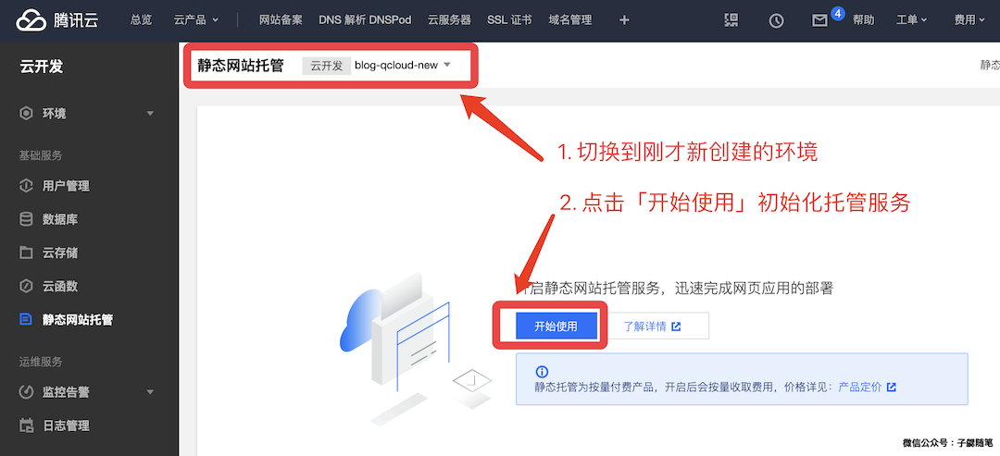

前几天腾讯云推出了静态网站托管服务，受邀体验一下将自己的博客迁移部署上去，顺便总结记录一下。迁移结束，做一个总结。文章重点介绍将自己的博客迁移部署上去，基本上不涉及Jekyll相关的内容。如果想了解怎么基于 Jekyll搭建博客，可以参考文章：[使用 Jekyll 搭建技术博客](https://blog.bihe0832.com/jekyll.html)

### 创建静态网站托管服务

1. 创建腾讯云云开发环境
	
	打开腾讯云「云开发 [https://console.cloud.tencent.com/tcb/env/index](https://console.cloud.tencent.com/tcb/env/index)」 服务的页面。如下图，点击新建环境，然后在弹框中输入你自定义的环境名称，选择付费模式，然后点击下方的「立即开通」。

	

	之后就进入了环境的初始化阶段，初始化比较久。一般需要 1 分钟左右，当初始化结束，点击对应的 tab 就进入了 环境总览界面，可以看到具体的资源等信息。

2. 初始化静态网站托管服务

	点击进入「静态网站托管 [https://console.cloud.tencent.com/tcb/hosting](https://console.cloud.tencent.com/tcb/hosting)」 服务的页面。如下图，选择之前创建的开发环境，然后点击「开始使用」初始化环境。静态网站服初始化一般需要约 3 分钟

	

### 将静态页面部署到托管服务

你阔以直接选择将构建好的静态页面上传到托管服务，但是考虑到博客的更新频率，还是选择使用官方提供的工具来上传。首先使用npm 下载并安装官方上传工具`cloudbase`

	➜  _posts git:(master) ✗ npm install -g @cloudbase/cli
	
	npm WARN deprecated request@2.88.2: request has been deprecated, see https://github.com/request/request/issues/3142
	/usr/local/bin/tcb -> /usr/local/lib/node_modules/@cloudbase/cli/bin/tcb.js
	/usr/local/bin/cloudbase -> /usr/local/lib/node_modules/@cloudbase/cli/bin/cloudbase.js
	npm WARN ws@7.2.3 requires a peer of bufferutil@^4.0.1 but none is installed. You must install peer dependencies yourself.
	npm WARN ws@7.2.3 requires a peer of utf-8-validate@^5.0.2 but none is installed. You must install peer dependencies yourself.
	
	+ @cloudbase/cli@0.6.6
	added 383 packages from 325 contributors in 26.045s
	
然后使用`cloudbase`命令获取CLI授权，输入命令，然后再弹出的页面中点击「确认授权」
	
	➜  blog git:(master) ✗ tcb login
	✔ 已打开云开发 CLI 授权页面，请在云开发 CLI 授权页面同意授权
	✖ 未知错误：请求超时，请检查你的网络，如果终端无法直接访问公网，请设置终端 HTTP 请求代理！
	请检查你的网络，尝试重新运行 cloudbase login 命令！
	
如果遇到上面的错误，一般是因为网络限制，需要添加 http 代理，可以参照文章 「iMac（OS X）日常开发中各种代理设置方法汇总（shell、Android Studio、gem、npm） [https://blog.bihe0832.com/proxy.html](https://blog.bihe0832.com/proxy.html)」设置 shell 代理即可。设置代理后重试：
	
	➜  _posts git:(master) ✗ tcb login
	✔ 已打开云开发 CLI 授权页面，请在云开发 CLI 授权页面同意授权
	✔ 登录成功！
	? 是否同意 Cloudbase CLI 收集您的使用数据以改进产品？ Yes
	可使用下面命令继续操作：
	
	– 创建免费环境
	
	  $ cloudbase env:create envName
	
	– 初始化云开发项目
	
	  $ cloudbase init
	
	– 部署云函数
	
	  $ cloudbase functions:deploy
	
	– 查看命令使用介绍
	
	  $ cloudbase -h
	
	Tips：可以使用简写命令 tcb 代替 cloudbase
	
使用 hosting 命令 将本地已经编译的静态文件部署到托管服务（例如部署我的博客的 `_site` ），命令行中-e 后面的环境ID就是首页生成的环境ID，一般腾讯云会在我们的自定义名称后面加一个后缀。由于博客的内容比较大、加上网络代理，发现有时候会失败，重试即可。
	
	➜  blog git:(master) ✗ jekyll build
	Configuration file: /Volumes/Document/Documents/github/blog/_config.yml
	            Source: /Volumes/Document/Documents/github/blog
	       Destination: /Volumes/Document/Documents/github/blog/_site
	 Incremental build: disabled. Enable with --incremental
	      Generating...
	                    done in 4.504 seconds.
	 Auto-regeneration: disabled. Use --watch to enable.
	➜  _site git:(master) ✗ cd ..
	➜  blog git:(master) ✗ cd _site
	➜  _site git:(master) ✗ tcb hosting:deploy ./ -e blog-qcloud-new-131e7b
	FetchError: request to https://tcb-admin.tencentcloudapi.com/admin failed, reason: connect ECONNRESET 127.0.0.1:12639
	    at ClientRequest.<anonymous> (/usr/local/lib/node_modules/@cloudbase/cli/node_modules/node-fetch/lib/index.js:1455:11)
	    at ClientRequest.emit (events.js:205:15)
	    at ClientRequest.EventEmitter.emit (domain.js:471:20)
	    at onerror (/usr/local/lib/node_modules/@cloudbase/cli/node_modules/agent-base/index.js:101:9)
	    at callbackError (/usr/local/lib/node_modules/@cloudbase/cli/node_modules/agent-base/index.js:123:5)
	    at processTicksAndRejections (internal/process/task_queues.js:89:5)
	✖ request to https://tcb-admin.tencentcloudapi.com/admin failed, reason: connect ECONNRESET 127.0.0.1:12639
	➜  _site git:(master) ✗ tcb hosting:deploy ./ -e blog-qcloud-new-131e7b
	文件传输中 [==================================================] 100% 0.0s
	✔ 文件共计 842 个
	✔ 文件上传成功 842 个
	✖ 文件上传失败 0 个

### 管理静态页面及修改设置

上传结束以后，在静态页面托管的「文件管理」页面可以对我们上传的内容进行调整，在「设置」页面可以添加域名、错误页面等信息，同时也给出了腾讯云提供的默认域名。如果你有自己的域名，你也可以添加自己的域名解析，例如下面我修改为使用我自己的域名，并设置了自定义的索引页和404页面：
	

### 访问静态页面

在浏览器输入讯云提供的默认域名 [https://blog-qcloud-new-131e7b.tcloudbaseapp.com/index.html](https://blog-qcloud-new-131e7b.tcloudbaseapp.com/index.html)， 或者使用自己的域名[http://qcloud.bihe0832.com/index.html](http://qcloud.bihe0832.com/index.html) 均可打开部署好的静态服务，由于默认资源免费的，腾讯云对下载速度做了限速，因此打开速度会很慢。

**特别说明：**由于默认资源腾讯云对下载速度做了限速，所以我对于我的站点做了特殊配置：

- 默认打开 [http://qcloud.bihe0832.com/jump.html](http://qcloud.bihe0832.com/jump.html)时 还是跳转到我的博客域名及服务器 [http://blog.bihe0832.com](http://blog.bihe0832.com)

- 完整路径打开 [http://qcloud.bihe0832.com/index.html](http://qcloud.bihe0832.com/index.html) 时使用腾讯云托管的服务
