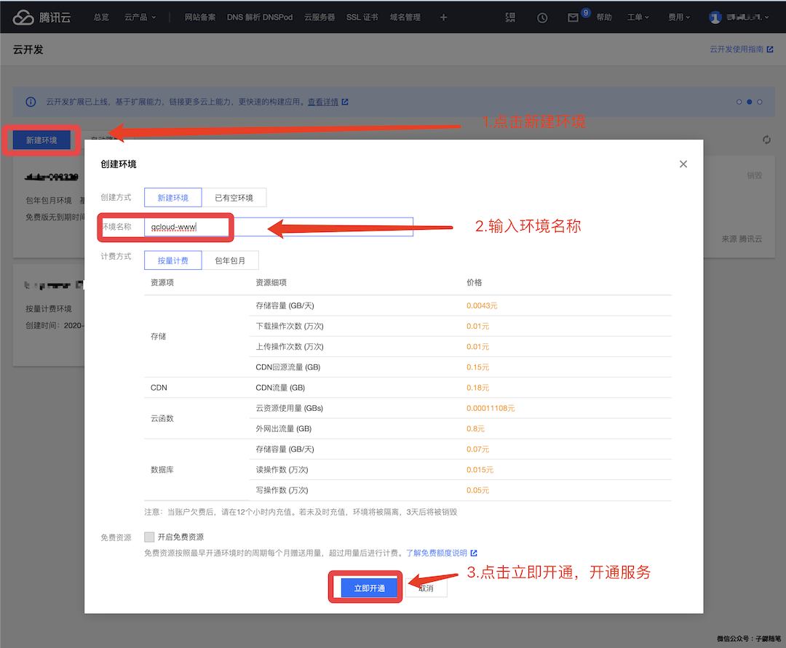
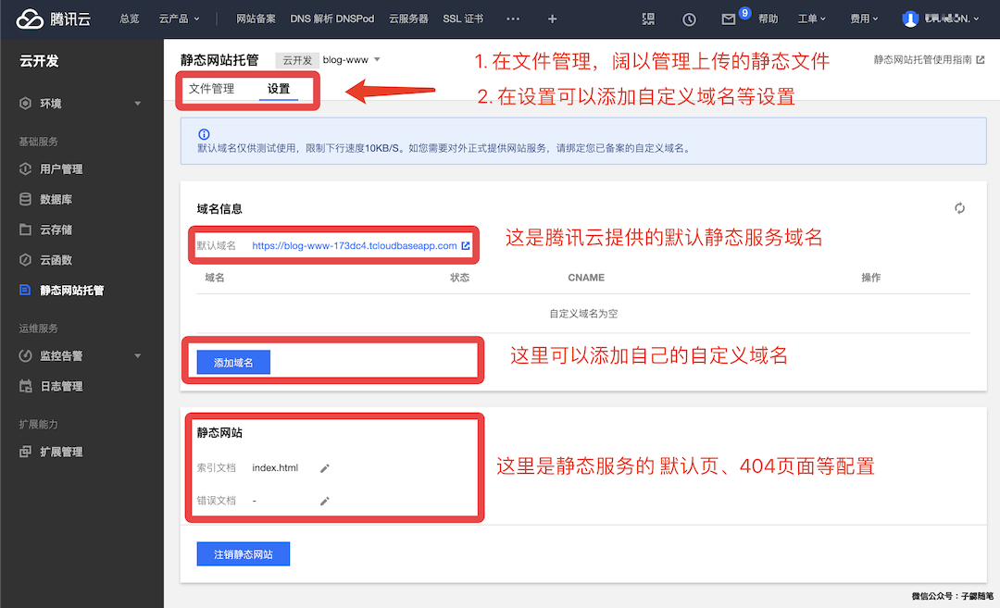

前几天利用博客尝试了下腾讯云新出的静态网站托管，写了一个总结，收到反馈问问能不能再写一个Octopress的，结果今天就又收到域名备案站的提醒，要完善和整改一些信息，那就干脆尝试用 Octopress 从零搭建一个简单站点。

## 使用 Octopress 搭建静态站点

#### Octopress 介绍

Octopress is a blogging framework for hackers。

- 官方网站： [http://octopress.org/](http://octopress.org/)

#### iMac搭建 Octopress 本地环境

参考官网的指引 [http://octopress.org/docs/setup/](http://octopress.org/docs/setup/) 搭建 Octopress 本地环境 

	➜  github  git clone git://github.com/imathis/octopress.git www.bihe0832.com
		Cloning into 'www.bihe0832.com'...
		^C
	➜  github
	➜  github  git clone https://github.com/imathis/octopress.git www.bihe0832.com
		Cloning into 'www.bihe0832.com'...
		remote: Enumerating objects: 1, done.
		remote: Counting objects: 100% (1/1), done.
		remote: Total 10801 (delta 0), reused 0 (delta 0), pack-reused 10800
		Receiving objects: 100% (10801/10801), 2.63 MiB | 1.08 MiB/s, done.
		Resolving deltas: 100% (5578/5578), done.
	➜  github  cd www.bihe0832.com
	➜  www.bihe0832.com git:(master) gem install bundler
		Fetching bundler-2.1.4.gem
		bundler's executable "bundle" conflicts with /usr/local/lib/ruby/gems/2.6.0/bin/bundle
		Overwrite the executable? [yN]  y
		bundler's executable "bundler" conflicts with /usr/local/lib/ruby/gems/2.6.0/bin/bundler
		Overwrite the executable? [yN]  y
		Successfully installed bundler-2.1.4
		Parsing documentation for bundler-2.1.4
		Installing ri documentation for bundler-2.1.4
		Done installing documentation for bundler after 2 seconds
		1 gem installed
	➜  www.bihe0832.com git:(master) rbenv rehash
		zsh: command not found: rbenv
	➜  www.bihe0832.com git:(master) brew install rbenv
		Updating Homebrew...
		==> Auto-updated Homebrew!
		Updated 1 tap (homebrew/core).
		==> Updated Formulae
		stellar-core

		...........
		
		==> ruby-build
		ruby-build installs a non-Homebrew OpenSSL for each Ruby version installed and these are never upgraded.
		
	➜  www.bihe0832.com git:(master) rbenv rehash	➜  www.bihe0832.com git:(master) bundle install
		Fetching gem metadata from https://rubygems.org/...........
		Fetching gem metadata from https://rubygems.org/.
		Resolving dependencies...
		
		...........

		Bundle complete! 13 Gemfile dependencies, 52 gems now installed.
		Use `bundle info [gemname]` to see where a bundled gem is installed.
		
	➜  www.bihe0832.com git:(master) bundle exec
		bundler: exec needs a command to run
	➜  www.bihe0832.com git:(master) bundle exec rake install
		## Copying classic theme into ./source and ./sass
		mkdir -p source
		cp -r .themes/classic/source/. source
		mkdir -p sass
		cp -r .themes/classic/sass/. sass
		mkdir -p source/_posts
		mkdir -p public
	➜  www.bihe0832.com git:(master) ✗
	
至此我们就完成了 Octopress 环境的搭建，和站点的初始化，下一步就是修改配置，添加内容

#### 创建静态站点、修改配置、添加内容

这部分内容可以参考官网提供的「Configuring Octopress [http://octopress.org/docs/configuring/](http://octopress.org/docs/configuring/)」来根据配置自定义你的站点风格。我重点修改了 `_config.yml` 添加一些自定义配置。

在搭建好静态站点以后，就可以在`source/_posts`添加你的文章了，我选择了直接迁移过来两篇自己的文章。

#### 编译构建

在项目根目录直接命令行运行 `rake generate ` 即可查看构建结果

	➜  www.bihe0832.com git:(master) ✗ rake generate
		rake aborted!
		Gem::LoadError: You have already activated rake 12.3.2, but your Gemfile requires rake 10.5.0. Prepending `bundle exec` to your command may solve this.
		/usr/local/lib/ruby/gems/2.6.0/gems/bundler-2.1.4/lib/bundler/runtime.rb:312:in `check_for_activated_spec!'
		/usr/local/lib/ruby/gems/2.6.0/gems/bundler-2.1.4/lib/bundler/runtime.rb:31:in `block in setup'
		/usr/local/lib/ruby/gems/2.6.0/gems/bundler-2.1.4/lib/bundler/spec_set.rb:147:in `each'
		/usr/local/lib/ruby/gems/2.6.0/gems/bundler-2.1.4/lib/bundler/spec_set.rb:147:in `each'
		/usr/local/lib/ruby/gems/2.6.0/gems/bundler-2.1.4/lib/bundler/runtime.rb:26:in `map'
		/usr/local/lib/ruby/gems/2.6.0/gems/bundler-2.1.4/lib/bundler/runtime.rb:26:in `setup'
		/usr/local/lib/ruby/gems/2.6.0/gems/bundler-2.1.4/lib/bundler.rb:149:in `setup'
		/usr/local/lib/ruby/gems/2.6.0/gems/bundler-2.1.4/lib/bundler/setup.rb:10:in `block in <top (required)>'
		/usr/local/lib/ruby/gems/2.6.0/gems/bundler-2.1.4/lib/bundler/ui/shell.rb:136:in `with_level'
		/usr/local/lib/ruby/gems/2.6.0/gems/bundler-2.1.4/lib/bundler/ui/shell.rb:88:in `silence'
		/usr/local/lib/ruby/gems/2.6.0/gems/bundler-2.1.4/lib/bundler/setup.rb:10:in `<top (required)>'
		/github/www.bihe0832.com/Rakefile:2:in `<top (required)>'
		(See full trace by running task with --trace)
	➜  www.bihe0832.com git:(master) ✗ bundle exec rake generate
		## Generating Site with Jekyll
		write source/stylesheets/screen.css
		Configuration file: /github/www.bihe0832.com/_config.yml
		            Source: source
		       Destination: public
		      Generating...
		                    done.
		 Auto-regeneration: disabled. Use --watch to enable.
		 
如果构建没有报错，你就可以选择将构建结果 `public` 部署到你的服务器。如果想在本地查看效果，在项目根目录直接命令行运行 ` rake preview ` 即可

	➜  www.bihe0832.com git:(master) ✗ bundle exec rake preview
		Starting to watch source with Jekyll and Compass. Starting Rack on port 4000
		[2020-04-13 16:30:18] INFO  WEBrick 1.4.2
		[2020-04-13 16:30:18] INFO  ruby 2.6.2 (2019-03-13) [x86_64-darwin18]
		[2020-04-13 16:30:18] INFO  WEBrick::HTTPServer#start: pid=75677 port=4000
		>>> Compass is watching for changes. Press Ctrl-C to Stop.
		Configuration file: /github/www.bihe0832.com/_config.yml
		            Source: source
		       Destination: public
		      Generating...
		                    done.
		 Auto-regeneration: enabled for 'source'
		    write public/stylesheets/screen.css
		::1 - - [13/Apr/2020:16:30:22 +0800] "GET / HTTP/1.1" 200 16703 0.0151

然后在浏览器打开 [http://localhost:4000/](http://localhost:4000/) 即可查看效果

## 将静态站点使用腾讯云静态网站托管

#### 创建静态网站托管服务

1. 创建腾讯云云开发环境
	
	打开腾讯云「云开发 [https://console.cloud.tencent.com/tcb/env/index](https://console.cloud.tencent.com/tcb/env/index)」 服务的页面。如下图，点击新建环境，然后在弹框中输入你自定义的环境名称，选择付费模式，然后点击下方的「立即开通」。

	

	之后就进入了环境的初始化阶段，初始化比较久。一般需要 1 分钟左右，当初始化结束，点击对应的 tab 就进入了 环境总览界面，可以看到具体的资源等信息。

2. 初始化静态网站托管服务

	点击进入「静态网站托管 [https://console.cloud.tencent.com/tcb/hosting](https://console.cloud.tencent.com/tcb/hosting)」 服务的页面。如下图，选择之前创建的开发环境，然后点击「开始使用」初始化环境。静态网站服初始化一般需要约 3 分钟

	

#### 将静态页面部署到托管服务

你阔以直接选择将构建好的静态页面上传到托管服务，但是考虑到博客的更新频率，还是选择使用官方提供的工具来上传。首先使用npm 下载并安装官方上传工具`cloudbase`

	➜  _posts git:(master) ✗ npm install -g @cloudbase/cli
	
	npm WARN deprecated request@2.88.2: request has been deprecated, see https://github.com/request/request/issues/3142
	/usr/local/bin/tcb -> /usr/local/lib/node_modules/@cloudbase/cli/bin/tcb.js
	/usr/local/bin/cloudbase -> /usr/local/lib/node_modules/@cloudbase/cli/bin/cloudbase.js
	npm WARN ws@7.2.3 requires a peer of bufferutil@^4.0.1 but none is installed. You must install peer dependencies yourself.
	npm WARN ws@7.2.3 requires a peer of utf-8-validate@^5.0.2 but none is installed. You must install peer dependencies yourself.
	
	+ @cloudbase/cli@0.6.6
	added 383 packages from 325 contributors in 26.045s
	
然后使用`cloudbase`命令获取CLI授权，输入命令，然后再弹出的页面中点击「确认授权」
	
	➜  blog git:(master) ✗ tcb login
	✔ 已打开云开发 CLI 授权页面，请在云开发 CLI 授权页面同意授权
	✖ 未知错误：请求超时，请检查你的网络，如果终端无法直接访问公网，请设置终端 HTTP 请求代理！
	请检查你的网络，尝试重新运行 cloudbase login 命令！
	
如果遇到上面的错误，一般是因为网络限制，需要添加 http 代理，可以参照文章 「iMac（OS X）日常开发中各种代理设置方法汇总（shell、Android Studio、gem、npm） [https://blog.bihe0832.com/proxy.html](https://blog.bihe0832.com/proxy.html)」设置 shell 代理即可。设置代理后重试：
	
	➜  _posts git:(master) ✗ tcb login
	✔ 已打开云开发 CLI 授权页面，请在云开发 CLI 授权页面同意授权
	✔ 登录成功！
	? 是否同意 Cloudbase CLI 收集您的使用数据以改进产品？ Yes
	可使用下面命令继续操作：
	
	– 创建免费环境
	
	  $ cloudbase env:create envName
	
	– 初始化云开发项目
	
	  $ cloudbase init
	
	– 部署云函数
	
	  $ cloudbase functions:deploy
	
	– 查看命令使用介绍
	
	  $ cloudbase -h
	
	Tips：可以使用简写命令 tcb 代替 cloudbase
	
使用 hosting 命令 将本地已经编译的静态文件部署到托管服务（例如部署我的博客的 `public` ），命令行中-e 后面的环境ID就是首页生成的环境ID，一般腾讯云会在我们的自定义名称后面加一个后缀。由于博客的内容比较大、加上网络代理，发现有时候会失败，重试即可。
	
	➜  www.bihe0832.com git:(master) ✗ bundle exec rake generate
		## Generating Site with Jekyll
		    write source/stylesheets/screen.css
		Configuration file: /github/www.bihe0832.com/_config.yml
		            Source: source
		       Destination: public
		      Generating...
		                    done.
		 Auto-regeneration: disabled. Use --watch to enable.
	➜  www.bihe0832.com git:(master) ✗ tcb hosting:deploy ./public/ -e blog-www-173dc4
		FetchError: request to https://tcb-admin.tencentcloudapi.com/admin failed, reason: connect ECONNRESET 127.0.0.1:12639
		    at ClientRequest.<anonymous> (/usr/local/lib/node_modules/@cloudbase/cli/node_modules/node-fetch/lib/index.js:1455:11)
		    at ClientRequest.emit (events.js:205:15)
		    at ClientRequest.EventEmitter.emit (domain.js:471:20)
		    at onerror (/usr/local/lib/node_modules/@cloudbase/cli/node_modules/agent-base/index.js:101:9)
		    at callbackError (/usr/local/lib/node_modules/@cloudbase/cli/node_modules/agent-base/index.js:123:5)
		    at processTicksAndRejections (internal/process/task_queues.js:89:5)
		✖ request to https://tcb-admin.tencentcloudapi.com/admin failed, reason: connect ECONNRESET 127.0.0.1:12639
		➜  www.bihe0832.com git:(master) ✗ tcb hosting:deploy ./public/ -e blog-www-173dc4
		文件传输中 [==================================================] 100% 0.0s
		✔ 文件共计 65 个
		✔ 文件上传成功 65 个
		✖ 文件上传失败 0 个

如果调试通了，也阔以一个命令直接完成编译到部署：

	➜  www.bihe0832.com git:(master) ✗ bundle exec rake generate && tcb login && tcb hosting:deploy ./public/ -e blog-www-173dc4
		Configuration file: /github/www.bihe0832.com/_config.yml
		            Source: source
		       Destination: public
		      Generating...
		                    done.
		 Auto-regeneration: disabled. Use --watch to enable.
		✔ 您已登录，无需再次登录！
		文件传输中 [==================================================] 100% 0.0s
		✔ 文件共计 65 个
		✔ 文件上传成功 65 个
		✖ 文件上传失败 0 个

#### 管理静态页面及修改设置

上传结束以后，在静态页面托管的「文件管理」页面可以对我们上传的内容进行调整，在「设置」页面可以添加域名、错误页面等信息，同时也给出了腾讯云提供的默认域名。如果你有自己的域名，你也可以添加自己的域名解析，例如下面我修改为使用我自己的域名，并设置了自定义的索引页和404页面：
	

#### 访问静态页面

在浏览器输入讯云提供的默认域名 [https://blog-www-173dc4.tcloudbaseapp.com/](https://blog-www-173dc4.tcloudbaseapp.com/)即可打开部署好的静态服务，由于默认资源免费的，腾讯云对下载速度做了限速，因此打开速度会很慢。
