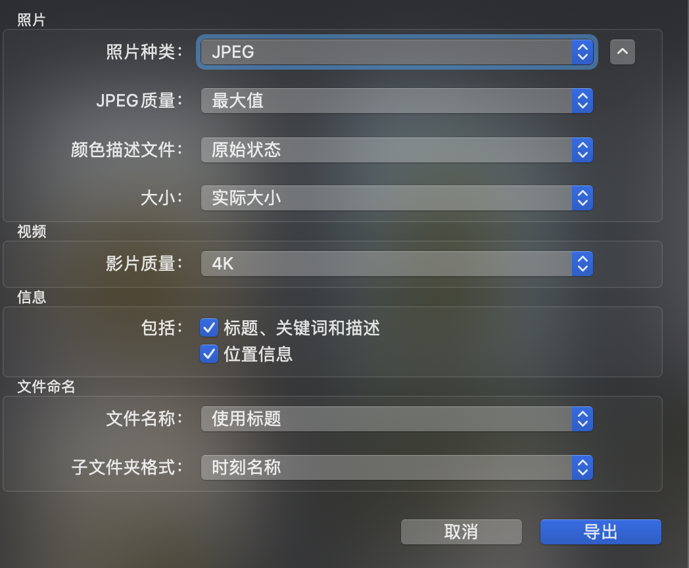

### 背景

之前在[照片整理系列之整理及归档的总体方案](https://blog.bihe0832.com/photos.html) 已经介绍了照片整理的总体方案，这篇文章主要记录自己单次整理照片的流程，方便后续定期整理时参考。由于现在历史照片都已经整理完成了，该步骤主要整理家里所有人手机近期拍的照片。

### 照片导出

- 将手机内照片使用iPhoto同步到电脑自定义相薄

- 使用 文件 -> 导出  将照片从相薄导出到文件，配置如下图：

	

- 复制一份已下载好的所有已备份照片到照片处理目录

### 整理

#### 一、准备工作目录

新建文件夹 1 2 3：

-  1 用于处理第一次归档的结果
-  2 用于处理第二次归档结果
-  3 用户处理中间文件

#### 二、整理第一个人的手机照片

按照照片数量从多到少整理，先整理照片最多的，可以为后续整理提供时间对照。

1. 先用 [基于命令行的照片整理及查看工具 \| 子勰的博客](https://blog.bihe0832.com/photomanage.html) 自动将第一个人的照片目录中的照片归档到文件夹1

2. 根据文件夹1 中照片的开始结束时间，在文件夹新建对应子文件夹

		➜  2  ls
		201111 201210 201802 201804 201806 201808 201810 201812 201902 201904 201906 201908 201910 201912
		201207 201801 201803 201805 201807 201809 201811 201901 201903 201905 201907 201909 201911
		➜  2  mkdir 202001
		➜  2  mkdir 202002
		➜  2  mkdir 202003
		➜  2  mkdir 202004
		➜  2  ls
		201111 201801 201804 201807 201810 201901 201904 201907 201910 202001 202004
		201207 201802 201805 201808 201811 201902 201905 201908 201911 202002
		201210 201803 201806 201809 201812 201903 201906 201909 201912 202003
		➜  2
		
3. 手动将文件夹1  中的照片按月份移动到文件夹3 

4. 然后使用自动归档归档到文件夹2下对应月份的目录

		➜  2  alias zixiemanagephoto
		zixiemanagephoto='java -jar ~/lib/managePhoto.jar --manage '
		➜  2  zixiemanagephoto ~/2/3  ~/2/2/202001
		******************************************************
		照片整理已经开始……
			如果照片较多，持续时间较长，请耐心等待。
			整理过程中您可以在目标目录实时查看整理效果
			
			……
			
		******************************************************
		照片整理结果如下：共计从: ~/2/3/ 整理了 21 张照片到 ~/2/2/202001/，其中：
		整理成功: 21 张，其中
		: 0 张照片为已经存在的照片
		: 21 张照片已经按时间重新命名
		整理失败: 0 张，其中
			: 0 张照片没有找到
			: 0 张照片解析时间错误放弃整理，需要手动整理
			: 0 张照片解析时间错误放弃整理，需要手动整理
		******************************************************

5. 重复上述工作，直到文件夹1 没有照片

6. 回到第一个人的照片目录中，手动逐个处理剩余的未被自动归档的照片，处理方法参照：[照片整理系列之整理及归档的总体方案](https://blog.bihe0832.com/photos.html) 中怎么获取并按照指定格式归档照片的方法手动整理。这一步是最耗时的。具体步骤包括：

	- 按照推算对于无法自动归档的照片，手动标记时间或者选择删除
	- 按月份整理完后，逐个月使用自动归档，将目录照片转移到文件夹3
	- 对于该月剩余无法归档的，手动迁移到文件夹3
	- 再次使用自动归档，将该月剩余可以归档的照片归档到文件夹3
	- 使用自动归档将文件夹3的照片归档到文件夹2中的对应月份文件夹，合并
	- 对于无法归档的，转移到文件夹2中的对应月份文件夹
	- 再次使用自动归档，将文件夹3的照片归档到文件夹2中的对应月份文件夹

7. 检查并自动优化命名不规范文件。

		/bin/bash ~/zixie/github/PhotoManager/shell/optimize.sh ./

	例如：

		➜  201802  /bin/bash ~/zixie/github/PhotoManager/shell/optimize.sh ~/3/
			~/3
			============ zixe check photos start ======================
			----------- process photo start -----------
			~/3/ start to check:
			process *.jpg
			mv: rename *.jpg to *.JPG: No such file or directory
			process *.png
			mv: rename *.png to *.PNG: No such file or directory
			----------- process photo end -----------
			----------- process photo start -----------
			~/3/201802/ start to check:
			process 2018-02-01_09-21-52.jpg
			process 2018-02-01_15-53-55.jpg
			process 2018-02-01_20-15-28.jpg
			process 2018-02-02_12-02-13.jpg
			process 2018-02-02_12-16-01.jpg
			process 2018-02-02_19-02-23.jpg
			process *.png
			mv: rename *.png to *.PNG: No such file or directory
			----------- process photo end -----------
			----------- delete DS_Store-----------
			----------- find bad name photo -----------
			~/3//201802/2018-02-03_13-05.JPG
			~/3//201802/2018-02-03-12-44-03.JPG
			============ zixe check photos finished ======================
			➜  201802  ls
			2018-02-01_09-21-52.JPG 2018-02-01_20-15-28.JPG 2018-02-02_19-02-23.JPG
			2018-02-01_15-50-00.JPG 2018-02-02_12-02-13.JPG 2018-02-03-12-44-03.JPG
			2018-02-01_15-53-55.JPG 2018-02-02_12-16-01.JPG 2018-02-03_13-05.JPG

#### 三、按照上面的步骤整理下一个人的手机照片

#### 四、二次归档和验证

所有人的手机照片整理结束以后，将文件夹2中的所有照片迁移到文件夹3，然按月份逐个自动归档到文件夹2，对于无法自动归档的照片，再结合照片全集修正一下时间后归档。

#### 五、 备份

将归档后的照片迁移到常用盘，再次用常用盘复制到备份盘