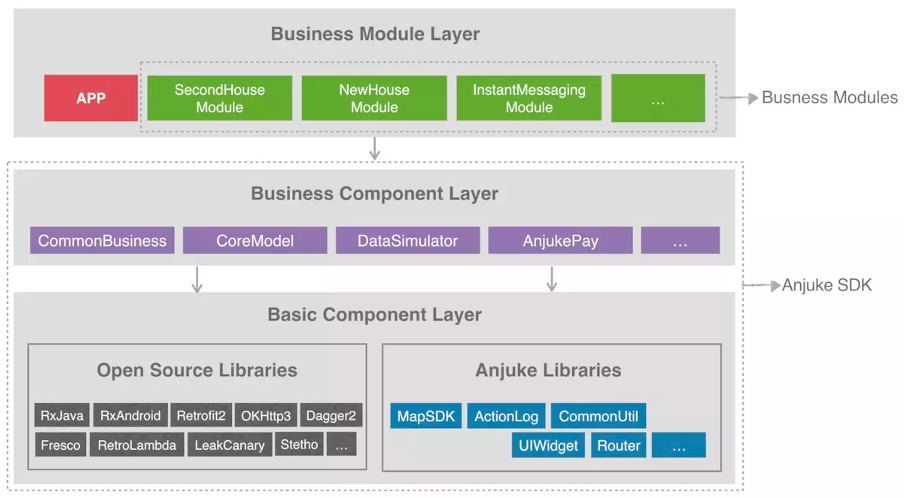

这篇文章主要总结和介绍开发框架的设计，也先写一些核心内容，详细内容后续逐渐完善。

## 背景

在终端项目的开发中，我们都绕不开几个问题：

- 应用内的业务关系非常复杂，但前期没有设计好框架

	很多业务甚至单个项目只有一个模块，然后各业务功能相互依赖和调用。一些核心业务动辄就是上万行的代码，关键是里面一半以上的代码是和自身逻辑没有直接关系的。
	
	当然UI也是如此，多个功能整合在一个界面里面，界面的数据、UI、操作等没有分离，有些首页一个UI文件基本上就包含了整个应用的大部分界面。然后因为再通过各种业务逻辑互相耦合的去控制UI表现。
	
	如果前期没有做好解耦，当随着业务增加，项目成员越来越多的时候，项目开发维护的成本会非常高。这样复杂的关系下无论是新功能开发还是老版本调整都会非常痛苦，甚至下线个已有的功能都非常复杂，引入一堆问题。

- 项目随着发展越来越大，开发效率越来越低
    
	当项目发展到一定阶段，逐渐庞大以后，由于需要编译的内容太多开发过程中编译、构建等都会耗费大量的开发时间。即使可以使用instant run等工具优化编译的时间，但都是治标不治本，开发的效率并不会很明显

- 代码复用

	虽然不同项目间可以复用的代码很多，但是平时开发中都习惯了只有一些完备的功能才使用或者找专门的类库。对于一些简单又常用的基础和公共逻辑，目前代码复用的方式还停留在代码文件或者代码片段的复用，而且可能每次都是用的时候随便网上找，搜索复制粘贴。甚至有些时候为了赶需求，项目中已经有一份了，但懒得找，再引入一份进来。
	
	这种代码复用的方式会带来的最大问题就是对于同一个逻辑怎么同步修改所有使用的地方。这种修改可能是你做的一些定制化的修改，也可能是本身的bug。由于是复制粘贴，所以你可能也不记得还有哪里用过。结果就是同一个问题反复遇到，反复修改。而且随着时间积累，这些代码的差异越来越大，开发维护的成本就会越来越高
	
## 新开发框架设计的方向

在终端开发的框架发展演进的过程中，也一直通过各种方法来优化解决上面的问题。

- 通过模块化来降低业务代码和基础框架以及业务逻辑之间的代码耦合

- 通过组件化将公共逻辑，基础功能抽离为组件，组件和业务分别独立维护，减小业务规模。

目前主流的开发框架一般都是三层（基础库、业务公共逻辑、业务模块），然后所有模块单向依赖，例如下图。

这种框架设计结构简单明了，而且单向依赖模块之间的耦合就可以大大减小，但是他存在一个缺点，随着业务的增长，模块越来越多，还是会越来越膨胀。

我们的框架设计和主流方案一致，设计几个核心原则就是分层、解耦、依赖隔离。通过将业务分层并拆分为组件来降低业务与基础能力和公共能力的耦合。为了后续的规划，目前对于功能模块拆分基本上按照下面的几个原则

- 模块拆分尽可能原子化，一个模块聚焦一个功能

- 同一功能对外接口暴露尽可能少

- 同一功能覆盖尽可能多的场景，且兼容性尽可能好

下面是对于框架的详细介绍

## 框架介绍

我们的框架设计共有四层。

基础组件层，主要是自己沉淀或者统一对比以后选择的第三方技术栈与业务无关，可通用。通过自动构建，它会被提交到私有Maven库里面，后续远程引入。

框架组件层主要是两个，Framework 和 Application ，他们负责通用资源、公共声明、页面路由以及对于底层第三方库的二次封装。Framework 也与业务无关，可通用，Application 与业务相关。这前期源码依赖，后期通过自动构建，提交到本地的依赖库，通过AAR引入。

业务组件层是公共但无法独立运行的业务逻辑，例如页面卡片、广告等。这部内容开发结束以后通过自动构建，提交到本地的依赖库，通过AAR引入。

应用组件这一层是所有可以独立运行的最小单元，而且他们基本只是一个Android Application的空壳，加一些配置文件，所有的业务逻辑都在业务组件层实现。这部内容基本都是直接源码开发。其中里面比较特别的是APPTest，他既是底层业务组件在开发中的临时入口，同时也是一些基础功能 和 所有 Pub的测试入口（在后面会详细介绍）。

四层之间严格遵守同级或向下依赖，同时整个框架通过自动构建完成中间产物的生成。

## 怎么解耦

上面介绍了总体的架构，在开发中，我们经常会发现，会因为业务需求的原因，两个原本相对独立的两个模块产生了耦合。这种耦合一般是两种：

- 页面通信

	页面通信，我们和第三方跳转等外部通信统一，均通过 router 实现解耦。使用路由还有一个好处就是可以方便的处理各种通用拦截，例如检查登录态，弹出广告，检查权限等

- 数据耦合

	对于数据耦合，我们通过使用 livedata 将业务的数据展现与数据操作分拆到不同的组件，然后已有的两个组件共通依赖数据组件来进一步解耦。没有什么是多分一层解决不了的，有就分两层

