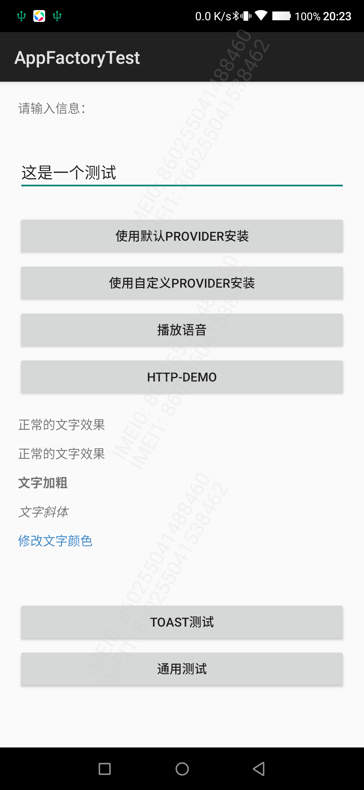

最近开发中UI上对文字有一些简单的特性需求，如果使用多个Textview 比较麻烦，而且是后台下发的字段，因此就直接用 HTML 了。为了方便数据构造的同学使用，写个简单的事例。

Android 原生 Textview 对于 HTML的 支持相对还比较多，考虑到兼容性和具体场景，这里只列出常用的部分。

- 代码：

		 var data =
	                "正常的文字效果 " +
	                "
正常的文字效果
" +
	                "
<b>文字加粗</b>
" +
	                "
<em>文字斜体</em>
" +
	                "
修改文字颜色
"
	        
	        testResult.text = Html.fromHtml(data)

- HTML效果：

	正常的文字效果 
	
正常的文字效果

	
<b>文字加粗</b>

	
<em>文字斜体</em>

	
修改文字颜色

- Android 效果：
	
	

	