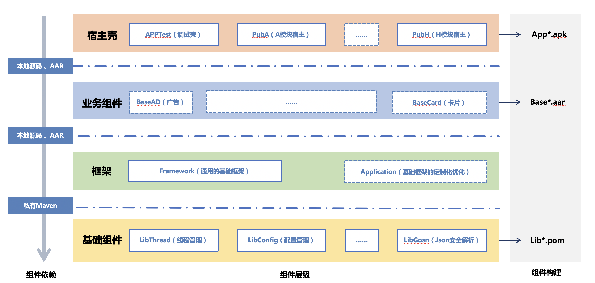

这篇文章主要总结和介绍开发框架的设计，也先写一些核心内容，详细内容后续逐渐完善。

## 框架设计的方向

在终端开发的框架发展演进的过程中，也一直通过各种方法来优化解决上面的问题。

- 通过模块化来降低业务代码和基础框架以及业务逻辑之间的代码耦合

- 通过组件化将公共逻辑，基础功能抽离为组件，组件和业务分别独立维护，减小业务规模。

目前主流的开发框架一般都是三层（基础库、业务公共逻辑、业务模块），然后所有模块单向依赖，例如下图。

这种框架设计结构简单明了，而且单向依赖模块之间的耦合就可以大大减小，但是他存在一个缺点，随着业务的增长，模块越来越多，还是会越来越膨胀。

我们的框架设计和主流方案一致，设计几个核心原则就是分层、解耦、依赖隔离。通过将业务分层并拆分为组件来降低业务与基础能力和公共能力的耦合。为了后续的规划，目前对于功能模块拆分基本上按照下面的几个原则

- 模块拆分尽可能原子化，一个模块聚焦一个功能

- 同一功能对外接口暴露尽可能少

- 同一功能覆盖尽可能多的场景，且兼容性尽可能好

下面是对于框架的详细介绍

## 框架介绍

我们的框架设计共有四层。

基础组件层，主要是自己沉淀或者统一对比以后选择的第三方技术栈与业务无关，可通用。通过自动构建，它会被提交到私有Maven库里面，后续远程引入。

框架组件层主要是两个，Framework 和 Application ，他们负责通用资源、公共声明、页面路由以及对于底层第三方库的二次封装。Framework 也与业务无关，可通用，Application 与业务相关。这前期源码依赖，后期通过自动构建，提交到本地的依赖库，通过AAR引入。

业务组件层是公共但无法独立运行的业务逻辑，例如页面卡片、广告等。这部内容开发结束以后通过自动构建，提交到本地的依赖库，通过AAR引入。

应用组件这一层是所有可以独立运行的最小单元，而且他们基本只是一个Android Application的空壳，加一些配置文件，所有的业务逻辑都在业务组件层实现。这部内容基本都是直接源码开发。其中里面比较特别的是APPTest，他既是底层业务组件在开发中的临时入口，同时也是一些基础功能 和 所有 Pub的测试入口（在后面会详细介绍）。

四层之间严格遵守同级或向下依赖，同时整个框架通过自动构建完成中间产物的生成。

## 组件解耦

上面介绍了总体的架构，在开发中，我们经常会发现，会因为业务需求的原因，两个原本相对独立的两个模块产生了耦合。这种耦合一般是两种：

- 页面通信

	页面通信，我们和第三方跳转等外部通信统一，均通过 router 实现解耦。使用路由还有一个好处就是可以方便的处理各种通用拦截，例如检查登录态，弹出广告，检查权限等

- 数据耦合

	对于数据耦合，我们通过使用 livedata 将业务的数据展现与数据操作分拆到不同的组件，然后已有的两个组件共通依赖数据组件来进一步解耦。没有什么是多分一层解决不了的，有就分两层

