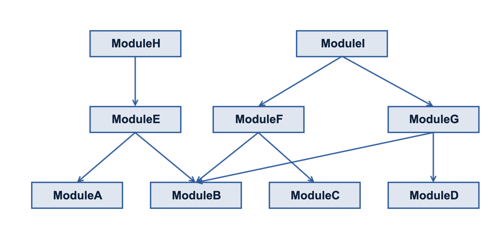

这篇文章主要总结组件化开发框架中，我们是怎么通过对项目的工程配置、编译、依赖管理等进行重构，来更方便的管理所有组件，提高日常的开发效率。

## 写在前面

当项目随着业务模块的增加组件数量变多以后，就会带来一个很现实的问题，平时开发中其实只涉及到个别组件，但是开发中却需要大部分组件整体参与编译，浪费了不少时间，大大影响了开发效率。对于这个问题解决很容易，做好组件化以后，把一些稳定维护的组件调整为二进制依赖（maven或者aar）即可。但是这一步却带来一个更复杂的问题：**由于组件过多、工程越来越大，导致组件依赖复杂，维护成本越来越高**。

下图列出来大部分项目都会遇到的常用的依赖关系（后面的内容都会基于这个依赖关系图来介绍。）



在基于上面的依赖关系下，我们设想一个场景：当前参与开发源码依赖的模块有ModuleH、ModuleE、ModuleB；此时

- 如果修改ModuleH、ModuleE，是没有任何问题的。
	
- 如果修改ModuleB，ModuleH、ModuleE会立即生效，但是ModuleF、ModuleG、ModuleI对应的ModuleB还是老版本，就出现了版本不一致

尤其是当一个模块被依赖越来越多，这个问题就会越复杂。

## 组件管理方案概述

在前期我们曾经基于Android Studio 提供的构建模式 ➕ 手动维护来管理依赖，后来当组件数量发展到几十个以后，这种方式已经不能很好的满足项目的开发和维护。

为了方便组件依赖的管理，我们对整个组件化项目的工程配置、编译、依赖管理等进行了整体重构。包括**模块怎么导入、依赖关系怎么添加、修改以后怎么更新组件**。由于Android 原有的构建方式解决这几个问题比较复杂，因此我们基于Gradle对于这部分做了比较大的改动。重构以后：

- **所有组件依赖关系集中管理，组件只需要关注其直接依赖**

- **平时开发过程中不需要不停调整模块的导入、依赖关系。只需要修改依赖管理的配置文件，会自动完成导入和依赖关系更新。**

- **开发结束以后，根据提示运行对应的命令，即可完成所有相关依赖组件的更新。**

重构构建方式以后，提供三种开发方式开发，每种开发方式的要求不同。

- 对于 **`基于全量开发` 模式，没有前置条件**

- 对于 **`基于最小依赖` 和 `基于最全依赖` 开发，在首次运行时需要先完成预处理操作，然后再按照对应的开发方式开发：**

## 组件管理方案实现

首先，我们把所有组件的版本、依赖管理都集中统一，然后所有的构建相关的配置都通过Gradle自动生成。下面是我们新的构建相关的配置：

```
ext {
    zixieMainProject = ext.mainProject
    zixieDevelopModule = ext.developModule
    zixieRepoName = "android"
    zixieUserOrg = 'bihe0832'
    zixieGroupId = "com.bihe0832.android"
    zixieLicences = ""
    zixieVersionCode = Integer.parseInt(['sh', '-c', 'git rev-list --all --count'].execute().text.trim())
    zixieVersionName = ext.moduleVersionName
    zixieModuleInfo = ext.moduleInfo
    zixieModules = new ArrayList<>()
    zixieIsDebug = false
    zixieIncludeALL = ext.includeALLDependOnDevelopModule
    zixieIncludeList = new ArrayList()
    zixieDepenciesList = new HashMap<String, ArrayList>()
    zixieUpdateRealDependencies = this.&updateRealDependencies
    zixiePublishCommand = this.&getPublishCommand
    zixieAutoDependencies = this.&addDependencies
    zixieLocalDependencies = this.&addLocalDependencies
    zixieCheckModuleIsDev = this.&checkModuleIsDev
}
```

这里有几个定义比较重要：

- zixieMainProject (ext.mainProject)

	当前开发中，最终运行的主工程，也就是最终运行的那个Module

- zixieDevelopModule  (ext.developModule)

	当前开发的模块，可以配置多个，构建脚本会根据`mainProject` 和 `developModule` 的配置，自动 include 相关联的模块，如果 `mainProject` 依赖的模块不在 `developModule`，就会尝试使用本地的二进制文件
 
- zixieIncludeALL (ext.includeALLDependOnDevelopModule)

	是否将所有依赖了 `developModule` 的模块都加载进来，如果为false，会只加载与 `mainProject`相关的，如果为 true 则会把所有依赖他的模块全加载

这是具体项目的构建配置：

```
apply from: rootDir.toString() + '/config.gradle'
def project = ext
/************************************ 组件化开发常用配置 ************************************/
/**
 * 当前开发中，最终运行的主工程，多个用 "," 分隔
 */
ext.mainProject = "APPTest"
/**
 * 当前开发中，涉及到修改的工程（仅填写直接修改的即可，依赖他的会自动添加），多个用 "," 分隔。
 */
ext.developModule = "LibWrapper"
/**
 * 是否将所有依赖了 developModule 的模块都加载进来。
 *  true 全都加载，
 *  false 仅加载与 mainProject 相关的模块
 */
ext.includeALLDependOnDevelopModule = false
/**
 * 应用组件 （各个外发APP的发布模块）是否以application模式运行，当需要独立运行应用组件时修改，默认为false
 * true 表示以 application 模式运行
 * false 表示以 Android Library 模式运行
 */
ext.pubModuleIsApplication = false
/**
 * 组件所有模块的最新版本，下次发布时使用
 */
ext.moduleVersionName = "2.0.18"
/************************************ 组件化开发常用配置 ************************************/

ext.moduleInfo = [

        "APPTest"                   : [
                "version"         : "",
                "artifactId"      : "",
                "apidependenciesList": [
                        "LibWrapper"
                ],
                "specialdependenciesList": [
                        "kapt": [
                                "com.bihe0832.android:lib-router-compiler:2.0.15"
                        ]
                ]
        ],

		……
        
        "LibWrapper"                : [
                "version"         : "2.0.18",
                "artifactId"      : "lib-wrapper",
                "apidependenciesList": ["LibUtils", "LibUIUtils"]
        ]
]

```

接下来我们将基于这个配置文件来介绍怎么解决前面的几个问题。

### 组件导入

#### 重构前后对比

- 重构以前的 settings.gradle

	```
	include ':APPTest'
	//include ':APPTest'
	//include ':LibTTS'
	include ':LibTimer'
	
	//include ':LibEncrypt'
	//include ':LibFile'
	//include ':LibGson'
	//include ':LibThread'
	
	```
- 重构后的 settings.gradle（部分）

	```
	
	zixieMainProject.split(",").each { projectName ->
	    addInclude(projectName)
	}
	
	zixieDevelopModule.split(",").each { projectName ->
	    addInclude(projectName)
	}
	
	if (zixieIncludeALL) {
	    zixieDepenciesList.each { projectName, subModuleList ->
	        autoAddInclude(projectName)
	    }
	} else {
	    zixieMainProject.split(",").each { projectName ->
	        zixieDepenciesList[projectName].each { dependenciesModule ->
	            autoAddInclude(dependenciesModule)
	        }
	    }
	}
	
	System.err.println("\n\n========================================\n\n")
	System.err.println("当前工程导入组件如下：\n\n\t" + zixieIncludeList)
	System.err.println("\n\n========================================\n\n")
	
	def addInclude(projectName) {
	    if (null == projectName || projectName.trim().length() == 0) {
	        if (zixieIsDebug) System.out.println("Add Include: " + projectName + " is bad !")
	    } else if (zixieIncludeList.contains(projectName)) {
	        if (zixieIsDebug) System.out.println("Add Include: " + projectName + " has bad !")
	    } else{
	        String finalProjectName = ':' + projectName
	        System.out.println("include " + finalProjectName)
	        zixieIncludeList.add(projectName)
	        include finalProjectName
	    }
	}
	
	def autoAddInclude(dependenciesModule) {
	    if (zixieIsDebug) println("autoAddInclude Depenciese of dependenciesModule " + dependenciesModule + " " + zixieCheckModuleIsDev(dependenciesModule))
	    if(zixieCheckModuleIsDev(dependenciesModule)){
	        addInclude(dependenciesModule)
	    }
	}
	```

#### 主要改进点

1. 不在手工维护需要引入的模块，你只需要设置 mainProject 和 developModule，gradle会自动根据依赖关系，导入合适的依赖关系

2. 为了方便开发，同时提供了最小构建和最全构建模式，以前面的依赖关系举例，假如你在开发ModuleH，同时要修改ModuleB，此时如果

	- 选择最小依赖，导入的将是：ModuleB、ModuleE、ModuleH
	
	- 选择最全依赖，导入的将是：ModuleB、ModuleE、ModuleF、ModuleG、ModuleH、ModuleI
	
### 组件依赖

#### 重构前后对比

- 重构以前的根 build.gradle
	
	```
	subprojects {
	    afterEvaluate { Project project ->
	        project.getTasks().getByName('clean').doFirst {
	            delete "build"
	            delete ".externalNativeBuild"
	        }
	        project.getTasks().getByName('clean').dependsOn("checkGradleDependencies")
	        project.getTasks().getByName('preBuild').dependsOn("checkGradleDependencies")
	    }
	}
	```
	
- 重构以后的根 build.gradle

	```
	subprojects {
	    afterEvaluate { Project subproject ->
	        if (zixieIsDebug) println("subprojects afterEvaluate : " + subproject.name)
	
	        zixieAutoDependencies(subproject.name)
	        zixieLocalDependencies(subproject.name, subproject.getProjectDir().absolutePath + "/libs")
	        
	        subproject.getTasks().getByName('clean').doFirst {
	            delete "build"
	            delete ".externalNativeBuild"
	        }
	
	        subproject.getTasks().create("copyAAR", Copy.class, {
	            from 'build/outputs/aar/' + module.name + '-release.aar'
	            into "./../libs/"
	        })
	        subproject.getTasks().getByName('copyAAR').dependsOn("assembleRelease")
	    }
	}
	
	```

- 重构以前的组件 build.gradle

	```
	dependencies {
	    api 'com.bihe0832.android:lib-router:1.2.4'
	    api 'com.bihe0832.android:lib-router-annotation:1.2.1'
	    api 'com.bihe0832.android:lib-android:1.0.1'
	
	    api 'com.bihe0832.android:lib-thread:1.2.0'
	    api 'com.bihe0832.android:lib-channel:1.2.1'
	    api "com.bihe0832.android:lib-timer:1.2.6"
	    api "com.bihe0832.android:lib-timer:1.2.7"
	    api 'com.bihe0832.android:lib-request:1.0.2'
	    api 'com.bihe0832.android:lib-sqlite:1.0.0'
	    api 'com.bihe0832.android:lib-device-network:1.0.4'
	    api 'com.bihe0832.android:lib-device-network:1.0.6'
	
	    api 'com.bihe0832.android:lib-download-install:1.2.12'
	    api 'com.bihe0832.android:lib-http-advanced:1.3.1'
	    api 'com.bihe0832.android:lib-tts:1.3.9'
	    api 'com.bihe0832.android:lib-download-install:1.2.13'
	    api 'com.bihe0832.android:lib-http-advanced:1.3.2'
	    api 'com.bihe0832.android:lib-tts:1.3.10'
	}
	```


- 重构以后的组件 build.gradle 再无dependencies

#### 主要改进点

1. 不再手工维护或者切换组件依赖关系及方式，你只需要设置 mainProject 和 developModule，gradle会自动根据mainProject 和 developModule的设置以及组件的依赖关系，添加合适的依赖关系

2. 所有组件的依赖集中管理，更方便对组件以及第三方依赖的版本进行管理

### 其他依赖相关的问题

在重构以后，组件的依赖主要通过 zixieAutoDependencies 来完成，平时开发中组件依赖相关的，还会有下面的几个问题：

1. 除了远程依赖和自己开发的组件，我们开发中可能还会用到一些**第三方组件**，这些怎么管理

2. 怎么做到开发中**不将依赖的二进制文件打入组件的AAR**，但是在最终运行时打入APK（这样优化可以在一定程度优化构件速度）

对于上面的问题，看完 zixieAutoDependencies 的 具体实现，就都明白了：

```
//添加依赖
def addDependencies(String projectName) {
	
    HashMap<String, ArrayList> dependencies = new HashMap<>()
    addLocalDependencies(projectName, rootDir.toString() + '/libs')
    autoDependencies(projectName, projectName, dependencies)
    if (zixieIsDebug) println("======== addDependencies " + projectName + " ========")
}
	
def addLocalDependencies(String projectName, String path) {
    if (zixieIsDebug) println("======== addDependencies " + projectName + " ========")
    if (zixieIsDebug) println("addLocalDependencies fileTree ： " + path)
    HashMap<String, ArrayList> dependencies = new HashMap<>()
    fileTree(dir: path, include: '*.aar').each { File file ->
        if (zixieIsDebug) println("fileTree dependencies： " + file + "")
        addDependenciesOnce(projectName, file.name, "", dependencies)
    }
	
    fileTree(dir: path, include: '*.jar').each { File file ->
        if (zixieIsDebug) println("fileTree dependencies： " + file + "")
        addDependenciesOnce(projectName, path + '/' + file.name, "", dependencies)
    }
}
	
//根据依赖添加依赖
def autoDependencies(String projectName, String moduleName, HashMap<String, ArrayList> dependencies) {
    if (zixieIsDebug) println("======== autoDependencies " + projectName + " ========")
    if (zixieIsDebug) println("check " + projectName + " depenciese:" + moduleName)
	
    if (zixieModuleInfo[moduleName] != null) {
        zixieModuleInfo[moduleName].get("apidependenciesList").each { item ->
            if (zixieIsDebug) println(projectName + " addDependenciesOnce:" + item)
            addDependenciesOnce(projectName, item, "", dependencies)
            autoDependencies(projectName, item, dependencies)
        }
	
        zixieModuleInfo[moduleName].get("specialdependenciesList").each { item, data ->
            if (zixieIsDebug) println(projectName + " specialdependenciesList from " + item + " list :" + data)
            if (null != data) {
                data.each { listItem ->
                    if (zixieIsDebug) println(projectName + " " + item + " :" + listItem)
                    project(':' + projectName).dependencies.add(item, listItem)
                    addDependenciesOnce(projectName, listItem, item, dependencies)
                }
            }
	
        }
    }
    if (zixieIsDebug) println("======== autoDependencies " + projectName + " ========")
}
	
def addDependenciesOnce(String projectName, String moduleName, String sourceType, HashMap<String, ArrayList> dependencies) {
    if (null == moduleName || moduleName.trim().length() == 0) {
        return
    }
    if (null == dependencies.get(projectName)) {
        dependencies.put(projectName, new ArrayList())
    }
    if (dependencies.get(projectName).contains(moduleName)) {
        if (zixieIsDebug) println("addDependenciesOnce :  " + projectName + " has dependencies " + moduleName)
        return
    }
    dependencies.get(projectName).add(moduleName)
	
    String finalType = sourceType
    if (null == finalType || finalType.length() < 1) {
        if (isDebugModule(moduleName)) {
            finalType = "debugApi"
        } else {
            if (isApplicationModule(projectName)) {
                finalType = "api"
            } else {
                if (moduleName.endsWith(".jar") || moduleName.endsWith(".aar")) {
                    finalType = "compileOnly"
                } else {
                    finalType = "implementation"
                }
            }
        }
    }
	
    if (zixieIsDebug) println("addDependenciesOnce :  " + projectName + " " + finalType + " " + moduleName)
    if (moduleName.endsWith(".jar")) {
        project(':' + projectName).dependencies.add(finalType, files(moduleName))
    } else if (moduleName.endsWith(".aar")) {
        def name = moduleName.lastIndexOf('.').with {
            it != -1 ? moduleName[0..<it] : moduleName
        }
        project(':' + projectName).dependencies.add(finalType, [name: name, ext: 'aar'])
    } else if (moduleName.contains(":")) {
        project(':' + projectName).dependencies.add(finalType, moduleName)
    } else if (checkModuleIsDev(moduleName)) {
        if (zixieIsDebug) println("addDependenciesOnce :  " + projectName + " " + finalType + " " + moduleName + " project")
        project(':' + projectName).dependencies.add(finalType, project(':' + moduleName + ''))
    } else {
        if (moduleName.contains(":")) {
            project(':' + projectName).dependencies.add(finalType, moduleName)
        } else {
            if (zixieIsDebug) println("addDependenciesOnce :  " + projectName + " " + finalType + " " + moduleName + " release aar")
            //project(':' + projectName).dependencies.add(finalType, [name: moduleName + "-release", ext: 'aar'])
            if (null != zixieModuleInfo[moduleName]) {
                project(':' + projectName).dependencies.add(finalType, zixieGroupId + ":" + zixieModuleInfo[moduleName].get("artifactId") + ":" + zixieModuleInfo[moduleName].get("version"))
            }
        }
    }
}
```

### 组件升级

相比组件的导入和依赖管理，组件升级是所有流程中最复杂的。以前因为不可能很清楚的记得组件之间的依赖关系，经常出现更新遗漏的问题。为了解决相同组件不同版本的问题，当时做过不少尝试：

- 手动维护版本，同时专门开发了一个检查Gradle依赖配置是否冲突的插件：[https://blog.bihe0832.com/gradle-dependencies-check.html](https://blog.bihe0832.com/gradle-dependencies-check.html)，如果冲突了就逐个统一

- 所有的组件使用相同的版本号，只要有一个修改了，就把所有的组件都升级更新一次。

上面的方法不是治标不治本，就是用相对暴力的方法规避问题，并没有根本解决问题。其实解决问题的方法很明确，就是当一个组件升级版本以后，将所有依赖他的组件都同步升级即可。之前组件依赖各自管理很难做到，当我们统一管理以后就非常容易了。

我们的做法是提供一个构建任务，当构建任务执行结束会输出组件升级的命令。按照提示运行命令，将会把组件逐个重新构建并升级到最新版。例如：

	========================================
	
	当前开发的组件开发修改版本号后，直接在根目录运行下面的命令即可发布所有依赖到最新版本
	
	运行后升级版本的组件有：
	
		[LibWrapper]
	
	发布使用的命令： 
	
	
	echo "
	LibWrapper
	"  | xargs -I {} /bin/bash ./build_upload.sh {} 2.0.18
	
	
	========================================
	
### 对应代码

- 重构以前的根 build.gradle

	```
	allprojects {
	    afterEvaluate { Project subproject ->
	    
	    }
	}
	```

- 重构以后的根 build.gradle

	```
	allprojects {
	       afterEvaluate { Project subproject ->
	        if (subproject.name == rootProject.name) {
	            subproject.getTasks().create("zixiePublishCommand", {
	                zixiePublishCommand()
	            })
	
	            rootProject.getTasks().create("showInfo", {
	
	                System.err.println("\n\n >>>>>>>>>>>>>>>>>>>>>>>>>>>> AndroidAPPFactory <<<<<<<<<<<<<<<<<<<<<<<<<<<<<")
	                System.err.println("|\n|       Android 构建已基于组件化重构，构建方式发生变化，详细信息可以参考文档")
	                System.err.println("|\n|  https://iwiki.oa.tencent.com/pages/viewpage.action?pageId=289506637")
	                System.err.println("|\n >>>>>>>>>>>>>>>>>>>>>>>>>>> AndroidAPPFactory <<<<<<<<<<<<<<<<<<<<<<<<<<<<<<")
	            })
	
	            rootProject.getTasks().getByName('buildEnvironment').doLast {
	                zixiePublishCommand()
	            }
	        }
	    }
	}
	```
	
- zixiePublishCommand 源码

	```
	// 更新组件命令生成
	def getPublishCommand() {
	    System.err.println("组件依赖关系处理中，预计耗时较久，请耐心等待...\n\n")
	
	    def moduleList = []
	
	    zixieDepenciesList.each { projectName, subModuleList ->
	        if (zixieIsDebug) println("showCommand projectName :" + projectName + " " + checkModuleIsDev(projectName))
	        if (!isApplicationModule(projectName) && checkModuleIsDev(projectName)) {
	            moduleList.add(projectName)
	        }
	    }
	    if (moduleList.size() > 0) {
	        if (zixieIsDebug) System.err.println("showCommand before :" + moduleList)
	        for (int i = 0; i < moduleList.size(); i++) {
	            for (int j = 0; j < moduleList.size() - 1; j++) {
	                if (zixieIsDebug) println("----- showCommand " + i + " " + j)
	                if (zixieIsDebug) println("showCommand " + moduleList.get(i) + " " + moduleList.get(j) + " " + (checkModuleDependencies(moduleList.get(i), moduleList.get(j)) < 0))
	                if ((checkModuleDependencies(moduleList.get(i), moduleList.get(j)) < 0)) {
	                    def temp = moduleList.get(i)
	                    if (zixieIsDebug) println("showCommand before:" + moduleList)
	                    moduleList.set(i, moduleList.get(j))
	                    moduleList.set(j, temp)
	                    if (zixieIsDebug) println("showCommand before:" + moduleList)
	                } else {
	                    if (zixieIsDebug) println("showCommand noting")
	                }
	                if (zixieIsDebug) println("----- showCommand " + i + " " + j)
	            }
	        }
	
	        if (zixieIsDebug) System.err.println("showCommand end :" + moduleList)
	
	        def resultList = "\n"
	        moduleList.each { item ->
	            resultList = resultList + item + "\n"
	        }
	        System.err.println("\n\n========================================\n\n")
	        System.err.println("当前开发的组件开发修改版本号后，直接在根目录运行下面的命令即可发布所有依赖到最新版本\n")
	        System.err.println("运行后升级版本的组件有：\n\n\t" + moduleList)
	        System.err.println("\n发布使用的命令： \n\n")
	
	        System.err.println("echo \"" + resultList + "\"  | xargs -I {} /bin/bash ./build_upload.sh {} " + zixieVersionName)
	        System.err.println("\n\n========================================\n\n")
	    } else {
	        System.err.println("组件依赖关系处理已完成，没有组件需要更新...")
	    }
	}
	```