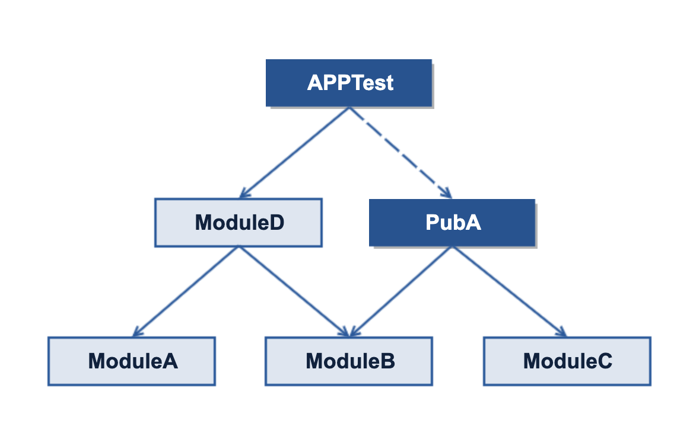

这篇文章总结组件化开发框架怎么基于组件化更好的提升开发效率。包括如何做到最小单元运行、怎么增加调试入口提供更便捷的调试。

## 写在前面

在平时日常的开发中，我们经常会有下面的诉求：

- 遇到问题的时候，想要提供一些设备、版本、用户相关的基本信息（例如：版本、环境、机型、用户ID等）来协助问题的定位

- 会有些功能要在现网环境体验，有些正在开发中又要在测试环境体验

- 有些功能的体验可能会设计到一些参数调整，例如广告显示时长、例如功能的开关

- 有时候会遇到数据返回错误，后台说没问题，就需要切换环境验证是不是后台的问题

- 预研一些功能，或者为了方便调试功能，对一些功能增加了临时入口又不想对外暴露

- 最小单元运行，也就是开发中只想同时编译和修改自己的功能涉及到的代码，其余的功能可以屏蔽

对于上面的诉求，在以前的开发中，基本上是用下面的几种方法解决：

- 信息查看基本靠日志，对于不开启日志的包，先把日志打开，重新出包

- 不同的出不同环境的包，体验或者测试的时候不停的卸载安装

- 添加的临时功能或者测试内容，要么验证结束直接删了，下次再写。要么正式版本隐藏入口，但代码保留

## 开发调试方案总结

在我们的方案中，对于上面的问题，做了一些尝试：

1. 增加了一个测试模块 APPTest 用于：

	- 日常开发中添加一些临时测试或者方案预研的代码

	- 在功能开发中以最小单元开发时作为开发调试的宿主模块

	- 提供各种配置的修改入口和调试开关

2. 在组件化框架里，所有的UI内容都是基于Fragment进行开发。我们在APPTest提供了一个空的Fragment入口用于日常功能开发。

3. 在内部测试体验时，要发布的应用作为 APPTest 的一个子模块开发，而正式发布时，APPTest不在包含。

	以下面的依赖关系为例：

	

	在 PubA 的开发中，他作为 APPTest 的 一个子模块，APPTest 是整个应用的宿主；而等到正式发布的时候，他将作为应用的宿主，整个应用不再包含APPTest

按照上面的方案，目前我们可以随意的添加各种测试入口或者代码而不担心发布到外网，同时通用的配置、环境切换等可以做到所有应用公用一份。例如虽然基于组件化框架我们已经有超过五款APP，但是使用统一的测试入口以后，这部分逻辑我们只需要维护一份。

## 具体实践

上面描述了方案的美好，这部分内容就重点介绍一下这套方案会遇到的问题以及怎么解决这些问题。

###  Pub 从 Application 和 Library 的自由切换

在基于Gradle的构建中，对于一个module，提供了两种类型。Application 可以独立运行，但不能被任何module依赖，Library 可以被任意模块依赖，但是不能独立运行。因此当 Pub 要变为一个 APPTest 的子模块时，需要将类型切换为 Library。对于这个问题，基本上大家都是一样的方式解决：

```
if (rootProject.ext.pubModuleIsApplication as boolean) {
    apply plugin: 'com.android.application'
} else {
    apply plugin: 'com.android.library'
}

android {

    compileSdkVersion project.compileSdkVersion
    buildToolsVersion project.buildToolsVersion

    defaultConfig {
        if (rootProject.ext.pubModuleIsApplication as boolean) {
            applicationId applicationID
        }
        ……
    }
   ……
 }
```

### Application 冲突怎么解决

当 Pub 被修改为一个 Library 并被 APPTest 依赖时，经常会遇到 APPTest 无法运行，提示找不到Default Activity，这个问题一般是因为 Application 的定义冲突导致的。

在平时开发中，可以通过手动将APPTest 的 AndroidMainfest 里面 Application 的 name 手动修改为与 Pub 一致即可解决。对于自动构建，我们会根据构建设置，自动完成替换。

### Pub 的调试入口怎么联动

通过这样的设计，我们所有的模块都支持了各种调试。开发中我们怎么从项目切换到调试模块呢？这里有两个方法：

1. APPTest 也有自己的launcher activity， 因此桌面有icon可以进入

2. 我们在侧边栏的组件中，增加了进入调试的入口可以通过路由访问APPTest的内容，对于 APPTest 为宿主的包，他可以正常跳转。对于以 Pub 为宿主的包，就算我们忘记隐藏入口，他也不能跳转。不会存在测试代码外泄的风险。

### 怎么基于APPTest开发

在组件化框架里所有的UI内容都是基于Fragment进行开发，因此我们在APPTest提供了一个占位的Fragment入口，平时开发时可以将这个占位入口设置为自己正在开发的Fragment直接开发。等开发调试结束以后主模块直接调用联调即可。