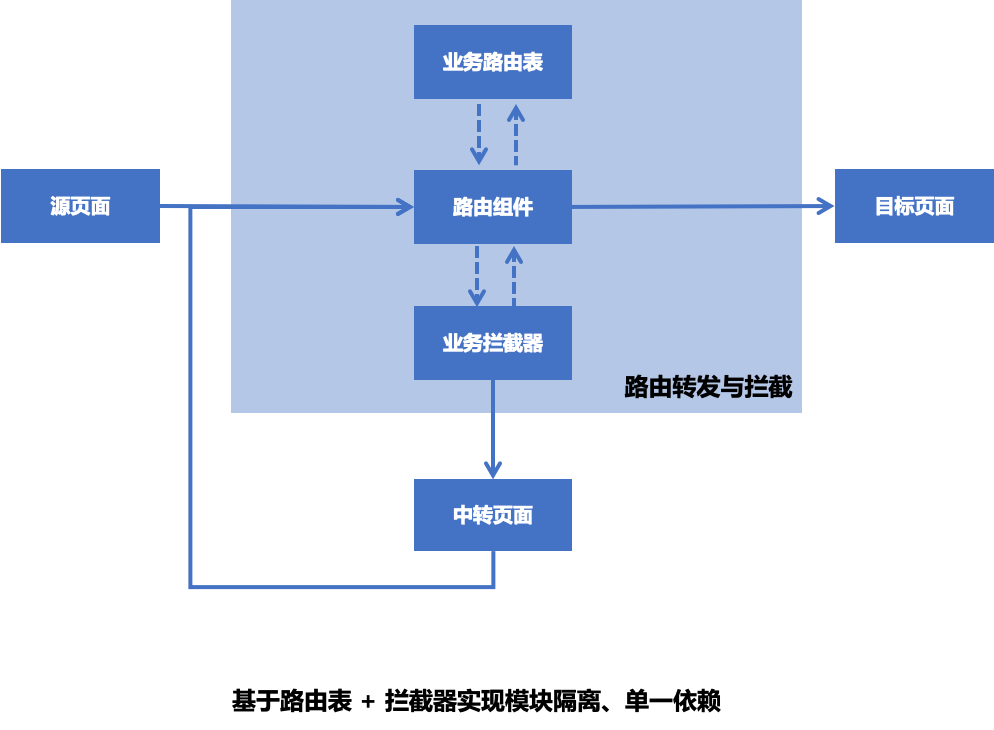

这篇文章主要总结了我们基于路由的组件通信怎么设计的，以及怎么基于路由处理通用拦截及页面返回等逻辑。目前路由实现相关的代码，我已经整理开源，可以参考源码：[https://github.com/bihe0832/AndroidAppFactory](https://github.com/bihe0832/AndroidAppFactory)

### 路由能力介绍
 
 在考察了多个路由组件以后，结合我们的场景需求，基于 ActivityRouter [https://github.com/mzule/ActivityRouter](https://github.com/mzule/ActivityRouter) 重构了我们的路由组件。组件主要解决几个问题：
	 
- 为了统一内外部跳转，页面路由组件使用标准的URL格式，每个页面的路由透传字段由自己维护
 
- 为了方便开发，目前所有路由通过注解配置，编译过程中会通过注解动态生成代码，构建对应的路由规则。
	
- 为了保证页面回退最终回退到主页面，增加了主页面的注解及处理

### 路由实现

- 路由表生成

	路由表的生成使用注解动态生成代码，部分代码如下
	
	```
	public boolean process(Set<? extends TypeElement> annotations, RoundEnvironment roundEnv) {
	        debug("process apt with " + annotations.toString());
	        if (annotations.isEmpty()) {
	            return false;
	        }
	
	        MethodSpec.Builder initMethod = MethodSpec.methodBuilder("init").addModifiers(Modifier.PUBLIC, Modifier.FINAL, Modifier.STATIC);
	        Set<? extends Element> mainList = roundEnv.getElementsAnnotatedWith(APPMain.class);
	        debug("process mainList: " + mainList.size());
	        boolean hasMain = false;
	        if (mainList != null && mainList.size() > 0) {
	            for (Element tempModule: mainList) {
	                ClassName className = ClassName.get((TypeElement) tempModule);
	                APPMain annotation = tempModule.getAnnotation(APPMain.class);
	                if(null != annotation){
	                    initMethod.addStatement(ROUTER_PACKAGE_NAME + ".RouterMappingManager.addMain(" +className + ".class);");
	                    hasMain = true;
	                }
	            }
	        }
	
	        if(hasMain){
	            TypeSpec routerInit = TypeSpec.classBuilder("RouterInit")
	                    .addModifiers(Modifier.PUBLIC, Modifier.FINAL)
	                    .addMethod(initMethod.build())
	                    .build();
	            try {
	                JavaFile.builder(STUB_PACKAGE_NAME, routerInit)
	                        .build()
	                        .writeTo(filer);
	            } catch (Exception e) {
	                e.printStackTrace();
	            }
	        }
	
	        ArrayList<String> modulesNameList = new ArrayList<>();
	        Set<? extends Element> moduleList = roundEnv.getElementsAnnotatedWith(Module.class);
	        debug("process moduleList: " + moduleList.size());
	        if (moduleList != null && moduleList.size() > 0) {
	            for (Element tempModule: moduleList) {
	                String moduleName = "RouterMapping";
	                Module annotation = tempModule.getAnnotation(Module.class);
	                moduleName = moduleName + "_" + annotation.value();
	                debug("process moduleName: " + moduleName);
	                if(!modulesNameList.contains(moduleName)){
	                    modulesNameList.add(moduleName);
	                }else{
	                    throw new RuntimeException("Module "+ moduleName + "has been add");
	                }
	            }
	        }
	        debug("generate default RouterInit");
	        return handleRouters(modulesNameList, roundEnv);
	    }
	
	    private boolean handleRouters(ArrayList<String> modulesNameList, RoundEnvironment roundEnv) {
	        for (String moduleName:modulesNameList ) {
	            if(!handleRouter(moduleName,roundEnv)){
	                return false;
	            }
	        }
	        return true;
	    }
	
	    private boolean handleRouter(String genClassName, RoundEnvironment roundEnv) {
	        Set<? extends Element> elements = roundEnv.getElementsAnnotatedWith(Module.class);
	
	        MethodSpec.Builder mapMethod = MethodSpec.methodBuilder("map")
	                .addModifiers(Modifier.PUBLIC, Modifier.FINAL, Modifier.STATIC)
	                .addCode("\n");
	
	        for (Element element : elements) {
	            Module router = element.getAnnotation(Module.class);
	            ClassName className = ClassName.get((TypeElement) element);
	            mapMethod.addStatement(ROUTER_PACKAGE_NAME + ".RouterMappingManager.getInstance().addMapping($S, $T.class)", router.value(), className);
	            mapMethod.addCode("\n");
	        }
	        TypeSpec routerMapping = TypeSpec.classBuilder(genClassName)
	                .addModifiers(Modifier.PUBLIC, Modifier.FINAL)
	                .addMethod(mapMethod.build())
	                .build();
	        try {
	            JavaFile.builder(STUB_PACKAGE_NAME, routerMapping)
	                    .build()
	                    .writeTo(filer);
	        } catch (Throwable e) {
	            e.printStackTrace();
	        }
	        return true;
	    }
	}
	```

	生成的某个模块的路由表事例如下：
	
	```
	public final class RouterMapping_main {
	  public static final void map() {
	    com.bihe0832.android.lib.router.RouterMappingManager.getInstance().addMapping("test", TestHttpActivity.class);
	    com.bihe0832.android.lib.router.RouterMappingManager.getInstance().addMapping("main", MainActivity.class);
	  }
	}
	```

### 路由跳转

路由跳转有两步，第一步根据路由去路由表匹配对应的路由规则；第二步根据路由规则打开对应的页面。

具体的，在匹配规则时，会先去路由总表查看是不是存在，如果不存在，再去尝试将这个路由所属某块的路由表加载到总表。

根据路由表打开页面，其实就是构造一个startActivity的过程
	
### 路由拦截

如果对于一些页面，在打开前有前置条件，例如是不是已经登录，或者对于特权相关的，需要有权限才能跳转的，在没有路由之前添加就会很麻烦，在基于路由以后，我们可以在打开路由之前添加拦截规则，拦截规则处理结束以后再继续跳转。



相关代码：

```
object RouterInterrupt {

    val TAG = "Router->"
    interface RouterProcess {
        //是否需要登录
        fun needLogin(uri: Uri): Boolean
        //是否需要拦截
        fun needInterrupt(uri: Uri): Boolean
        //拦截后操作
        fun doInterrupt(uri: Uri): Boolean
    }

    @Synchronized
    fun init(process: RouterProcess) {
        RouterContext.setGlobalRouterCallback(object : RouterContext.RouterCallback {
            override fun afterOpen(context: Context, uri: Uri) {
                Logger.d(TAG,"：afterOpen ->$uri")
            }

            //跳转前拦截
            override fun beforeOpen(context: Context, uri: Uri): Boolean {
                Logger.d(TAG,"：beforeOpen ->$uri")
                return if (process.needInterrupt(uri) || process.needLogin(uri)) {
                    intercept(uri, process)
                } else {
                    false
                }
            }

            override fun error(context: Context, uri: Uri, e: Throwable) {
                Logger.d(TAG," ：error ->$uri")
            }

            override fun notFound(context: Context, uri: Uri) {
                Logger.d(TAG," ：notFound ->$uri")
            }
        })
    }


    //拦截处理结果
    fun intercept(uri: Uri, process: RouterProcess): Boolean {
        Logger.d(TAG,"：beforeOpen uri ->$uri")
        return if (process.needLogin(uri)) {
            return if (Login.isLogin()) {
                //已登录，检测是否额外拦截
                if (process.needInterrupt(uri)) {
                    process.doInterrupt(uri)
                } else {
                    false
                }
            } else {
                //未登录，先登录，再重放
                Login.doActionWithLogin({
                    Routers.open(Context.applicationContext, uri)
                }, { })
                true
            }
        } else {
            //无需登录，直接拦截
            process.doInterrupt(uri)
        }
    }
}
```

### 页面返回

由于接入路由以后，存在外部跳转的场景，而外部跳转会直接进入对应路由页面。

当用户关闭该页面以后，如果不作处理就退出了应用。但是合理的效果应该是非应用主页面回退到应用的主页面，应用主页面弹出应用退出的确认。

页面打开之前我们通过路由拦截实现。而回退则只能通过分析当前的Activity堆栈实现。

我们在每次页面返回的时候会去获取当前任务栈本应用相关的页面，然后根据路由表生成的应用主页面表根据规则完成对应业务逻辑。回退时处理的代码如下：

```
fun BaseActivity.onBackPressedSupportAction(autoExit: Boolean) {
    val am = getSystemService(ACTIVITY_SERVICE) as ActivityManager
    val taskInfoList = am.getRunningTasks(Int.MAX_VALUE)
    var topActivity = ""
    var activityNum = 0
    for (i in taskInfoList.indices) {
        if (taskInfoList[i].baseActivity.packageName.equals(packageName, ignoreCase = true)) {
            if (TextUtils.isEmpty(topActivity)) {
                topActivity = taskInfoList[i].topActivity.className
            }
            activityNum += taskInfoList[i].numActivities
        } else if (i > 0) {
            break
        }
    }

    if (activityNum == 1) {
        if (isMain(topActivity)) {
            if (autoExit) {
                Context.exitAPP(null)
            } else {
                onBack()
            }
        } else {
            finishAndGoMain()
        }
    } else {
        if (isMain(topActivity)) {
            if (autoExit) {
                Context.exitAPP(null)
            } else {
                onBack()
            }
        } else {
            onBack()
        }
    }
}

```

### 路由测试

终端测试总是很方便，但是一旦和H5结合，尤其H5的页面还没开发好的时候，路由联动测试就比较麻烦。顺手撸了一个工具。对应链接为：[https://blog.bihe0832.com/android_schema.html](https://blog.bihe0832.com/android_schema.html)

	
