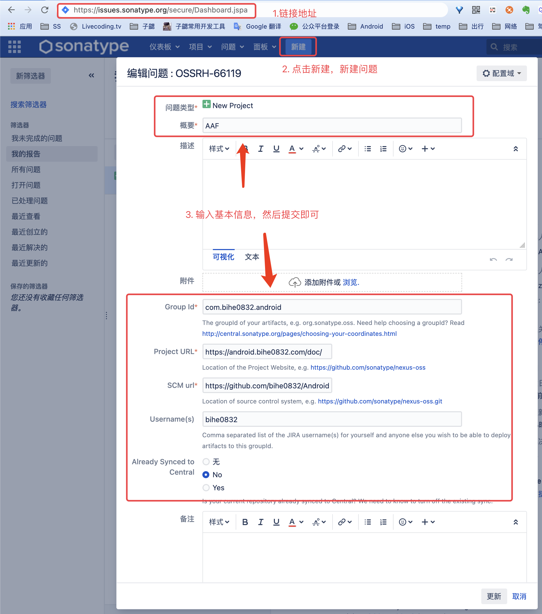
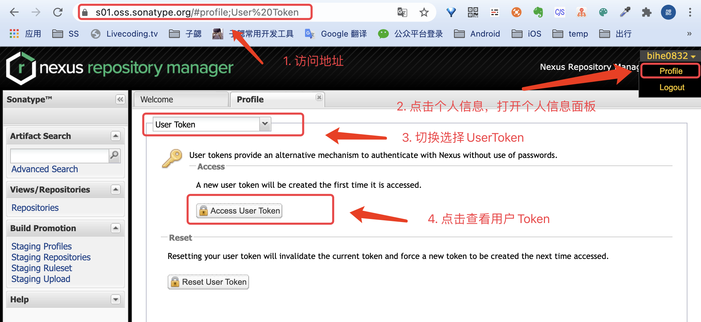
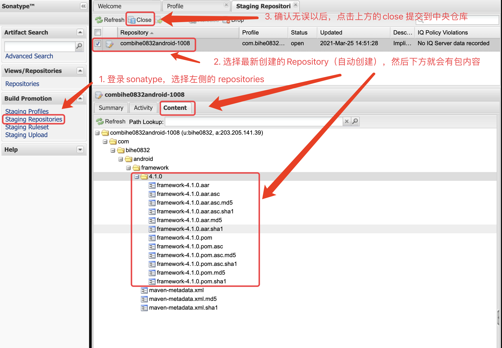
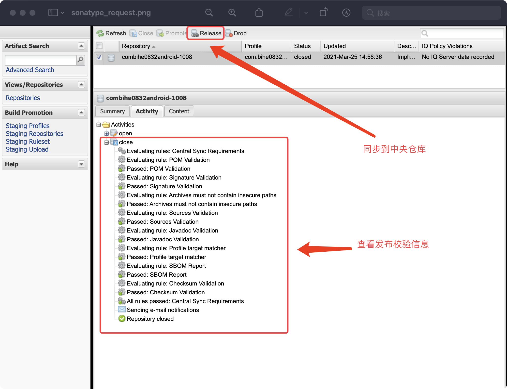

在平时的开发中，经常会写一些通用的代码，为了方便自己后续使用，也为了方便更多的人，大都会选择发布到github或者jcenter等一些开源库。之前一直是使用jcenter，结果活久见，前几天发布的时候登录，竟然看到了这：

又红又粗必然是有大事，果然没想到他竟然要跑路了，核心内容就是：

> UPDATE: To better support the community in this migration, JFrog has extended the JCenter new package versions submission deadline through March 31st 2021.

> To clarify, the JCenter repository will keep serving packages for 12 months until February 1st 2022. Only the JCenter REST API and UI will be sunsetted on May 1st 2021.

之前觉得发布到 Maven Central 太麻烦，没想到最终还是逃不掉，因此开始着手迁移到 Maven Central ，考虑到遇到的人应该不少，简单整理下。**这篇文章从头开始介绍怎么把开源代码发布到Maven Central，并在项目中使用。包括注册账号，发布，发布后使用以及发布中一些常见的问题。**

## 前期准备

### 开源项目

你需要有已经开源的项目，并且项目已经编译通过，可以发布。为了方便介绍，我选择通过自己的开源项目AAF来介绍。项目地址：

[https://github.com/bihe0832/AndroidAppFactory](https://github.com/bihe0832/AndroidAppFactory)

### Group Id

Jcenter对于 Group Id的归属没有强校验，Sonatype会要求你提供权属的真实性，例如使用：com.bihe0832.android；你需要证明你拥有  android.bihe0832.com 域名的所有权。怎么证明后面会介绍。

## 注册 Group Id

我当时申请 android.bihe0832.com 的信息可以参考：[https://issues.sonatype.org/browse/OSSRH-66119](https://issues.sonatype.org/browse/OSSRH-66119)

### 官网地址：

- issues.sonatype.org：[https://issues.sonatype.org/secure/Dashboard.jspa](https://issues.sonatype.org/secure/Dashboard.jspa)

	这是一个基于 JIRA 的平台，如果没有账号，就注册一个，并不麻烦。**注册成功之后，记下用户名和密码，后面还会用到**

### 注册 Group Id：

1. 提交申请

	登录以后，点击上面的链接，进入网页，按照下图的指引，点击新建，只需要填写概要以下的信息即可，基本上主要是项目主页，项目源码和要注册的Group Id。

	
	
	如果后续有信息需要修改，比如要修改Group Id，改完之后点击工单上方的“response”按钮，以通知平台已修改完毕。
	
2. 验证域名的有效性

	当申请提交以后，很快就会有官网账号，回复你，提醒你验证域名的有效性，例如：
    

	> Do you own the domain bihe0832.com? If so, please verify ownership via one of the following methods:
	> 
	> - Add a TXT record to your DNS referencing this JIRA ticket: OSSRH-66119 (Fastest)
	> - Setup a redirect to your Github page (if it does not already exist) You can find more information here: https://central.sonatype.org/pages/producers.html
	> 
	> If you do not own this domain, please read:
	> http://central.sonatype.org/pages/choosing-your-coordinates.html
	> You may also choose a groupId that reflects your project hosting, in this case, something like io.github.bihe0832 or com.github.bihe0832

	这个操作也很简单，去你的域名解析规则里面增加一条指向 https://issues.sonatype.org/browse/OSSRH-66119 的 TXT 记录即可，例如：将 android.bihe0832.com	的 TXT 配置为 https://issues.sonatype.org/browse/OSSRH-66119
	
	配置成功以后可以使用 dig 命令验证。例如：
	
		dig -t TXT android.bihe0832.com
		
		; <<>> DiG 9.10.6 <<>> -t TXT android.bihe0832.com
		;; global options: +cmd
		;; Got answer:
		;; >>HEADER<< opcode: QUERY, status: NOERROR, id: 30392
		;; flags: qr rd ra; QUERY: 1, ANSWER: 1, AUTHORITY: 0, ADDITIONAL: 1
		
		;; OPT PSEUDOSECTION:
		; EDNS: version: 0, flags:; udp: 4000
		;; QUESTION SECTION:
		;android.bihe0832.com. IN TXT
		
		;; ANSWER SECTION:
		android.bihe0832.com. 600 IN TXT "https://issues.sonatype.org/browse/OSSRH-66119"
		
		;; Query time: 73 msec
		;; SERVER: 10.11.56.23#53(10.11.56.23)
		;; WHEN: Tue Mar 23 17:43:08 CST 2021
		;; MSG SIZE rcvd: 108
		
	当验证没有问题，就可以直接回复已完成，当官方验证没有问题，就会进入下一步
	
3. 增加Jcenter 同步
	
	这一步个人认为可以放弃，在域名验证没有问题以后，收到官网的回复：
	
	> Are you migrating from Jcenter? If so please create the empty repository in Bintray https://bintray.com/bihe0832/OSSRH-66119 as proof of ownership.

	最开始有打算把 Jcenter 的代码也同步过来，因此就根据提示，前往 Jcenter 新建了名为OSSRH-66119 的 repository，后来发现Jcenter都要跑路了，其实这一步可以不做的。
	
4. 发放Group Id

	当上面的工作做完以后，继续回复issue，官网验证结束以后，就会收到下面的信息，并且开通对应仓库的权限：
	
	> com.bihe0832.android has been prepared, now user(s) bihe0832 can:
	> Publish snapshot and release artifacts to https://s01.oss.sonatype.org
	> Have a look at this section of our official guide for deployment instructions:
	> https://central.sonatype.org/pages/ossrh-guide.html#deployment
	> 
	> Please comment on this ticket when you've released your first component(s), so we can activate the sync to Maven Central.
	> Depending on your build configuration, this might happen automatically. If not, you can follow the steps in this section of our guide:
	> https://central.sonatype.org/pages/releasing-the-deployment.html
	
至此，第一步，账号及Group Id就算申请通过了。

## 提交代码到 Sonatype Maven Central

### 配置gpg信息

配置并发布GPG信息，关于GPG信息的生成，可以参考文章：[https://blog.bihe0832.com/gpg.html](https://blog.bihe0832.com/gpg.html)

### 配置账号信息

1. 获取Token

	打开 [https://s01.oss.sonatype.org](https://s01.oss.sonatype.org)
	
	使用注册 Group Id是注册的sonatype 的账号和密码登录，按照下图的步骤，获取Token
	
	

2. 配置Token信息

	在项目根目录的 `gradle.properties` 添加nexus Token的配置信息。例如：
	
		# nexus账号信息，也就是创建工单时的账号和密码
		NEXUS_USERNAME=GTXXXXXEt
		NEXUS_PASSWORD=xjXXXXXXXXXXXXXXXXXXXXXXXXXXXXXXaqJG
	
	你也阔以不操作第一步，直接在这里配置你的 sonatype 的登录账号和密码
	
### 添加发布脚本

- 配置发布信息

	添加开源项目的基本信息，上传脚本可以参考  [https://github.com/bihe0832/AndroidAppFactory/build_aar.gradle](https://github.com/bihe0832/AndroidAppFactory/build_aar.gradle) 
	
- 引入发布脚本

	在需要发布的 Library 的 build.gradle 里面引入 build_aar.gradle即可，例如 AndroidAppFactory 的Framework ，对于Java 类型的 Library， 参考 AndroidAppFactory 的 RouterCompiler 的 build.gradle，还需要添加额外的几个Task
	
### 发布代码到 sonatype

在项目根目录运行命令，上传二进制包。例如：
	
	./gradlew clean :Framework:uploadArchives

即可将二进制包发布到 sonatype

## 同步代码到  Maven Central

### 信息确认

打开 [https://s01.oss.sonatype.org](https://s01.oss.sonatype.org) 使用注册 Group Id是注册的sonatype 的账号和密码登录，按照下图的步骤，查看刚才新上传的代码

### 同步到 Maven Central

如果确认Content的信息正确，勾选点击上方的Close，提交申请

然后刷新页面，就可以在Activity查看信息审核的进度，如果失败了，这里会提示哪一步出错了，以及出错原因，根据原因解决问题，删了有问题版本，再次提交申请，如果审核通过了，上面的Release按钮会变为可点击，点击即可同步到中央仓库

当提交到中央仓库以后：

> Central sync is activated for com.bihe0832.android. After you successfully release, your component will be published to Central https://repo1.maven.org/maven2/, typically within 10 minutes, though updates to https://search.maven.org can take up to two hours.

##  使用项目

此时其实我们的项目已经可以在代码中使用，在根目录添加开源库仓库的相关依赖：

    buildscript {  
        repositories {  
            maven { url "https://s01.oss.sonatype.org/content/groups/public" }

        }  
    }   

    allprojects {  
        repositories {  
            maven { url "https://s01.oss.sonatype.org/content/groups/public" }

        }  
    }
    
在对应项目添加依赖，具体的依赖方法可以参考上图左下角：

    compile 'com.bihe0832.test:utils-demo:1.0.0'

在同步10分钟左右，我们就可以通过 mavenCentral 引用了

## 常见问题：

1. 提交代码报错，提示：failed to deploy artifacts: could not transfer artifact return code is: 401, reasonphrase: unauthorized.

    请检查根目录build.gradle 里面配置用户名和API Key是否正确，一般是因为这个原因。
     