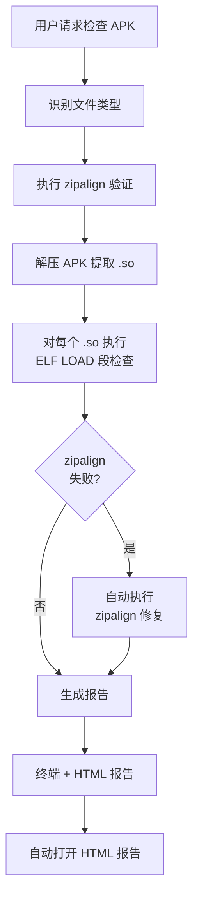

# APK/AAB/AAR 16KB 页面对齐检查工具详解

> **背景**：自 2025 年 11 月 1 日起，Google Play 要求所有以 Android 15 (API 35) 及以上为目标的应用必须支持 16KB 页面大小。本文介绍 `apk-16kb-check` skill 如何一键完成 APK/AAB/AAR 的 16KB 对齐合规检查与自动修复。

## 目录

- [为什么不直接用官方工具？](#为什么不直接用官方工具)
- [工具能做什么](#工具能做什么)
- [检查内容详解](#检查内容详解)
- [实际检查报告截图](#实际检查报告截图)
- [各输入类型的检查范围](#各输入类型的检查范围)
- [使用方法](#使用方法)
- [工作流程](#工作流程)
- [修复方案](#修复方案)
- [集成到开发流程](#集成到开发流程)
- [常见问题](#常见问题)

## 为什么不直接用官方工具？

Google 官方提供了 `zipalign` 和 `check_elf_alignment.sh`，但它们存在流程碎片化、格式受限、报告不友好等问题。`apk-16kb-check` 在此之上做了一层工程化封装。

| 维度 | 官方工具 | apk-16kb-check |
|------|----------|----------------|
| **格式支持** | 主要针对 APK | ✅ APK / AAB / AAR / .so 全支持 |
| **执行方式** | 需手动组合多个命令 | ✅ 一键检查 + 自动修复 |
| **批量能力** | 单文件处理 | ✅ 支持目录批量检查 |
| **报告形式** | 终端文本，需人工解析 | ✅ HTML + 终端双报告 |
| **来源分析** | 无 | ✅ 自动分析 .so 来源模块（Gradle 依赖树） |
| **工程集成** | 无 | ✅ 支持 Android 工程目录，自动构建后检查 |
| **修复能力** | 只检查不修复 | ✅ zipalign 失败时自动修复 |

## 工具能做什么

- **多格式支持**：APK、AAB、AAR、单个 .so 文件、Android 工程目录
- **双重检查**：zipalign 对齐验证 + ELF LOAD 段对齐检查
- **自动修复**：zipalign 失败时自动尝试修复并生成对齐后文件
- **批量处理**：支持目录批量检查，自动汇总
- **详细报告**：生成 HTML 报告（自动打开）+ 终端彩色输出
- **来源分析**：自动关联 Gradle 依赖树，定位 .so 所属模块

## 检查内容详解

工具会并行执行两类检查，分别对应 Google Play 16KB 合规的两个关键维度：

### 1. zipalign 对齐检查（ZIP 层）

- **工具**：`zipalign -c -P 16 -v 4`
- **目的**：验证 APK 中所有文件的 ZIP 存储偏移量是否按 16KB 对齐
- **修复**：`zipalign -P 16` 重新对齐（脚本自动执行）

### 2. ELF LOAD 段对齐检查（SO 层）

- **工具**：AOSP 官方 `check_elf_alignment.sh`
- **目的**：验证 .so 文件内部的 ELF LOAD 段是否按 16KB 对齐
- **修复**：需重新编译 .so（升级 NDK 或调整链接参数）

> ⚠️ **关键区别**：
> - **zipalign** 检查 .so 在 APK 内的 **ZIP offset** 对齐 → 打包问题，**可自动修复**
> - **ELF 段** 检查 .so 内部的 **LOAD 段 alignment** → 编译问题，**需重新编译**

## 实际检查报告截图

以下是对实际 APK 文件进行检查的真实效果展示：

### 截图 1：zipalign 验证结果


- APK 文件：`Zixie_V1.2.0_103-debug.apk`
- 检查项总计：1173，通过：1161，未通过：12
- 工具自动执行 `zipalign -P 16` 修复，修复后全部通过
- 生成对齐后文件：`Zixie_1v1.2.0_103-debug.aligned.apk`

### 截图 2：ELF LOAD 段对齐检查


- 64 位架构 .so 文件总数：16
- 对齐（ALIGNED）：13；未对齐（UNALIGNED）：3
- 详细列出每个未对齐 .so 的文件名、架构、对齐值、NDK 版本、来源模块

### 截图 3：修复方案总览


- **方案一**：修复 ZIP 偏移对齐（zipalign）— 已验证可自动修复
- **方案二**：修复 ELF LOAD 段对齐（需重新编译）
- 提供重放命令和分步修复说明

## 各输入类型的检查范围

| 输入类型 | zipalign 验证 | ELF 段检查 | 说明 |
|----------|:---:|:---:|------|
| APK | ✅ | ✅ | 完整检查，失败时自动修复 |
| AAB | ✅（需转 APK） | ✅（直接解压） | ELF 为核心检查项 |
| AAR | ❌（跳过） | ✅（直接解压） | 中间产物，zipalign 由宿主 APK 决定 |
| .so 文件 | ❌（跳过） | ✅ | 开发调试专用 |
| 工程目录 | ✅ | ✅ | 自动构建后检查产物 APK |

## 使用方法

### 基本用法

```bash
# APK 检查（完整检查 + 自动修复）
python3 check_alignment.py app-release.apk

# AAR 检查（仅 ELF 段检查，支持多个）
python3 check_alignment.py lib1.aar lib2.aar lib3.aar

# SO 文件检查（开发调试）
python3 check_alignment.py libnative.so

# 批量检查目录
python3 check_alignment.py --batch ./apks/
```

### 生成 HTML 报告

```bash
# 指定 HTML 输出路径
python3 check_alignment.py app-release.apk report.html

# 默认与输入文件同名：app-release_alignment_report.html
python3 check_alignment.py app-release.apk
```

## 工作流程

### APK 检查流程



### AAB 处理流程

AAB 需要两步处理，分别覆盖 ELF 段和 zipalign 两个维度：

```bash
# 1. 解压 AAB 提取 .so 做 ELF 段检查
unzip -o app.aab -d /tmp/aab_extract/
# .so 位于 base/lib/{abi}/ 下

# 2. 用 bundletool 转 universal APK 做 zipalign 检查
java -jar bundletool.jar build-apks \
  --bundle=app.aab --output=app.apks --mode=universal
unzip app.apks -d /tmp/apks/
# 对 universal.apk 调用 check_alignment.py
```

### 工程目录处理

当输入为 Android 工程目录时，流程如下：

1. 定位 `settings.gradle` 确定项目根目录
2. 识别 application 模块（多个时询问用户选择）
3. 执行 `gradlew :{module}:assemble{Variant}`（默认 debug）
4. 定位构建产物 APK，调用检查脚本
5. 发现问题时自动进入修复流程

## 修复方案

### 1. 压缩存储问题（优先级最高）

```groovy
android {
    packagingOptions {
        jniLibs { useLegacyPackaging = false }
    }
}
```

> AGP 8.5.1+ 已默认设置此选项。

### 2. ELF LOAD 段对齐问题

| 方案 | 操作 | 适用场景 |
|------|------|----------|
| **升级 NDK（推荐）** | `ndkVersion "28.0.12433566"` | 自有 native 代码 |
| **CMake 链接参数** | `target_link_options(lib PRIVATE -Wl,-z,max-page-size=16384)` | 无法升级 NDK |
| **Gradle cmake 参数** | `arguments "-DANDROID_SUPPORT_FLEXIBLE_PAGE_SIZES=ON"` | Gradle 管理的 native 构建 |
| **第三方 SDK** | 升级 SDK 或联系供应商 | 闭源 .so |

### 3. zipalign 对齐问题

| 方案 | 操作 |
|------|------|
| **升级 AGP（推荐）** | AGP 8.5.1+ 自动支持 |
| **手动 zipalign** | `zipalign -P 16 -f 4 input.apk output.apk` |

> ⚠️ **重要**：zipalign 必须在签名之前执行。本工具会自动处理这一步。

## 目录结构

```
scripts/
├── check_alignment.py        # 主入口：参数解析 + 路由分发
├── models.py                 # 数据模型（dataclass + 常量）
├── checker_common.py         # 通用工具（zipalign/ELF 检查/NDK 版本检测）
├── checker_apk.py            # APK 检查 + 自动修复
├── checker_aar.py            # AAR 直接解压检查
├── so_source_analyzer.py     # SO 来源分析（Gradle 依赖树 + 缓存匹配）
├── report_html.py            # HTML 报告生成
├── report_terminal.py        # 终端输出 + 批量检查
├── aar_builder.py            # AAR→APK 构建（保留备用）
└── check_elf_alignment.sh    # AOSP 官方 ELF 对齐检查脚本
```

## 依赖要求

- **Python**: 3.6+（仅使用标准库）
- **Android SDK**: Build-Tools 35+
- **外部工具**: zipalign、bundletool（AAB 模式需要）
- **Shell**: 支持 bash 的环境

## 报告示例

### 终端报告

```
📋 检查报告: app-release.apk (12.5 MB)

✅ zipalign 检查: 通过
   - 所有文件已按 16KB 对齐

🔍 ELF LOAD 段检查:
   ✅ libnative.so (arm64-v8a): ALIGNED (2**14)
   ✅ libimage.so (armeabi-v7a): ALIGNED (2**14)
   ❌ libold.so (x86): UNALIGNED (2**12)

📊 统计: 3 个 .so 文件，2 个通过，1 个失败
💡 建议: libold.so 需要重新编译以支持 16KB 页面对齐
```

### HTML 报告

HTML 报告包含：文件基本信息、zipalign 检查结果、每个 .so 的 ELF 对齐状态、NDK 版本、.so 来源分析、针对性修复建议。

## 集成到开发流程

### 本地开发检查

```bash
./gradlew assembleRelease
python3 check_alignment.py app/build/outputs/apk/release/app-release.apk
```

### CI/CD 集成

```yaml
# GitHub Actions 示例
- name: Check 16KB alignment
  run: |
    python3 check_alignment.py \
      ${{ github.workspace }}/app/build/outputs/apk/release/app-release.apk
    if [ $? -ne 0 ]; then
      echo "16KB alignment check failed"
      exit 1
    fi
```

### 预提交钩子

```bash
# .git/hooks/pre-commit
#!/bin/bash
if git diff --cached --name-only | grep -E '\.(apk|aar)$'; then
    echo "Running 16KB alignment check..."
    python3 check_alignment.py --batch .
fi
```

## 常见问题

**Q: 为什么 AAR 文件跳过 zipalign 检查？**
A: AAR 是中间产物，zipalign 对齐由最终宿主 APK 打包时决定，因此只需检查 ELF LOAD 段对齐。

**Q: ELF LOAD 段对齐失败如何修复？**
A: 需要重新编译 .so 文件，首选升级到 NDK r28+，或通过 `-Wl,-z,max-page-size=16384` 链接参数调整。

**Q: 工具支持哪些架构？**
A: 支持所有 Android 架构：arm64-v8a、armeabi-v7a、x86、x86_64。其中 32 位架构（armeabi-v7a、x86）不受 16KB 页面要求约束，主要关注 64 位。

**Q: 批量检查时如何处理大量文件？**
A: 工具并行处理多个文件，提供进度显示和汇总报告，适合 CI 场景。

## 相关链接

- [Google 官方：支持 16KB 页面大小](https://developer.android.com/guide/practices/page-sizes?hl=zh-cn)
- [AOSP check_elf_alignment.sh](https://cs.android.com/android/platform/superproject/main/+/main:system/extras/tools/check_elf_alignment.sh)
- [Android Gradle Plugin 文档](https://developer.android.com/studio/releases/gradle-plugin)

## 总结

`apk-16kb-check` skill 为 Android 开发者提供了一个全面、自动化的 16KB 页面对齐检查解决方案。通过支持多种文件格式、提供详细的报告和自动修复功能，大大简化了 Google Play 新要求的合规性检查流程。建议将其集成到日常开发流程中，确保应用顺利上架 Google Play。