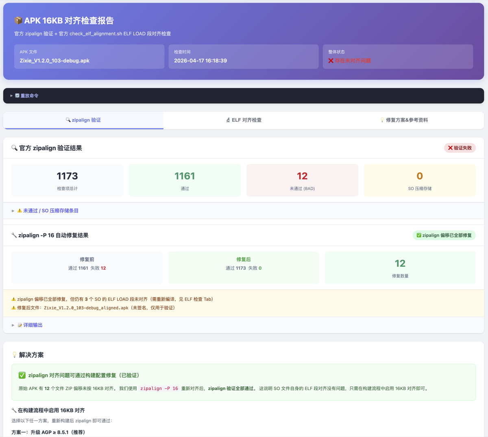
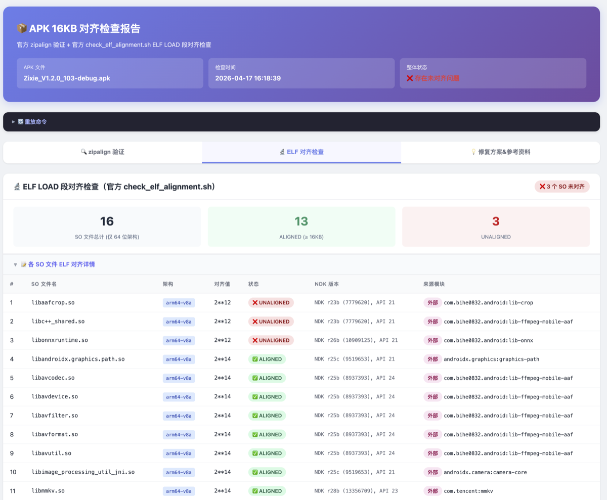
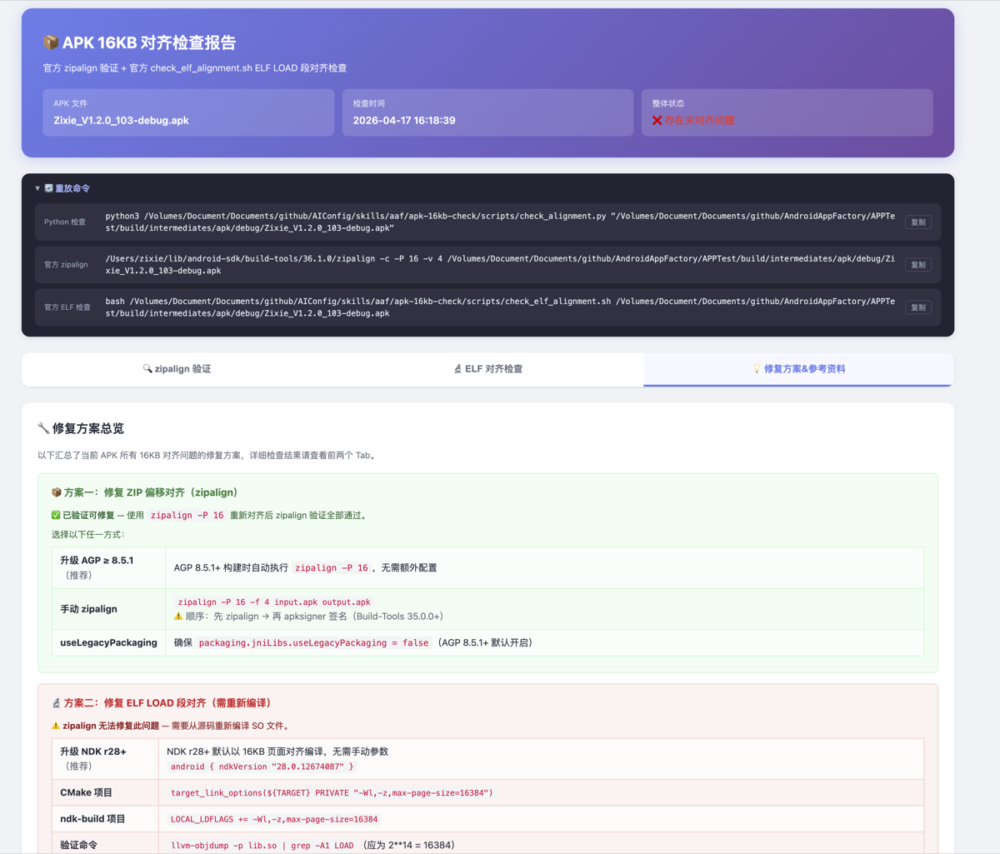
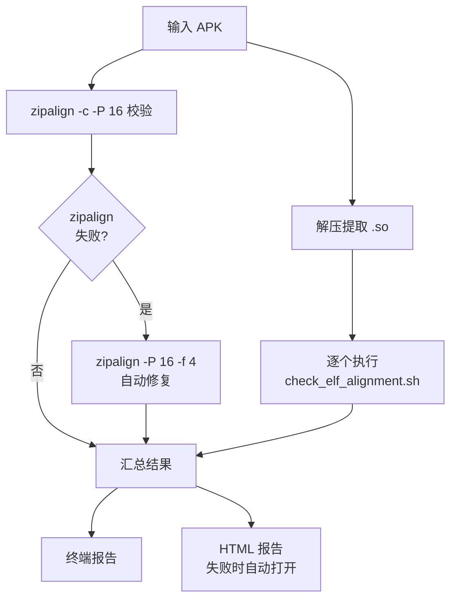

# APK/AAB/AAR 16KB 页面对齐检查工具详解

> **合规背景**：自 2025 年 11 月 1 日起，Google Play 要求所有以 Android 15 (API 35) 及以上为目标的应用必须支持 **16KB 页面大小**（此前 Android 默认 4KB 页）。不合规的包将无法在 Pixel 8+ 等新设备上安装，也会被商店拦截上架。
>
> 本文介绍 `apk-16kb-check` skill —— 一个将官方散落的多条命令工程化封装，一键完成 **APK / AAB / AAR / 工程目录** 合规检查与自动修复的工具。

## 一、为什么不直接用官方工具？

Google 官方提供了 `zipalign` 和 AOSP 的 `check_elf_alignment.sh`，但在实际使用中存在如下痛点：

| 维度 | 官方工具 | apk-16kb-check |
|------|----------|----------------|
| **格式支持** | 主要针对 APK | APK / AAB / AAR / `.so` / 工程目录全支持 |
| **执行方式** | 需手动组合 `unzip`、`zipalign`、`readelf`、`bundletool` 等多条命令 | 一条命令一键完成 |
| **批量能力** | 单文件处理 | 支持目录批量检查 |
| **报告形式** | 终端文本，需人工解读 | 终端彩色输出 + HTML 报告（自动打开） |
| **来源定位** | 无 | 自动关联 Gradle 依赖树，定位 `.so` 所属模块 |
| **工程集成** | 无 | 输入工程目录，自动构建后检查产物 |
| **修复能力** | 只检查不修复 | zipalign 层问题自动修复并输出新包 |

一句话总结：**官方工具是"原料"，这个 skill 是开箱即用的"厨房"。**

## 二、16KB 对齐的两个维度

很多开发者对 16KB 对齐的理解仅停留在"跑一下 zipalign"，但实际上 **Google 的要求有两层**，缺一不可：

### 1. zipalign 对齐 —— ZIP 层

- **检查**：`zipalign -c -P 16 -v 4 xxx.apk`
- **含义**：APK（本质是 ZIP）内每个文件的**存储偏移量**是否按 16KB 对齐
- **属性**：**打包问题**，可由工具自动修复（重新 zipalign）

### 2. ELF LOAD 段对齐 —— SO 层

- **检查**：AOSP 官方 `check_elf_alignment.sh`（底层是 `readelf -l`）
- **含义**：`.so` 文件内部的 **ELF LOAD 段 alignment** 是否 ≥ 16384（2^14）
- **属性**：**编译问题**，需重新编译 `.so`（升级 NDK 或调整链接参数）

> 💡 **关键区别**：zipalign 合格 ≠ ELF 合格。即使 APK 整体 zipalign 通过，里面某个 `.so` 也可能因为编译时用的是 NDK r26 以下而导致 LOAD 段按 4KB 对齐，最终在 16KB 设备上无法加载。**两项都必须过。**

## 三、工具核心能力

- 🧩 **多格式支持**：APK、AAB、AAR、单个 `.so`、Android 工程目录
- 🔍 **双重检查**：zipalign 对齐验证 + ELF LOAD 段对齐检查并行执行
- 🔧 **自动修复**：zipalign 失败时自动 `zipalign -P 16 -f 4` 并输出新包
- 📦 **批量处理**：支持目录递归检查，统一汇总
- 📊 **双报告形态**：终端彩色输出 + HTML 报告（失败时自动浏览器打开）
- 🎯 **来源分析**：遍历 Gradle 依赖树 + 本地 Gradle 缓存反查，精确指出问题 `.so` 来自哪个依赖

## 四、实际检查效果

以一次真实 APK（`Zixie_V1.2.0_103-debug.apk`）检查为例：

### 4.1 zipalign 验证 + 自动修复



- 总检查项 **1173**，通过 **1161**，未通过 **12**
- 工具识别出未对齐后，自动执行 `zipalign -P 16 -f 4` 修复
- 修复后全部通过，输出新包 `Zixie_1v1.2.0_103-debug.aligned.apk`

### 4.2 ELF LOAD 段检查



- 64 位 `.so` 文件共 **16** 个
- 对齐 (ALIGNED) **13** 个，未对齐 (UNALIGNED) **3** 个
- 每个未对齐 `.so` 都标注：**文件名 / 架构 / 对齐值 / NDK 版本 / 来源模块**

### 4.3 针对性修复方案



- **方案一**：zipalign 重新对齐（已自动执行）
- **方案二**：ELF 段需重新编译，给出具体链接参数和可替换的 NDK 版本
- 附分步命令，直接复制即可重放

## 五、各输入类型的检查范围

不同输入对应不同的检查策略：

| 输入类型 | zipalign | ELF 段 | 说明 |
|----------|:--------:|:------:|------|
| **APK** | ✅ | ✅ | 完整检查，失败时自动修复 |
| **AAB** | ✅ | ✅ | 经 bundletool 转 universal APK 后做 zipalign；同时直接解压做 ELF 检查 |
| **AAR** | ❌ | ✅ | 中间产物，zipalign 由宿主 APK 决定，仅检查 ELF |
| **`.so`** | ❌ | ✅ | 开发调试单文件，仅检查 ELF |
| **工程目录** | ✅ | ✅ | 自动 `gradlew assemble` 后检查产物 APK |

## 六、使用方法

### 6.1 基本用法

```bash
# APK 检查（完整 + 自动修复）
python3 check_alignment.py app-release.apk

# AAR 检查（仅 ELF 段，支持多个）
python3 check_alignment.py lib1.aar lib2.aar

# SO 文件检查
python3 check_alignment.py libnative.so

# 批量检查整个目录
python3 check_alignment.py --batch ./outputs/

# 工程目录（自动构建）
python3 check_alignment.py ~/work/MyApp/
```

### 6.2 HTML 报告

```bash
# 指定报告输出路径
python3 check_alignment.py app-release.apk report.html

# 默认与输入文件同名：app-release_alignment_report.html
python3 check_alignment.py app-release.apk
```

## 七、工作流程

### APK 检查



### AAB 处理

AAB 需要两步，分别覆盖两个维度：

1. **直接解压** `base/lib/{abi}/*.so` → ELF 段检查
2. **bundletool 转 universal APK** → zipalign 检查

```bash
java -jar bundletool.jar build-apks \
  --bundle=app.aab --output=app.apks --mode=universal
```

### 工程目录

1. 定位 `settings.gradle` 确定项目根
2. 识别 `application` 模块（多个时让用户选）
3. 执行 `./gradlew :{module}:assemble{Variant}`（默认 debug）
4. 定位产物 APK，转入 APK 检查流程

## 八、修复方案速查

### 8.1 zipalign 层（打包问题）

| 方案 | 操作 | 备注 |
|------|------|------|
| 升级 AGP（推荐） | AGP **8.5.1+** | 自动开启 16KB zipalign |
| 关闭 legacy packaging | `jniLibs { useLegacyPackaging = false }` | `.so` 不压缩存储，对齐才生效 |
| 手动 zipalign | `zipalign -P 16 -f 4 in.apk out.apk` | **必须在签名前执行** |

### 8.2 ELF 段层（编译问题）

| 方案 | 操作 | 适用场景 |
|------|------|----------|
| 升级 NDK（推荐） | `ndkVersion "28.0.12433566"` | 自有 native 代码 |
| CMake 链接参数 | `target_link_options(lib PRIVATE -Wl,-z,max-page-size=16384)` | 无法升级 NDK |
| Gradle cmake 参数 | `arguments "-DANDROID_SUPPORT_FLEXIBLE_PAGE_SIZES=ON"` | Gradle 管理的 native 构建 |
| 第三方 SDK | 升级 SDK 或联系供应商 | 闭源 `.so` |

## 九、集成到开发流程

### 本地开发

```bash
./gradlew assembleRelease
python3 check_alignment.py app/build/outputs/apk/release/app-release.apk
```

### CI/CD（以 GitHub Actions 为例）

```yaml
- name: Check 16KB alignment
  run: |
    python3 check_alignment.py \
      app/build/outputs/apk/release/app-release.apk || exit 1
```

### Pre-commit Hook

```bash
#!/bin/bash
# .git/hooks/pre-commit
if git diff --cached --name-only | grep -E '\.(apk|aar)$'; then
    echo "Running 16KB alignment check..."
    python3 check_alignment.py --batch .
fi
```

## 十、常见问题

**Q1：为什么 AAR 跳过 zipalign 检查？**
A：AAR 是中间产物，最终的 ZIP 偏移由宿主 APK 打包时决定，单独 check AAR 的 zipalign 没有意义，只需检查其中 `.so` 的 ELF 段即可。

**Q2：ELF 段不对齐一定要重编吗？能用 zipalign 修吗？**
A：不行。zipalign 只能调整文件在 ZIP 内的偏移量，**无法改写 `.so` 内部的 LOAD 段 alignment**。后者是编译期确定的，必须重新编译。

**Q3：工具支持哪些架构？**
A：支持所有 Android 架构。其中 **32 位（armeabi-v7a / x86）不受 16KB 约束**，工具会跳过；重点检查 64 位（arm64-v8a / x86_64）。

**Q4：闭源第三方 `.so` 不对齐怎么办？**
A：首选升级 SDK；若供应商迟迟不更新，短期可考虑剔除该 ABI 或替换为替代方案。**不要试图用脚本"打补丁"对齐 LOAD 段**，会破坏 `.so` 签名和完整性。

**Q5：zipalign 放在签名前还是签名后？**
A：**必须签名前**。签名后再 zipalign 会使签名失效。本工具修复时会处理这一顺序。

## 相关链接

- [Google 官方：支持 16KB 页面大小](https://developer.android.com/guide/practices/page-sizes?hl=zh-cn)
- [AOSP check_elf_alignment.sh](https://cs.android.com/android/platform/superproject/main/+/main:system/extras/tools/check_elf_alignment.sh)
- [Android Gradle Plugin 发布说明](https://developer.android.com/studio/releases/gradle-plugin)

## 总结

`apk-16kb-check` 把 16KB 合规检查从"散落的官方命令"升级为"一键工程化方案"：

- **覆盖全**：APK / AAB / AAR / 工程目录 / 单 `.so` 全链路
- **看得懂**：终端 + HTML 双报告，`.so` 来源一目了然
- **修得掉**：zipalign 层问题自动修复，ELF 层问题给出精确方案
- **接得上**：CI/CD、pre-commit、本地脚本都能直接用

面对 2025 年 11 月的 Google Play 硬性要求，建议尽早把它接入日常构建与发布流程，避免上架前才发现问题导致紧急返工。
