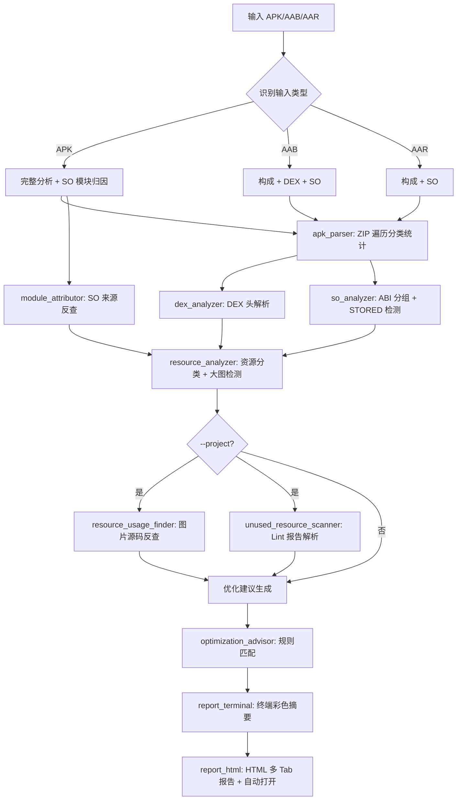

# APK 体积分析与瘦身助手详解

> **背景**：Google Play 对应用大小有诸多建议（< 150MB、优先 App Bundle），APK 体积直接影响下载转化率、更新成本和用户留存。Android Studio 自带的 APK Analyzer 虽然能看到基本构成，但不支持源码关联反查、Lint 未用资源扫描、跨模块未用资源聚合，也无法一键生成可执行的批量压缩方案。
>
> 本文介绍 `apk-size-analyzer` skill —— 一个将体积分析从"大致看看"升级为"精准拆解 + 源码关联 + 可执行方案"的工程化工具。

## 一、为什么不直接用 Android Studio 自带的 APK Analyzer？

AS 自带的 APK Analyzer 在日常开发中足够应付，但当你真正需要做体积治理时，它的能力就不够了：

| 维度 | AS APK Analyzer | apk-size-analyzer |
|------|-----------------|-------------------|
| **格式支持** | APK / AAB | APK / AAB / AAR |
| **SO 来源归因** | 无 | 自动关联 Gradle 缓存，定位 .so 所属模块 / Maven 坐标 |
| **图片源码反查** | 无 | 扫描工程源文件，三档可信度（静态引用 / 动态引用 / 未找到）标注每张图的使用位置 |
| **Lint 未用资源跨模块聚合** | 无 | 多 module 聚合去重，图片缩略图预览，一键归因 |
| **批量压缩方案** | 无 | 生成 TinyPNG 批量压缩清单 + 通用壳脚本，dry-run → apply → restore 三模式 |
| **体积优化建议** | 无 | 自动生成 15+ 条优化建议（DEX / SO / 资源 / 策略），按严重程度排序 |
| **可视化报告** | 单一视图 | 终端彩色摘要 + HTML 多 Tab 交互报告（饼图 / 缩略图 / 排序 / 灯箱） |
| **重放能力** | 无 | 自动生成重放命令，结果可复现、可分享 |

一句话总结：**AS APK Analyzer 告诉你"有多大"，这个 skill 告诉你"为什么大、大在哪、怎么瘦"。**

## 二、体积分析的六大维度

AS APK Analyzer 只给出基本文件列表，而 `apk-size-analyzer` 从六个维度层层拆解：

### 1. 构成分类 —— 体积都去哪了？

按 DEX / Native / 资源 / Assets / 签名 / Kotlin 元数据 / Manifest / 其他 八大类别拆解，CSS 饼图 + 交互排序表格，一眼看清体积分布全貌。

### 2. DEX 分析 —— 代码有多大？

解析每个 DEX 文件头部（前 112 字节），提取方法数、类数、字符串数。自动检测 MultiDex 与 R8 启用状态，计算方法数利用率。若方法数 ≥ 上限 90% 或多 DEX 但方法数利用率 < 50%，自动生成高优先级建议。

### 3. Native SO 分析 —— C/C++ 库的体积账

按 ABI 分组统计 .so 的体积分布，标记 STORED（未压缩）存储的 .so。**核心差异化能力**：通过 Gradle transforms 缓存自动反查每个 .so 的来源模块 / Maven 坐标，精确到"这个 14MB 的 .so 是从哪个依赖带进来的"。

### 4. 资源分析 —— 图片、密度变体、Assets

- **大图识别**：列出所有 >100KB 的 PNG/JPG，标注是否可转 WebP
- **密度变体统计**：检测是否存在 ≥4 个密度变体，提示可限定密度范围
- **Assets 大文件**：列出 assets/ 下 >100KB 的文件

### 5. 源码关联（可选，`--project` 启用）—— 这张图到底谁在用？

这是本工具最独特的能力之一。传入 `--project <工程根>` 后：

- **图片使用位置反查**：按 APK 路径对图片分 4 类分别反查（assets / res/raw / res/drawable+mipmap / 其他 res/*），扫描 Kotlin/Java/XML 以及 html/js/json/css/md 等文本文件，覆盖静态引用（`@drawable/`、`R.xxx`、`android_asset/...`）、动态引用（字符串字面量），三档可信度标注。
- **Lint 未使用资源扫描**：解析 `*/build/reports/lint-results-*.xml`，多 module 聚合去重，结合 APK 条目倒推体积。图片类用缩略图网格预览，非图片类用紧凑表格。

### 6. 优化建议 —— 不只是"看看"，而是"怎么做"

基于规则引擎自动生成 15+ 条优化建议，按严重程度分为 high / medium / low / info 四档：

| 维度 | 级别 | 典型建议 |
|------|:----:|----------|
| **整体策略** | high | 使用 App Bundle（AAB）、启用 R8 + shrinkResources |
| **DEX/代码** | high/medium | 方法数接近上限、R8 未启用导致 DEX 冗余 |
| **Native SO** | high/medium/low | 多 ABI 冗余、STORED 存储浪费、超大 .so |
| **资源图片** | high/medium | PNG/JPG → WebP、密度变体过多、大图未压缩 |

## 三、工具核心能力

- 📊 **六大维度拆解**：构成分类 + DEX + Native + 资源 + 大文件 + 优化建议
- 🎯 **SO 来源归因**：自动反查 Gradle transforms 缓存，定位 .so 所属模块 / Maven 坐标
- 🔗 **源码关联**：图片使用位置反查（静态/动态/未找到三档）+ Lint 未用资源跨模块聚合
- 🗜️ **批量压缩方案**：TinyPNG 一键压缩清单 + 通用壳脚本，dry-run / apply / restore 三模式
- 📊 **双报告形态**：终端彩色摘要 + HTML 多 Tab 交互报告（饼图 / 缩略图 / 排序 / 灯箱）
- 📄 **多格式支持**：APK / AAB / AAR 全链路
- 🔄 **可重放**：自动生成重放命令，结果可分享、可复现

## 四、实际分析效果

### 4.1 终端输出（极简摘要）

```
═══════ 📦 APK 体积分析 ═══════
  文件: /path/to/app-release.apk
  大小: 41.47 MB（原始 117.83 MB，1981 条目）
  ⚠️  2 条高优先级建议（详情见 HTML）
  📄 HTML 报告: /path/to/app-release_size_report.html

🔄 重放命令（可复制）
  python3 "/path/to/analyze_apk.py" "/path/to/app-release.apk"
```

### 4.2 HTML 报告（完整模式）

HTML 报告包含最多 **7 个 Tab**：

- **总览**：CSS 饼图 + 八大类别交互表格（文件数 / 压缩后 / 原始 / 占比 / 进度条）

  

- **DEX**：各 DEX 文件的方法数 / 类数 / 字符串数，MultiDex 与 R8 状态

  

- **Native**：ABI 分布表 + SO 详情表（文件名 / ABI / 大小 / 来源模块 / 存储方式）

  

- **大文件**：>1MB 文件 Top 20，按路径 / 类别 / 大小展示

  

- **可优化图片**：>100KB PNG/JPG 缩略图网格（点击放大）+ 源码引用位置 + 一键批量压缩命令面板

  

  

- **未用资源**：Lint 未使用资源多 module 聚合，分类视图（图片缩略图 / 表格）+ module 筛选

  

- **优化建议**：15+ 条建议卡片，按严重程度排序，附操作命令和涉及文件

  

### 4.3 批量压缩工作流

当启用 `--project` 且存在 ≥100KB 的 PNG/JPG 时，HTML「可优化图片」Tab 展示一键批量压缩面板：

```bash
# 1. 配置 TinyPNG API Key（仅首次）
export tinypng_api_key=your_key_here

# 2. 预览将要压缩的图片（不修改文件）
bash <skill>/scripts/templates/compress_images.sh --list report_assets/compress_images.list

# 3. 执行压缩（自动备份到 .backup/）
bash <skill>/scripts/templates/compress_images.sh --list report_assets/compress_images.list --apply

# 4. 不满意？一键回滚
bash <skill>/scripts/templates/compress_images.sh --list report_assets/compress_images.list --restore
```

安全机制：默认 dry-run、API Key 预校验、自动备份、9-patch 跳过、无收益不覆盖、执行日志记录。

## 五、各输入类型的分析范围

| 输入类型 | 构成分析 | DEX | SO | 模块归因 | 源码关联 |
|----------|:------:|:---:|:--:|:------:|:------:|
| **APK** | ✅ | ✅ | ✅ | ✅ | ✅（需 `--project`） |
| **AAB** | ✅ | ✅ | ✅ | ❌ | ❌ |
| **AAR** | ✅ | ❌ | ✅ | ❌ | ❌ |

APK 为完整产物，可做全维度分析。AAB/AAR 为中间产物，跳过部分不适合在该阶段做的分析。

## 六、使用方法

### 6.1 基本用法

```bash
# 分析单个 APK（自动生成并打开 HTML 报告）
python3 analyze_apk.py app-release.apk

# 指定 HTML 输出路径
python3 analyze_apk.py app-release.apk report.html

# 显式关联 Android 工程（启用图片使用位置反查 + 未用资源扫描）
python3 analyze_apk.py app-release.apk --project ~/work/MyApp/

# 分析 AAB / AAR
python3 analyze_apk.py app-release.aab

# 批量分析目录
python3 analyze_apk.py --batch ./outputs/
python3 analyze_apk.py --batch ./outputs/ --project ~/work/MyApp/
```

### 6.2 自动工程推断

当 APK 位于典型构建产物路径下（如 `build/outputs/apk/`、`build/intermediates/apk/`），工具会自动向上查找 `settings.gradle(.kts)` 推断工程根，无需手动传 `--project`。

## 七、工作流程



## 八、常见优化方案速查

### 8.1 切换到 App Bundle（优先级最高）

```bash
./gradlew bundleRelease
```

### 8.2 限定 ABI

```groovy
android {
    defaultConfig {
        ndk { abiFilters 'arm64-v8a' }
    }
}
```

### 8.3 启用 R8 + shrinkResources

```groovy
android {
    buildTypes {
        release {
            minifyEnabled true
            shrinkResources true
        }
    }
}
```

### 8.4 PNG/JPG 转 WebP

- Android Studio：右键 drawable 目录 → Convert to WebP
- 命令行：`cwebp -q 75 input.png -o output.webp`
- 或使用本 Skill 生成的 TinyPNG 一键批量压缩方案

### 8.5 限定资源密度

```groovy
android {
    defaultConfig {
        resConfigs 'zh', 'en', 'xxhdpi', 'xxxhdpi'
    }
}
```

## 九、集成到开发流程

### 本地开发

```bash
./gradlew assembleRelease
python3 analyze_apk.py app/build/outputs/apk/release/app-release.apk --project .
```

### CI/CD（以 GitHub Actions 为例）

```yaml
- name: APK Size Analysis
  run: |
    python3 analyze_apk.py \
      app/build/outputs/apk/release/app-release.apk \
      --project . || echo "查看报告获取优化建议"
```

### 发布前检查

```bash
# 每次提测前跑一次，确认体积变化
python3 analyze_apk.py app/build/outputs/apk/release/app-release.apk \
  --project . --output release_size_report.html
```

## 十、常见问题

**Q1：SO 来源归因是如何工作的？**
A：利用 Gradle transforms 缓存的映射关系。项目构建时 Gradle 会在 `.gradle/caches/transforms-*` 中留下依赖 → 产物 `.so` 的对应关系，工具遍历这些缓存即可反查每个 `.so` 来自哪个依赖。

**Q2：图片源码反查的"动态引用"是什么？**
A：指通过字符串动态加载的图片引用，如 `getIdentifier("ic_logo", "drawable", pkg)` 或 Glide 的 `Glide.with(ctx).load(R.drawable.xxx)`。工具用三档可信度区分：绿色（✓ 静态引用，如 `@drawable/xxx`）、黄色（~ 仅动态引用）、红色（✗ 未找到引用）。

**Q3：Lint 未用资源扫描为什么需要 `checkDependencies`？**
A：Android Lint 默认对 library module 禁用 UnusedResources 检查（library 的资源可能被依赖它的 app 引用）。只有 app module 在启用 `checkDependencies true` 后才能跨 module 扫出 library 里的未用资源。

**Q4：批量压缩的 .backup 会很大吗？**
A：.backup 目录自动创建在报告产物目录下，镜像备份原图。压缩完成后可手动删除。压缩日志 `compress_images.log` 记录每张图的 before/after/saved，方便核算收益。

**Q5：为什么 AAB 不做 SO 模块归因？**
A：AAB 的模块归属应由 Play Console 的 App Bundle Explorer 负责，且拆 AAB 中间产物做归因可能得出不准确的模块映射。

## 相关链接

- [姊妹 Skill：apk-16kb-check](../apk-16kb-check/SKILL.md) —— 16KB 页面对齐检查工具
- [Android 官方：减小 APK 大小](https://developer.android.com/topic/performance/reduce-apk-size?hl=zh-cn)
- [Android App Bundle 指南](https://developer.android.com/guide/app-bundle?hl=zh-cn)
- [TinyPNG API 文档](https://tinypng.com/developers)
- [Android Lint 检查： checkDependencies](https://developer.android.com/studio/write/lint?hl=zh-cn)

## 总结

`apk-size-analyzer` 把体积分析从"大致看看"升级为"精准拆解 + 源码关联 + 可执行方案"：

- **拆得细**：六大维度（构成 / DEX / Native / 资源 / 大文件 / 优化建议），每个维度可交互下钻
- **找得到**：SO 来源归因到模块/Maven 坐标，图片使用位置反查到具体代码行，未用资源跨模块聚合
- **修得掉**：一键批量压缩（dry-run → apply → restore），优化建议带操作命令，直接可执行
- **接得上**：CI/CD、本地脚本都能直接用，重放命令保证可复现

面对不断增长的 APK 体积和用户对包大小的敏感度，建议尽早把它接入日常构建流程，把体积优化从"偶尔看一眼"变成"每次构建都看一眼"。
