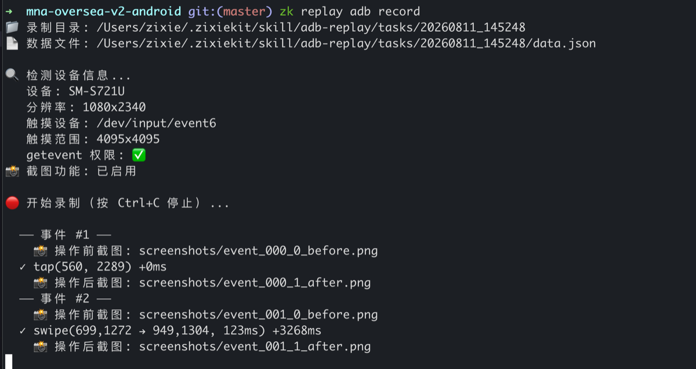
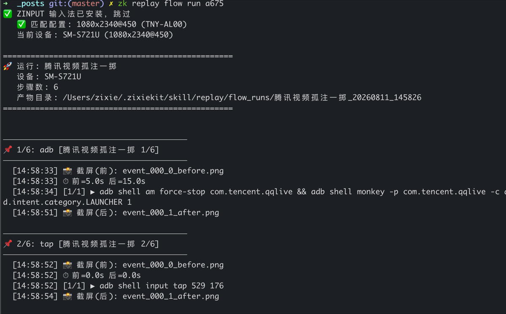
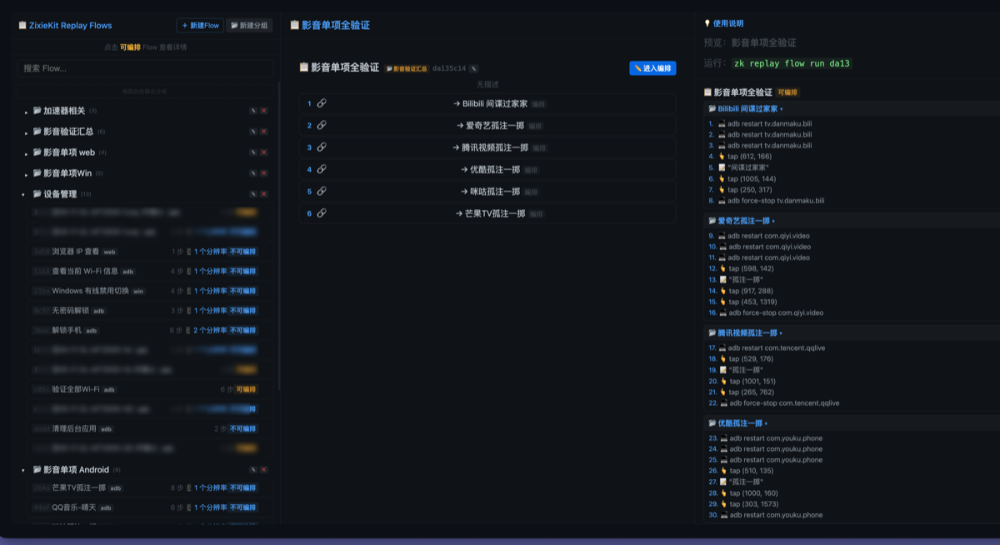
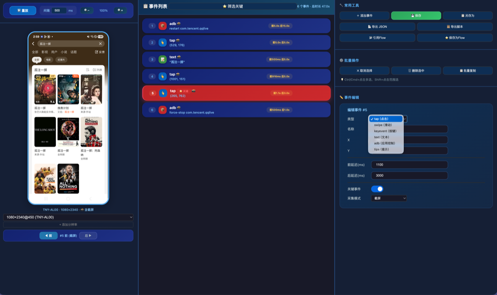
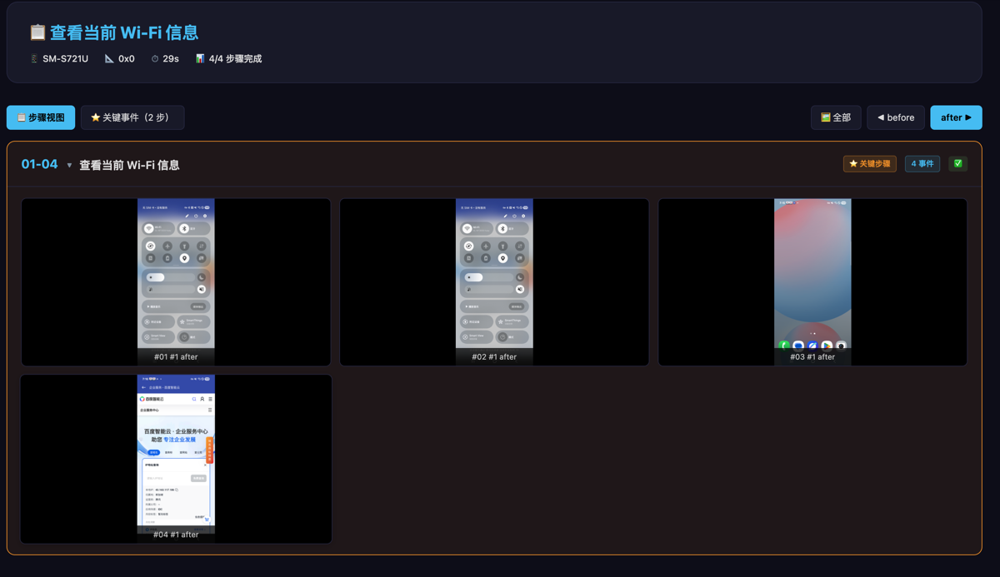
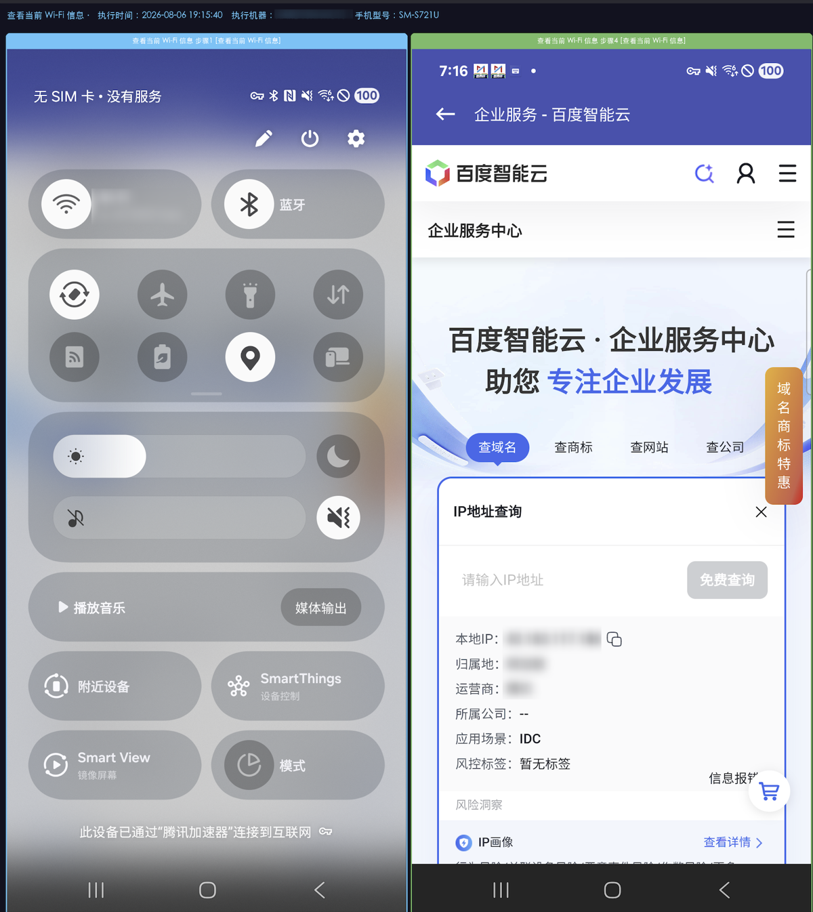
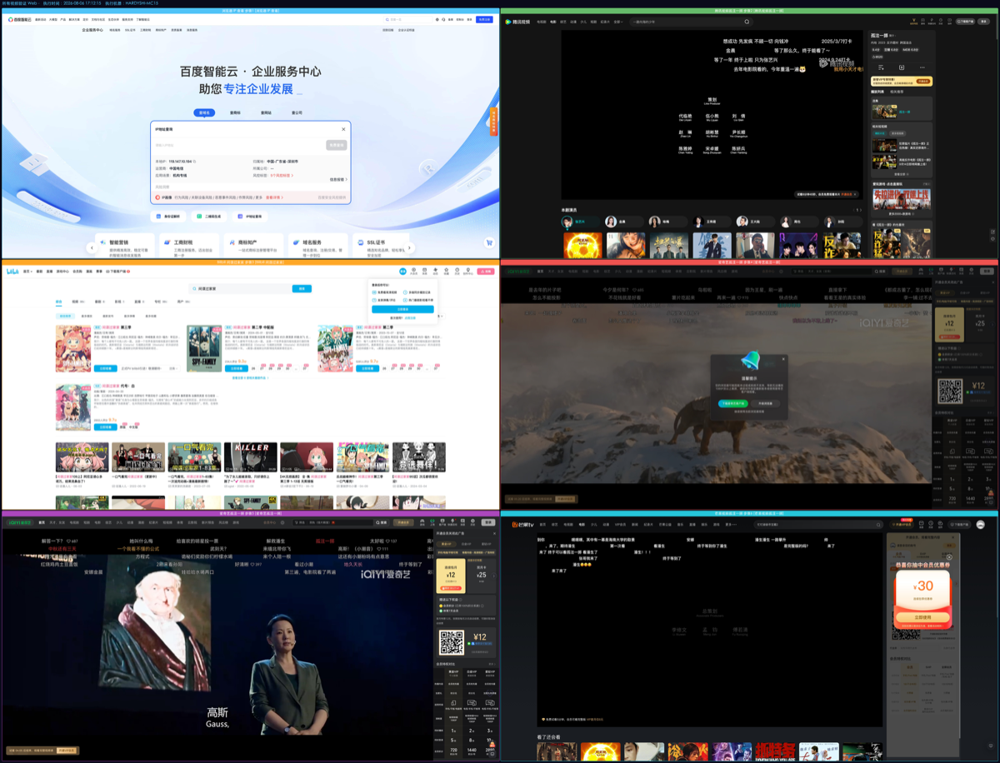

# replay：四端 UI 自动化录制与回放工具详解

> **背景**：日常开发中经常需要重复执行一系列 UI 操作——回归测试、演示录制、Bug 复现步骤记录。传统做法是手动操作 + 截图，不仅效率低，而且无法跨平台复用。更麻烦的是，脚本式自动化（Selenium/Appium）需要写大量代码，维护成本高。
>
> replay 采用"录制即 Flow、Flow 即可回放"的思路，支持 Android (ADB)、Web (Playwright)、macOS (CGEventTap)、Windows (pynput) 四端，统一数据格式，一份 Flow 可跨平台执行。

## 一、设计理念：录制 → 回放 → 编排 → 报告

replay 将 UI 自动化拆解为四个阶段：

```
┌──────────┐     ┌──────────┐     ┌──────────┐     ┌──────────┐
│  录制     │ ──▶ │  回放     │ ──▶ │  编排     │ ──▶ │  报告     │
│ 操作采集  │     │ 精确复现  │     │ 组合复用  │     │ 可视化   │
└──────────┘     └──────────┘     └──────────┘     └──────────┘
```

- **录制**：各平台用自己的技术采集用户操作（触摸、点击、键盘等），保存为结构化 JSON
- **回放**：读取录制产物，精确复现每一步操作，支持截图对比
- **编排**：将多个录制的操作片段组合为 Flow（流程），支持子流程引用、断点、条件
- **报告**：每次运行自动生成 HTML 报告，包含每步截图、耗时、成功/失败状态

核心设计原则：**录制器各端独立（平台 API 天然不同），录制后的所有能力（Flow CRUD、执行引擎、报告、通知、前端界面）全部收敛到共享内核**。

## 二、架构：core 内核 + 各端薄适配器

```
replay/
├── flows/            ← Flow 定义仓库（跨平台共享）
├── scripts/
│   ├── core/         ← 共享内核（Flow CRUD / Runner / Report / Notify / CLI / HTTP）
│   ├── adb/          ← Android 端（getevent 录制器 + ADB 执行器）
│   ├── web/          ← Web 端（Playwright 录制器 + CDP 执行器）
│   ├── mac/          ← macOS 端（CGEventTap 录制器 + CGEventPost 执行器）
│   └── win/          ← Windows 端（pynput 录制器 + pyautogui 执行器）
└── edit/             ← 前端资源（editor.html + flow.html + JS/CSS）
```

### core 与各端的职责划分

| 模块 | core 提供 | 各端保留 |
|------|-----------|----------|
| Flow CRUD | `core.flow`（save/load/list/delete/resolve/flows_summary） | 代理层 re-export |
| 执行引擎 | `core.runner`（run_flow/run_steps + hook 注入） | setup_hook + step_executor |
| 报告生成 | `core.report`（HTML 报告 + 关键截图） | — |
| 通知推送 | `core.notify`（企业微信 webhook） | — |
| 数据契约 | `core.schema`（normalize_step + 校验） | — |
| CLI 框架 | `core.cli`（build_parser + tips 文案） | main.py 路由 |
| HTTP 服务 | `core.hsrv`（manage + editor API） | — |
| 前端界面 | `editor.html` + `flow.html` + JS/CSS | — |

**关键架构决策**：

- **D16**：消灭 recording 类型，四端统一用 event 动作步骤
- **D17**：三段式生命周期（record → play → publish）+ flow manager 中枢
- **D18**：Core 数据模型定稿（Event / Flow 双实体，定位下沉平台）
- **D19**：砍顶层 device/resolution → 统一 `meta.profiles[default_profile]`
- **D20**：单事件执行时序标准化（setup → step_executor → 截图 before/after → teardown）

## 三、四端技术栈

### Android (ADB)

通过 `getevent` 录制手机触摸/按键操作，保存为 JSON。

**录制原理**：在手机端启动 `getevent -lt` 监听 `/dev/input/event*` 设备节点，解析 EV_ABS（触摸坐标）、EV_KEY（按键）事件，合并为 tap / swipe / keyevent 操作。

**支持的事件**：`tap`、`swipe`、`keyevent`、`text`、`adb`、`tips`

**前置条件**：ADB 已安装、手机 USB 连接并授权调试、Python 3.8+



### ADB 回放

读取录制产物，通过 `adb shell input` 系列命令精确复现每一步操作（tap / swipe / keyevent / text），支持截图前后对比。



### Web (Playwright)

基于 Playwright + CDP (Chrome DevTools Protocol) 的浏览器 UI 自动化。

**录制原理**：启动 Chromium 浏览器，注入 CDP 事件监听器，捕获 click / type / scroll / navigate 等操作，同时记录 DOM 元素的多种选择器（data-testid > id > aria-label > text > class > XPath），确保回放时的元素定位鲁棒性。

**支持的事件**：`click`、`dblclick`、`navigate`、`type`、`scroll`、`keyboard`、`hover`、`select`、`check`、`wait`

**依赖**：playwright (Chromium)

### macOS

通过 CGEventTap 捕获系统级鼠标/键盘事件，CGEventPost 精确回放。

**录制原理**：注册 `kCGHIDEventTap` 事件监听器，拦截系统级鼠标移动/点击/滚轮和键盘按键事件。回放时通过 `CGEventPost(kCGHIDEventTap, ...)` 将构造的事件注入系统事件流，实现像素级精确复现。

**依赖**：`pyobjc-framework-Quartz`、`pyobjc-framework-Cocoa`

**前置条件**：macOS 10.15+、辅助功能权限、屏幕录制权限

### Windows

通过 pynput 监听系统级鼠标/键盘事件，pyautogui/pynput 驱动回放。

**支持的事件**：`click`、`dblclick`、`rclick`、`type`、`keyboard`、`hotkey`、`scroll`、`drag`、`move`、`launch`、`quit`

**依赖**：pynput、Pillow

## 四、数据模型：Event 与 Flow

### 双层事件格式

所有平台的动作统一使用**双层结构**：

```json
{
  "type": "event",
  "action": "tap",
  "x": 540, "y": 960,
  "delay_before_ms": 500,
  "delay_after_ms": 0,
  "is_critical": false,
  "screenshots": {
    "before": "screenshots/event_000_0_before.jpg",
    "after":  "screenshots/event_000_1_after.jpg"
  }
}
```

`type` 恒为 `"event"`，`action` 标识具体动作类型。不同平台的定位方式不同：

- **ADB/macOS/Windows**：用 `x`/`y` 坐标
- **Web**：用 `selectors` 链（`data-testid` → `id` → `aria-label` → `text` → `class` → `XPath`），提供多重定位保障

### 步骤类型

除了 `event`（动作），Flow 还支持三种结构步骤：

| 类型 | 含义 | 示例场景 |
|------|------|---------|
| `event` | 平台动作 | tap / click / type / swipe |
| `flow` | 子流程引用 | 复用"登录流程"作为其他流程的前置步骤 |
| `pause` | 手动断点 | 暂停等待人工操作（如输入验证码） |
| `shell_cmd` | 系统命令 | 执行 ADB 命令、Shell 脚本 |

### Flow 完整结构

```json
{
  "id": "a1b2c3d4",
  "name": "App 登录 → 查看个人中心",
  "platform": "adb",
  "description": "回归测试用例：登录后验证个人中心数据正确性",
  "meta": {
    "device": "TNY-AL00",
    "resolution": [1080, 2340],
    "profiles": {
      "1080x2340@450": { "scale": 1.0 }
    },
    "default_profile": "1080x2340@450"
  },
  "steps": [
    { "type": "event", "action": "tap", "x": 999, "y": 168, "is_critical": true },
    { "type": "pause", "hint": "输入验证码后点击继续" },
    { "type": "event", "action": "tap", "x": 540, "y": 1800 },
    { "type": "flow", "flow_id": "e5f6g7h8" }
  ]
}
```

## 五、执行引擎：runner 核心

runner 是 replay 的心脏，以 ADB 端 flow_runner 为蓝本统一重构。各平台只需提供 `step_executor` 回调（执行单个 event），其余逻辑全部由 core 处理：

```
run_flow(flow_id)
  │
  ├─ load_flow()          加载 Flow 定义
  ├─ resolve_flow_steps() 递归展开子 Flow 引用（最大深度 10）
  │
  ▼
run_steps(context, steps)
  │
  ├─ setup_hook()         初始化平台资源（启动浏览器 / 连接设备）
  │
  ├─ for each step:
  │    ├─ 离散步骤选择（--step 1,3,5-8）
  │    ├─ pause 断点（等待手动操作）
  │    ├─ shell_cmd 系统命令执行
  │    ├─ mixed 平台切换（_platform 变化时自动 teardown → setup）
  │    ├─ 创建独立目录 {run_dir}/{0001..NNNN}/
  │    └─ step_executor(ctx, step):
  │         ├─ delay_before_ms
  │         ├─ 截图 before
  │         ├─ 执行动作
  │         ├─ 截图 after
  │         ├─ delay_after_ms
  │         └─ 写入 data.json
  │
  ├─ teardown_hook()      释放平台资源
  │
  └─ 生成 summary.json + run.log
```

### 单事件执行时序（D20）

```
setup → [创建目录 → 进度打印 → step_executor(
           delay_before → 截图(before) → 执行 → 截图(after) → delay_after → data.json
         ) → 记录结果 → fail_fast] → teardown
```

### Mixed Flow（跨平台流程）

当 Flow 的 `platform` 为 `mixed` 时，每个步骤可携带 `_platform` 标记。runner 自动检测步骤的平台变化，在边界处 teardown 上一平台 → setup 下一平台：

```json
{
  "platform": "mixed",
  "steps": [
    { "_platform": "adb", "type": "event", "action": "tap", "x": 540, "y": 960 },
    { "_platform": "adb", "type": "event", "action": "swipe", "x1": 500, "y1": 1500, "x2": 500, "y2": 200 },
    { "_platform": "web", "type": "event", "action": "click", "selectors": [...] },
    { "_platform": "web", "type": "event", "action": "type", "content": "hello" }
  ]
}
```



## 六、事件编辑器

replay 提供了 Web 界面用于查看和编辑录制事件，通过 `zk replay flow manage` 一键启动本地服务：

- 手工创建和编辑单个录制事件
- 支持坐标微调、延迟设置、关键帧标记
- 预览事件截图



## 七、报告系统

每次 Flow 运行完成后，自动生成 HTML 交互报告，包含：

- **总览**：Flow 名称、平台、耗时、成功/失败步骤数
- **步骤列表**：每步的 before/after 截图对比、执行耗时、成功状态
- **关键帧**：标记 `is_critical: true` 的步骤作为报告的"封面"
- **运行日志**：完整的 run.log 可追溯







## 八、通知系统

支持企业微信 Webhook 推送运行结果。可在 runner 中注册 `NotifyHook`，运行结束后自动发送通知卡片（流程名 / 成功/失败 / 关键截图 / 报告链接）：

```python
from core.notify import notify_safe, notify_image_safe

# 纯文本通知
notify_safe(title="Flow 运行完成", message="3/5 步骤通过", level="warning")

# 带截图的通知卡片
notify_image_safe(snapshot_path, title="关键帧：登录页面")
```

## 九、CLI 命令

```bash
# 录制（各平台独立命令）
zk replay adb record 登录流程
zk replay web record 首页浏览
zk replay mac record 文件操作
zk replay win record 安装向导

# 回放录制产物
zk replay adb play <录制目录>
zk replay web play <录制目录>

# 运行 Flow
zk replay adb flow run a1b2c3d4
zk replay adb flow run a1b2c3d4 --step 1,3,5-8    # 选择性执行

# 生成 Flow 报告（不重新运行，基于已有产物）
zk replay adb flow report a1b2c3d4

# Flow 管理器（跨平台，Web 界面）
zk replay flow manage --port 8090

# 环境检查 / 初始化
zk replay adb doctor
zk replay adb init
```

## 十、当前规模

| 指标 | 数值 |
|------|:----:|
| 支持平台 | 4（ADB / Web / macOS / Windows） |
| 共享核心模块 | 15 个 core 模块 |
| Flow 仓库 | 40+ 个 Flow 定义 |
| 前端界面 | 2 个（editor.html + flow.html） |
| 支持事件类型 | 20+ 种跨平台动作 |
| 架构决策记录 | 5 条 D 级决策 |

## 总结

replay 把 UI 自动化从"写脚本"变成"录操作"：

- **录得快**：四端原生录制，操作即数据，无需写代码
- **跑得稳**：执行引擎统一，单事件标准时序，断点续跑 + 选择性执行
- **编得活**：Flow 编排支持子流程引用、跨平台 mixed flow、pause 断点、shell_cmd 命令
- **看得清**：每步 before/after 截图对比，HTML 交互报告，企业微信通知推送
- **跨平台**：ADB / Web / macOS / Windows 共享一套 core 内核和前端界面

如果你经常需要做回归测试、演示录制、Bug 复现，replay 值得一试。

